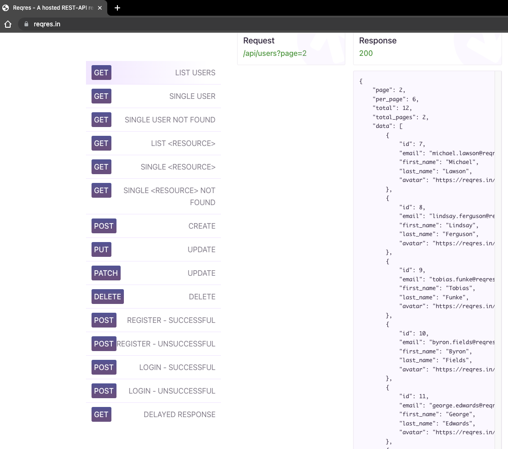

# HTTP取样器
## 本章要点
1. 要点一
1. 要点
1. 要点
1. **要点**

## 学习目标

1. Window系统安装并打开JMeter工具。

## 思考

JMeter中的HTTP取样器(Http Request)允许用户在性能测试中模拟HTTP/HTTPS请求。它是JMeter中最常用的取样器之一，因为在现代网络应用中，HTTP/HTTPS通信非常普遍。

## 添加

导航到 **线程组**(`Thread Group`) -> **添加**(`Add`) -> **采样器**(`Sampler`) -> **HTTP 请求**(`HTTP Request`)。

## 界面

### 基本

在“**基本**”选项卡下，您可以配置HTTP请求。

主要设置包括：

#### 协议

指定**HTTP**或**HTTPS**。

#### 服务器名称或IP

配置测试目标的**IP地址**或**域名**。

域名：www.baidu.com；IP地址：10.15.14.55。

#### 端口号

配置目标服务器上的端口号。

>一般情况下，HTTP为 80，HTTPS为 443。

Method：请求方法（例如GET，POST，PUT，DELETE等）。
路径：目标服务器上的API路径。
内容码：字符集，默认使用UTF-8。
参数：在此区域可以添加请求参数/携带的数据，如 HTTP POST表单数据等。
头字段：如果需要，可以通过“添加”按钮为请求添加自定义请求头。
之后，在JMeter测试计划中添加其他元素如定时器、断言和听众，并执行测试。HTTP请求将根据配置模拟HTTP通信，并收集响应时间等性能数据。

#### 3）HTTP请求编写 

接下来搜索可在 Internet 上免费获得的[Reqres API](https://reqres.in/)。我们将以 Reqres API 为例。

GET请求如下：

现在你有了API，从链接中找出**服务器名称**、**路径**和**参数**。在JMeter 测试计划的 HTTP 请求中复制这些值。

## 总结
- 总结一
- 总结二
- 总结三
https://github.com/Wechat-ggGitHub/Awesome-GitHub-Repo

[项目演示地址](https://github.com/testeru-pro/junit5-demo/tree/main/junit5-basic)

# 学习反馈

1. SpringBoot项目的父工程为( )。

   - [x] A. `spring-boot-starter-parent`
   - [ ] B.`spring-boot-starter-web`
   - [ ] C. `spring-boot-starter-father`
   - [ ] D. `spring-boot-starter-super`

