# JMeter代理服务器录制Web端压测脚本

## 本章要点
1. 录制的流程
2. JMeter相关组件的添加、配置
3. 证书的生成导入
4. 录制中优化

## 录制流程

1. 压测对象。
2. 压测页面。
3. 业务步骤。
4. 录制步骤。
5. 优化。


### 压测对象

选用腾讯的[新闻](https://new.qq.com/)页面进行压测脚本的录制。


### 压测页面

涉及到的压测页面包括**三**个，分别是：腾讯**新闻首页**、新闻的**财经**页面、新闻的**科技**页面。


### 业务步骤

1. 打开浏览器，访问腾讯[新闻](https://new.qq.com/)页面。
2. 点击页面Tab栏中的[财经](https://new.qq.com/ch/finance/)跳转到财经新闻页面。
3. 点击页面Tab栏中的[科技](https://new.qq.com/ch/tech/)跳转到科技新闻页面。


以上为业务的功能测试流程。

### 录制步骤

下面来看下怎样使用`JMeter`的代理服务器来录制压测脚本。

1. 打开JMeter的GUI界面。
2. 保存脚本。
3. 添加HTTP(S) 测试脚本记录器。
4. 录制的请求路径组件。
5. 配置HTTP(S)测试脚本记录器。
6. 启动代理服务器。
7. 证书配置。
8. 浏览器代理配置。
9. 执行。


#### 1. 打开JMeter的GUI界面

默认创建测试计划，在界面上方对应当前`JMeter`版本号。


#### 2. 保存脚本

当前界面的脚本默认没有保存，为了防止添加的组件及录制的脚本丢失，建议在打开了`GUI`界面后先对脚本进行保存。

脚本保存时，默认的文件名为测试计划组件的名称，选择好保存路径后，可在`File`对应的输入框内输入新的脚本文件名。

注意⚠️：要`jmx`结尾说明当前文件是一个`JMeter`脚本。

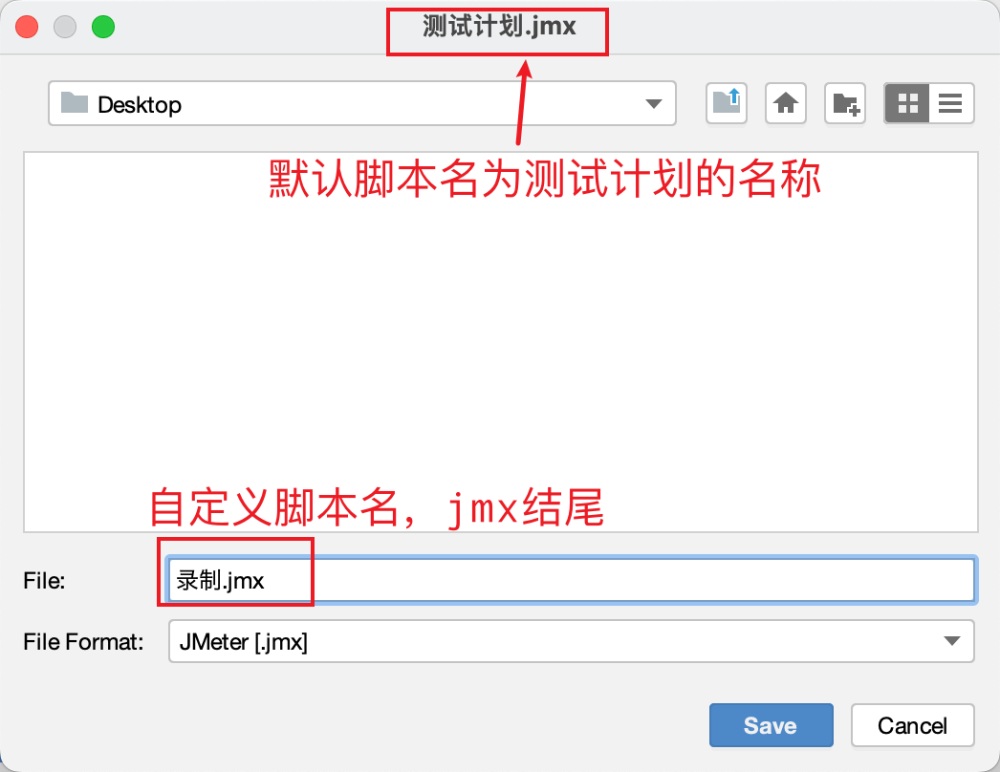


脚本保存成功后，`JMeter`界面会显示文件名称及其路径。


#### 3. 添加HTTP(S) 测试脚本记录器

第一个组件的添加，非测试组件。

导航到 测试计划(`Test Plan`) -> 添加(`Add`) -> 非测试元件(`Non-Test Elements`) -> HTTP 代理服务器(`HTTP(S) Test Script Recorder`)。


`HTTP(S)` 测试脚本记录器允许 `JMeter` 在浏览器浏览 `Web` 应用程序时拦截并记录操作。

#### 4. 录制的请求路径组件

虽然添加了`HTTP(S)` 测试脚本记录器，但是记录下的来的`HTTP`请求还没有存放路径。下面来添加录制的请求存放路径组件。

##### 线程组组件

导航到 测试计划(`Test Plan`) -> 添加(`Add`) -> 线程(`Threads`) -> 线程组(`Thread Group`)。

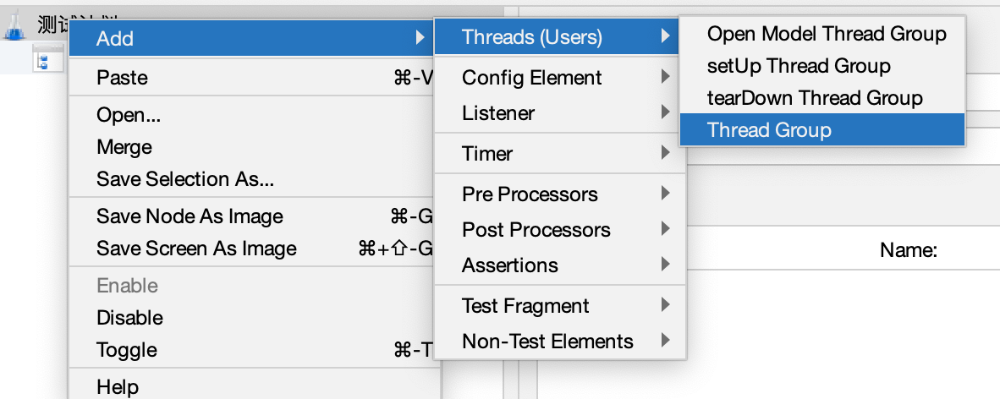

##### 添加录制控制器组件

导航到 线程组(`Thread Group`) -> 添加(`Add`) -> 逻辑控制器(`Logic Controller`) -> 录制控制器(`Recording Controller`)。


录制控制器组件下会存放录制的脚本请求内容，主要是对录制的请求可直接一键清空。


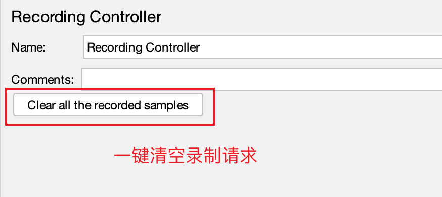

#### 5. 配置HTTP(S)测试脚本记录器

组件都添加完成后，需要对`JMeter`的录制控制器进行配置。

##### 监听端口配置

`Port`：设置监听浏览器的端口号，默认是8888。

注意⚠️：
端口号设置的前提是要求当前端口号在客户端**没有被占用**。

```bash
# Mac Linux
netstat -an|grep "端口号"
# Window
netstat -an|findstr "端口号"
```


如果命令行对应结果没有输出，则代表当前端口号没有被占用。

当有相关进程输出时，说明端口号被占用，此时需要修改，比如修改端口号为6666。

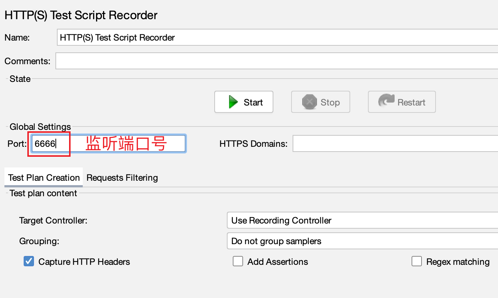

##### 脚本存放路径设置

**目标控制器**：用来指定最终录制**生成的脚本的存放位置**。

>设置`JMeter`录制请求的路径，在 测试计划内容(`Test Plan Creation`) 下设置目标控制器。

点击下拉小三角可以看到目标控制器有**三**个选项，建议选择存放路径为：测试计划(`Test Plan`) -> 线程组(`Thread Group`) -> 录制控制器(`Recording Controller`)。

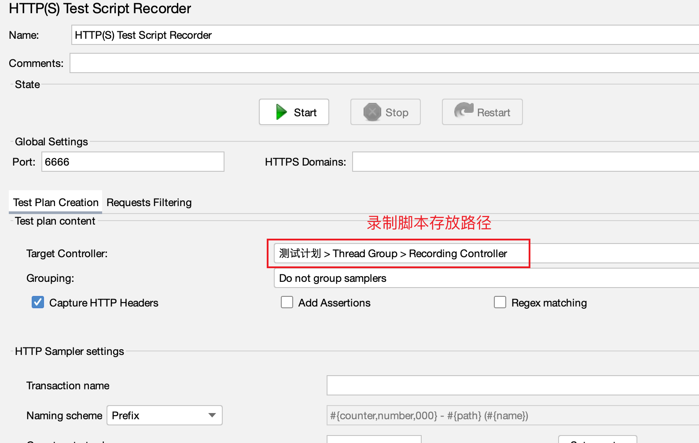

存放在录制控制器下**优点**：

1. 可以与其他编写的请求组件进行区分。

2. 要删除录制相关的请求组件时，直接使用录制控制器的一键清除按钮即可。

3. 录制的请求组件可直接在该节点下保存为新的测试计划。

##### 脚本编码格式设置

录制的页面是中文页面，中文应用一般使用的是`UTF-8`的编码格式。

录制脚本时也需要声明编码格式与客户端的编码格式保持一致，否则会出现**乱码**问题。「解决脚本乱码问题」

`Recording's default encoding`：`JMeter`录制时的默认编码，中文应用设置为**utf-8**。


##### 请求类型

`Type`：`HTTP`请求的实现类型，默认是`httpclient4`。

若录制时出现报错，解决方案为：考虑换成`java`模式。

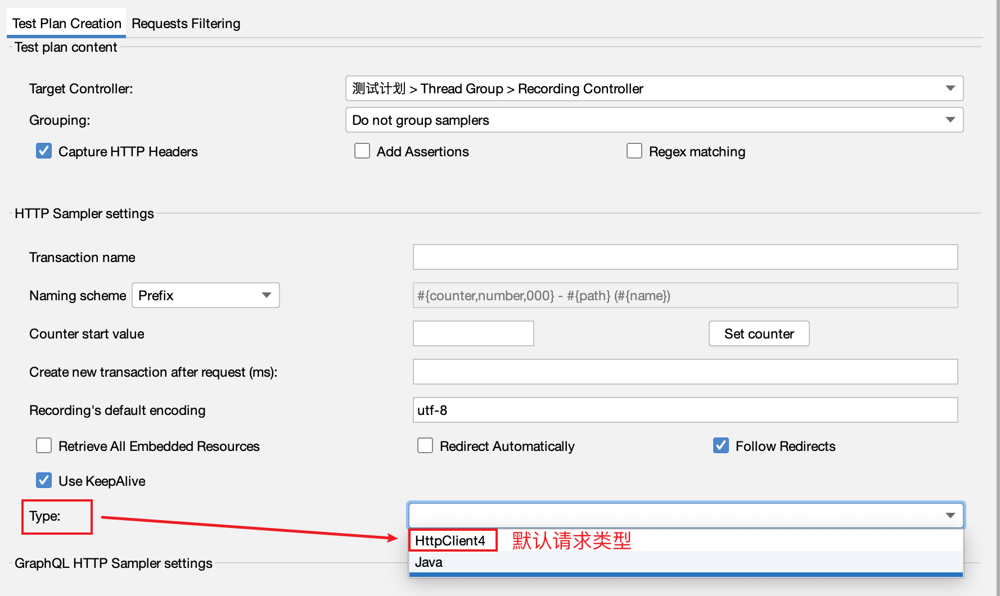

#### 6. 启动代理服务器

当所有配置检查完毕后，点击 **HTTP(S)测试脚本记录器** 组件的 启动`Start` 按钮，此时才会启动`JMeter`的代理服务器。

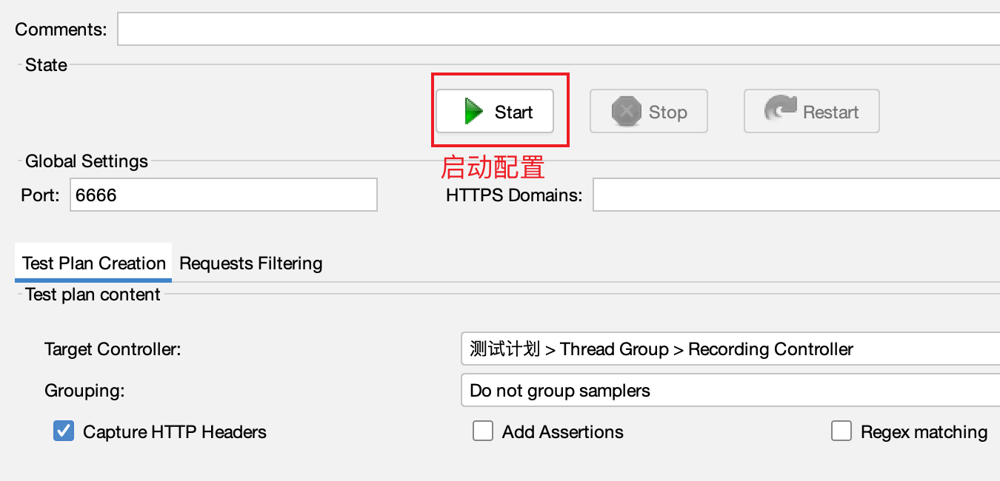

##### 证书生成

启动之后会弹出根证书的提示信息。包含如下：
1. 根证书保存在`JMeter`的`bin`目录。
1. 根证书的有效期为**7**天。
1. 如果已安装了旧的根证书，确保删除旧证书并且安装新的。
    >说明证书安装至电脑端不会被覆盖。

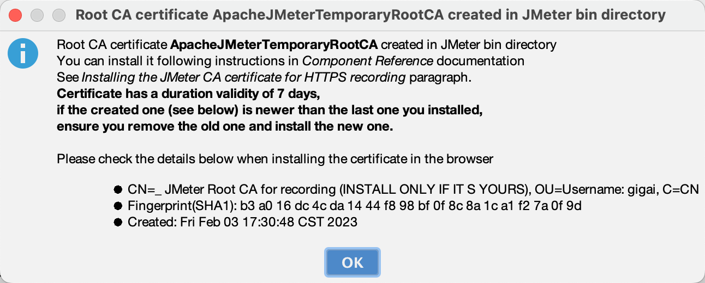

代理服务器启动成功时界面如下：


##### 证书验证

打开`{jmeter_path}/bin`路径下查看生成的证书是否存在。

注意⚠️：
1. 如果在7天内生成过证书，则对应不会生成新的证书。
2. 如果已存在7天之前的证书，需要删除后重新生成。


##### CA证书作用
`CA`「`Certificate Authority`」：**证书授权中心**，负责管理和签发证书的第三方机构。
一般，`CA`证书必须是所有行业和所有公众都信任的、认可的，因此它具有足够的权威性。`CA`证书就是权威机构颁发的证书。

在本文中，生成的`CA`证书就是客户端与`JMeter`之间的相互认可的一个信用凭证。


#### 7. 证书配置


##### Mac系统
###### 1. 导入

钥匙串访问 -> 系统 -> 文件 -> 导入项目，选择对应证书地址导入。

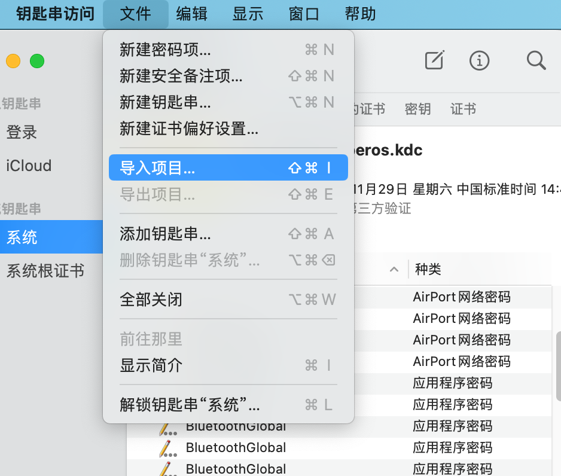

###### 2. 信任
   
导入后发现对应证书未被信任。


点开证书发现证书配置是使用系统默认，系统为了保证安全性，默认手动添加的证书都是不被信任的。


修改完成后，直接关闭输入密码，此时的证书被完全信任。

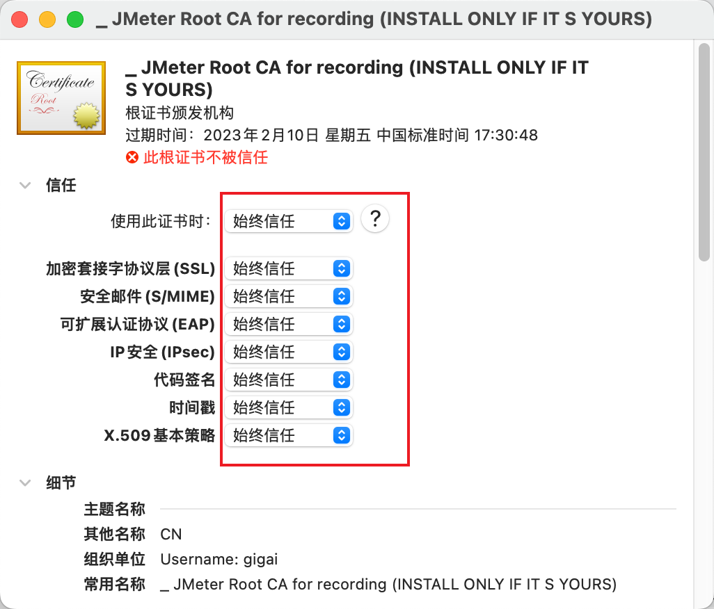


##### Window系统


#### 8. 浏览器代理配置

##### Mac系统

###### Chrome浏览器代理配置
使用第三方插件`SwitchyOmega`来进行代理配置。
1. 新建名为`jmeter`的代理模式，类型为默认的代理服务器选项。
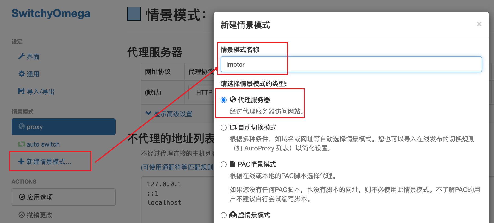

2. 代理配置。
    - 请求为`HTTP`协议的代理，所以配置代理服务器的代理协议为`HTTP`。
    - `JMeter`代理服务器启动的地址是本地，所以配置代理服务器的`IP`时为**127.0.0.1**。
    - `JMeter`代理服务器修改的监听端口号为**6666**，这里配置的代理端口与`JMeter`的保持一致为**6666**。
    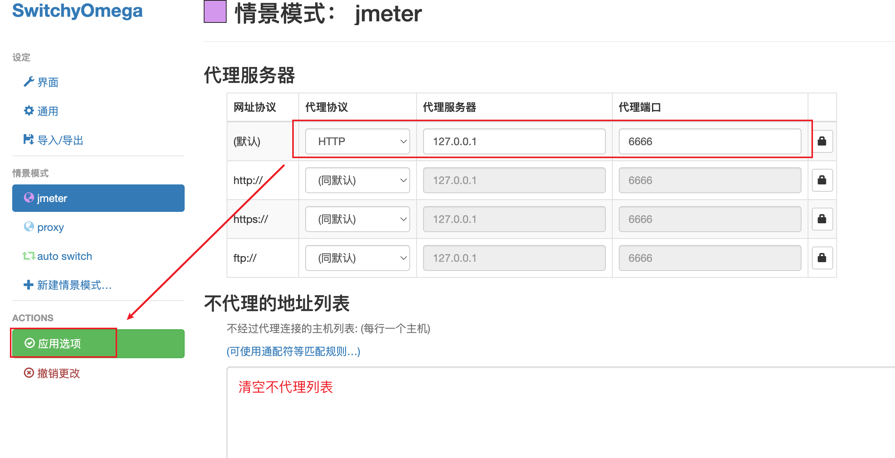

    >最后点击应用选项保存以上配置。
3. 应用代理。
    >在浏览器的扩展程序中选中`jmeter`模式，此时浏览器的所有请求都会通过该端口进行转发给`JMeter`的代理服务器。
    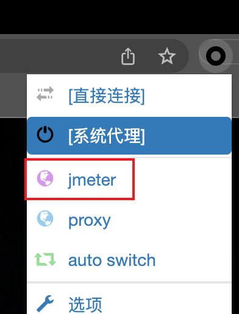

###### FixFox浏览器代理配置

##### Window系统

#### 9. 执行


1. 执行业务逻辑。

2. 关闭`JMeter`代理服务器。
    

3. 关闭浏览器代理配置。


#### 9. 回放验证

❖ 只是为了检验，所以一个并发、一次循环即可

4. JMeter脚本验证回放。[录制](./资料/代理录制/录制Web.jmx)
   - 检验代码等正确性是测试的老本行。
   - 压测代码也是代码。
   - 自己的代码也必须检验。
   - JMeter添加查看结果树，点击运行查看结果。
     - 查看结果树的**⽤途**：看请求和响应「Req/Resp」的详情
    >为了检验，线程组只设置⼀个并发、⼀次循环即可。
    >单击开始运⾏按钮，检查请求/响应是否都成功。
    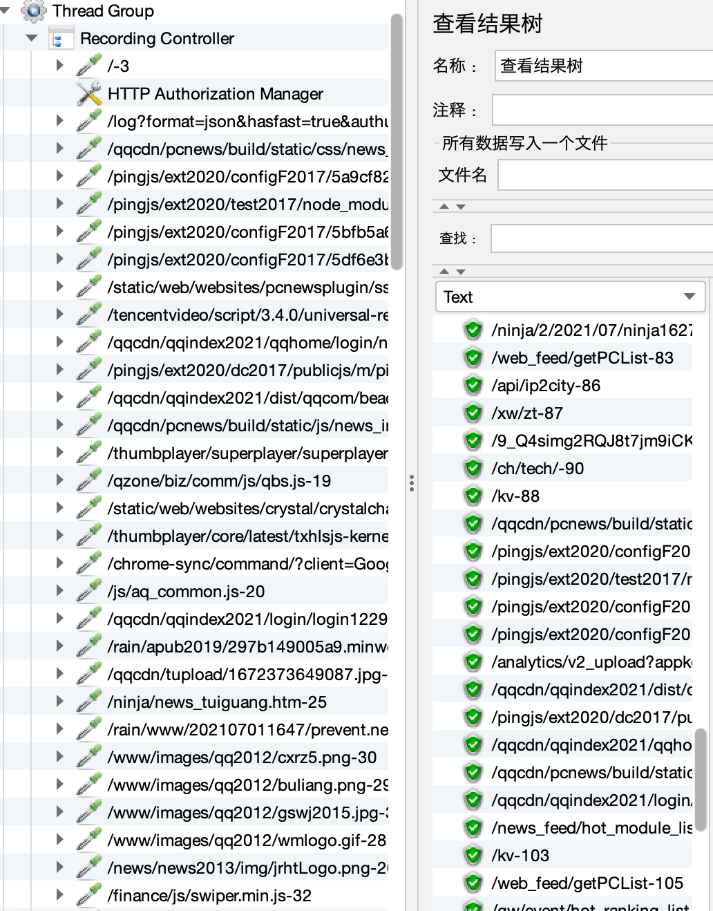

注意⚠️：
当关闭`JMeter`代理服务器时一定要同时关闭浏览器代理配置，否则再使用浏览器时无法进行网络访问。

## 优化

虽然业务逻辑步骤只是点了两个页面，但是录制出来的请求有很多个。

下面我们对这些请求进行一个分析，发现录制的脚本中有很多`js`或者`jpg`或者`css`等等结尾的请求，这些请求统称为静态资源。公司里面的**静态资源**是不会和请求的服务端共同放在一个服务器上。

### 静态资源优化
#### 静态资源概念

静态资源就是服务端发送到客户端的文件，比如：`js`、`css`、图片、音频等等。

静态资源是不会占用服务器的运算资源，所以在压测时不会关注静态资源相关的请求。

#### 静态资源存放位置

静态资源的存放位置，需要问一下前端研发，这块资源的统筹归属为前端研发。

静态资源会存放在`CDN`服务器上，`CDN`服务包含：**公司自建的CDN服务**、**又拍云**、**阿里云**、**七牛云**等等。
              
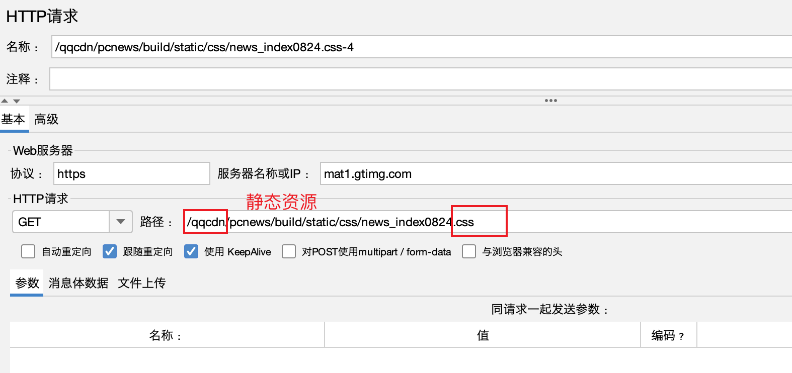

#### 过滤规则

录制的请求需要进行过滤，过滤的原则为去掉请求中的静态资源，只录制服务端的请求URL，不录制其他的图片资源内容。

- `Exclude`：过滤的内容，去掉一些静态请求比如：图片、js、css等
- `Include`：包含的内容


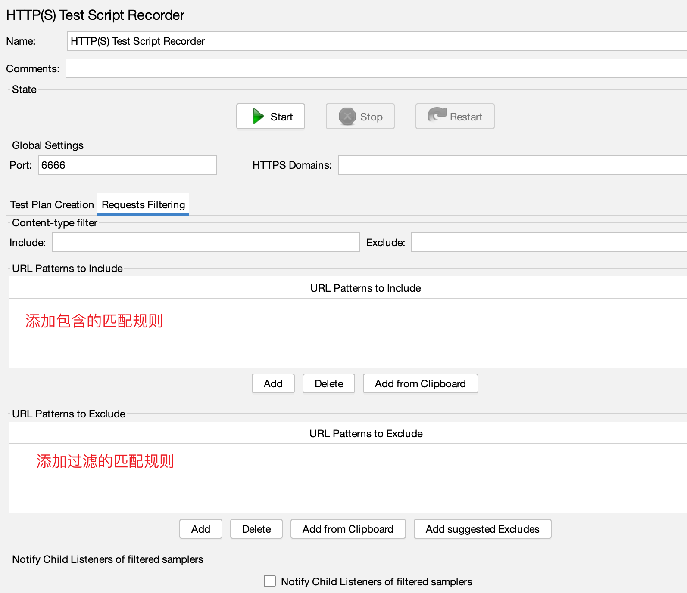

在匹配规则内进行添加，`Include Patterns`添加网站的域名包含规则，只录制业务请求的域名，其他请求域名不录制，比如腾讯的[新闻](https://new.qq.com/)相关页面表达式为：

```bash
(new\.qq\.com).*
```

`Exclude Patterns`添加录制请求的静态资源过滤规则，图片一般为`png`/`jpg`结尾，前端渲染配置一般为`css`/`js`/`jsp`，视频资源为`mp4`，动图一般以`gif`结尾。所以，静态资源过滤表达式为：
```bash
.*\.(png|jpg|css|js|jsp|mp4|gif).*
```

注意⚠️：在表达式中如果是域名的`.`符号，需要添加`\`转义字符。

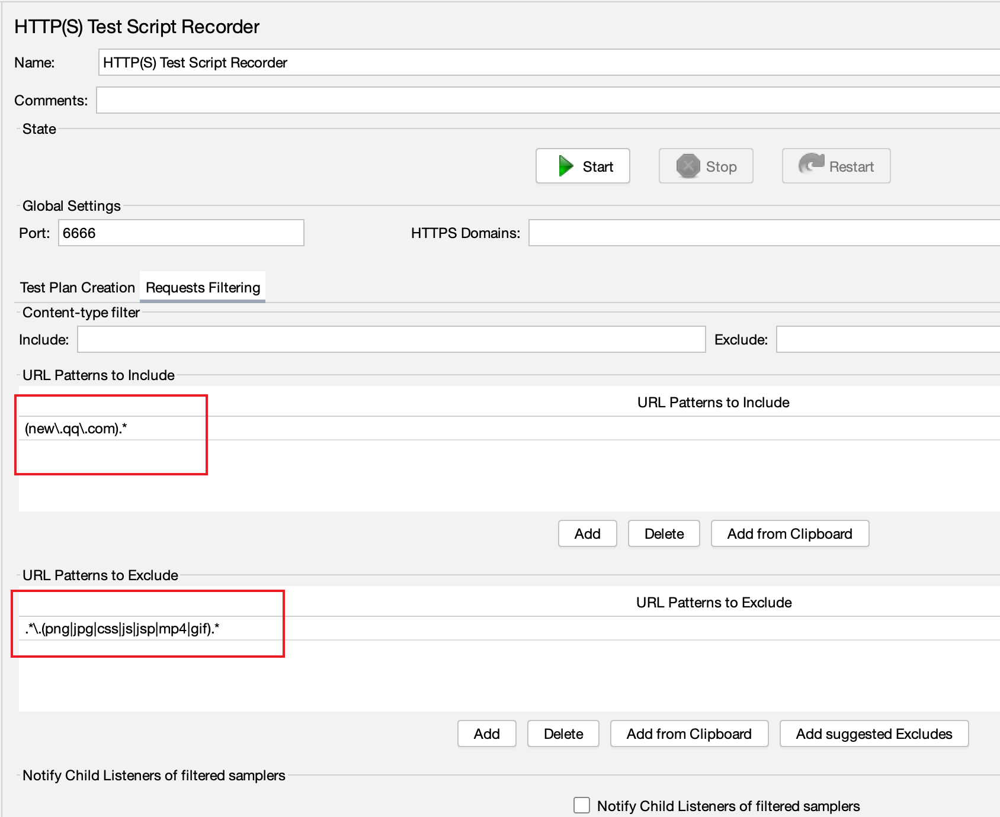

#### 优化验证

[优化](./资料/代理录制/录制Web优化.jmx)

根据录制步骤重新启动代理服务器，浏览器选择代理配置后，访问腾讯的[新闻](https://new.qq.com/)，录制的请求少很多，并且没有相关静态资源的内容加载进来，此时说明对应过滤的匹配规则正确。

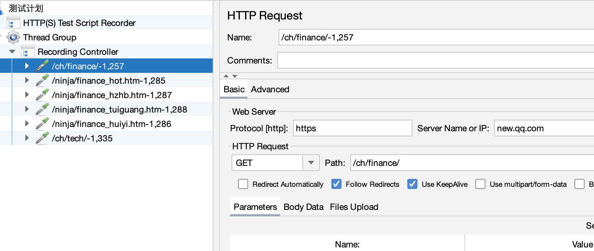


## 总结

- `JMeter`代理服务器配置内容
  - 端口
  - `URL`过滤规则：`Include`、`Exclude`
  - 录制脚本的存放位置
- 不同浏览器端配置代理设置
- 录制步骤
  - 开启JMeter代理
  - 不同系统的JMeter证书导入
  - 不通浏览器的JMeter证书配置
  - 配置浏览器代理
  - 业务操作
  - 使用过滤匹配来优化录制请求中的静态资源
- 运行验证
  - JMeter录制完成后查看是否有静态资源请求
  - 添加查看结果树，运行脚本查看结果
