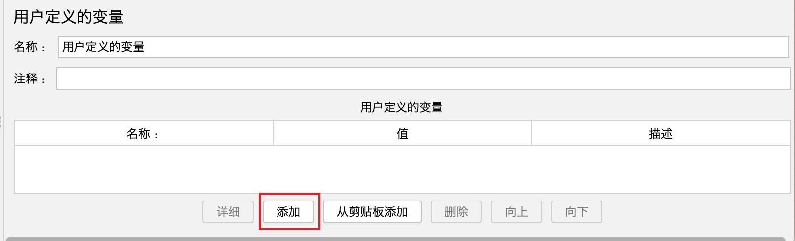

# 文章名
## 本章要点
1. 要点一
1. 要点
1. 要点
1. **要点**

## 学习目标

1. 。

## 思考

## 介绍
**用户定义的变量**（User Defined Variables，简称UDV），相当于是**全局变量**，所有的线程都可以使用。

**用户定义的变量**是JMeter中的一个配置元素，它可以帮助你在整个测试计划中存储和传递变量值。在应对**复杂测试场景**或**要管理多个变量值**时非常有用。UDV可以**让你重复使用不同取样器和控制器中的常量或动态值**。

#### 添加方式

1. 在测试计划上可以直接添加。

2. 在测试计划界面中，右键点击测试计划或线程组，然后选择 "**添加**" (Add) -> "**配置元素**" (Config Element) -> "**用户定义的变量**" (User Defined Variables)。

#### 注意

如果测试过程中想切换环境，切换配置，一般**不建议在测试计划上添加变量**，因为**不方便启用和禁用**，一般是**直接添加用户自定义变量组件**。

#### 变量声明及引用

1. 在 "**用户定义的变量"** 界面，点击 "**添加**" 按钮来添加一个新的变量。

    

2. 为新变量定义 "**名称**" (Name) 和 "**值**" (Value)。名称应尽量有意义，以帮助你快速识别变量的用途。

    

3. 变量引用。为了引用用户定义的变量，使用语法 `${变量名}`。
    >创建变量后，可以在测试计划中的其他元素（例如取样器断言、控制器等）使用这些变量。 例如，如果你有名为 "serverName" 的变量，可以在 HTTP请求取样器的 "服务器名称或IP" (Server Name or IP) 栏中使用 `${serverName}` 作为值。

#### 应用场景

使用用户定义的变量的一些典型应用场景包括：

1. **设置公共参数**：例如，为所有HTTP请求设置共同的名或IP地址。

1. **动态生成数据**：例如，为每次迭代生成不同的用户名进行登录测试。

1. **参数化测试数据**：例如，使用CSV文件中的不同数据集测试应用程序。

使用用户定义的变量可以提高测试计划的可重用性、灵活性和可维护性。合理使用UDV帮助你轻松管理复杂的测试计划。

## 总结
- 总结一
- 总结二
- 总结三
https://github.com/Wechat-ggGitHub/Awesome-GitHub-Repo

[项目演示地址](https://github.com/testeru-pro/junit5-demo/tree/main/junit5-basic)

# 学习反馈

1. SpringBoot项目的父工程为( )。

   - [x] A. `spring-boot-starter-parent`
   - [ ] B.`spring-boot-starter-web`
   - [ ] C. `spring-boot-starter-father`
   - [ ] D. `spring-boot-starter-super`

