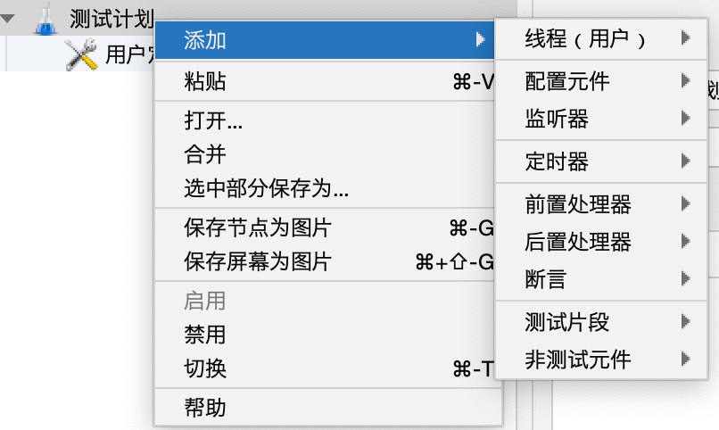

# 文章名
## 本章要点
1. 要点一
1. 要点
1. 要点
1. **要点**

## 学习目标

1. 。

## 思考

## 组件

以下是一个典型的测试计划所包的组件：

### 线程组（Thread Group）

线程组描述了要模拟的虚拟用户数量以及它们的行为。你可以创建多个线程组来测试不同的场景和并发用户配置。

### 配置元件（Configuration Element）

配置元素用于设置默认值、服务器认证、用户变量等，这些参数会影响到取样器和控制器的行为。

### 监听器（Listener）

监听器负责显示、记录和输出性能测试结果以及统计信息。可以将结果以多种形式展示，如图形报表、聚合报告等。

### 前置处理器（Pre-Processor）

前置处理器在取样器发送请求之前执行。它们可以执行一些预处理任务，如设置请求参数、读取文件数据等。

### 后置处理器（Post-Processor）

后置处理器在取样器完成请求之后执行。它们可以提取服务器响应中的有用信息、设置变量以供后续操作使用。

### 断言（Assertion）

断言用于验证服务器响应是否符合预期条件。例如，包含指定文本、具有预期状态码等。

创建一个有效的测试计划，请确保针对目标应用程序选择合适的组件，并正确配置它们。

一旦设置好测试计划，就执行性能测试并通过监听器查看测试结果。

务必根据测试场景的变化对测试计划进行调整，以确保获得准确的性能指标。

## 总结
- 总结一
- 总结二
- 总结三
https://github.com/Wechat-ggGitHub/Awesome-GitHub-Repo

[项目演示地址](https://github.com/testeru-pro/junit5-demo/tree/main/junit5-basic)

# 学习反馈

1. SpringBoot项目的父工程为( )。

   - [x] A. `spring-boot-starter-parent`
   - [ ] B.`spring-boot-starter-web`
   - [ ] C. `spring-boot-starter-father`
   - [ ] D. `spring-boot-starter-super`

