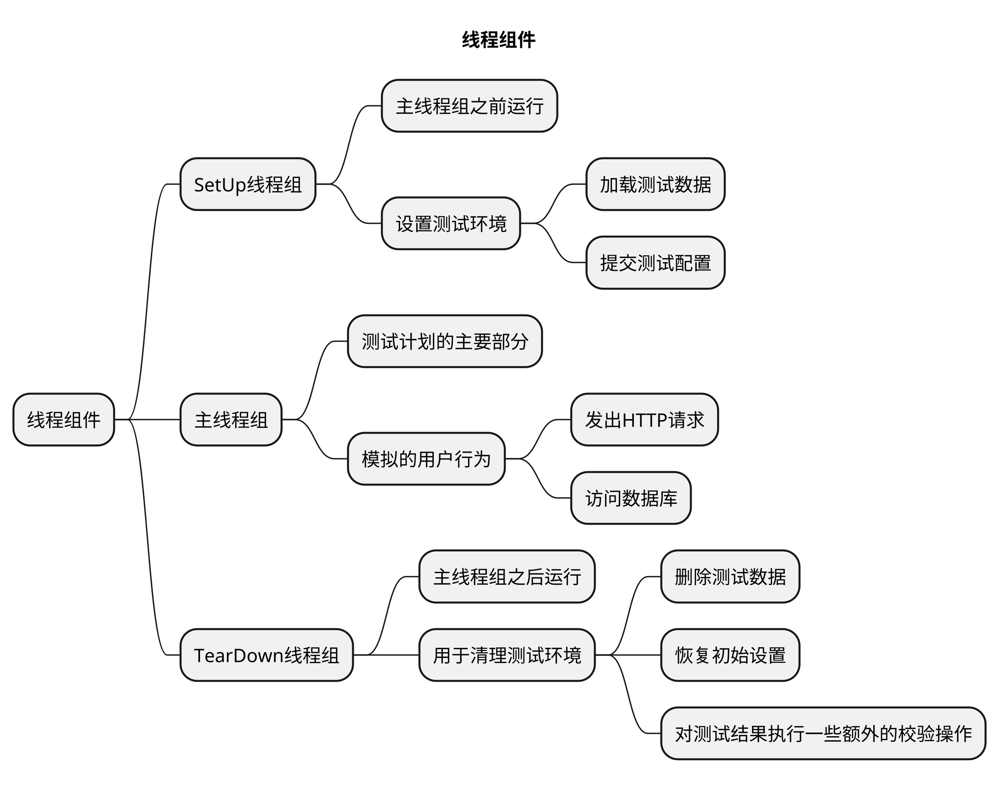

# 文章名

## 本章要点
1. 要点一
1. 要点
1. 要点
1. **要点**

 

## 学习目标

1. 。

## 思考

在JMeter中，除了标准的线程组之外，还有两种特殊类型的线程组：**SetUp线程组**（SetUp Thread Group）和**TearDown线程组**（TearDown Thread Group）。

它们在测试过程中的**运行顺序**分别是：**SetUp**线程组 -> **主**线程组 -> **TearDown**线程组。

## SetUp线程组

在**主线程组之前运行**，最初用于**设置测试环境**（例如**加载测试数据**、**提交测试配置**等）。

这些活动可以影响主线程组的执行，故应在主线程组开始之前完成。

## 主线程组

是测试计划的主要部分，包含**要模拟的用户行为**，例如**发出HTTP请求**、**访问数据库**等。

主线程组的执行将指示您系统输入各种负载的性能表现。

## TearDown线程组

在**主线程组之后运行**，通常用于**清理测试环境**（例如**删除测试数据**、**恢复初始设置**等）。

TearDown线程组还可以用于**对测试结果执行一些额外的校验**操作。

## 总结
- 总结一
- 总结二
- 总结三
https://github.com/Wechat-ggGitHub/Awesome-GitHub-Repo

[项目演示地址](https://github.com/testeru-pro/junit5-demo/tree/main/junit5-basic)

# 学习反馈

1. SpringBoot项目的父工程为( )。

   - [x] A. `spring-boot-starter-parent`
   - [ ] B.`spring-boot-starter-web`
   - [ ] C. `spring-boot-starter-father`
   - [ ] D. `spring-boot-starter-super`

