# 文章名

## 本章要点
1. 要点一
1. 要点
1. 要点
1. **要点**

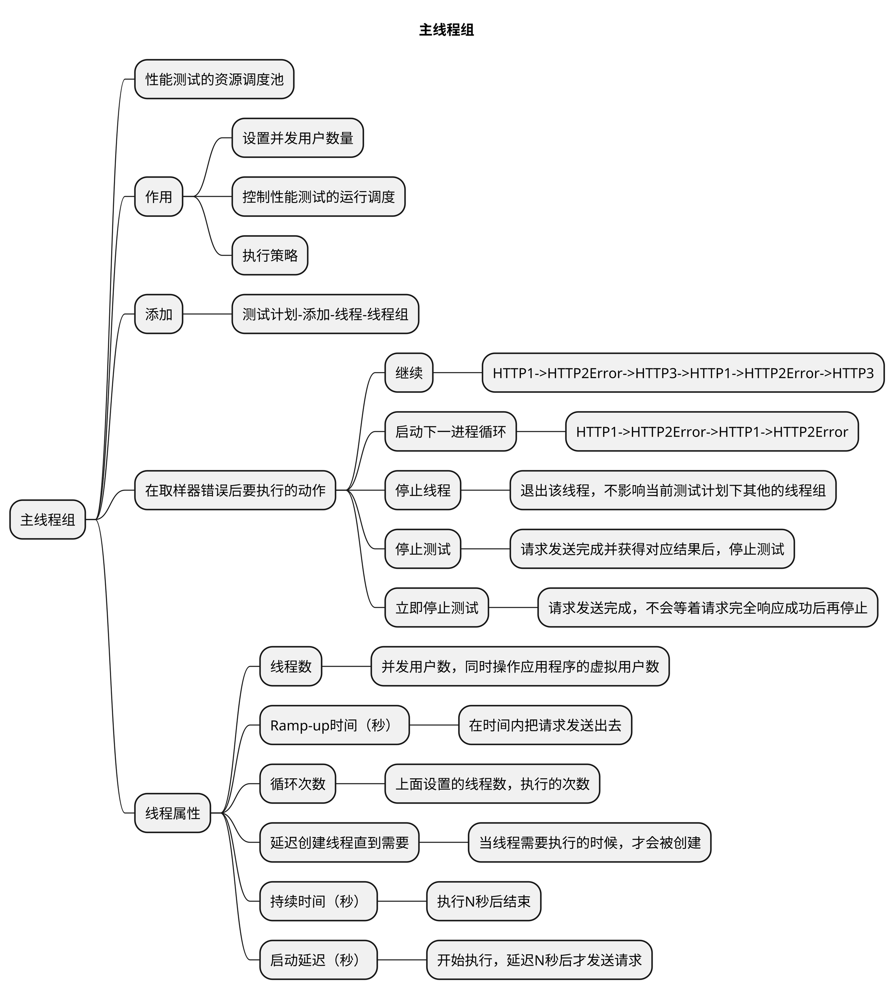

## 学习目标

1. 。

## 思考

## 介绍

线程组（Thread Group）是JMeter中一个非常重要的组件，它**定义了测试计划中虚拟用户的行为**。

线程组表示一组交互的虚拟用户，模拟真实环境中的多用户（客户端）访问。

线程组可以帮助你设置 参与人数「并发用户数量」、执行策略「执行过程的逻辑」以及性能测试的运行调度。

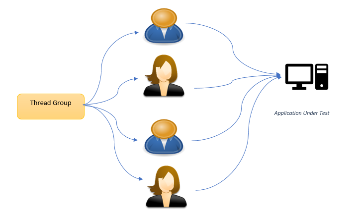

## 添加

添加线程组，**测试计划**(`Test Plan`) -> **添加**(`Add`) -> **线程**(`Threads`) -> **线程组**(`Thread Group`)

## 界面

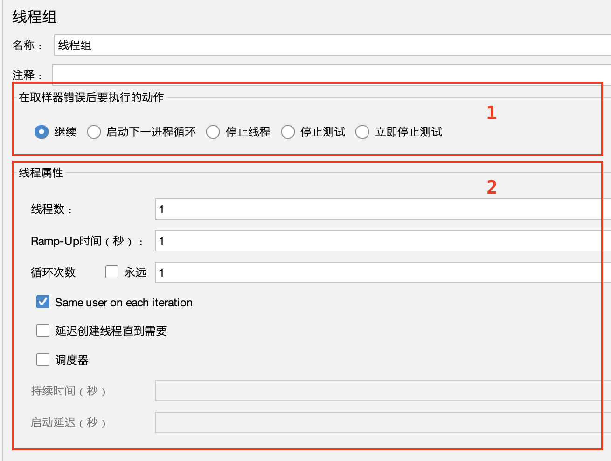

### 1. 在取样器错误后要执行的动作

>JMeter会在发送压测请求后，等待服务器返回响应。如果响应是正确的，此时没有问题，JMeter执行下一步就可以。但是如果响应的结果是错误的，出错了以后，就需要配置一下JMeter应该怎样操作。一般，出错了以后不用管，让JMeter直接执行下一步操作就可以。就是默认的**继续**选项。

Action to be taken after a Sample error：**在请求取样器执行错误时需要执行的下一步动作**。

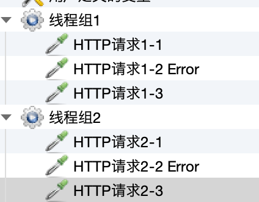

#### 继续

**continue**：继续执行接下来的操作。

执行：

**线程组1**

HTTP请求1 --> HTTP请求2 Error --> HTTP请求3 --> 

HTTP请求1 --> HTTP请求2 Error --> HTTP请求3

#### 启动下一进程循环

**startnextloop**：忽略错误，执行下一个循环。

>错误后的循环不再执行，启动下一个循环。

执行：

**线程组1**

HTTP请求1 --> HTTP请求2 Error --> 

HTTP请求1 --> HTTP请求2 Error --> 

...

>HTTP请求2请求执行错误了，后面的请求则不执行，直接跳到下一个循环继续执行。

#### 停止线程

**stopthread**：退出该线程（不再进行此线程的任何操作），但是不影响当前测试计划下其他的线程组。

执行：

**线程组1**

HTTP请求1 --> HTTP请求2 Error --> 停止当前线程

#### 停止测试

**stoptest**：等待当前执行的采样器结束后，结束整个测试。

当前线程中的请求，已经开始发送的请求，会在它请求发送完成并获得对应结果后，停止测试。

#### 立即停止测试

**stoptestnow**：直接停止整个测试，当前执行的取样器可能会中断。

不会等着请求完全响应成功后再停止。

### 2. 线程属性

#### 线程数

**Number of Thread (users)**：模拟的用户数量，表示并发用户数量（同时操作应用程序的虚拟用户数）。

同时在线的人数，有可能当天访问的人数是10万，但是并不是一直都在线，有可能是7-8点的在线人数是1000，9-10点的在线人数是5万，这样累计起来的在线人数是10万。所以，日活不能作为压测的线程数。

#### Ramp-up时间（秒）

**Ramp-up Period（in seconds）**：达到指定线程数所需要的时间。在**设置时间内启动** 所有线程「**上面设置的线程数**」。

>举例：线程数设置为50，此处设置为5，那么每秒启动的线程数 => 线程数50/5 = 10

>JMeter从0产生50的并发需要 5秒的一个时间过程，也就是一秒加10个并发，过了5秒才能压上。真正的业务场景中，并不是系统上来就拥有很大的一个并发数，而是陆续的流量进来，有一个过程。

在Ramp-up时间内，**把请求发送出去**，但是**不包括请求返回结果的时间**。

#### 循环次数

**Loop Count**：线程组结束前每个线程循环的次数。**上面设置的线程数，执行的次数**。

**勾选☑️永远**，若**未设置运行时间**，需要**手动停止**。

在每次循环内，线程组中的所有取样器和逻辑控制器将按顺序执行。

设置为1意味着每个虚拟用户将执行一次完整的测试过程。

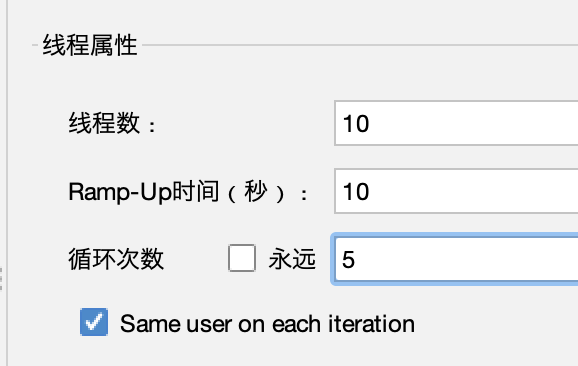

>10个请求循环5次，一共是50个线程请求。

#### Same user on each iteration

每次迭代都用相同的用户。

**勾选☑️** 那么 JMeter 将使用相同的用户详细信息在每次迭代中运行测试。

如果我们不想要，那么我们可以不选中此字段。

希望在线程组迭代之间保留cookie 和缓存-勾选 Same user on each iteration box。

如果想清除 cookie 和缓存 - 不要勾选此框。

注意：

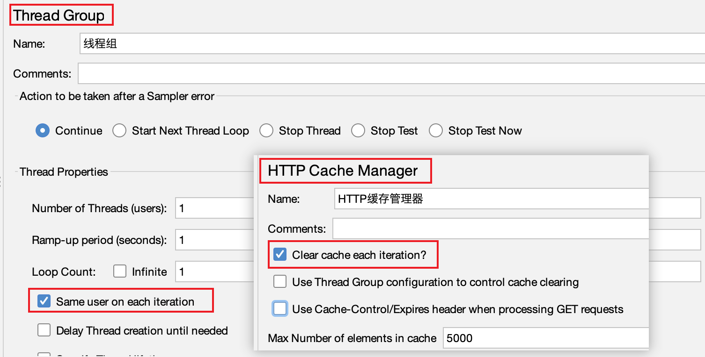

如果**线程组**勾选 Same User On Each Iteration 和 **HTTP 缓存管理器**勾选 Clear cache each iteration，则 **HTTP 缓存管理器将覆盖线程组设置**。

#### 延迟创建线程直到需要

`Delay Thread creation until needed`：当线程需要执行的时候，才会被创建。

如果**不勾选**，那么，在计划开始的时候，所有需要的线程就都被创建好了。

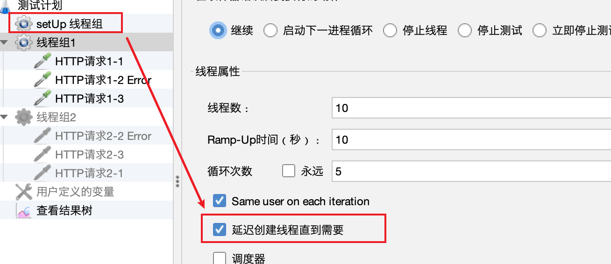

>有setUp 线程组时，勾选延迟创建线程直到需要，则运行完setUp 线程组才会创建线程组1的请求。否则会在运行前就创建线程组1的请求。 

**场景1:**

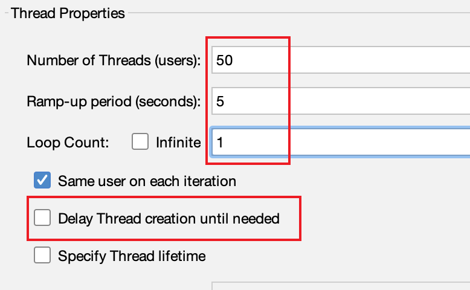

此时，50个线程会提前创建出来，但是不发送给服务端，每5秒发送10个线程给服务端。

**场景2:**

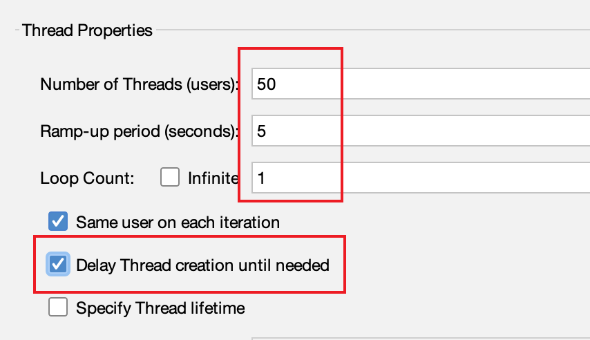

此时，50个线程不会提前创建出来，会先创建出10个线程发送给服务端，等过了1秒后再创建10个线程，再过1秒后再创建10个线程.....直到50个线程创建完成。

#### 调度器

Scheduler：**勾选☑️**此选项，你可以定制测试持续时间以及线程组的启动和停止时间。这在长时间测试和资源管理时非常有用。

#### 持续时间（秒）

Duration (seconds)：在此选项填入数字N，说明这个计划，从某个开始时间算起，执行N秒后结束。（会忽略 结束时间 的选项）

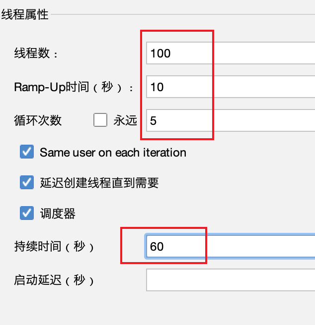

>100个并发执行5次，如果在60s内还未完成。JMeter也会结束你当前的压测请求，会把当前发出的请求完成，但是不会再创建新的请求实例。

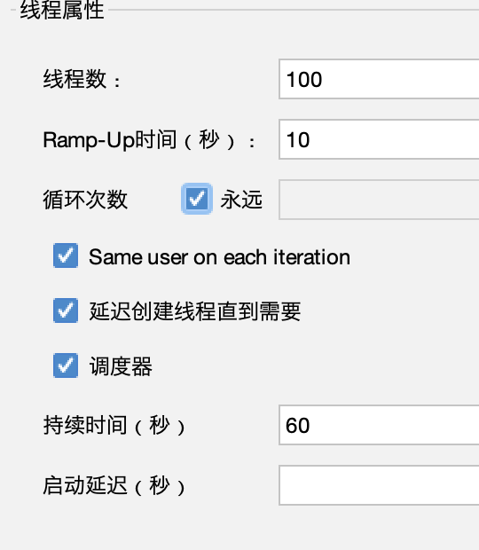

>把JMeter从循环次数的维度控制改编成从持续时间的一个维度去控制。100个线程不管循环请求多少次，持续压60s结束，在60s时，JMeter把当前请求完成，但是不会创建新的请求。

#### 启动延迟（秒）

Startup delay (seconds)：在此选项填入数字N，手动点击开始执行计划，然后延迟N秒后，线程组才真正开始发送请求执行。

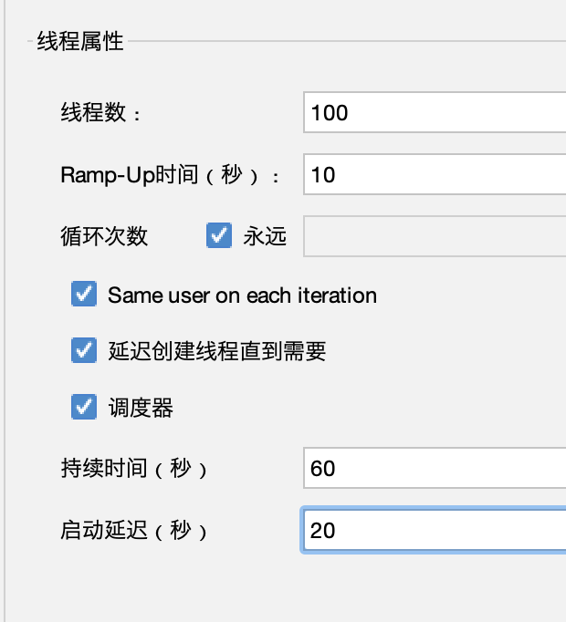

>设置了启动延迟20s，则在开始时，前20s是没有请求发送的，等过完20s后，才会发送请求，但是整体时间是60s，也就是发送压测请求也就40s「60-20」的时间。
「**发送并发请求的时间 = 持续时间（秒） - 启动延迟（秒）**」

>配置持续时间（秒）和启动延迟（秒）来控制每个线程组的持续时间及启动后的秒数。测试开始时，JMeter启动线程组的线程之前等待启动延迟（秒），然后运行配置的持续时间（秒）。

>10个线程，启动周期为100秒。JMeter花费100秒来启动和运行所有10个线程。每个线程将在上一个线程开始后10秒「100/10」开始。 如果有30个线程，启动周期为120s，每个连续线程将延迟4s启动。

## 总结
- 总结一
- 总结二
- 总结三
https://github.com/Wechat-ggGitHub/Awesome-GitHub-Repo

[项目演示地址](https://github.com/testeru-pro/junit5-demo/tree/main/junit5-basic)

# 学习反馈

1. SpringBoot项目的父工程为( )。

   - [x] A. `spring-boot-starter-parent`
   - [ ] B.`spring-boot-starter-web`
   - [ ] C. `spring-boot-starter-father`
   - [ ] D. `spring-boot-starter-super`

