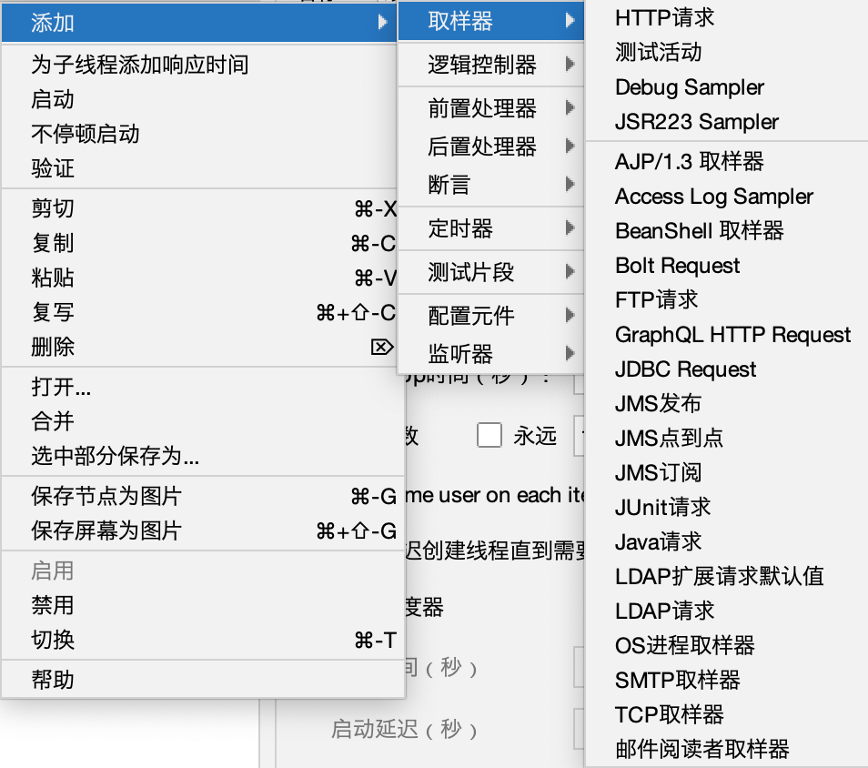

# 文章名
## 本章要点
1. 要点一
1. 要点
1. 要点
1. **要点**

```plantuml
@startmindmap
scale 10
title 取样器/采样器
* 取样器
** 生成各种类型负载请求的组件
** 常用取样器
*** HTTP Request
*** Debug 取样器
*** BeanShell 取样器
*** JDBC Request
*** TCP Sampler
*** Java请求
@endmindmap
```

## 学习目标

1. 。

## 思考

## 

在JMeter中，在线程组（Thread Group）下添加取样器（Sampler）将帮助您**创建和配置用于执行特定操作**（例如发送HTTP请求、访问数据库等）的元素。这些取样器将在测试场景中使用，以**模拟用户在实际情况下执行的各种操作**。

JMeter中的取样器（Sampler）是用于**生成各种类型负载请求的组件**，这些负载请求被发送到服务器以评估应用程序在特定场景下的性能。

取样器的结果可以通过监听器（Listener）分析和可视化，以便找出性能瓶颈并绘制出应用程序的响应时间图。

## 常用取样器

在JMeter中有许多取样器类型，它们覆盖了各种网络协议和访问类型。以下是一些常用的取样器类型及其作用：

### HTTP Request

模拟HTTP/HTTPS请求，广泛应用于Web应用程序和API接口测试中。

### Debug 取样器

### BeanShell 取样器

### JDBC Request

测试数据库性能，向目标数据库发送SQL查询请求并评估响应时间。

### FTP Request

检测FTP服务器性能，通过模拟文件上传和下载。

### SMTP Sampler

测试邮件服务器性能，通过模拟发送电子邮件的过程。

### JMS Sampler

评估Java消息服务（Java Message Service）性能，模拟JMS发布者和消费者请求。

### TCP Sampler

验证TCP协议的性，通过模拟TCP请求和响应。

### Java请求

通过运行自定义Java类来测试应用程序的性能。

### BSF Sampler和JSR223 Sampler

使用各种脚本编程语言（如Groovy、Python、Beanshell等）执行自定义脚本，实现非常灵活的测试场景。

这些取样器可以根据实际的测试需求组合使用。

通过为不同的取样器分不同的线程数、持续时间和循环次数，可以模拟各种真实场景的负载情况。与定时器、断言和监听器配合使用，您可以创建强大的性能测试套件。

在整个测试周期中，取样器不仅可以识别性能瓶颈，还可以优化您的应用程序来改善用户体验。

下面先介绍常用的三个：**HTTP请求的取样器**、**Debug 取样器**、**BeanShell 取样器**。

## 总结
- 总结一
- 总结二
- 总结三
https://github.com/Wechat-ggGitHub/Awesome-GitHub-Repo

[项目演示地址](https://github.com/testeru-pro/junit5-demo/tree/main/junit5-basic)

# 学习反馈

1. SpringBoot项目的父工程为( )。

   - [x] A. `spring-boot-starter-parent`
   - [ ] B.`spring-boot-starter-web`
   - [ ] C. `spring-boot-starter-father`
   - [ ] D. `spring-boot-starter-super`

