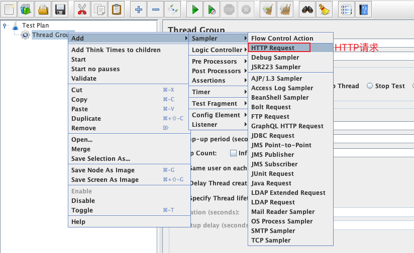
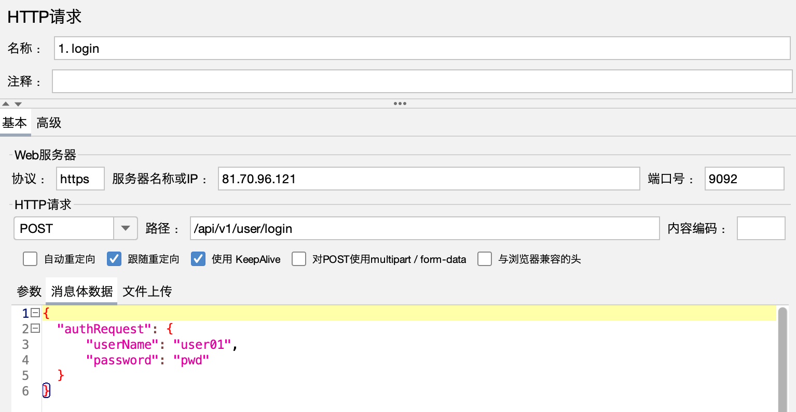
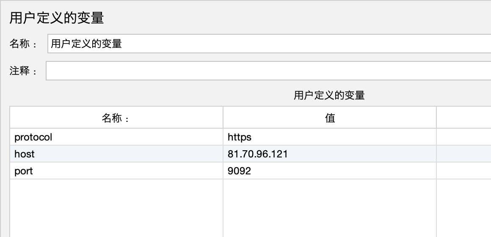

# HTTP取样器
## 本章要点
1. 要点一
1. 要点
1. 要点
1. **要点**


## 学习目标

1. 。


## 思考

JMeter中的HTTP取样器(Http Request)允许用户在性能测试中模拟HTTP/HTTPS请求。

它是JMeter中最常用的取样器之一，因为在现代网络应用中，HTTP/HTTPS通信非常普遍。


## 添加

导航到 **线程组**(`Thread Group`) -> **添加**(`Add`) -> **采样器**(`Sampler`) -> **HTTP 请求**(`HTTP Request`)。




## 界面


## 基本


在“**基本**”选项卡下，您可以配置HTTP请求。

主要设置包括：

### Web服务器

#### 协议

指定**HTTP**或**HTTPS**。

#### 服务器名称或IP

配置测试目标的**IP地址**或**域名**。

域名：www.baidu.com；IP地址：10.15.14.55。

#### 端口号

配置目标服务器上的端口号，业务自定义指定的端口。

>一般情况下，HTTP为 80，HTTPS为 443。

### HTTP请求

#### Method

请求方法（例如 **GET**，**POST**，PUT，DELETE等）。

获取：研发提供、抓包、swagger-API。

#### 路径

目标服务器上的API路径。

请求域名后的路径，以 **/** 开头。

#### 内容编码

字符集，默认使用UTF-8。


### 参数

### 请求参数

在此区域可以添加请求参数的数据。


#### 消息体数据

body体数据，HTTP POST表单数据等。

#### 文件上传

上传文件，直接填写文件路径。


## 场景1：GET请求不带参数

编写**GET请求不带参数**的脚本。

接下来搜索可在 Internet 上免费获得的[baidu](https://www.baidu.com/)。


### 响应结果乱码


```bash
# The encoding to be used if none is provided (default ISO-8859-1)
#sampleresult.default.encoding=ISO-8859-1
sampleresult.default.encoding=UTF-8
```


[脚本](./资料/GETAPI.jmx)


## 场景2：GET请求带参数

编写**GET请求带参数**的脚本。

接下来搜索可在 Internet 上免费获得的[Reqres API](https://reqres.in/)。

我们将以 Reqres API 为例。


GET请求如下：


现在你有了API，从链接中找出**服务器名称**、**路径**和**参数**。在JMeter 测试计划的 HTTP 请求中复制这些值。


[脚本](./资料/GETAPI.jmx)


## 实战：获取登录token


获取**accesstoken**是调用商城API接口的第一步，相当于创建了一个登录凭证，其它的业务API接口，都需要依赖于**accesstoken**来鉴权调用者身份。

**请求方式：** POST（**HTTP**）

**请求地址：**`https://81.70.96.121:9092/api/v1/user/login`

**请求包体：**
```
{
  "authRequest": {
      "userName": "user01",
      "password": "pwd"
  }
}
```

**参数说明**：

| 参数 | 是否必填| 说明 |
| --- | --- | --- |
| userName | 是 | 用户名，默认user01 |
| password | 是 | 密码，默认密码pwd |


**返回结果：**
```json
{
  "access_token": "3b6754f00bb0063071c5b71ce2b56b4ed0ce56a63493e785bea85b74c41ce200", 
  "code": "200", 
  "message": "login success"
}
```

备注：**accesstoken** 使用方法：在每个业务接口的headers中添加token键值对，键为“accesstoken”，值为具体的token值。

| 字段 | 值 | 备注 |
| --- | --- | --- |
| accesstoken | 随机文本，例如“7172bbc7-f81a-4a78-9220-e55e3cfdf98c” | 通过登录接口获取 |


### 脚本设置



## 实战：请求中的默认标头提取


**优化提取登录请求中的默认标头。**


### 优化




## 总结
- 总结一
- 总结二
- 总结三
https://github.com/Wechat-ggGitHub/Awesome-GitHub-Repo

[项目演示地址](https://github.com/testeru-pro/junit5-demo/tree/main/junit5-basic)


# 学习反馈

1. SpringBoot项目的父工程为( )。

   - [x] A. `spring-boot-starter-parent`
   - [ ] B.`spring-boot-starter-web`
   - [ ] C. `spring-boot-starter-father`
   - [ ] D. `spring-boot-starter-super`


<style>
  strong {
    color: #ea6010;
    font-weight: bolder;
  }
  .reveal blockquote {
    font-style: unset;
  }
</style>


