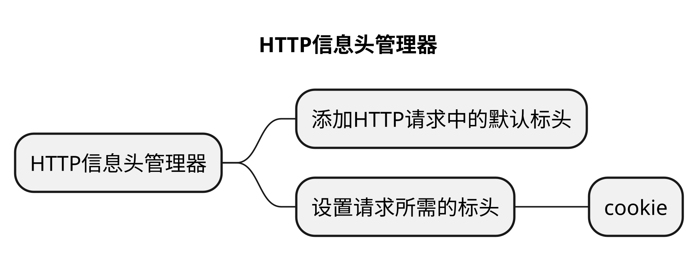
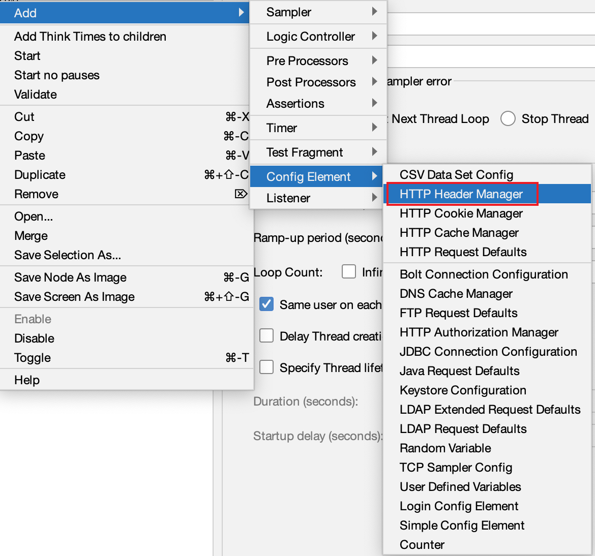
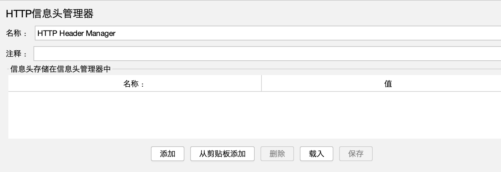

# HTTP信息头管理器
## 本章要点
1. 要点一
1. 要点
1. 要点
1. **要点**

## 学习目标

1. 。

## 思考

## 添加

导航到 **线程组**(`Thread Group`) -> **添加**(`Add`) -> **配置元件**(`Config Element`) -> **HTTP信息头管理器**(`HTTP Header Manager`)。

## 界面

## 作用

1. 添加、删除或修改HTTP请求中的默认标头。

1. 设置请求所需的标头，以便在虚拟浏览器中实际测试缓存、cookie和其他信息。

1. 模拟使用各种用户代理（User—Agent）的Web应用程序响应性。

1. 在服务器上创建条件请求以协调对后续请求的响应。例如如果—修改—自标头）。

使用HTTP头管理器可以更接近真实地再现测试中假设的场景和真实用户行为，从而评估Web应用程序的性能和可靠性。

## 总结
- 总结一
- 总结二
- 总结三
https://github.com/Wechat-ggGitHub/Awesome-GitHub-Repo

[项目演示地址](https://github.com/testeru-pro/junit5-demo/tree/main/junit5-basic)

# 学习反馈

1. SpringBoot项目的父工程为( )。

   - [x] A. `spring-boot-starter-parent`
   - [ ] B.`spring-boot-starter-web`
   - [ ] C. `spring-boot-starter-father`
   - [ ] D. `spring-boot-starter-super`

