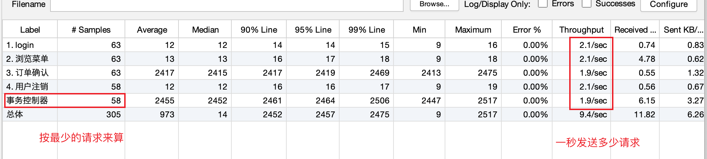
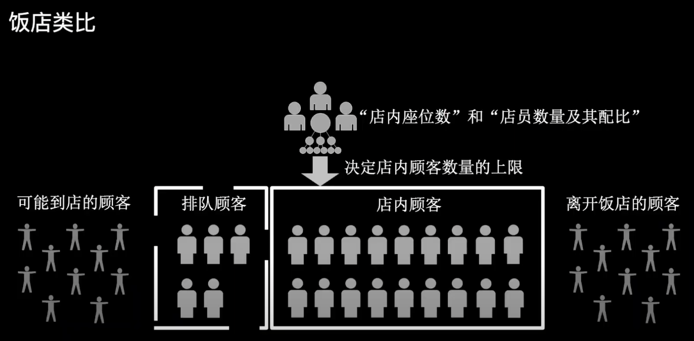
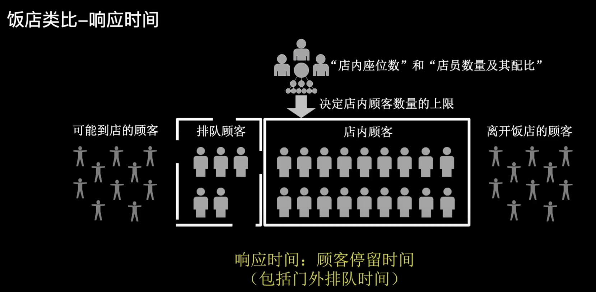
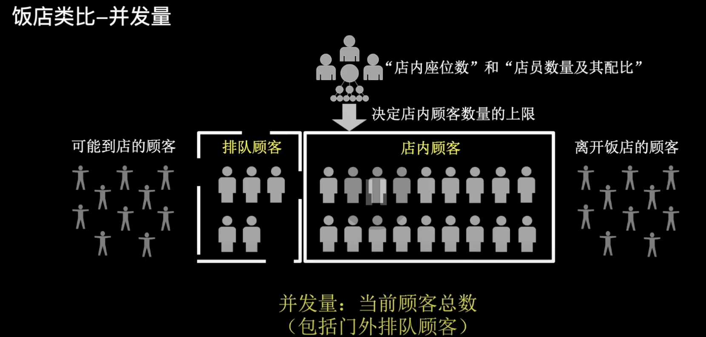
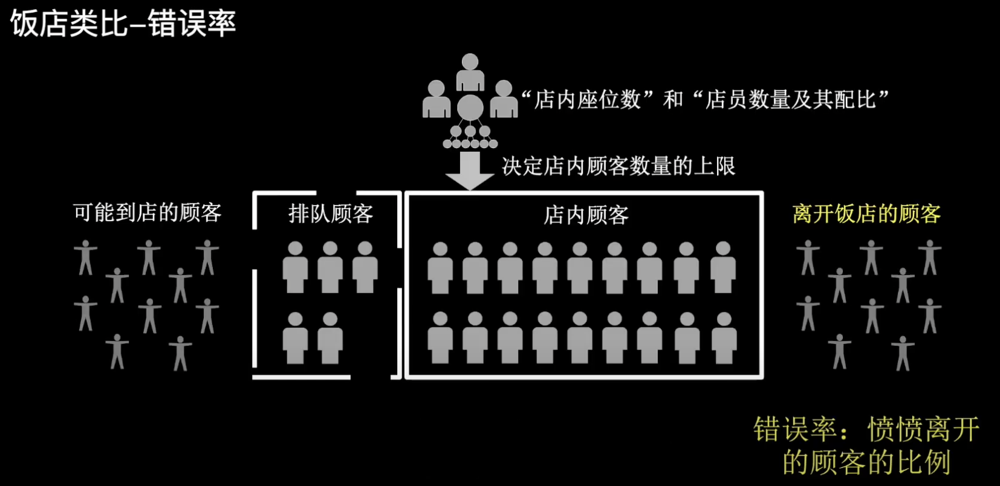
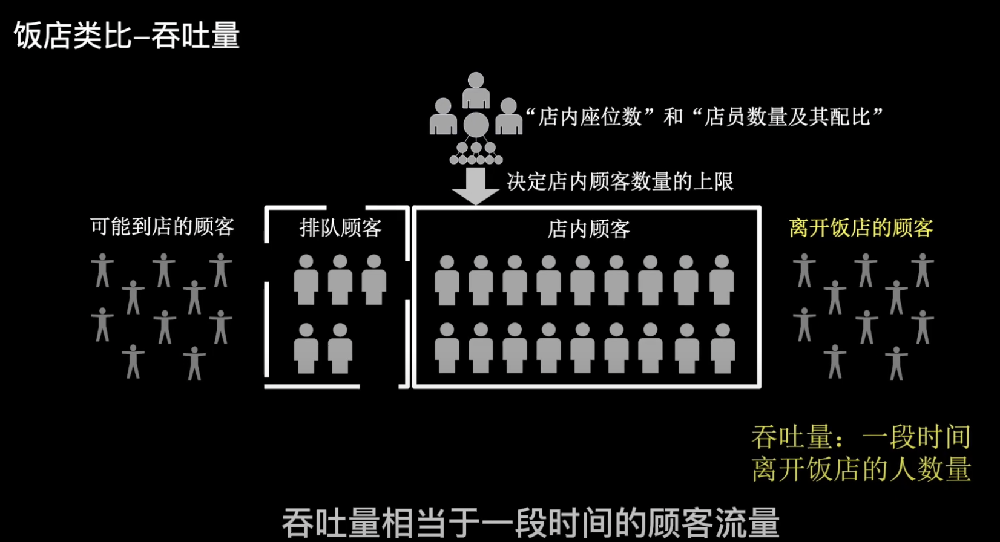
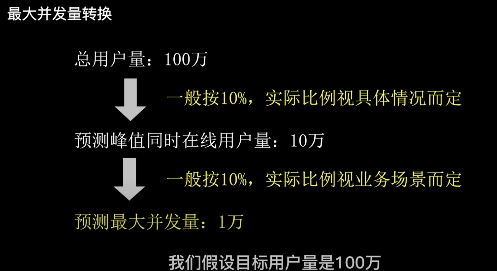
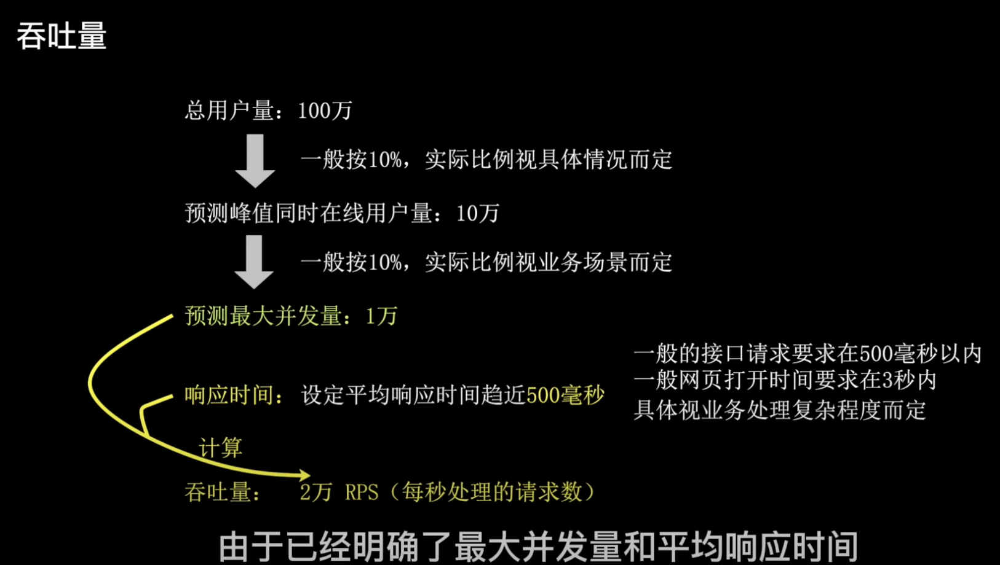

## 性能指标

性能指标：响应时间、并发量、吞吐量、错误率。

### 响应时间

处理一个请求所需要的时间。

网络良好前提下，网页打开时间一般要求在3s内，普通接口的响应时间在500ms内。

### 并发量

网站系统在同一时间需要处理的请求数，包括正在处理的请求和处于等待的请求。

### 吞吐量

网站系统在一段时间（每秒）处理请求的数量，常用单位 TPS、RPS、QPS。

**RPS、QPS**：每秒处理的请求数量。
**TPS**：每秒处理的事务数。

查看商品列表、查看商品详情、下单

整个行为是1个事务，3次请求。

理论上，TPS是RPS的1/3。

### 错误率

一段时间的请求错误率，0.5%以下即可。

虽然错误率最好是0%，但是在大量的并发时很难实现，所以请求错误率一般在0.5%以下即可。

以上的4个性能指标，单独拿出来任何一个都不能描述系统的性能。只有4个指标结合才能描述。

## 类比

以上4个性能指标可以用饭店来类比。

饭店相当于**网站系统**，顾客就相当于**接收的请求**。

**响应时间**就是顾客到达饭店到离开饭店到时间，包括门外排队的时间。

**并发数量**相当于当前顾客数量，包括门外排队顾客和店内顾客。

**错误率**相当于中途走掉的人。
如果上菜太慢就会直接走掉，对应响应时间太长。如果排队或店里没有位置也会走掉一部分，相当于服务器会拒绝一部分请求，对应并发量过大。

**吞吐量**相当于一段时间的顾客流量，但吞吐量的有效量依赖错误率。

>1小时有100个顾客，但是这100个顾客并不一定都是吃完饭走的，也有一部分没吃饭走掉的。

## 并发量转换

究竟什么样的性能指标才能满足目标用户量？？

假设目标用户量100万，那么同时在线用户的峰值一般是10%，当然这个比例不同平台相差可能甚远，有些平台可能只有千分之一。

假设同时在线用户的峰值是10万，系统最大并发量一般为1万（10%），因为同时在线用户不回同时发送请求。

购物场景，用户不可能点开商品详情就马上点击购买，一般是先阅读以下信息再决定是否购买，这个转换的值与业务是相关的，这里假设最大并发量是1万。

这里以普通接口为例，在峰值压力时，平均响应时间要求趋近500ms，由于已经明确了最大并发量和平均响应时间，所以可以计算出峰值压力时RPS应该高于2万。

这里的RPS>2万，是峰值1万的前提下。如果低于这个压力，RPS有可能更高。但是低压力下的RPS参考意义不大，最后错误率在0.5%以下即可。

经过以上转换就可满足100万用户的使用。

## 行业参考标准

不同行业不同业务可接受的响应时间是不同的，一般情况，对于在线实时交易：

**互联网企业**：500 毫秒以下，例如淘宝业务 10 毫秒左右。

**金融企业**：1 秒以下为佳，部分复杂业务 3 秒以下。

**保险企业**：3 秒以下为佳。

**制造业**：5 秒以下为佳。

**时间窗口**：不同数据量结果是不一样的，大数据量的情况下，2 小时内完成。

需要指出的是，响应时间的绝对值并不能直接反映软件的性能的高低，软件性能的高低实际上取决于用户对该响应时间的接受程度。

