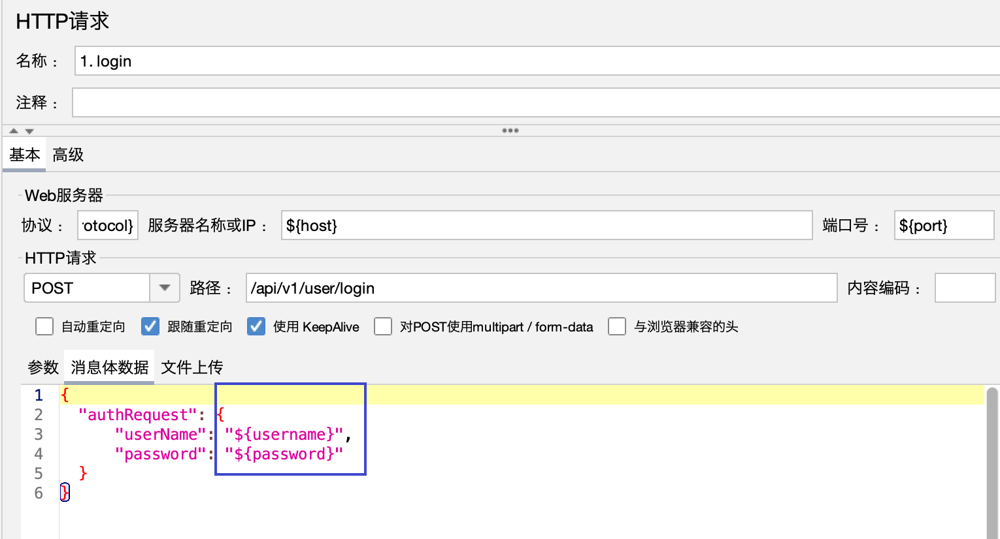

# 接口


## 登录


获取**accesstoken**是调用商城API接口的第一步，相当于创建了一个登录凭证，其它的业务API接口，都需要依赖于**accesstoken**来鉴权调用者身份。

**请求方式：** POST（**HTTP**）

**请求地址：**`https://81.70.96.121:9092/api/v1/user/login`

**请求包体：**
```
{
  "authRequest": {
      "userName": "user01",
      "password": "pwd"
  }
}
```

**参数说明**：

| 参数 | 是否必填| 说明 |
| --- | --- | --- |
| userName | 是 | 用户名，默认user01 |
| password | 是 | 密码，默认密码pwd |


**返回结果：**
```json
{
  "access_token": "3b6754f00bb0063071c5b71ce2b56b4ed0ce56a63493e785bea85b74c41ce200", 
  "code": "200", 
  "message": "login success"
}
```

备注：**accesstoken** 使用方法：在每个业务接口的headers中添加token键值对，键为“accesstoken”，值为具体的token值。

| 字段 | 值 | 备注 |
| --- | --- | --- |
| accesstoken | 随机文本，例如“7172bbc7-f81a-4a78-9220-e55e3cfdf98c” | 通过登录接口获取 |

## 浏览菜单

**请求方式：** GET（**HTTP**）

**请求地址：**`https://81.70.96.121:9092/api/v1/menu/list`


**返回结果：**

```
{
  "breakfast": [
    {
      "menu_name": "小笼包", 
      "menu_nunber": "01", 
      "menu_price": 5.5
    }, 
    {
      "menu_name": "八宝粥", 
      "menu_nunber": "02", 
      "menu_price": 3.0
    }, 
    {
      "menu_name": "油条", 
      "menu_nunber": "03", 
      "menu_price": 1.5
    }, 
    {
      "menu_name": "茶叶蛋", 
      "menu_nunber": "04", 
      "menu_price": 1.0
    }, 
    {
      "menu_name": "豆包", 
      "menu_nunber": "05", 
      "menu_price": 1.5
    }, 
    {
      "menu_name": "烧饼", 
      "menu_nunber": "06", 
      "menu_price": 2.0
    }
  ], 
  "code": "200", 
  "dinner": [
    {
      "menu_name": "辣椒炒肉", 
      "menu_nunber": "13", 
      "menu_price": 21.0
    }, 
    {
      "menu_name": "豌豆肉片汤", 
      "menu_nunber": "14", 
      "menu_price": 15.0
    }, 
    {
      "menu_name": "原味五花肉卷", 
      "menu_nunber": "15", 
      "menu_price": 26.0
    }, 
    {
      "menu_name": "醋溜白菜", 
      "menu_nunber": "16", 
      "menu_price": 20.0
    }, 
    {
      "menu_name": "地三鲜", 
      "menu_nunber": "17", 
      "menu_price": 25.5
    }, 
    {
      "menu_name": "红烧排骨", 
      "menu_nunber": "18", 
      "menu_price": 39.0
    }
  ], 
  "lunch": [
    {
      "menu_name": "宫保鸡丁", 
      "menu_nunber": "07", 
      "menu_price": 17.0
    }, 
    {
      "menu_name": "锅包肉", 
      "menu_nunber": "08", 
      "menu_price": 25.0
    }, 
    {
      "menu_name": "糖醋排骨", 
      "menu_nunber": "09", 
      "menu_price": 35.0
    }, 
    {
      "menu_name": "蒜台炒肉片", 
      "menu_nunber": "10", 
      "menu_price": 30.0
    }, 
    {
      "menu_name": "酸辣土豆丝", 
      "menu_nunber": "11", 
      "menu_price": 25.5
    }, 
    {
      "menu_name": "红烧茄子", 
      "menu_nunber": "12", 
      "menu_price": 32.0
    }
  ]
}
```

## 订单确认

**请求方式：** POST（**HTTP**）

**请求地址：**`https://81.70.96.121:9092/api/v1/menu/confirm`

**请求包体：**

```
{
    "order_list": [
        {
            "menu_nunber" : "01",
            "number" : 2
        },
        {
            "menu_nunber" : "03",
            "number" : 2
        },
        {
            "menu_nunber" : "04",
            "number" : 2
        },
        {
            "menu_nunber" : "05",
            "number" : 3
        }
    ]
}
```


**参数说明**：

| 参数 | 是否必填| 说明 |
| --- | --- | --- |
| menu_nunber | 是 | 菜单编号，str |
| number | 是 | 数量，int |


**返回结果：**

```
{
  "code": "200", 
  "message": "Order success.", 
  "total": 9
}
```


## 用户注销

**请求方式：** DELETE**HTTP**）

**请求地址：**`https://81.70.96.121:9092/api/v1/user/logout`


**返回结果：**


```
{
  "code": "200", 
  "message": "logout success"
}
```


# 需求


## 登录


1. **定义请求名称**：用户登录

1. 配置 Host 、Port、Path = /api/v1/user/login
1. 配置 Method = POST
1. 在Http Request中添加 Http Header Manager， 管理该请求的header信息
1. 添加 “View Result Tree” 用于查看 请求/响应 详情


## 请求头提取


## 浏览菜单


没有token导致，需要添加HTTP头管理器。


## jmeter中文显示问题的解决


1. 解决乱码问题 -> 在`<jmeter_home>/bin/jmeter.properties`配置文件中设置 `sampleresult.default.encoding=utf-8`。

2. 解决Unicode 显示成可读中文的问题 -> 将 以下 内容复制粘贴到 后置处理器`BeanShell PostProcessor` 中。


```java
String s2 = new String(prev.getResponseData(), "UTF-8");
//---------------一下步骤为转码过程---------------
char aChar;
int len = s2.length();
StringBuffer outBuffer = new StringBuffer(len);
for (int x = 0; x < len;)
{
    aChar = s2.charAt(x++);
    if (aChar == '\\') {
        aChar = s2.charAt(x++);
        if (aChar == 'u') {
            int
            value = 0;
            for (int i = 0;
            i < 4;
            i++
        )
            {
                aChar = s2.charAt(x++);
                switch (aChar) {
                    case'0':
                    case'1':
                    case'2':
                    case'3':
                    case'4':
                    case'5':
                    case'6':
                    case'7':
                    case'8':
                    case'9':
                        value = (value << 4) + aChar - '0';
                        break;
                    case'a':
                    case'b':
                    case'c':
                    case'd':
                    case'e':
                    case'f':
                        value = (value << 4) + 10 + aChar - 'a';
                        break;
                    case'A':
                    case'B':
                    case'C':
                    case'D':
                    case'E':
                    case'F':
                        value = (value << 4) + 10 + aChar - 'A';
                        break;
                    default:
                        throw new IllegalArgumentException(
                            "Malformed   \\uxxxx  encoding.");
                }
            }
            outBuffer.append((char)
            value
        )
            ;
        } else {
            if (aChar == 't')
                aChar = '\t';
            else if (aChar == 'r')
                aChar = '\r';
            else if (aChar == 'n')
                aChar = '\n';
            else if (aChar == 'f')
                aChar = '\f';
            outBuffer.append(aChar);
        }
    } else
        outBuffer.append(aChar);
}
//-----------------以上内容为转码过程---------------------------
//将转成中文的响应结果在查看结果树中显示

prev.setResponseData(outBuffer.toString());
```

## 订单确认


## 用户注销


# 进阶

## Json后置处理器

不同的用户登录会是不同的token，需要把信息头的token不能固定，要根据不同的用户返回的结果放入。


## CSV多用户导入

- 从 CSV文件中导入多用户名 + 密码
- 解析access token，获得用户的正确认证标识
- jmeter中的参数传递





**修改并发数，执行12次线程，查看用户是否重复使用。**


## 事务控制器


示例：


