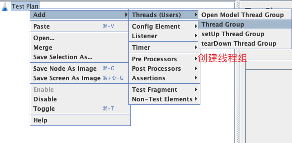

# 性能实战

霍格沃兹测试开发学社

ceshiren.com

---

## 目录


---


## JMeter介绍


---


## JMeter安装


---


## JMeter启动提示

```bash
# 不要使用GUI模式进行负载测试 GUI模式只是压测脚本的创建和调试
Dont use GUI mode for load testing !, only for Test creation and Test debugging.
# 如果想要进行负载测试 使用CLI模式 即非GUI模式 -- 静默压测会详细介绍
For load testing, use CLI Mode (was NON GUI):
   jmeter -n -t [jmx file] -l [results file] -e -o [Path to web report folder]
# 可以增加Java的堆来满足压测需求
& increase Java Heap to meet your test requirements:
# 修改JMeter文件的Java堆变量
   Modify current env variable HEAP="-Xms1g -Xmx1g -XX:MaxMetaspaceSize=256m" in the jmeter batch file
```


---


## 压测脚本四要素


---


### 用户定义的变量


---

## 线程组件


---

## 线程组添加

添加线程组，**测试计划**(`Test Plan`) -> **添加**(`Add`) -> **线程**(`Threads`) -> **线程组**(`Thread Group`)




---


## 线程组参数


---


