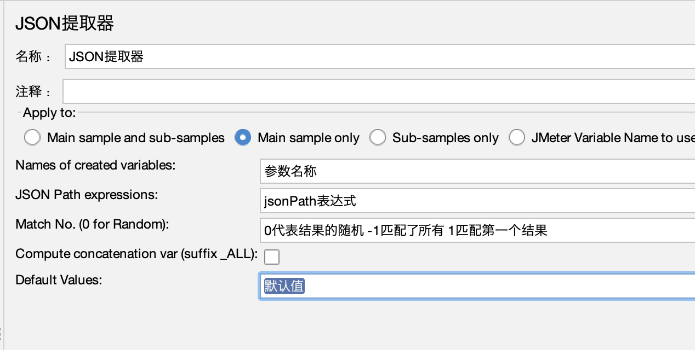

# 性能实战

霍格沃兹测试开发学社

ceshiren.com

---

## 目录


---


## JMeter介绍


---


## JMeter安装


---


## JMeter启动提示

```bash
# 不要使用GUI模式进行负载测试 GUI模式只是压测脚本的创建和调试
Dont use GUI mode for load testing !, only for Test creation and Test debugging.
# 如果想要进行负载测试 使用CLI模式 即非GUI模式 -- 静默压测会详细介绍
For load testing, use CLI Mode (was NON GUI):
   jmeter -n -t [jmx file] -l [results file] -e -o [Path to web report folder]
# 可以增加Java的堆来满足压测需求
& increase Java Heap to meet your test requirements:
# 修改JMeter文件的Java堆变量
   Modify current env variable HEAP="-Xms1g -Xmx1g -XX:MaxMetaspaceSize=256m" in the jmeter batch file
```


---


## 压测脚本四要素


---


### 用户定义的变量


---

## 线程组件


---


## 产品介绍

- 被压测演示例子程序说明：
    - 仅为用于课堂演示，被压测程序，无实际业务逻辑，Mock应用
    - 简单模拟一个订餐业务逻辑的Restful API 接口交互业务逻辑过程
    - 包含POST 、 GET、DELETE 请求
    - 使用python 3编写，源码在iJmeter项目中，python3 运行
    - https://github.com/princeqjzh/iJmeter


---

## 需求说明

- 被压测演示例子程序说明：
- 包含4个练习用接口
- Demo：
    - 运行一下
    - 源码讲解用法
- 


---

## 用户登录

- 定义请求名称：用户登录
- 配置 Host 、Port、Path = /api/v1/user/login 
- 配置 Method = POST
- 在Http Request中添加 Http Header Manager， 管理该请求的header信息
- 添加 “View Result Tree” 用于查看 请求/响应 详情

---

## 请求头提取

- 在Http Header Manager中配置如下参数
    - Content-Type ： application/json 
    - access_token：python 源码中查找


---

## 浏览菜单


- 创建浏览菜单接口请求
    - 添加HttpRequest请求
    - 配置请求名称：浏览菜单
    - 输入hostname, port, path = /api/v1/menu/list
    - 设定 Method = GET

- 添加HTTP头管理器。

---

## jmeter中文显示问题的解决

- 解决乱码问题 -> 在<jmeter_home>/bin/jmeter.properties配置文件中设置 sampleresult.default.encoding=utf-8
- 解决Unicode 显示成可读中文的问题 -> 将 <ijmeter_proj>/unicode2utf8/unicode2utf8.js 内容复制粘贴到 BeanShell PostProcessor 中

---

## 订单确认

- 创建订单确认接口请求
    - 添加HttpRequest请求
    - 配置请求名称：订单确认
    - 输入hostname, port, path = /api/v1/menu/confirm
    - 设定 Method = POST


---


## 用户注销

- 创建用户注销接口请求
- 添加HttpRequest请求
- 配置请求名称：用户注销
- 输入hostname, port, path = /api/v1/user/logout
- 设定 Method = DELETE 


---

## http 与 https 协议的区别

- HTTP： 超文本传输协议
- HTTPS：安全超文本传输协议
- 安全保障三原则：
    - 内容加密：采用混合加密技术，中间者无法直接查看明文内容
    - 验证身份：通过证书认证客户端访问的是自己的服务器
    - 保护数据完整性：防止传输的内容被中间人冒充或者篡改

---

## 创建https请求

- 网站使用机构可信证书：直接选择https协议即可
- 网站使用自建证书： 将网站证书导入ssl manager 或 添加到系统的信任列表中 即可使用https协议
  
- 


---

## 创建https请求

- 添加到ssl manager 中， 加入对应证书的key文件。位置： <iJmeter>/application/cert_files/
- 运行时需要输入密码: 1234


---

## 本章小结

- POST，GET, DELETE 接口请求
- 请求中的配置参数 host, port, path
- body data中的请求参数 - json
- Http Request Header
- 接口响应结果
- 一点点调试小技巧 – 接口错误 vs 接口没有（404）


---


## Json后置处理器

不同的用户登录会是不同的token，需要把信息头的token不能固定，要根据不同的用户返回的结果放入。




---

## CSV多用户导入

- 从 CSV文件中导入多用户名 + 密码
- 解析access token，获得用户的正确认证标识
- jmeter中的参数传递
- 


---

## 并发压测中的事务控制

- 如果需要统计一组请求完成的总计时间，可以考虑使用事务控制器
- 方法： 把需要统计的请求样本放入事务控制器中


---

## 静默压测

- 静默 -> 脱离UI运行JMeter压测
- 好处：命令运行更容易“搞事情”
- 命令格式：  jmeter –n –t $jmx_file -l $jtl_file
- jmx： JMeter压测程序脚本文件，压测控制过程记录在jmx文件中
- jtl 文件是JMeter压测请求响应数据的原始文件

---

## Web压测报告生成

- 命令格式： jmeter -g /fullpath/result-file -e -o /fullpath/report/folder


---

## 自动化压测

- 为啥要自动化压测呢？
    - 手动逐步加压
    - 需要人肉改并发数，然后等待完成
    - 烦 ！！！！！
- 所以，制定好策略，让程序自动加压，自动等待；完成后看压测监控记录，或者坐收报告
- 计算机努力的干活，我去做更重要的事情
- 希望测试生涯由此变得美好一些 

---

## 自动化压测

- 实现思路： 
- JMeter 脚本 （.jmx 文件） - 压测逻辑 与 xml 文件
- Shell – 控制逻辑
- JMeter 静默运行 – 脱离UI限制，使得自动化运行更稳定
     jmeter –n –t $jmx_file -l $jtl_file     
     注： jtl 文件是jmeter压测请求响应数据的原始文件

---

## 自动化压测

- 生成Web Report，命令：
	jmeter -g <jmx_file> -e -o <web_report_path>
- 静默压测+生成 Web 压测报告整合
    jmeter –n –t $jmx_file -l $jtl_file  -e -o <web_report_path>

---

## 自动化压测

-  程序流程图


---

## 自动化压测

- 命令行导入并发数变量
 jmeter … –Jthread=100


---

## 自动化压测

- 源码解读与实操演练
- 源码位置：{iJMeter}/automation


