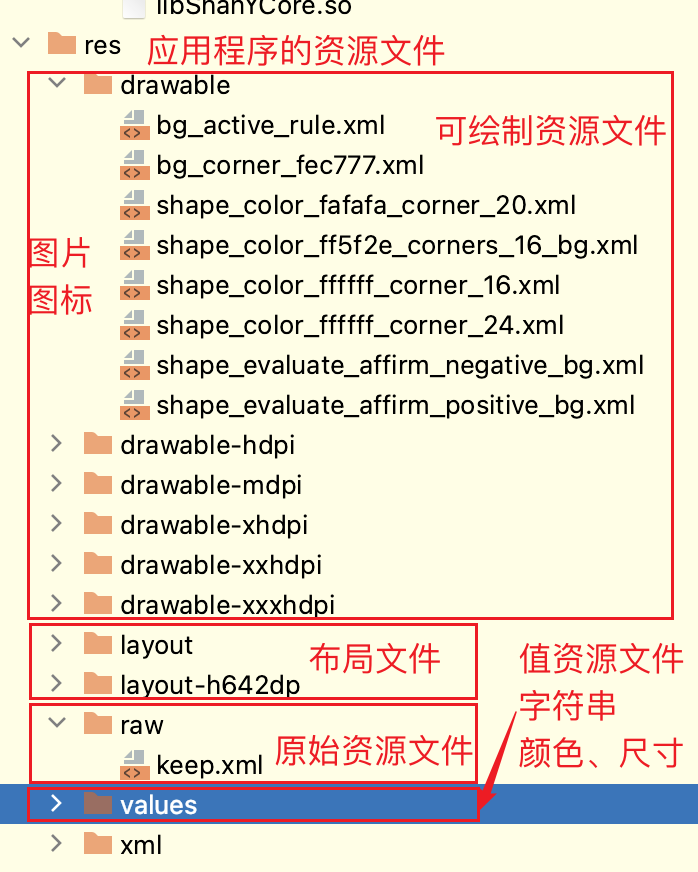

# App基本知识
## 本章要点
1. 要点一
1. 要点
1. 要点
1. **要点**

## APK

APK是Android应用程序的安装包文件的后缀名，全称为**Android Application Package**。

当下载和安装Android应用程序时，通常会获得一个以`.apk`结尾的文件。

### 是什么

APK文件是Android操作系统上的标准应用程序分发格式。

它是一个**压缩文件**，包含**应用程序的代码**、**资源文件**、**图像**、**声音**和**其他必要的文件**。

**APK**文件类似于Windows操作系统上的 **.exe** 文件或iOS操作系统上的 **.ipa** 文件。

>**APK文件** 理解为 一个以 .apk结尾的压缩文件。

在安装Android应用程序时，您可以通过从手机商店下载APK文件，或从其他第三方来源（如应用程序的官方网站或其他应用商店）获得APK文件。

如果电脑有相关APK文件，可以使用adb命令将其传输到Android设备进行安装。

需要注意的是，在下载和安装来自第三方来源的APK文件时，确保文件来源可靠，并注意潜在的安全风险。

默认情况下，Android设备会阻止从未知来源安装的APK文件，以确保用户的安全。

### APK 包结构

APK包结构是指APK文件内部的组织结构和目录层次。下面是APK包的一般结构：

#### META-INF目录

该目录包含了签名和证书信息，用于验证APK文件的完整性和可信性。

#### assets目录

该目录用于存储应用程序需要的原始资源文件，例如文本文件、音频、视频等。

#### AndroidManifest.xml文件

这是**APK的核心文件**，其中包含了应用程序的**清单信息**，包括应用程序的**包名**、**权限声明**、**组件定义**等。

#### classes.dex文件

这是应用程序的主要执行文件，其中包含了应用程序的Java字节码。

#### lib目录

该目录用于存储应用程序的本地库文件，针对不同的CPU架构和设备类型提供不同的库。

#### res目录

该目录包含了应用程序的资源文件，如图像、布局文件、字符串等。

#### res/raw目录

该目录用于存储应用程序的原始资源文件，如未经编译的音频、视频、文本文件等。

#### res/drawable目录

该目录包含应用程序的可绘制资源文件，如图片、图标等。

#### res/layout目录

该目录包含了应用程序的布局文件，用于定义用户界面的结构和组件排列。

#### res/values目录

该目录包含了应用程序的值资源文件，如字符串、颜色、尺寸等。

除了上述主要组成部分，APK文件还可以包含其他辅助文件和目录，根据应用程序的需求和开发人员的选择而定。

总体而言，**APK包结构的组织和内容是为了将应用程序的代码、资源和配置文件打包成一个可分发和安装的文件**，以便于在Android设备上部署和运行应用程序。

## 总结
- 总结一
- 总结二
- 总结三
https://github.com/Wechat-ggGitHub/Awesome-GitHub-Repo

[项目演示地址](https://github.com/testeru-pro/junit5-demo/tree/main/junit5-basic)

# 学习反馈

1. SpringBoot项目的父工程为( )。

   - [x] A. `spring-boot-starter-parent`
   - [ ] B.`spring-boot-starter-web`
   - [ ] C. `spring-boot-starter-father`
   - [ ] D. `spring-boot-starter-super`

