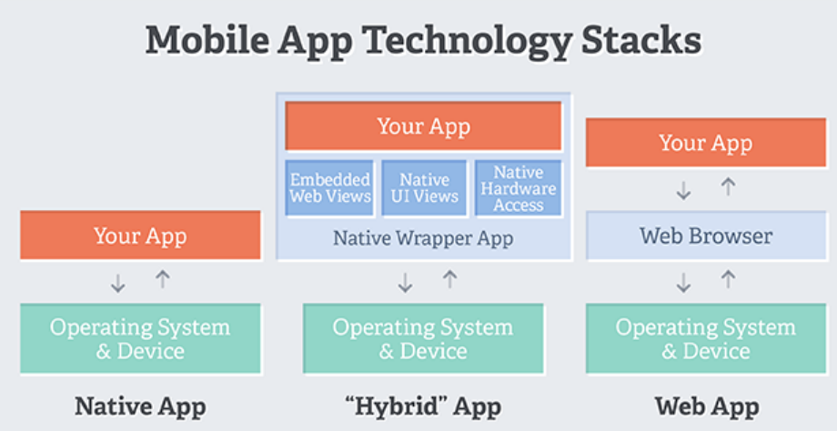
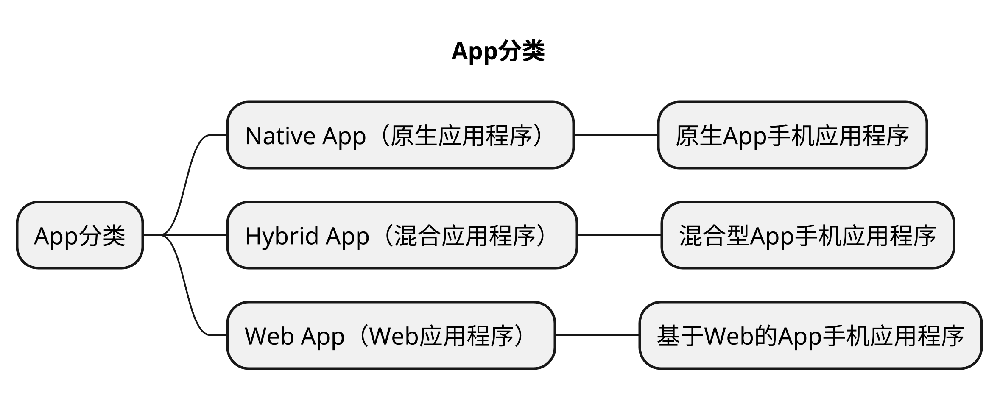
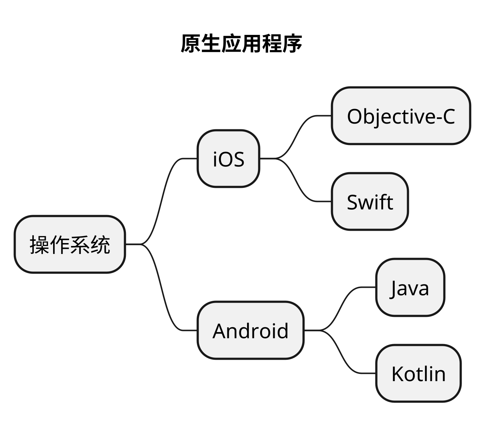
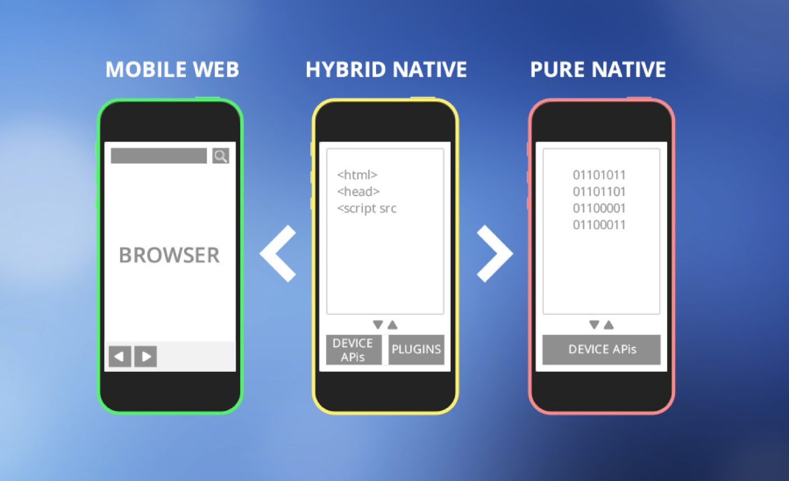

# App 分类
## 本章要点
1. 要点一
1. 要点
1. 要点
1. **要点**

## App 分类

App可以根据其**开发方式**和**技术特点**进行分类，其中常见的分类包括：

### Native App（原生应用程序）

Native App是为特定的操作系统和平台（如iOS、Android、Windows等）使用**原生编程语言**（如Objective-C/Swift、Java/Kotlin、C#/C++等）**开发的应用程序**。

这些应用程序**可以直接访问设备功能和操作系统特性**，具有高性能和优化的用户体验。

#### iOS（苹果操作系统）

iOS应用程序使用**Objective-C**或**Swift**编程语言进行开发。

Objective-C是早期iOS开发的主要语言，而Swift是苹果于2014年发布的现代化编程语言，逐渐成为iOS应用程序开发的首选语言。

#### Android（安卓操作系统）

Android应用程序使用**Java**或**Kotlin**编程语言进行开发。

Java是Android开发的主要语言，而Kotlin是一种现代化的编程语言，由JetBrains公司开发，并获得了谷歌的官方支持。

Kotlin逐渐成为Android开发的流行选择。

#### Windows（微软操作系统）

Windows应用程序使用**C#**（C Sharp）编程语言进行开发。

C#是微软开发的现代化、面向对象的编程语言，用于开发各种Windows平台应用程序，包括桌面应用程序、UWP应用程序和移动应用程序。

#### 注意

需要注意的是，尽管原生应用程序使用不同的编程语言进行开发，但可以**使用跨平台开发框架**（如**React Native**、**Xamarin**等）来实现部分代码共享和跨平台开发。

这些框架允许开发人员使用一种语言编写应用程序，并在多个平台上进行部署。

#### 优点

1. **最佳性能**：原生应用直接运行在设备的操作系统上，能够充分利用操作系统和硬件的优化，因此通常具有最佳的性能和响应速度。

1. **完全访问设备功能**：原生应用可以直接访问设备的各种功能和特性，如相机、GPS、传感器等。这使得开发者可以提供丰富的功能和无缝的用户体验。

1. **更好的用户界面**：原生应用可以根据特定平台的设计准则和用户体验标准进行开发，提供与平台一致的用户界面和交互模式，增强了用户体验和可用性。

1. **平台特定优化**：由于原生应用是专门为特定平台开发的，开发者可以针对该平台进行优化，提供更好的性能、稳定性和用户体验。

#### 缺点

1. **开发成本高**：原生应用的开发通常需要熟悉特定的编程语言和工具，以及针对不同平台的开发环境。这增加了开发人员的学习和开发成本。

1. **平台限制**：原生应用通常是针对特定平台开发的，因此需要为每个平台分别开发和维护不同的代码库。这可能增加开发和维护的工作量和复杂性。

1. **跨平台兼容性**：原生应用无法直接在不同平台上运行，需要针对每个平台进行独立的开发和调试。这可能导致跨平台兼容性问题和额外的开发工作。

1. **更新和发布**：原生应用**需要通过应用商店进行发布和更新**，需要遵守应用商店的审核和发布流程。这可能增加发布的时间和限制开发者的灵活性。

综上所述，原生应用提供了最佳的性能、访问设备功能和用户体验，但开发成本较高且受限于特定平台。开发者需要根据应用需求、目标用户和资源考虑是否选择原生应用开发。

### Hybrid App（混合应用程序）

Hybrid App是 既**有原生应用**又有**使用Web技术**（HTML、CSS和JavaScript）**开发**的应用程序，然后**通过封装工具**（如Apache Cordova、React Native等）**将其打包为原生应用程序**。

这种应用程序结合了Web技术的跨平台优势和原生应用程序的部分功能访问，可以在多个平台上运行。

#### 开发流程

开发流程通常如下：

1. **开发Web应用程序**：使用Web技术（HTML、CSS和JavaScript）开发应用程序的前端界面和业务逻辑。这部分开发类似于开发Web网站或Web应用程序。

1. **封装和打包**：使用封装工具（如Apache Cordova/PhoneGap、React Native、Ionic等）将Web应用程序封装为原生应用程序。这些工具提供了桥接和访问原生设备功能的API，使Web应用程序可以在原生容器中运行。

1. **跨平台部署**：封装后的应用程序可以在多个平台上进行部署，如iOS、Android和Windows。这使得开发人员可以使用相同的代码库和技术栈开发应用程序，并将其发布到不同的应用商店。

#### 优点

优势包括：

1. **跨平台开发**：使用相同的代码和技术可以在多个平台上进行开发和部署，减少了开发和维护的工作量。

1. **快速开发和迭代**：Web技术的熟悉性和便捷性使得开发人员可以更快速地构建和迭代应用程序。

1. **访问原生功能**：通过封装工具提供的API，混合应用程序可以访问设备功能，如相机、地理位置、传感器等。

1. **简化发布流程**：混合应用程序可以通过应用商店进行分发，与原生应用程序相似。

然而，**与原生应用程序相比，混合应用程序可能在性能、访问原生功能的灵活性和用户体验方面存在一定的限制**。

开发人员需要权衡不同的因素，根据应用程序的需求和目标选择合适的开发方法。

### Web App（Web应用程序）

Web App是**使用Web技术**（HTML、CSS和JavaScript）**开发的应用程序**，可以**在Web浏览器中访问和运行**。

Web App通常需要网络连接，通过互联网传输数据，并且可以在多个平台上运行，不需要针对特定操作系统进行开发。

### 分类图

原生应用需要每次下载包更新，并且包都需要上传到应用商店审核。「C/S架构的模式。」

如果每次更新时只是更改了一个前端页面布局，并没有更新逻辑或者其他字体，为了一个前端页面的更新，需要每次打包上传应用商店审核。效率太低，为了解决这一问题，解决方案：前端页面使用H5页面。「H5页面就变成了B/S架构」此时，前端存放的H5页面的CDN服务端更新，则用户端的App就更新，不需要再重新发版到应用商店。

这些应用程序分类在开发方式、技术特点和目标平台上存在一些区别。

选择适当的应用程序类型取决于应用程序的需求、目标用户和开发资源等因素。

## 总结
- 总结一
- 总结二
- 总结三

## 参考链接🔗

1. [混合应用 VS 原生应用](https://codexalters.com/hybrid-app-vs-native-mobile-app/)
2. [如何选择合适的移动应用类型：原生、Web 或混合](https://www.interaction-design.org/literature/article/native-vs-hybrid-vs-responsive-what-app-flavour-is-best-for-you)
3. [使用 Ionic 开发混合移动应用程序](https://www.theseus.fi/bitstream/handle/10024/145204/Phan_Tung.pdf;jsessionid=5A7C661463C134E711A2F71E6712F730?sequence=1)
4. [移动应用程序开发：在 Web、本机和混合之间进行选择](https://appsamurai.com/blog/mobile-app-development-choosing-between-web-native-and-hybrid/)

# 学习反馈

1. SpringBoot项目的父工程为( )。

   - [x] A. `spring-boot-starter-parent`
   - [ ] B.`spring-boot-starter-web`
   - [ ] C. `spring-boot-starter-father`
   - [ ] D. `spring-boot-starter-super`

