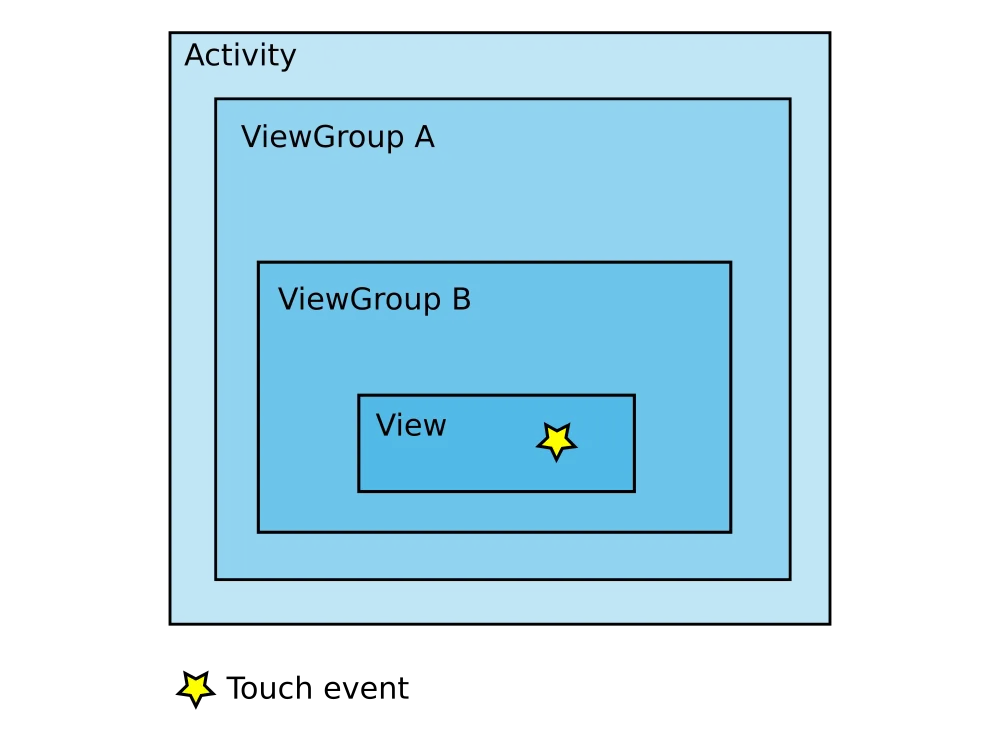

# Android基础知识
## 本章要点
1. 要点一
1. 要点
1. 要点
1. **要点**

## 正文




### Activity（活动）

Activity 是 Android 应用程序的一个基本组件，代表**用户界面上的一个屏幕**或交互界面。

每个 Activity 都包含一个用于用户交互的窗口，并负责管理用户界面元素和与用户的交互。

**Activity 可以包含一个或多个 View 和 ViewGroup**。

```bash
# 后面无论做App测试，还是App自动化测试，使用adb命令操作app都离不开Activity。
```


### Window（窗口）

Window 是 Android 应用程序中的顶层容器，代表应用程序的一个窗口，用于承载 Activity 的内容。

Window 是应用程序与操作系统之间的界面，窗口管理应用程序的用户界面，包括**布局**、**绘制**、**事件处理**和**交互**等。

>相当于一个app里面的顶部栏，底部栏，左侧目录栏等等。

#### 窗口与Activity的关系

在Android开发中，**每个Activity关联一个窗口**「一个 Window 对象」。

>Activity 通过调用 setContentView() 方法将界面内容填充到窗口中。

一个应用程序可以包含多个Activity，每个Activity都有自己的窗口。


**Window 可以包含一个或多个 View**。


#### 窗口的特性

窗口可以具有不同的特性和样式，如全屏、沉浸式、对话框风格等。

开发者可以通过设置窗口的属性和样式来实现不同的外观和行为。

#### 窗口的管理

窗口的创建、显示、隐藏和销毁由操作系统负责管理。

开发者可以通过**调用Activity的相关方法或使用系统提供的API来控制窗口的行为**，如`设置窗口的大小`、`位置`和`动画效果`等。


### ViewGroup（视图组）

ViewGroup 是一种特殊的 View，用于**容纳**和**管理**其他 View 对象的组合。

ViewGroup 充当了一个容器的角色，可以将多个 View 组合在一起形成一个层次结构，实现复杂的布局和界面结构。

```bash
# View 是用户界面的基本构建块，展示和处理用户界面的元素。可以是 按钮、文本框、图像、列表等各种可见的  用户界面元素。

# 一组View组成ViewGroup。

比如：2个输入框带一个登录按钮，组成了一个登录这样的一个组，就叫ViewGroup。

# 最重要的是Activity和View。
```

常见的 ViewGroup 包括 **LinearLayout**、RelativeLayout、FrameLayout 等。

#### 特点和功能

在 Android 开发中，ViewGroup 是 Android 框架提供的一个类，它有以下特点和功能：

1. **布局管理**：ViewGroup **负责管理其内部的子 View 的布局**。
   
   通过设置布局参数（LayoutParams），可以控制子 View 在 ViewGroup 中的位置、大小和对齐方式。
   
   Android 提供了多种内置的 ViewGroup 子类，如 LinearLayout、RelativeLayout、FrameLayout 等，它们具有不同的布局特点和用途。

2. **View 层级结构**：ViewGroup 可以嵌套包含其他 View 和 ViewGroup 对象，形成一个层级的 View 结构。
   
   这种嵌套关系使得开发者可以构建复杂的用户界面，通过组合不同的 View 和 ViewGroup 实现灵活的布局和界面设计。

3. **触摸事件传递**：ViewGroup 可以传递触摸事件给其子 View，从而实现用户的交互操作。
   
   当触摸事件发生时，ViewGroup 可以决定将事件传递给哪个子 View 处理，或者自己处理该事件。

4. **自定义 ViewGroup**：开发者可以自定义创建自己的 ViewGroup 子类，以满足特定的布局需求。
   
   通过自定义 ViewGroup，可以实现特定的布局算法、界面效果和交互逻辑。

通过使用 ViewGroup，开发者可以创建复杂的界面布局，包含多个子 View 和其他 ViewGroup 对象。

ViewGroup 提供了对子 View 的布局和管理能力，以及对触摸事件的传递和处理控制。

通过组合不同的 ViewGroup 和 View，可以实现多样化的用户界面设计和交互效果。


### View（视图）

View 代表**用户界面的基本构建块**，用于展示和处理用户界面的元素。

View 可以是`按钮`、`文本框`、`图像`、`列表`等各种可见的**用户界面元素**。


View 负责绘制自身的外观和处理用户的输入事件。

Android 提供了多种内置的 View 类，同时也可以自定义创建自己的 View 类。


#### 特点和功能

1. **绘制和展示**：View 负责绘制自身的外观，并在屏幕上展示。它通过使用绘制方法和图形资源（如位图、矢量图形等）来显示用户界面的内容。

1. **用户交互**：View 可以处理用户的输入事件，例如点击、滑动、长按等。通过监听和处理这些事件，开发者可以实现与用户的交互和响应。

1. **布局和位置**：View 可以根据布局参数（LayoutParams）来确定其在父容器中的位置和大小。通过设置布局参数，可以实现灵活的布局和控制各个 View 在界面中的摆放方式。

1. **可点击性和焦点**：View 可以设置为可点击（可接收点击事件）或不可点击。同时，View 也可以获取或失去焦点，以响应用户的交互和导航。

1. **继承和自定义**：View 是一个基类，Android 框架提供了多个内置的 View 子类，例如 TextView、Button、ImageView 等。开发者还可以自定义创建自己的 View 类，以满足特定的界面需求。

通过组合和嵌套多个 View，可以构建复杂的用户界面。View 提供了一系列的方法和属性，用于控制外观、行为和交互方式。开发者可以通过操作 View 对象来实现应用程序的用户界面逻辑和交互效果。


## 总结

- 总结一
- 总结二
- 总结三


[项目演示地址](https://github.com/testeru-pro/junit5-demo/tree/main/junit5-basic)


# 学习反馈

1. SpringBoot项目的父工程为( )。

   - [x] A. `spring-boot-starter-parent`
   - [ ] B.`spring-boot-starter-web`
   - [ ] C. `spring-boot-starter-father`
   - [ ] D. `spring-boot-starter-super`
<style>
  strong {
    color: red;
    font-weight: bolder;
  }
  .reveal blockquote {
    font-style: unset;
  }
</style>