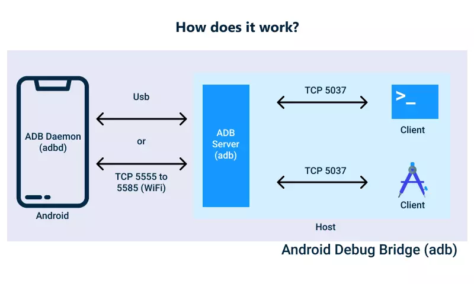
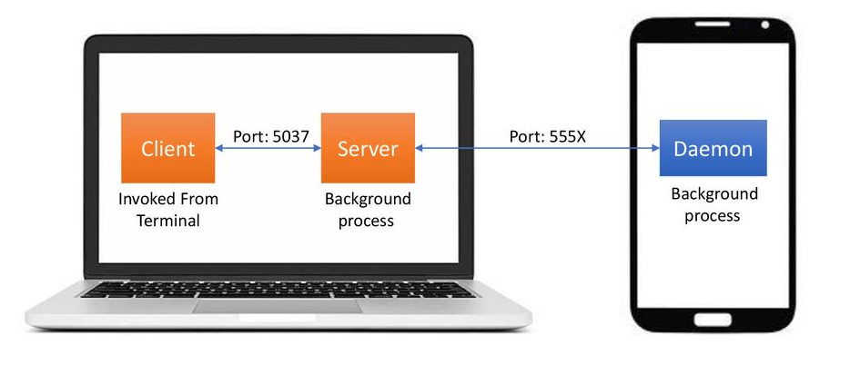
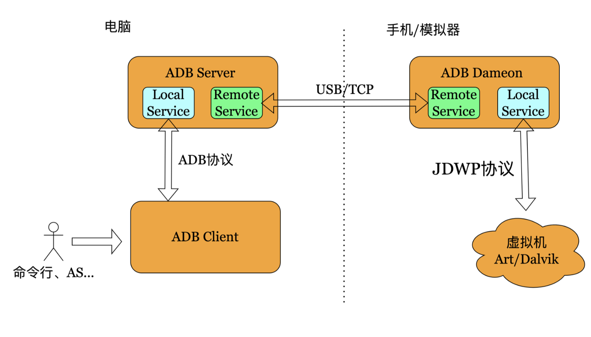
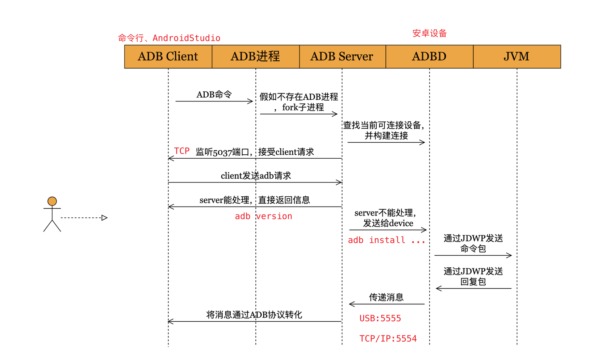
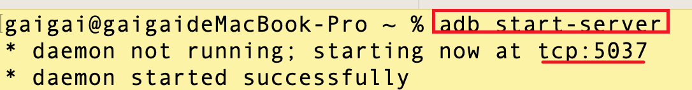
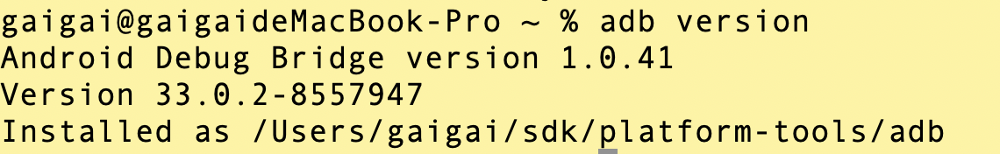

# ADB「Android Debug Bridge」
## 本章要点
1. 要点一
1. 要点
1. 要点
1. **要点**

ADB（Android Debug Bridge）是一种用于与Android设备进行通信和控制的命令行工具。它是Android开发和调试过程中的重要组件之一。ADB提供了开发人员与Android设备之间的桥梁，使他们能够执行各种操作，包括应用程序安装、调试、文件传输、日志记录等。

## ADB的基本概念

**了解ADB是什么，它是Android开发和调试工具中的一个关键组件。**

以下是ADB的基本概念：

### 通信桥梁

ADB充当了电脑和Android设备之间的**通信桥梁**。

通过ADB，开发人员可以与设备建立连接，并通过命令行与设备进行通信。

### 命令行工具

ADB是一个**命令行工具**，可以通过命令行界面（如终端或命令提示符）使用它。

开发人员可以使用ADB命令来执行各种操作和控制设备。

### 设备调试模式

要使用ADB与Android设备通信，设备必须启用调试模式。

调试模式允许计算机通过ADB与设备进行连接和通信。

### USB连接

ADB通常使用USB连接与Android设备进行通信。

通过将设备通过USB数据线连接到计算机，ADB可以识别设备并与之建立连接。

### 功能丰富

ADB提供了一系列功能，包括应用程序的**安装**和**卸载**、**设备信息的查看**、**文件传输**、**日志记录**、**截屏**、**录屏**等。

它是Android开发和调试的重要工具。

### 开发和测试工具

ADB不仅用于**应用程序开发**，还用于应用程序的**调试**和**测试**。

开发人员可以使用ADB进行应用程序的调试、测试和性能分析。

总而言之，ADB是Android开发和调试过程中不可或缺的工具，它提供了与Android设备进行通信和控制的能力，帮助开发人员进行应用程序的开发、调试和测试工作。

## ADB的作用

**理解ADB的作用，它提供了与Android设备进行通信和控制的功能。**

ADB（Android Debug Bridge）在Android开发中具有多种作用和功能，包括以下方面：

### 应用程序安装和卸载

ADB允许开发人员通过命令行界面轻松地安装和卸载应用程序到Android设备。

开发人员可以使用ADB命令将应用程序的APK文件安装到设备上进行测试和调试，并可以使用ADB命令将不需要的应用程序从设备上卸载。

### 设备状态监测

通过ADB，开发人员可以获取有关Android设备的各种信息，包括设备型号、Android版本、设备ID、屏幕分辨率等。

这些信息对于开发和测试过程中的设备适配和兼容性测试非常有用。

### 文件传输

ADB允许在计算机和Android设备之间进行文件传输。

开发人员可以使用ADB命令将文件从计算机复制到设备或从设备复制到计算机，这对于将测试数据、配置文件或日志文件传输到设备或从设备中提取文件非常有用。

### 日志记录和调试

ADB提供了日志记录功能，开发人员可以使用ADB命令查看设备的系统日志、应用程序日志和调试信息。

这对于调试应用程序中的错误、查看应用程序输出和分析性能问题非常有帮助。

### 截屏和录屏

ADB允许开发人员通过命令行界面进行设备截屏和录屏操作。

截屏功能可用于捕捉设备屏幕的截图，而录屏功能可用于记录设备屏幕上的操作和应用程序行为，这对于演示、教学或错误复现非常有用。

### 设备控制和模拟

ADB提供了一些设备控制和模拟的功能，例如模拟按键事件、触摸事件、传感器数据等。

这对于测试应用程序在不同设备状态下的行为非常有用，如测试应用程序对不同输入事件的响应。

总体而言，ADB在Android开发中是一个强大的工具，为开发人员提供了与Android设备进行通信、控制和调试的能力。

它在应用程序的开发、测试和调试过程中发挥着重要的作用，帮助开发人员提高效率、诊断问题和确保应用程序的稳定性和兼容性。

## ADB的组成

[ADB（Android Debug Bridge）](https://developer.android.com/studio/command-line/adb?hl=zh-cn)是一个基于C/S架构的服务 ，由以下几个组成部分组成：

### ADB服务器（Server）

ADB服务器是在**计算机**上运行的**进程**，用于**管理与设备之间的连接**。

**当ADB客户端与设备建立连接时，ADB服务器会创建一个与设备通信的通道，并将命令转发给设备上的ADB守护进程**。

ADB服务器还负责**维护设备列表**、**管理设备状态和连接**，并提供**设备选择**和**切换**的功能。

### ADB客户端（Client）

ADB Client 运行在电脑上，一般通过**命令行**或者 **Android Studio** 执行 adb 命令来与其交互。
『通常是通过命令行界面（Command Line Interface）使用的。』

ADB Client 的主要**职责**是**解析命令**，做预处理，**然后发送给 ADB Server**，这里分为两种情况：

1. ADB Server 能处理的命令就自己处理，如 `adb version`。

2. ADB Server 不能处理的命令就发送给 **ADB守护进程**「ADB Dameon」，并接受返回消息，如 `adb devices`。

开发人员可以使用ADB客户端执行各种操作，如**应用程序安装**、**文件传输**、**日志记录**等。

### ADB守护进程（Daemon）

守护进程**监听与客户端之间的通信**，**处理设备状态变化和命令请求**。它还**负责管理设备与计算机之间的连接和通信**。

ADB Dameon 运行在**Android手机**上的服务进程，进程名为 **adbd**，在手机启动后，由 Zygote 进程创建。

ADB Dameon 的主要**职责**是：

1. 为手机提供adb服务。

2. 创建 `Local Service` 和 `Remote Service`，`Local Service` 用于与 `JVM` 交互，`Remote Service` 用于**与 `ADB Server` 交互**。

### 设备（Device）

设备是指运行**Android**操作系统的**实际设备**，如智能手机、平板电脑、模拟器等。

设备通过 **USB 连接** 或 **网络连接**与 `ADB Server` 进行通信。

设备需要启动 **ADB守护进程**「Daemon」 才能与ADB客户端建立连接，并通过ADB命令进行交互。

当设备连接到计算机时，ADB Server 会为每个设备分配一个**唯一的设备标识符**，并为设备**开启一个动态端口**。

#### 端口号

ADB Server 监听在本地的 **5037** 端口，该端口用于**与 ADB Client 进行通信**。

此外，每个设备在连接时会分配一个动态端口号，用于与该设备进行特定的交互和数据传输。

以上是ADB的主要组成部分。ADB客户端和ADB服务器运行在计算机上，而ADB守护进程运行在Android设备上。

通过这些组件的协作，开发人员可以使用ADB进行调试、测试和管理Android设备。

## ADB的运行原理

ADB（Android Debug Bridge）的工作原理如下：

### 1. ADB服务器启动

当 **使用ADB命令** 或 **启动ADB客户端** 时，ADB服务器会在计算机上启动。监听默认端口号为**5037的TCP**连接。

>命令行输入adb start-server。

>当 ADB Server 启动时，它会监听本地的 5037 端口，等待来自 ADB Client 的连接请求。

### 2. 客户端与ADB服务器通信

客户端发送命令给ADB服务器，例如**查看adb版本**、**安装应用程序**、**查看设备信息**等。

客户端连接到ADB服务器的**默认端口**或指定的端口（如果使用了端口转发）。

如果是本地能直接处理的请求，比如：`adb version`就直接处理。

如果是本地处理不了的请求，就会转发给连接的真机或者模拟器来进行处理，可以通过**USB**数据线和**TCP/IP**「WI-FI」的方式通信。

### 3. 设备连接

当Android设备通过 **USB连接/WI-FI连接** 到计算机时，ADB服务器会检测到设备的存在，并与设备建立连接。

每个设备会被分配一个 **唯一的设备标识符/设备号**（Device ID）。

### 4. 端口转发

ADB Server服务器为每个连接的设备分配一个唯一的**本地端口号**，并将该端口与设备的端口进行映射。

这样，客户端可以通过本地端口与特定设备进行通信。

永远记住，**ADB 守护进程在 5555 到 5558 范围内的奇数端口**上运行。

连接在奇数端口 5555 上的模拟器实例具有在偶数端口 5554 上运行的相同控制台，即：每个正在运行的设备都有 1 个奇数和 1 个偶数连接端口。

每个安卓设备都**使用一对按顺序排列的端口**：一个用于**控制台连接的偶数号端口**，另一个**用于 adb 连接的奇数号端口**。例如：

安卓设备 1，控制台：5554
安卓设备 1，adb：5555
安卓设备 2，控制台：5556
安卓设备 2，adb：5557
依此类推。

如上所示，在端口 5555 处与 adb 连接的模拟器与控制台监听端口为 5554 的模拟器是同一个。

>如果使用USB连接则为奇数端口连接，如果是用WI-FI「TCP/IP」连接则使用偶数号端口连接。两种连接方式同步。

### 5. ADB服务器转发命令

**ADB服务器**接收到来自**ADB客户端**的命令后，根据命令的内容和设备标识符，将**命令转发**给相应**安卓设备的本地端口**。【默认5555】

### 6. ADB守护进程执行命令

**安卓设备**上的**ADB守护进程**【adbd进程】 收到命令后，**根据命令的内容执行相应的操作**，并将结果返回给设备的本地端口。

>位于真机或者模拟器后台的adbd进程接收到请求后，**通过JDWP协议转发给对应的Java虚拟机进程处理**。

**adbd将处理后的结果返回给adb server**

### 7. ADB服务器传递结果

**ADB服务器**将**安卓设备**的本地端口返回的**结果**传递给**ADB客户端**。

**adb server再将结果返回给 adbClient**

通过这个过程，ADB客户端可以与Android设备进行通信和交互，进行调试、测试、文件传输、应用程序管理等操作。

ADB提供了丰富的命令集，使开发人员能够更好地管理和控制Android设备。

## 总结
- 总结一
- 总结二
- 总结三

## 参考链接

https://ceshiren.com/t/topic/21035

https://emteria.com/learn/android-debug-bridge

https://itimetraveler.github.io/2019/06/07/Android%20ADB%E5%8E%9F%E7%90%86%E6%8E%A2%E7%A9%B6/

https://blog.salvationdata.com/2020/06/05/case-study-mobile-forensics-forensic-data-extraction-from-android-devices-using-adb-android-debug-bridge-part-ii/

https://zhuanlan.zhihu.com/p/602149990
# 学习反馈

1. SpringBoot项目的父工程为( )。

   - [x] A. `spring-boot-starter-parent`
   - [ ] B.`spring-boot-starter-web`
   - [ ] C. `spring-boot-starter-father`
   - [ ] D. `spring-boot-starter-super`
