# ADB常用命令
## 本章要点
1. 要点一
1. 要点
1. 要点
1. **要点**

## 获取帮助

```bash
adb help
```

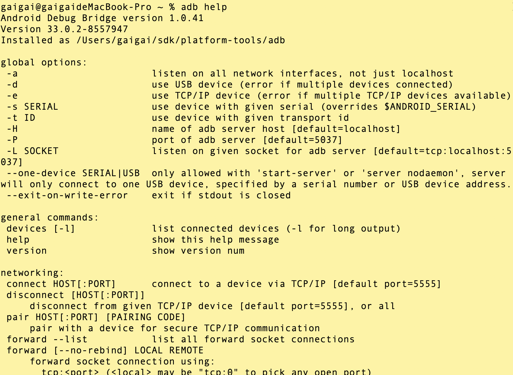

## 环境验证

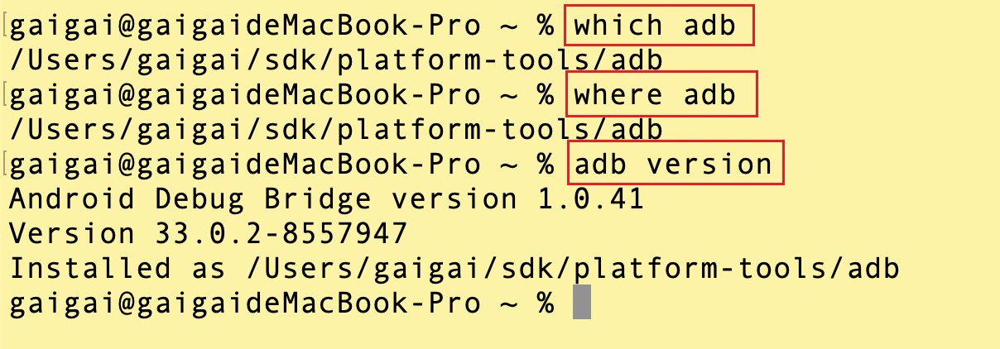

### adb安装路径

```bash
# adb安装路径
which adb

# adb安装路径
where adb
```

### adb 版本号

```bash
# adb 版本号； adbd版本号；adb安装路径
adb version
```

## 设备连接

### 获取设备ID

```bash
# 获取设备ID及其状态
adb devices

# 获取设备ID及其状态
adb devices -l
```
1. **设备为空**：

  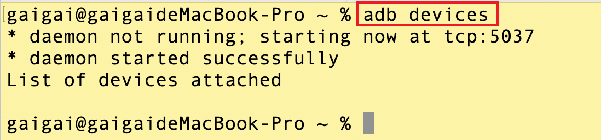

2. **设备连接**：

  


### 设备的连接状态

设备的连接状态可以是以下几项之一：

#### offline

设备未连接到 adb 或没有响应。

#### device

设备已连接到 adb 服务器。

请注意，此状态并不表示 Android 系统已完全启动并可正常运行，因为在设备连接到 adb 时系统仍在启动。

系统完成启动后，设备通常处于此运行状态。

#### no device

未连接任何设备。


说明：如果您加入 `-l` 选项，devices 命令会告知您设备是什么。当您连接了多个设备时，此信息会很有用，方便您区分这些设备。

### USB连接

#### 步骤

1. 确保你已经安装了ADB工具，并且设备已通过USB连接到计算机上。

1. 在Android设备上，**设置** --> **开发者选项** --> 打开**USB调试**。

1. 打开电脑终端或命令提示符。ADB工具的安装目录（通常是Android SDK的"platform-tools"目录）

1. 在终端或命令提示符中运行以下命令：
```bash
# 获取设备ID
adb devices
```
这将列出所有通过USB连接到计算机的Android设备。

查找以 "**device**" 状态显示的设备，并记录其设备ID。

设备ID是一个唯一的标识符，通常是**一串字母和数字的组合**。


### WI-FI连接

**鸿蒙系统不支持WI-FI连接。**

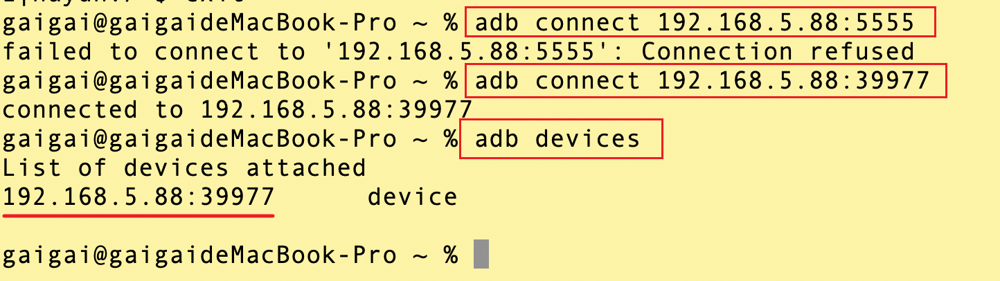

#### 步骤

1. 确保你的Android设备和计算机连接在**同一个Wi-Fi**网络上。

1. 在Android设备上，**设置** --> **开发者选项** --> **无线调试**。打开，并记下设备的IP地址和端口。


1. 打开电脑终端或命令提示符。ADB工具的安装目录（通常是Android SDK的"platform-tools"目录）

3. 在终端或命令提示符中运行以下命令：
  ```bash
  adb connect <设备IP地址>:端口号
  ```


## 命令格式

ADB（Android Debug Bridge）的命令格式如下：

```bash
adb [options] <command> [<args>]
```


- `adb` 是ADB工具的名称。

- `[options]` 是**可选的选项**，用于设置ADB工具的行为。
  
  - `-d` 用于**连接物理设备** Android真机。
  
  - `-e` 用于**连接模拟器**。
  
  - `-s` 用于指定**设备序列号**。

  


- `<command>` 是**要执行的ADB命令**。

  - `devices` 用于**列出已连接的设备**

  - `install` 用于**安装应用程序**

  - `shell` 用于**执行设备上的Shell命令**等。

- `[<args>]` 是**与命令相关的可选参数**。

## App安装
### 直接安装

```bash
# <path_to_apk> 是APK文件的路径
adb install <path_to_apk>

# APK文件复制到了计算机上，并提供正确的路径。
adb install /path/to/app.apk
```

执行该命令后，ADB会将 **APK文件发送到连接的设备**，并在**设备上安装应用程序**。你可以在设备上查看应用程序的安装进度和结果。

>1. apk发送到 **模拟器/android设备**。

>2. **模拟器/android设备** 安装app。

请注意，安装应用程序可能需要一些时间，具体取决于应用程序的大小和设备性能。确保设备处于连接状态，并且已启用开发者选项和USB调试模式。

#### 步骤

1. 准备要安装的apk包。

2. 运行adb install命令安装。拖拽apk到命令行，直接显示绝对路径。
  ```bash
  adb install /Users/gaigai/Documents/hogwarts/lesson/xueqiu.apk
  ```
3. 手机是否需要允许授权。

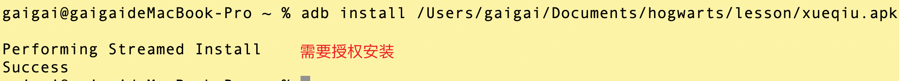

### 覆盖安装

要通过ADB执行覆盖安装（即在设备上已经存在应用的情况下重新安装应用），可以使用以下命令格式：

```bash
# <path_to_apk> 是APK文件的路径
adb install -r <path_to_apk>

# APK文件复制到了计算机上，并提供正确的路径。
adb install -r /path/to/app.apk
```

- `-r`: 替换现有应用程序。「`replace existing application`」

ADB会将**APK文件发送到连接的设备**，并**覆盖安装已存在的应用程序**。

这将**更新应用程序的版本或修复可能存在的问题**。

## 【重点】软件包管理器 (pm)

package Manager

在 adb shell 中，您可以使用软件包管理器 (pm) 工具发出命令，以对设备上安装的应用软件包执行操作和查询。

`pm` 命令允许你**查看**、**安装**、**卸载**、**清除**和**管理**应用程序包。

### 列出已安装的应用程序包

```bash
adb shell pm list packages
```

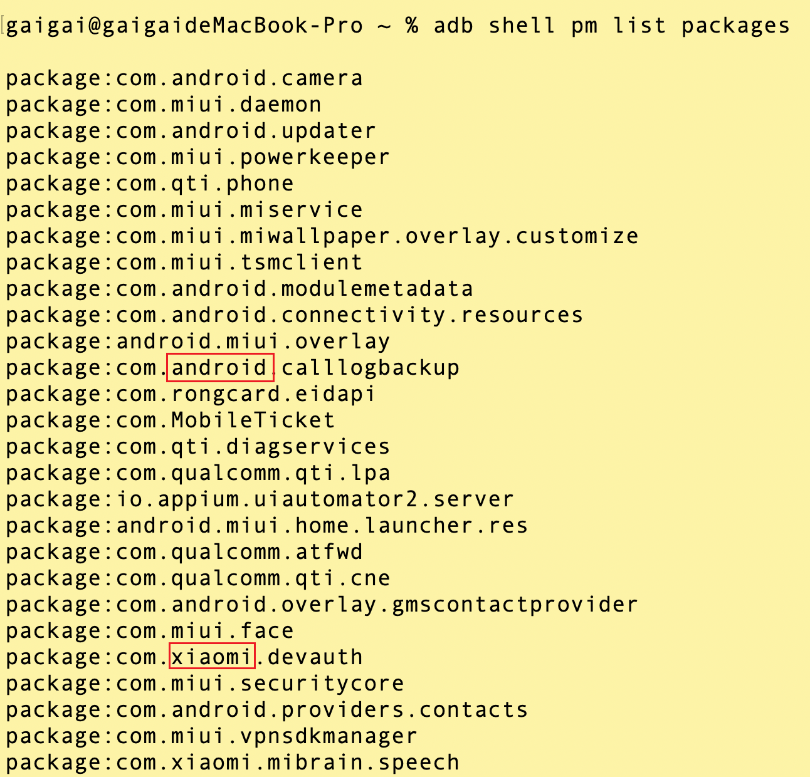

### 列出已安装的系统应用程序包

```bash
adb shell pm list packages -s
```

`-s`：过滤以仅显示 **系统** 包。「filter to only show **system** packages」

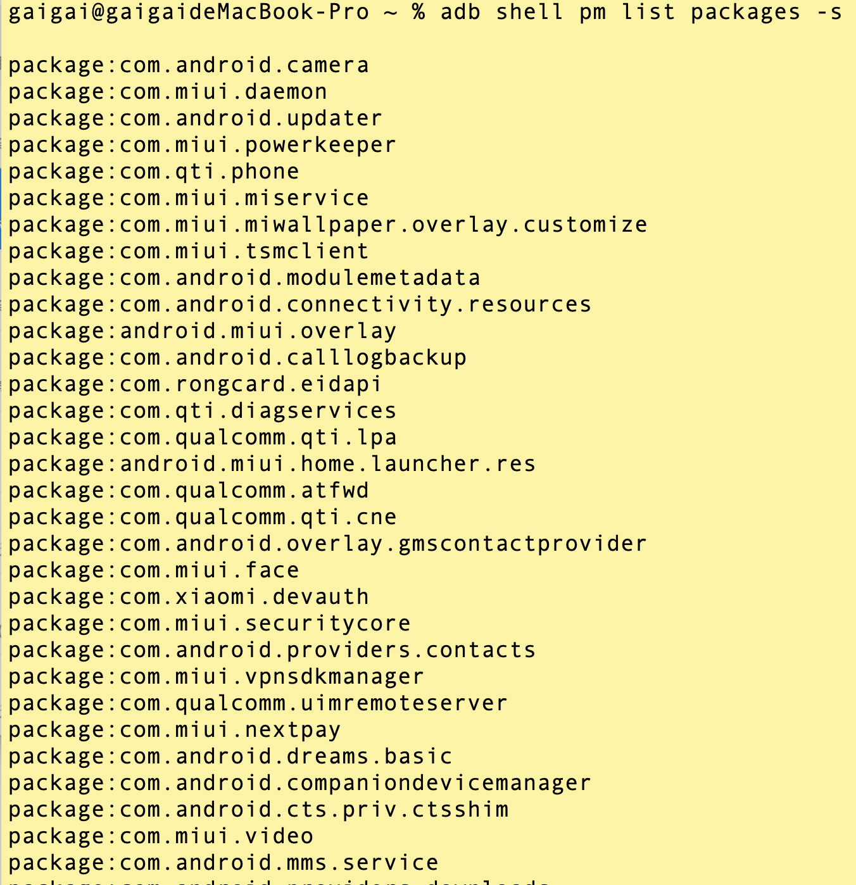

### 列出已安装的第三方应用程序包

```bash
adb shell pm list packages -3
```

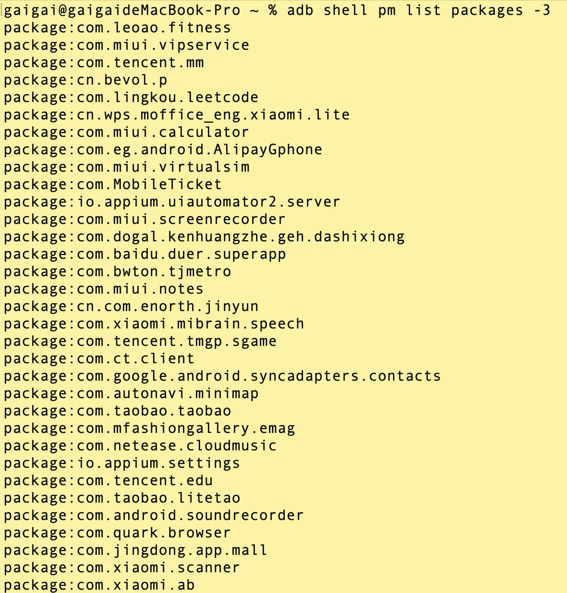

### 清除应用程序的用户数据和缓存

```bash
adb shell pm clear <package_name>

# 清除淘宝应用程序的用户数据和缓存
adb shell pm clear com.taobao.taobao
```

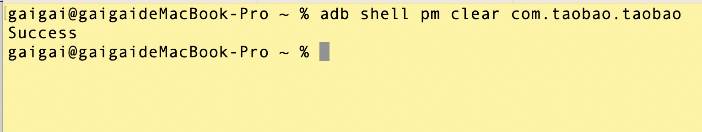

>再次进入，对应app的数据都清空了。新安装的效果

### 查看软件包的安装程序

```bash
adb shell pm list packages -i
```

`-i`：查看包的**安装程序**。「see the **installer** for the packages」

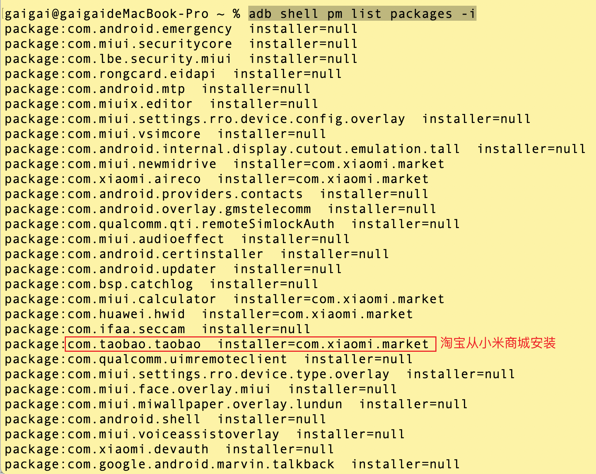

### 【扩展】显示应用程序包的详细信息

```bash
adb shell pm dump <package_name>

# 显示淘宝应用程序包的详细信息
adb shell pm dump com.taobao.taobao
```

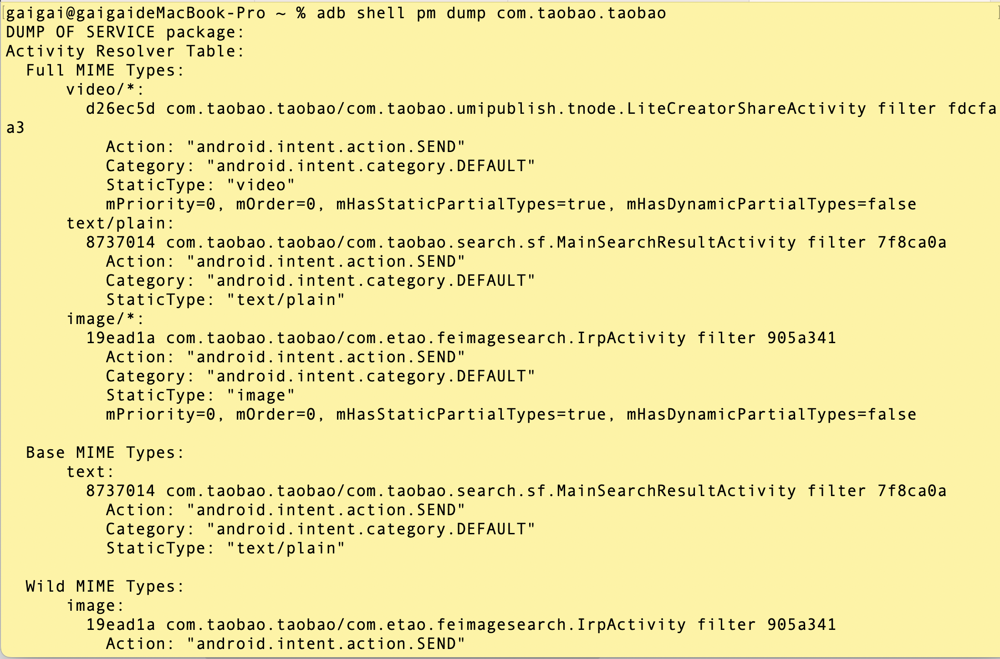

## App卸载

### 直接卸载

```bash
adb uninstall <package_name>

# 直接卸载淘宝应用
adb uninstall com.taobao.taobao
```
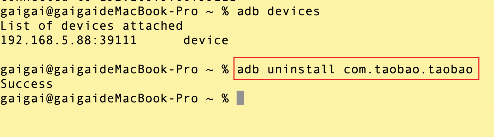

#### 场景

1. 直接卸载淘宝。

2. 小米应用商店安装淘宝apk。
   
3. 打开app需要登录。
	

### 保留配置文件和数据卸载

```bash
# 无法正常卸载
adb uninstall -k <package_name>

adb shell cmd package uninstall -k <package_name>

# 具体命令执行
adb uninstall -k com.taobao.taobao
adb shell cmd package uninstall -k com.taobao.taobao
```
	
`-k`: **保留**数据和缓存目录。「**keep** the data and cache directories」

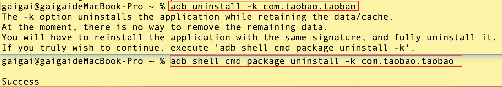

#### 场景

1. 保留配置文件和数据卸载淘宝。

2. 命令行安装淘宝apk。
   
3. 直接打开app发现不需要登录。
	
4. 命令行查看淘宝安装来源。

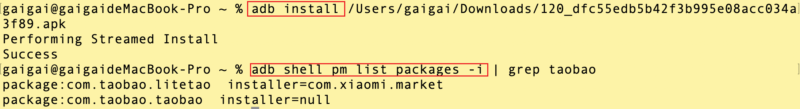

```bash

adb shell cmd package uninstall -k com.taobao.taobao

adb install taobao.apk

adb shell pm list packages -i | grep taobao
```
## shell命令

adb shell命令用于在连接的Android设备上执行Shell命令。通过adb shell命令，您可以直接在设备的命令行界面执行各种操作和命令。

以下是一些常用的adb shell命令示例：

```bash
# 1. 进入安卓设备
adb shell     

# 2. 查看安卓设备目录  sdcard是用户可以操作的路径
haydn:/ $ ls

# 3. 进入到sdcard文件夹内
haydn:/ $ cd sdcard/ 

# 4. 查看sdcard文件内的目录
haydn:/sdcard $ ls

# 5. 进入到下载文件夹内
haydn:/sdcard $ cd Download

# 6. 查看Download文件内的目录
haydn:/sdcard/Download $ ls

# 7. 查看当前文件夹的绝对路径
haydn:/sdcard/Download $ pwd

# 8. 创建1.txt文件，内容为test1
haydn:/sdcard/Download $ echo test1>1.txt                                        
# 9. 查看Download文件内的目录
haydn:/sdcard/Download $ ls                                       
# 10. 查看1.txt文件的详细内容            
haydn:/sdcard/Download $ cat 1.txt

# 11. 退出
haydn:/sdcard/Download $ exit

```


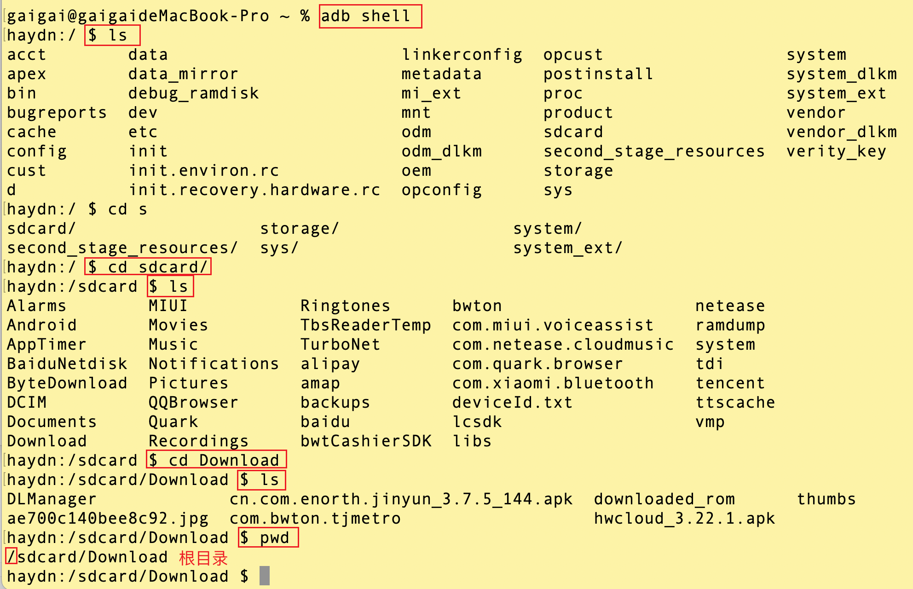

## 文件传递

### 从Android设备复制到电脑

```bash
adb pull <安卓设备文件路径> <电脑本地目标路径>
```		

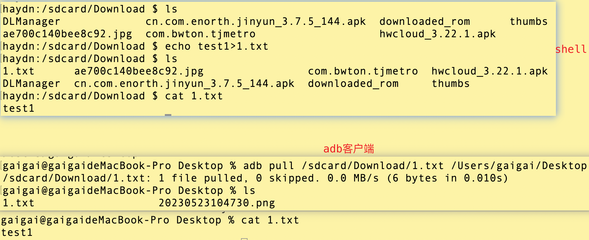

```bash
# 命令行终端
adb pull /sdcard/Download/1.txt /Users/gaigai/Desktop
```


### 从电脑复制到Android设备

```bash
adb push <电脑本地文件路径> <安卓设备目标路径>
```	


```shell
# 查看文件内容
Desktop % ls

# 从电脑复制到Android设备
Desktop % adb push 20230523104730.png /sdcard/Download/

# 安卓设备校验
Desktop % adb shell
haydn:/ $ cd /sdcard/Download/                                                                    
haydn:/sdcard/Download $ ls

```

## 截屏


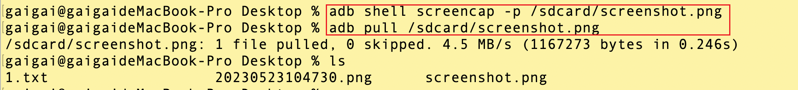

```bash
# 在命令行中运行以下命令以获取设备屏幕截图：
# adb截屏并保存为/sdcard/screenshot.png
adb shell screencap -p /sdcard/screenshot.png

# 将截图文件从设备复制到计算机上：
# 默认下载到本地当前目录
adb pull /sdcard/screenshot.png
```

## 录屏

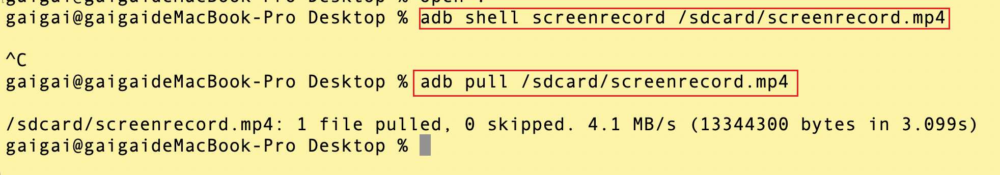


```bash
# 在命令行中运行以下命令以开始录制屏幕：
adb shell screenrecord /sdcard/screenrecord.mp4

# 执行所需的操作或操作应用程序，然后按Ctrl+C来停止录制。

# 将录屏文件从设备复制到计算机上：
adb pull /sdcard/screenrecord.mp4
```

## 获取各个系统服务的信息

通过该命令，您可以获取**设备的状态**、**应用程序信息**、**电池信息**、**网络状态**、**传感器数据**等等。

以下是一些常用的 adb dumpsys 命令示例：

### 【重点】获取设备上的活动（Activity）信息

```bash
# 查看设备上所有活动的信息
adb shell dumpsys activity
```

每一个页面都是一个Activity。

#### 场景

1. 只获取设备上雪球的活动页面信息：

```bash
# mac window findstr
adb shell dumpsys activity | grep xueqiu | grep Activity
```

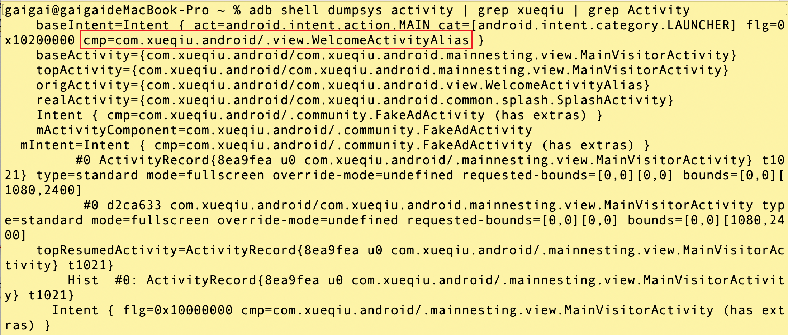

`cmp`：指组件（Component）部分，用于指定要启动的活动（Activity）或服务（Service）的包名和类名。

### 

dumpsys 命令是 Android 系统提供的一个工具，用于获取设备的各种系统信息和状态。通过使用 dumpsys 命令，可以进行性能分析、调试和监控等操作。


## 活动管理器（am）

am 是 Android 的 **Activity Manager**（活动管理器）命令行工具，用于与 Android 系统的活动、服务和广播进行交互。

### 启动应用程序

```bash
# 
adb shell am start -n <package_name>/<activity_name>

# 查找第一个去启动
adb shell am start -n com.xueqiu.android/.mainnesting.view.MainVisitorActivity
```

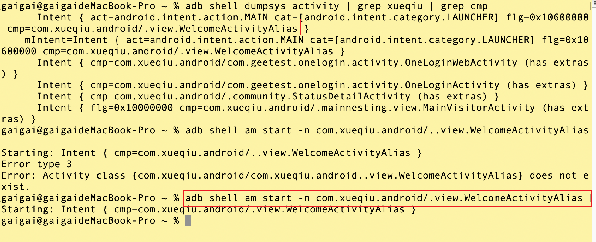

场景：

1. 获取雪球的包名。

2. 获取雪球活动的页面Activity。

3. 手动杀死雪球进程。

4. 启动雪球。

```bash
adb shell pm list packages -3 | grep xueqiu


adb shell dumpsys activity | grep xueqiu | grep cmp

adb shell am start -n com.xueqiu.android/.view.WelcomeActivityAlias
```

### 强制停止应用程序

```bash
adb shell am force-stop <package_name>

adb shell am force-stop com.xueqiu.android
```

场景：

1. 获取淘宝的包名。

2. 获取淘宝活动的页面Activity。

3. 强制停止淘宝进程。

4. 启动淘宝。

```bash
# 获取淘宝的包名。
adb shell pm list packages -3 | grep taobao                   

# 获取淘宝活动的页面Activity。
adb shell dumpsys activity | grep com.taobao.taobao | grep cmp

# 强制停止淘宝进程。
adb shell am force-stop com.taobao.taobao                     

# 启动淘宝。
adb shell am start -n com.taobao.taobao/com.taobao.tao.welcome.Welcome

```

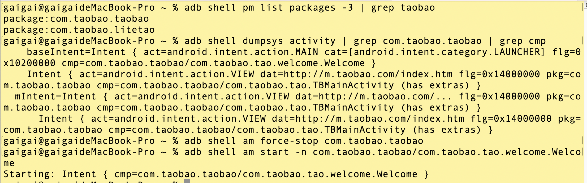

## 获取当前屏幕的 UI 层次结构信息

使用 uiautomator dump 命令，可以将当前屏幕的 UI 层次结构保存为一个 XML 文件。

该文件包含了屏幕上各个元素的属性、位置和层级关系等信息，可以用于分析应用的界面结构、编写自动化测试脚本等。

要使用 uiautomator dump 命令，需要连接 Android 设备，并通过 adb 命令执行以下步骤：


1. 使用 adb 命令启动 uiautomator，并执行 dump 命令：

```bash
adb shell uiautomator dump

# –compressed
```

等待一段时间，让设备完成屏幕截图和 UI 层次结构分析。

2. 在设备上生成的 XML 文件的路径通常是 **/sdcard/window_dump.xml**，可以使用 adb 命令将其复制到计算机上：
   
```bash
adb pull /sdcard/window_dump.xml <本地路径>
```

将 <本地路径> 替换为要保存文件的本地路径。
通过分析生成的 XML 文件，您可以了解应用程序的界面结构，包括各个元素的标识符、文本、位置、可点击性等信息，从而进行自动化测试或界面分析。

### 场景
1. 杀死雪球进程。
1. 命令行打开雪球app。
2. 获取当前屏幕的UI层次结构信息。
3. 下载到电脑。
4. 使用浏览器打开。

```bash
adb shell pm list packages -3 | grep xueqiu

adb shell dumpsys activity | grep xueqiu | grep cmp

# 杀死雪球进程。
adb shell am force-stop com.xueqiu.android

adb shell am start -n com.xueqiu.android/.view.WelcomeActivityAlias

adb shell uiautomator dump

adb pull /sdcard/window_dump.xml 
```


## monkey压力测试

[monkey](https://developer.android.com/studio/test/other-testing-tools/monkey?hl=zh-cn)

```bash
# 启动应用并向其发送 500 个伪随机事件
adb shell monkey -p your.package.name -v 500
```
### 日志级别

#### -v

级别 0（默认值）只提供启动通知、测试完成和最终结果。

#### -v -v 或者 -vv

级别 1 提供有关测试在运行时的更多详细信息，例如发送到您的 Activity 的各个事件。

#### -v -v -v 或者 -vvv

级别 2 提供更详细的设置信息，例如已选择或未选择用于测试的 Activity。

### 指定包

`-p <allowed-package-name>`

如果您通过这种方式指定一个或多个软件包，Monkey 将仅允许系统访问这些软件包内的 Activity。

如果应用需要访问其他软件包中的 Activity（例如选择联系人），您还需要指定这些软件包。

如果未指定任何软件包，Monkey 将允许系统启动所有软件包中的 Activity。

要**指定多个软件包**，请**多次使用 -p 选项**，每个软件包对应一个 -p 选项。


```bash
adb shell monkey -p com.xueqiu.android --ignore-crashes --ignore-timeouts --kill-process-after-error --pct-syskeys 0 -v -v -v 10000
```

**--ignore-crashes** ：忽略崩溃

**--ignore-timeouts** ：忽略超时

**--ignore-security-exceptions**：忽略安全异常

**--ignore-native-crashes**：忽略本地代码导致的崩溃异常

**--monitor-native-crashes**：跟踪本地方法的崩溃问题

**--kill-process-after-error** ：通常，当 Monkey 因出错而停止运行时，出现故障的应用将保持运行状态。设置此选项后，它将会指示**系统停止发生错误的进程**。注意，在正常（成功）完成情况下，已启动的进程不会停止，并且设备仅会处于最终事件之后的最后状态。


#### 场景

```bash
# 启动雪球并向其发送 10 个伪随机事件
adb shell monkey -p com.xueqiu.android -vvv 10

```

### `-s <seed>`

**伪随机数生成器的种子值。**

在使用 monkey 命令进行测试时，可以使用 -s 参数来指定一个种子值（seed），用于生成伪随机数序列。

种子值的作用是确定随机数序列的起始点，相同的种子值将生成相同的随机数序列。

>如果您使用相同的种子值重新运行 Monkey，它将会生成相同的事件序列。

种子值可以是任意整数。如果不指定种子值，则系统会使用当前时间作为默认种子值。

```bash
adb shell monkey -v -s 12345 <event-count>
```

```bash
adb shell monkey -p com.xueqiu.android --pct-touch 30 --pct-motion 30 \
--pct-syskeys 10 --pct-appswitch 20 --pct-flip 5 --pct-anyevent 5 \
-s 12345 --throttle 300 --ignore-crashes --ignore-timeouts \
--ignore-security-exceptions -v -v -v 200 > monkey_log.txt
```
## crash

## 总结

- 总结一
- 总结二
- 总结三
https://github.com/Wechat-ggGitHub/Awesome-GitHub-Repo

[项目演示地址](https://github.com/testeru-pro/junit5-demo/tree/main/junit5-basic)

参考链接
https://github.com/lxs137/adb-broker

# 学习反馈

1. SpringBoot项目的父工程为( )。

   - [x] A. `spring-boot-starter-parent`
   - [ ] B.`spring-boot-starter-web`
   - [ ] C. `spring-boot-starter-father`
   - [ ] D. `spring-boot-starter-super`
<style>
  strong {
    color: #ea6010;
    font-weight: bolder;
  }
  .reveal blockquote {
    font-style: unset;
  }
</style>