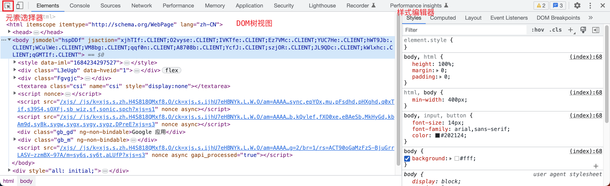
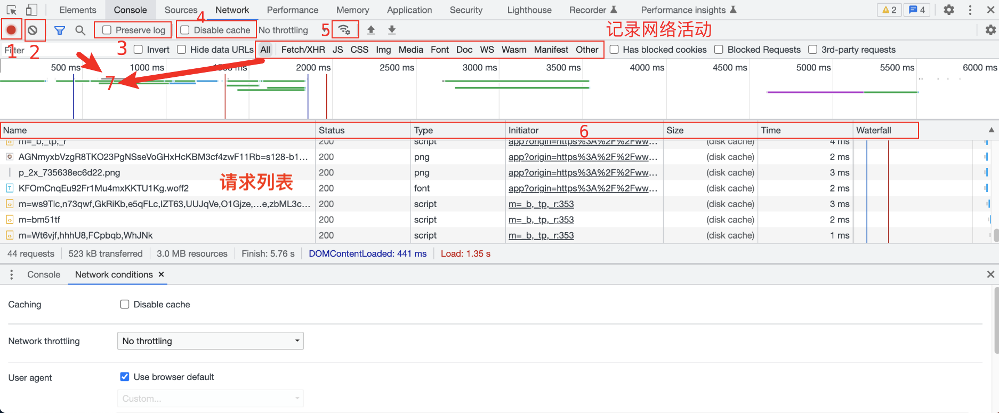
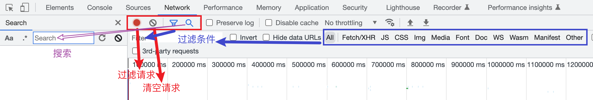
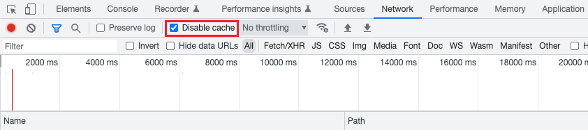
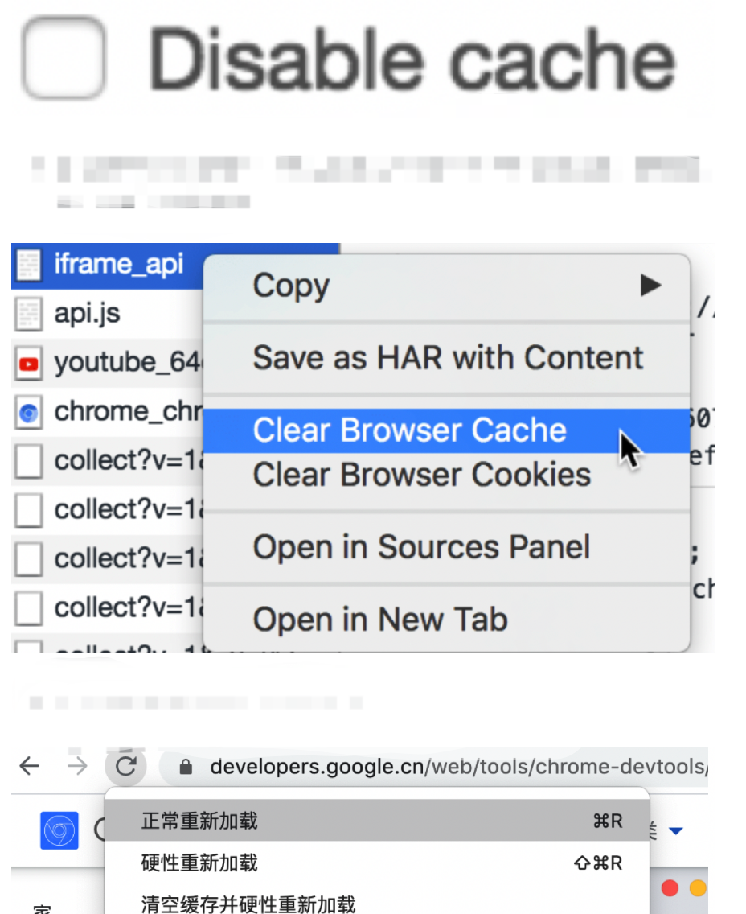
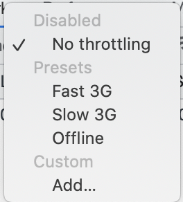
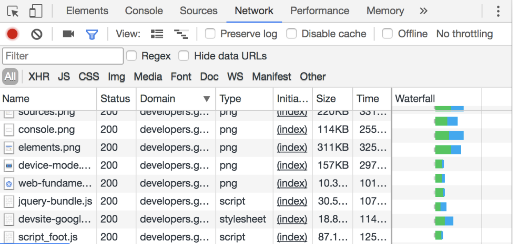

# 测试用例执行工具
## 本章要点
1. 要点一
1. 要点
1. 要点
1. **要点**

## 打开开发者工具

在大多数现代的Web浏览器中，可以通过以下方式打开开发者工具：

### 1. 使用快捷键

- Google Chrome 和 Microsoft Edge（基于 Chromium）：按下 **F12** 键或 **Ctrl + Shift + I**（Windows）/ **Command + Option + I**（Mac）。

- Mozilla Firefox：按下 **F12** 键或 **Ctrl + Shift + I**（Windows）/ **Command + Option + I**（Mac）。

- Safari：按下 **Option + Command + C**。

### 2. 右键菜单

在网页上右键单击，选择"**检查**"或"**检查元素**"选项。


### 3. 菜单选项

大多数浏览器提供一个菜单选项用于访问开发者工具。

在浏览器的菜单栏中，可以找到名为"**开发者工具**"或"**开发人员工具**"的选项，点击即可打开。


请注意，不同的浏览器版本和操作系统可能会有略微不同的快捷键或菜单选项。上述方式适用于常见的主流浏览器，但对于一些特定的浏览器或版本可能会有所差异。

## 开发者工具介绍

### Elements 面板

Elements 面板是浏览器开发者工具中的一个功能区域，用于**查看和调试网页的HTML结构和CSS样式**。

通过Elements面板，开发人员可以实时查看和编辑网页的DOM结构，修改元素的样式，以及调试JavaScript代码。

在Elements面板中，通常包含以下主要功能和组件：

#### DOM树视图

显示网页的DOM结构，以树状的形式展示HTML元素的层级关系。可以展开和折叠元素节点，查看和编辑其属性、内容和样式。

#### 元素选择器

允许开发人员通过鼠标悬停或点击网页中的元素来选中对应的DOM节点。选中的节点将在DOM树视图中高亮显示，并显示在Styles和Computed面板中的相关样式和计算值。

#### 样式编辑器

显示选中元素的样式信息，包括应用的CSS规则、样式属性和计算值。可以直接在样式编辑器中修改元素的样式，并实时预览效果。




### Network 面板

是浏览器开发者工具中的一个功能区域，用于**监控和分析网页的网络请求**。

```
加载顺序： URL --> js --> css
```

通过Network面板，开发人员可以查看网页加载过程中发送和接收的网络请求的详细信息，包括请求的URL、请求方法、请求头、响应状态、响应体等。


在Network面板中，通常包含以下主要功能和组件：




#### 记录网络活动

1. 停止记录网络请求
2. 清除记录
3. 保存跨页面加载的请求




#### 请求列表

显示所有网络请求的列表，以时间顺序排列。每个请求条目包含了请求的基本信息，如请求URL、请求方法、响应状态等。

可以点击请求条目以查看其详细信息。

#### 请求详细信息

在选中请求条目后，可以查看该请求的详细信息，包括请求头、响应头、请求参数、响应内容等。还可以查看请求的时间线，了解请求的各个阶段和耗时。

#### 过滤器

提供了多种过滤器选项，可以根据请求类型、域名、状态码等条件对请求进行过滤，以便快速定位和查找特定的请求。


#### 缓存

1. 禁用浏览器缓存。

  

2. 手动清除浏览器缓存。
3. 清空缓存并硬性重新加载。



#### 模拟网络条件

开发者可以在Network面板中模拟不同的网络条件，如缓慢的网络连接、离线状态等，以测试网页在不同网络环境下的表现和响应。


1. 离线模拟
2. 慢速网络模拟




## 查看网络数据

- Name：资源名称以及 URL 路径
- status：Http 状态码/文字解释
- Type：请求资源的类型
- Initiator：解释请求是怎么发起的
- Size：服务器提供的响应头加上响应主体的总大小
- Time：从请求开始到响应中最后一个字节接收的总持续时间
- Waterfall：每个请求活动的可视细分




通过Network面板，开发人员可以详细了解网页的网络请求情况，包括请求的性能、响应时间、错误状态等，帮助他们分析和优化网页的网络性能，并解决与网络请求相关的问题。


## 总结
- 总结一
- 总结二
- 总结三
https://github.com/Wechat-ggGitHub/Awesome-GitHub-Repo

[项目演示地址](https://github.com/testeru-pro/junit5-demo/tree/main/junit5-basic)


# 学习反馈

1. SpringBoot项目的父工程为( )。

   - [x] A. `spring-boot-starter-parent`
   - [ ] B.`spring-boot-starter-web`
   - [ ] C. `spring-boot-starter-father`
   - [ ] D. `spring-boot-starter-super`
<style>
  strong {
    color: #ea6010;
    font-weight: bolder;
  }
  .reveal blockquote {
    font-style: unset;
  }
</style>