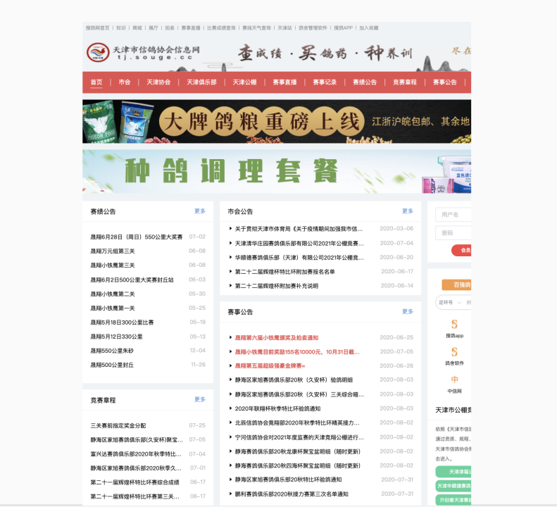
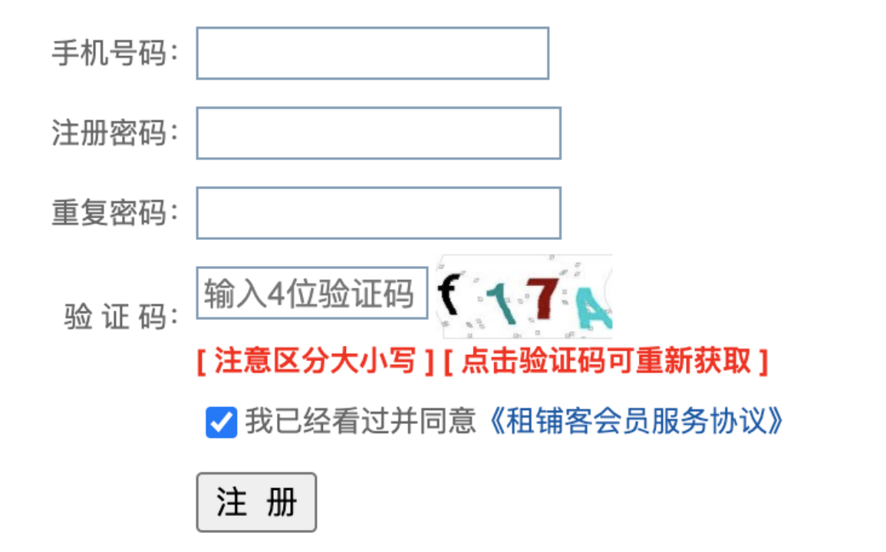
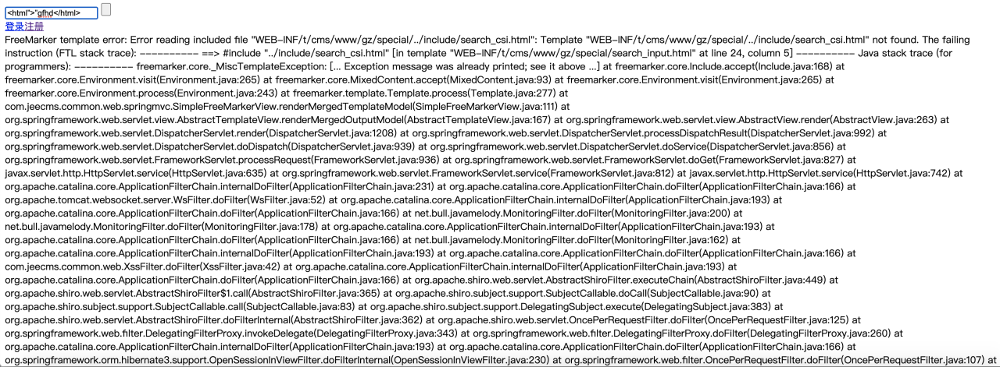
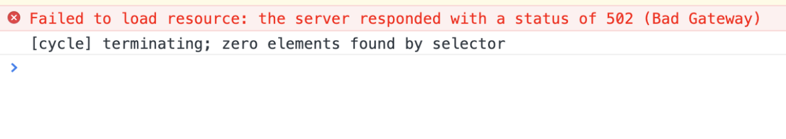
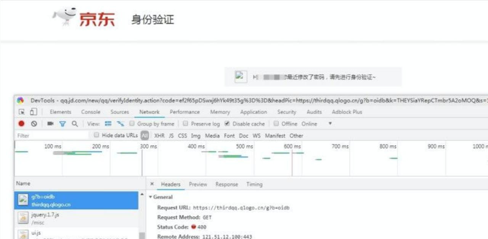
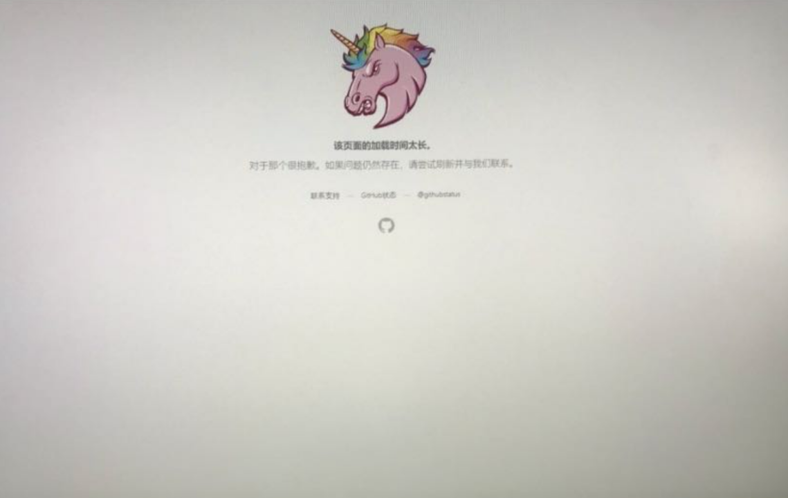

# Web端常见Bug

## 本章要点
1. 要点一
1. 要点
1. 要点
1. **要点**

## 页面布局问题

### 内容超长展示错乱

#### 解决

1. **文字溢出问题**：当内容超出容器的宽度或高度时，可能导致文字溢出或显示不完整。
   - 解决方法包括使用 CSS 属性 text-overflow: ellipsis 来省略过长的文本，并设置合适的容器宽度或高度。

2. **文字换行问题**：长段落或连续的文字没有适当的换行处理，可能会导致布局错乱。
   - 解决方法是使用 CSS 属性 word-wrap: break-word 或 word-break: break-all 来处理长文字的换行。

## 兼容性问题

不同的浏览器或设备可能会有不同的显示效果，甚至出现布局错乱等问题。

**更换设备布局错乱**:

当在不同设备上查看网页时，可能会出现页面布局错乱的问题。这主要是由于不同设备具有不同的**屏幕尺寸、分辨率和浏览器特性**等因素引起的。

在不同设备和浏览器上进行测试，并使用浏览器的开发者工具进行调试，以发现和修复布局错乱的问题。使用设备模拟器或浏览器调整窗口大小来模拟不同的屏幕尺寸，以确保页面在各种情况下都能正常显示。

#### 解决

以下是一些常见的解决方法：

**CSS 布局问题**：布局可能受到不正确的 CSS 样式或布局属性的影响，导致元素错位、重叠或排列不当。解决方法是仔细检查 CSS 样式，确保布局属性正确应用，使用浏览器开发者工具进行调试和排查。

**图片尺寸问题**：如果图片没有适当的尺寸设置，可能会导致页面布局错乱或图片变形。解决方法是对图片进行正确的尺寸调整，使用 CSS 属性 max-width: 100% 来确保图片在容器中适应合适的大小。

**动态内容加载问题**：如果页面中的内容是通过动态加载方式获取的，可能会导致页面布局在加载完成前出现错乱。解决方法是在加载过程中使用加载动画或占位符来保持页面布局的稳定性，等待内容加载完成后再展示。

**响应式设计问题**：如果网页没有良好的响应式设计，当在不同屏幕尺寸或设备上查看时，布局可能会出现问题。解决方法是采用响应式布局和媒体查询，确保页面在各种设备上能够适应并正确展示。

## 页面元素方面

### 输入域提示信息不明确

1. **清晰的标签和提示**：确保每个输入域都有明确的标签，并在输入域旁边或下方提供清晰的提示信息，描述所需的输入内容或格式要求。这样可以帮助用户理解输入域的用途和预期输入。

1. **错误提示信息**：如果用户提供了无效或不合法的输入，及时提供清晰的错误提示信息。错误提示应该明确指出输入的问题，并提供解决方法或建议。这样用户可以及时纠正输入错误并继续操作。

1. **实时验证和反馈**：在用户输入时，可以使用实时验证和反馈功能来检查输入的有效性。例如，对于邮箱输入域，可以在用户输入时检查邮箱格式，并实时显示验证结果。这样用户可以立即了解输入是否有效，而不必等待提交后才发现错误。

### 输入框包含 HTML 字符时出现异常

**输入提示和说明**：在输入框旁边或下方提供明确的提示和说明，告知用户输入框不支持HTML字符或特殊字符。这样可以引导用户避免输入可能导致异常的字符。

## 功能问题

网站功能异常、链接不正确等问题。

### 需求未实现

### 提示信息错误

不能带code。

### JavaScript 错误

JavaScript 代码错误、事件绑定问题等。

### 页面更改不同步

1. 登录后打开多个页面。
1. 在一个页面中操作修改内容。
1. 在另一个页面中查看。
1. 已经修改过的内容在另一个页面上没有体现。

### 权限状态不同步

1. 打开多个页面。
1. 其中一个页面登录成功。
1. 另一个页面刷新。
1. 没有同步为登录状态。

## 页面加载问题

页面请求失败、加载缓慢、图片不显示、CSS 无法加载等问题，影响用户体验。

### 页面请求失败

### 加载时间太长

## 表单验证问题

表单验证不完善，可能会导致非法输入或 XSS 攻击等问题。

## 安全问题

未经授权的访问、会话劫持、跨站脚本攻击等问题，可能会导致信息泄露或数据被篡改。

## SEO 问题

网页标题、META 描述等 SEO 相关的问题，可能会影响网站的搜索排名。

## 前端框架问题

使用的前端框架版本过低或者与后端框架不兼容等问题，可能会导致网站功能异常或者性能下降。

## 其他-

---

## 其他-

## 总结
- 总结一
- 总结二
- 总结三
https://github.com/Wechat-ggGitHub/Awesome-GitHub-Repo

[项目演示地址](https://github.com/testeru-pro/junit5-demo/tree/main/junit5-basic)

# 学习反馈

1. SpringBoot项目的父工程为( )。

   - [x] A. `spring-boot-starter-parent`
   - [ ] B.`spring-boot-starter-web`
   - [ ] C. `spring-boot-starter-father`
   - [ ] D. `spring-boot-starter-super`
