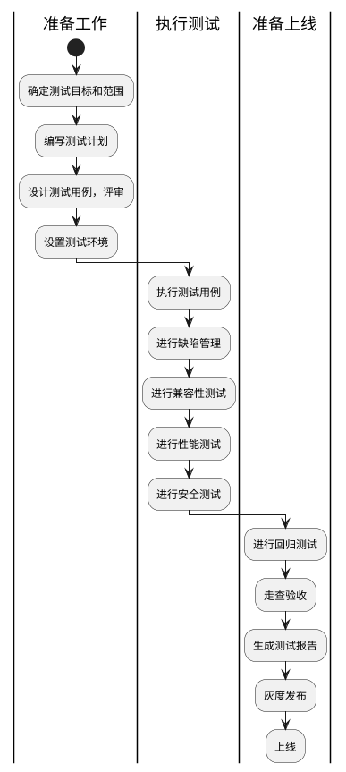

Web测试的流程可以根据具体项目的需求和测试策略进行调整，但通常包括以下步骤：

## 准备工作

### 确定测试目标和范围

明确测试的目标和范围，了解需要测试的功能、系统模块和用户需求。

**被测需求理解，分为3步：**

1. 需求文档。

    >查看需求需求文档范例，产品需求文档范例：https://docs.qq.com/doc/DV2ZMWUxFWE9XaEVk

2. [需求评审](1005B_需求评审.md)。

3. [需求分析](1005C_需求分析.md)。

### 编写测试计划

制定详细的测试计划，包括测试的目标、测试策略、测试环境、测试资源和时间安排等。

### 设计测试用例

根据需求和功能设计测试用例，包括正常情况下的功能验证、异常情况的处理、边界条件的测试等。测试用例应该具有全面性和充分性，以确保覆盖各种测试情景。

### 测试环境准备

>研发提测，运维部署。

准备适当的测试环境，包括服务器、数据库、网络配置等。确保测试环境与实际生产环境尽可能接近，以获取准确的测试结果。

## 执行测试

### 执行测试用例

按照设计的测试用例执行测试，包括手动测试和自动化测试。记录测试过程中遇到的问题和异常，并及时反馈给开发团队。

### 进行缺陷管理

对测试过程中发现的问题进行记录和跟踪，并与开发团队进行沟通和解决。确保问题得到及时修复，并进行验证确认。

### 进行性能测试

根据性能测试计划，执行负载测试、压力测试等，评估系统的性能和扩展能力，并找出性能瓶颈和优化的空间。

### 进行安全测试

执行安全测试，检查系统是否存在安全漏洞和风险，并提供相应的修复建议。

### 进行兼容性测试

验证Web应用程序在不同浏览器、操作系统和设备上的兼容性，并解决兼容性问题。

### 生成测试报告

整理测试结果和问题报告，编写测试报告，包括测试概述、测试结果、问题列表和建议等。向相关利益相关者提供详细的测试报告。

## 准备上线

### 进行回归测试

测试人员不只是对当前需求涉及到的场景进行测试，还需要把当前产品P0、P1级别的测试用例执行一遍。

### 走查验收

对修复的问题和改进的功能进行回归测试，确保修复和改进不会引入新的问题。

### 完成测试

根据测试计划和测试目标，确认测试已经完成，并做好总结和总结经验教训。

:进行回归测试;
:走查验收;
:生成测试报告;
:灰度发布;
:上线;

## 注意
需要注意的是，以上流程仅为一般性指导，实际的Web测试流程可能因项目的规模、复杂性和时间限制而有所不同。测试流程应根据具体情况进行灵活调整和优化，以满足项目的需求。