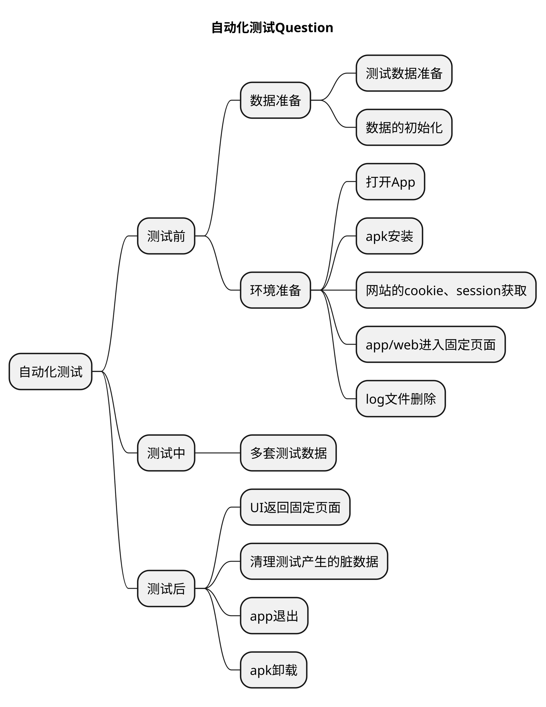
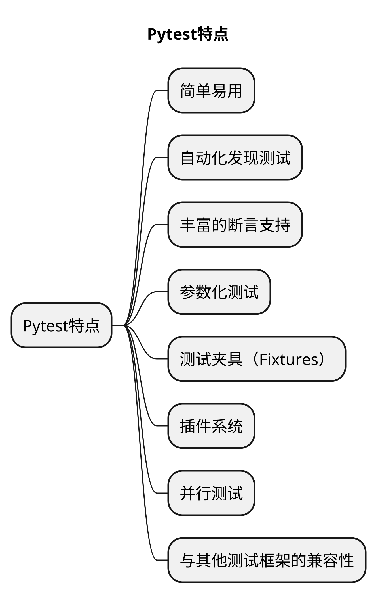

# 文章名
## 本章要点
1. 要点一
1. 要点
1. 要点
1. **要点**

## 学习目标

1. 。

## 思考

## 概念

Pytest是一个基于Python的功能强大且易于使用的**测试框架**。它提供了一种简单而灵活的方式来编写测试，并具有丰富的特性和插件生态系统。

python 中的测试框架其实有好几种呢。比如我们介绍过的 unittest，它是python自带的单元测试框架，现在很多公司也还在用。

pytest 这个是目前行业中最流行的测试框架，而且可以完美兼容 unittest 框架

还有 nosetest，这个用的人相对要少一些，我们就不多做介绍了。

## 特点

以下是Pytest的一些主要特点和功能：

### 简单易用

Pytest使用简洁的语法和约定，使得编写和运行测试变得简单明了。

Pytest使用简洁的语法，可以通过函数和装饰器轻松定义测试用例。它支持使用assert语句进行断言，使得测试代码易于编写和阅读。

### 自动化发现测试

Pytest会自动发现和收集测试文件和测试函数，无需手动指定。

Pytest会自动发现测试文件和测试函数，无需显式配置测试套件。只需按照约定的**命名规则编写**测试文件和函数，Pytest将自动执行它们。

### 丰富的断言支持

Pytest提供了丰富的断言函数，用于验证测试结果是否符合预期。

Pytest提供了丰富的断言方法，可以方便地进行各种断言操作，包括**比较值**、**容器中的元素**、**抛出异常**等。

### 参数化测试

Pytest支持使用装饰器来实现参数化测试，可以通过多个输入值运行相同的测试用例。

Pytest支持使用装饰器进行参数化测试，可以轻松地对测试用例进行多组输入数据的测试。

### 测试夹具（Fixtures）

Pytest的夹具机制可以在测试运行之前和之后执行一些准备和清理操作，方便共享和重用测试代码。

夹具Fixtures是Pytest中用于提供测试环境的功能。

夹具可以在测试用例**之前**和**之后**执行一些操作，例如**设置和清理测试数据**、**创建和销毁对象**等。

### 插件系统

Pytest具有丰富的插件生态系统，可以扩展功能，例如**生成测试报告**、**集成代码覆盖率**等。

插件生态系统：Pytest具有丰富的插件生态系统，可以通过插件扩展框架的功能，如生成测试报告、集成其他工具等。

### 并行测试

Pytest支持并行执行测试，可以提高测试执行速度。

### 与其他测试框架的兼容性

Pytest可以与其他主流的测试框架（如unittest）和持续集成工具（如Jenkins）集成使用。

总的来说，Pytest是一个灵活、强大且易于使用的测试框架，提供了许多功能和工具来简化测试编写和执行，并促进测试代码的可读性和可维护性。

## 总结
- 总结一
- 总结二
- 总结三
https://github.com/Wechat-ggGitHub/Awesome-GitHub-Repo

[项目演示地址](https://github.com/testeru-pro/junit5-demo/tree/main/junit5-basic)

# 学习反馈

1. SpringBoot项目的父工程为( )。

   - [x] A. `spring-boot-starter-parent`
   - [ ] B.`spring-boot-starter-web`
   - [ ] C. `spring-boot-starter-father`
   - [ ] D. `spring-boot-starter-super`

