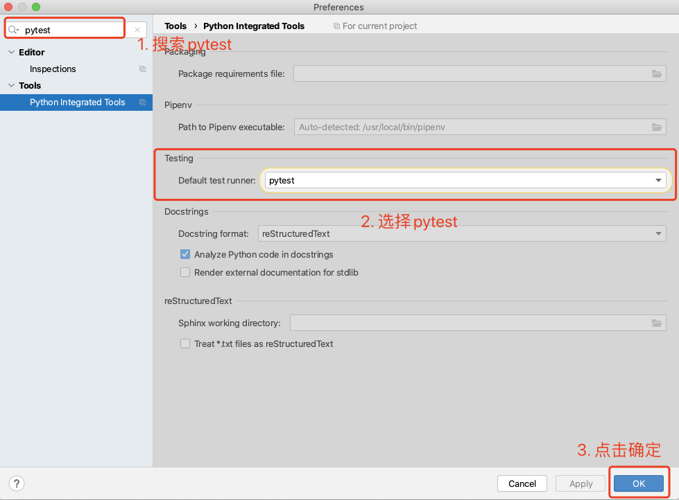

# 文章名
## 本章要点
1. 要点一
1. 要点
1. 要点
1. **要点**


## 学习目标

1. 。


## 思考

## 安装


要在Python中安装pytest测试框架，可以按照以下步骤进行：


### 1. 确保已安装Python

访问Python官方网站（https://www.python.org），下载并安装适合您操作系统的Python版本。安装完成后，确保在命令行中可以运行`python`和`pip`命令。

### 2. 创建和激活虚拟环境（可选）

虚拟环境可以帮助您隔离项目所需的依赖项。

在命令行中执行以下命令，创建并激活虚拟环境（如果您不打算使用虚拟环境，可以跳过此步骤）：

```bash

python -m venv myenv      # 创建虚拟环境
source myenv/bin/activate  # 激活虚拟环境（Linux/Mac）
myenv\Scripts\activate    # 激活虚拟环境（Windows）
```

### 3. 安装pytest

在命令行中执行以下命令，使用pip安装pytest：

```bash
pip install pytest
```

这将下载并安装最新版本的pytest和其依赖项。


```bash
pip install -U pytest
```

-U 这个参数可以加也可以不加，这个参数是让我们的 pytest 升级的。


### 4. 验证安装

执行以下命令，验证pytest是否成功安装：

```bash
pytest --version
```

如果一切正常，将显示已安装的pytest版本号。

现在，您已成功安装pytest测试框架。您可以编写测试用例并使用pytest运行它们。

记得在测试文件中以**test_**开头命名测试函数或方法，以便pytest能够自动发现和执行它们。


## Pycharm 界面化安装 Pytest

1. 进入 `Tools` -> `Python Intergrated Tools`

  

2. 选择 `Default test runner` 为 `pytest`
 
  

## 总结
- 总结一
- 总结二
- 总结三
https://github.com/Wechat-ggGitHub/Awesome-GitHub-Repo

[项目演示地址](https://github.com/testeru-pro/junit5-demo/tree/main/junit5-basic)


# 学习反馈

1. SpringBoot项目的父工程为( )。

   - [x] A. `spring-boot-starter-parent`
   - [ ] B.`spring-boot-starter-web`
   - [ ] C. `spring-boot-starter-father`
   - [ ] D. `spring-boot-starter-super`


<style>
  strong {
    color: #ea6010;
    font-weight: bolder;
  }
  .reveal blockquote {
    font-style: unset;
  }
</style>


