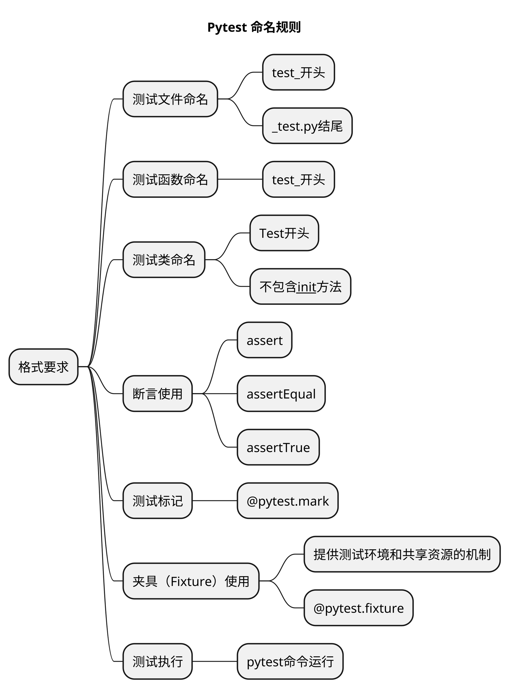

# 文章名
## 本章要点
1. 要点一
1. 要点
1. 要点
1. **要点**

## 学习目标

1. 。

## 思考

[pytest官网](https://docs.pytest.org/)

## 格式要求

pytest测试框架对于测试文件和测试函数的命名有一些约定和格式要求，以便能够自动发现和执行测试。以下是pytest的一些常见格式要求：

### 测试文件命名

测试文件应以**test_开头** 命名，或以 **_test.py结尾** 命名。例如：`test_example.py`。

### 测试函数命名

测试函数或方法应该以**test_开头**，以便pytest能够识别它们作为测试用例。例如，`def test_addition():`。

如果使用类来组织测试，测试方法应以**test_开头**命名。例如：`def test_addition(self):`。

### 测试类命名

如果使用了测试类，测试类的命名应该以**Test开头**，并且**不应该包含__init__方法**。例如，`class TestCalculator:`。

### 断言使用

在测试函数中使用断言来验证预期结果和实际结果是否一致。

使用Python的内置`assert`语句或pytest提供的断言函数（如`assertEqual`、`assertTrue`等）进行断言。

### 测试标记

pytest支持使用标记（**Markers**）来标识和选择特定的测试用例。可以使用`@pytest.mark`装饰器在**测试函数**或**测试类**上添加标记。例如，`@pytest.mark.smoke`。

使用标准的Python模块、类和方法来组织测试代码。可以将多个测试函数放在同一个模块中，或将测试函数放在类中作为方法。

使用pytest的参数化插件（如`@pytest.mark.parametrize`装饰器）来实现参数化测试。

### 夹具（Fixture）使用

夹具是pytest中用于**提供测试环境和共享资源的机制**。

**夹具函数**应该以**fixture_开头**，并可以通过参数方式在测试函数中使用。例如，`@pytest.fixture`。

### 测试执行

在命令行中使用`pytest`命令运行测试。`pytest`会自动发现和执行符合命名约定的测试函数和方法。

这些格式要求和约定可帮助pytest自动发现和执行测试，提供了一致且易于阅读的测试代码结构。根据pytest的约定，您可以组织和编写测试代码，以便更好地利用pytest的功能和特性。

## 总结
- 总结一
- 总结二
- 总结三
https://github.com/Wechat-ggGitHub/Awesome-GitHub-Repo

# 学习反馈

1. SpringBoot项目的父工程为( )。

   - [x] A. `spring-boot-starter-parent`
   - [ ] B.`spring-boot-starter-web`
   - [ ] C. `spring-boot-starter-father`
   - [ ] D. `spring-boot-starter-super`

