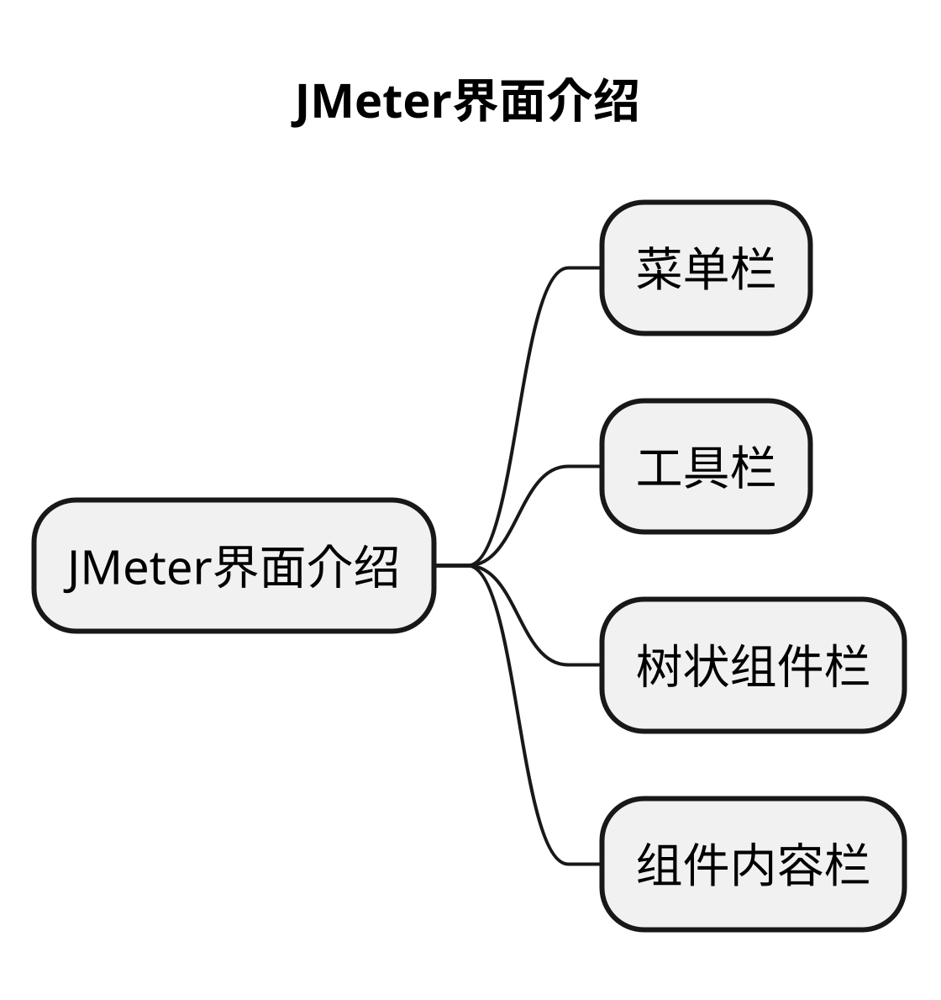
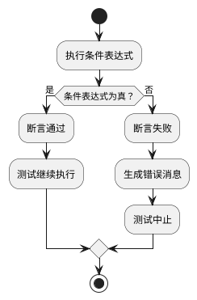
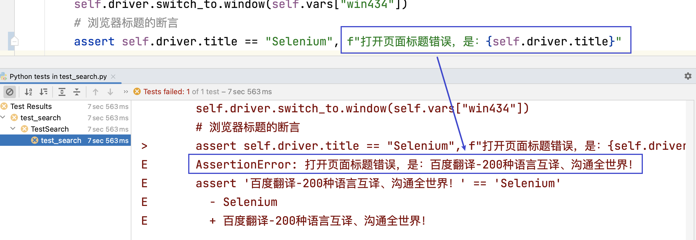

# 文章名
## 本章要点
1. 要点一
1. 要点
1. 要点
1. **要点**



## 学习目标

1. 。


## 思考

## 什么是断言

断言是一种用于**验证测试结果**的机制。在软件测试中，断言用于**检查程序的实际行为是否符合预期**。

它是一种测试技术，通过**对预期结果和实际结果进行比较，来确定测试是否通过或失败**。

断言通常用于测试框架和测试用例中，用于验证程序在给定输入或条件下的行为是否正确。它是测试用例中的关键部分，用于判断测试的成功或失败。

## 工作原理




断言的工作原理是将一个条件表达式与期望的结果进行比较。

如果条件表达式为**真**，则 **断言通过，测试继续执行**。

如果条件表达式为**假**，则**断言失败，测试中止**，并通常会生成**错误消息**来**指示断言失败的原因**。

在编写测试用例时，使用**断言可以快速验证代码的正确性**，确保被测试的功能或行为与预期一致。如果断言失败，它提供了一个指示问题所在的关键信息，有助于定位和修复错误。

断言是自动化测试中的重要组成部分，它可以帮助开发人员和测试人员快速发现问题，并提供可靠的测试结果。使用好断言可以提高测试的可靠性和效率，并帮助团队及时发现和解决软件中的问题。

## 常见断言方法

在pytest中，测试用例的断言可以使用Python的assert语句或使用断言库提供的函数来实现。

以下是一些常见的断言方法：

### 使用Python的assert语句

```python
assert <expression>, <message>
```

- `<expression>`是要进行断言验证的表达式。

- `<message>`是可选的错误消息，用于在断言失败时显示。


示例：

```python
assert result == expected_result, "断言失败: 结果与预期不一致"
```

### 使用断言库提供的函数

如pytest自带的断言函数或第三方库（例如assertpy）：

```python
import pytest
from assertpy import assert_that

# 使用pytest断言函数
def test_assertions():
  # pytest.assertion.assert_断言函数的条件(断言验证的表达式, 断言失败时显示的错误消息)
    pytest.assertion.assert_<condition>(<expression>, <message>)

# 使用assertpy断言函数
def test_assertpy():
  #  assert_that(断言验证的值).断言函数(期望值).断言函数(期望值)
    assert_that(<value>).<assertion_method>(<expected_value>).<assertion_method>(<expected_value>)

```

- `<condition>`是断言函数的条件，例如`equal`、`true`、`false`等。

- `<expression>`是要进行断言验证的表达式。
  
- `<message>`是可选的错误消息，用于在断言失败时显示。

- `<value>`是要进行断言验证的值，通过链式调用断言方法来实现多个断言。

示例：

```python
# 使用pytest断言函数
def test_assertions():
    pytest.assertion.assert_equal(result, expected_result, "断言失败: 结果与预期不一致")

# 使用assertpy断言函数
def test_assertpy():
    assert_that(result).is_equal_to(expected_result).is_not_empty()
```




无论是使用 Python 的 assert 语句还是断言库提供的函数，都可以根据具体的需求和测试场景来选择和使用。这些断言方法可以帮助您验证测试结果是否符合预期，并提供有用的错误信息以便快速定位问题。


## 总结
- 总结一
- 总结二
- 总结三
https://github.com/Wechat-ggGitHub/Awesome-GitHub-Repo

[项目演示地址](https://github.com/testeru-pro/junit5-demo/tree/main/junit5-basic)


# 学习反馈

1. SpringBoot项目的父工程为( )。

   - [x] A. `spring-boot-starter-parent`
   - [ ] B.`spring-boot-starter-web`
   - [ ] C. `spring-boot-starter-father`
   - [ ] D. `spring-boot-starter-super`


<style>
  strong {
    color: #ea6010;
    font-weight: bolder;
  }
  .reveal blockquote {
    font-style: unset;
  }
</style>


