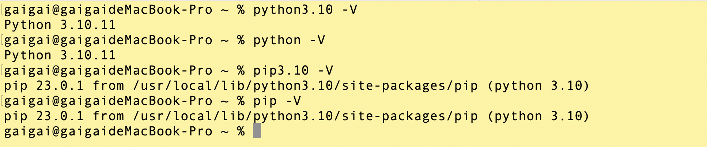

# 安装Python

首先确保你的计算机上已经安装了Python。

可以从Python官方网站（https://www.python.org）下载适用于你的操作系统的最新版本，并按照安装指南进行安装。

Mac电脑如果有brew命令行，则可以直接通过命令行安装python的3.10.11版本。

```bash
brew install python@3.10
```


pip是**Python的包管理工具**，用于安装和管理第三方库。通常情况下，Python安装程序会自动包含pip。

## 配置环境变量

如果不默认配置环境变量时，命令行终端输入 `python3.10` 也可以正常访问Python。

命令行终端输入 `pip3.10` 也可正常访问pip。

```bash
#------------------ python ------------------
PYTHON_HOME=/usr/local/Cellar/python@3.10/3.10.11
PATH=$PATH:${PYTHON_HOME}/bin


export PYTHON_HOME
export PATH

# 命令行输入python 调用python3.10
alias python=/usr/local/Cellar/python@3.10/3.10.11/bin/python3.10

alias pip=/usr/local/Cellar/python@3.10/3.10.11/bin/pip3.10

```

## 版本验证




```bash
# python 版本验证
python -V
# pip 版本验证
pip -V
```


## 安装pip
你可以在终端或命令提示符中运行以下命令来验证是否已经安装了pip：

