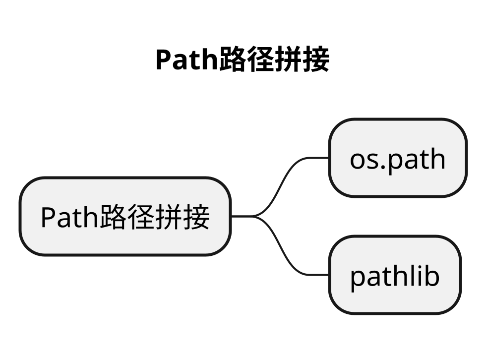

# Path路径拼接
## 本章要点
1. 要点一
1. 要点
1. 要点
1. **要点**



## 学习目标

1. 。


## 思考

不同的平台对应的路径拼接方式不同，比如在 **Windows** 上是**反斜杠** `\`，在**其他大多数操作系统**上是**正斜杠** `/`。

不能用字符串进行路径拼接，字符串路径拼接会导致代码无法跨平台运行。


## os.path

在 Python 中，为了确保跨平台兼容性，建议使用 os.path.join() 进行路径拼接。它会根据您的操作系统选择正确的路径分隔符（在 Windows 上是反斜杠 \，在其他大多数操作系统上是正斜杠 /）。


```python
# 文件目录
path = '/Users/gaigai/tutorials/python/python310'
# 文件名
file = 'path_splice.py'


# 方式一：os.path
new_path = os.path.join(path, file)
print(new_path)
```

## pathlib

使用了 pathlib 库的特性，在 Python 3.4 及更高版本中获得更易读、方便的路径操作方式。

这里，**folder** 是一个 **Path** 类型对象，表示文件夹的路径。

**file** 是一个表示文件名的字符串。

通过使用 **/** 运算符，我们可以轻松地将 **文件夹路径**（folder）和 **文件名**（file）组合成**一个完整的文件路径**（full_path）。


```python
# 文件目录
path = '/Users/gaigai/tutorials/python/python310'
# 文件名
file = 'path_splice.py'


# 方式二：pathlib
folder = Path(path)
# 使用 pathlib 进行路径拼接
new_path = folder / file
print(new_path)
```

注意：使用 pathlib 库时，不必担心操作系统之间的路径分隔符差异。pathlib 会自动为您处理这些问题。


## 总结
- 总结一
- 总结二
- 总结三
https://github.com/Wechat-ggGitHub/Awesome-GitHub-Repo

[项目演示地址](https://github.com/testeru-pro/junit5-demo/tree/main/junit5-basic)


# 学习反馈

1. SpringBoot项目的父工程为( )。

   - [x] A. `spring-boot-starter-parent`
   - [ ] B.`spring-boot-starter-web`
   - [ ] C. `spring-boot-starter-father`
   - [ ] D. `spring-boot-starter-super`


<style>
  strong {
    color: #ea6010;
    font-weight: bolder;
  }
  .reveal blockquote {
    font-style: unset;
  }
</style>


