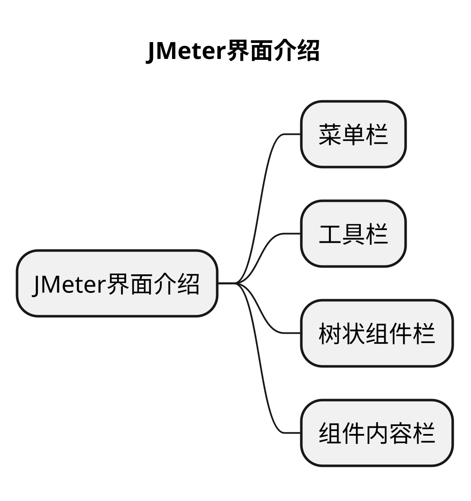

# 文章名
## 本章要点
1. 要点一
1. 要点
1. 要点
1. **要点**



## 学习目标

1. 。


## 思考

## 介绍

**列表推导式**（List comprehension）是Python中的一种简洁且可读性较强的方式，用于**创建新列表**。

## 语法

它可以**用一行代码完成遍历已有列表及对元素的过滤和计算等操作**。列表推导式的语法如下：

```python
new_list = [expression for item in iterable if condition]
```
### expression 

是对列表中每个元素进行操作的单个表达式，可以是简单的表达式，如 item，也可以是操作复杂的表达式，如 item * 2。

### for item in iterable 

是一个用于遍历iterable列表、元组、集合等可迭代对象）的for循环，其中item是遍历过程中的每个元素。

### if condition 

是可选的，用于对iterable中的元素进行过滤，只有满足条件的元素才会参与expression计算并被添加到新列表中。

## 案例

```python
# 案例1：创建一个列表，其元素为原列表元素的平方
original_list = [1, 2, 3, 4, 5]
squared_list = [x * x for x in original_list]
print(squared_list)  # 输出：[1, 4, 9, 16, 25]

# 案例2：创建列表，只包含原列表中的偶数
original_list = [1, 2, 3, 4, 5, 6, 7, 8, 9]
even_list = [x for x in original_list if x % 2 == 0]
print(even_list)  # 输出：[2, 4, 6,8]

# 案例3：创建一个列表，将原列表中的偶数乘以3
original_list = [1, 2, 3, 4, 5, 6, 7, 8, 9]
multiplied_even_list = [x * 3 for x in original_list if x % 2 == 0]
print(multiplied_even_list)  # 输出：[6, 12, 18, 24]

```


使用列表推导式可以让代码变得更简洁、易读，特别是在处理列表操作时。但请注意，如果表达式过于复杂，可能导致可读性降低，适当情下应考虑使用普通的for循环。


## 总结
- 总结一
- 总结二
- 总结三
https://github.com/Wechat-ggGitHub/Awesome-GitHub-Repo

[项目演示地址](https://github.com/testeru-pro/junit5-demo/tree/main/junit5-basic)


# 学习反馈

1. SpringBoot项目的父工程为( )。

   - [x] A. `spring-boot-starter-parent`
   - [ ] B.`spring-boot-starter-web`
   - [ ] C. `spring-boot-starter-father`
   - [ ] D. `spring-boot-starter-super`


<style>
  strong {
    color: #ea6010;
    font-weight: bolder;
  }
  .reveal blockquote {
    font-style: unset;
  }
</style>


