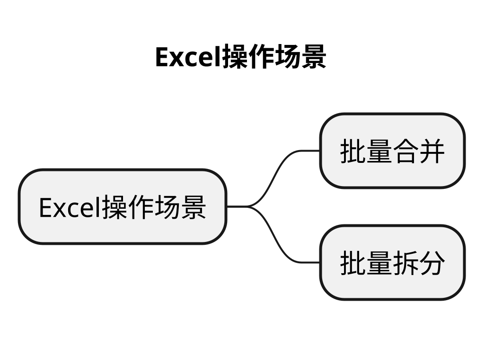
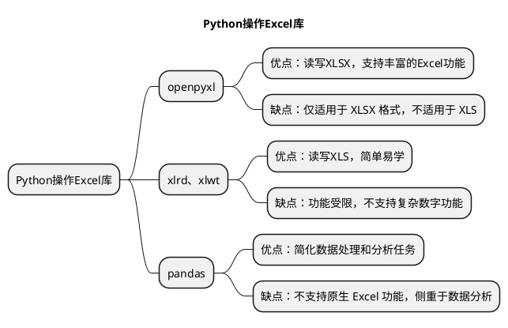

# 文章名

## 本章要点
1. 要点一
1. 要点
1. 要点
1. **要点**

## 学习目标

## 思考

同时操作多个Execel文件，如何操作？手工操作，重复浪费时间。。

Excel 是我们在工作中用到的最频繁的软件之一，它有着强大的计算能力和便捷的图表功能。如果我们要在同一个 Excel 文件中进行操作，手工进行也很方便，但问题是，如果我们需要同时操作多个 Excel 文件，就是一件非常耗时的事情了。

## 场景

在工作场景中，需要同时操作多个 Excel 的情况主要有 2 种：**批量合并**和**批量拆分**。

### 批量合并

假设你需要对某些工作内容进行问卷调查，这时你用 Excel 做了调查问卷模版。

我想你会这样做：先把 Excel 通过工作群分发给所有员工，再把群里收集到的反馈附件汇总成一个文件。

假设需要多人协作进行编写测试用例，这时你用Excel 做了测试用例模版。先把 Excel 通过工作群分发给小组成员，再把小组成员的测试用例汇总成一个文件。

**时序图就是以时间顺序来排列程序中的事件的图表。**

通过上图，你应该很容易看出重复操作的这四个事件：

1. 打开文件；

2. 提取用户填写内容；
3. 粘贴到汇总文件；
4. 关闭文件。

由于它们是重复的，所以我会使用 for 循环对它们依次进行处理。

### 批量拆分

假设你是公司的财务人员，你需要使用 Excel 对员工工资进行核算，之后再打印出来。但是公司要求员工薪水保密，所以每个员工的工资需要拆分成一个独立的文件，最后还需要打印出来。

无论是合并，还是拆分，我们都面临着一个困境：**没有现成的软件可以实现多个 Excel 文件的合并和拆分操作**，所以你只好对每一个 Excel 文件都进行“打开 - 复制粘贴 - 保存”的工作。

很多人在面对这样的工作需求时，都忍不住立马去做，却很少停下来分析问题。

其实，这三步是很简单的工作，不过也是无意义的重复工作，既浪费了时间，又没有真正产生价值。

幸运的是，这些工作都可以通过 Python 来解决。

今天，我就给你介绍一下用 Python 实现重复工作自动化，快速实现 Excel 的合并和拆分的方法。

### 如何用 Python 手工操作一个 Excel 文件？

刚刚我们说到批量处理，其实也就是逐一处理多个文件。

如果我们想要提升这类工作的效率，就可以先借助 Python 把每一次处理都自动化。

所以，在讲具体的合并和拆分方法前，我们要解决的第一个问题，就是用 Python 代替你的双手来操作一个 Excel 文件。

如果要用 **Python 操作 Excel 文件**，首先就要**支持读写 Excel 的功能**。

在 Python 中，要想实现对某一个功能的支持，就需要**安装扩展库**。

## 操作库

Python 中有几个可以操作 Excel 的库，如 openpyxl、xlrd、xlwt 和 pandas。

### openpyxl

**优点**：可读写 Excel 文件（XLSX），现代且功能全面，支持丰富的 Excel 功能，如图表、格式、公式等。

**缺点**：仅适用于 XLSX 格式，不适用于 XLS（旧版 Excel 文件）。

### xlrd 和 xlwt

**优点**：xlrd 可读 Excel 文件（XLS），xlwt 可写入 Excel 文件（XLS）；相对简单且易学。

> xlrd 的旧版本可以读 XLSX，但是会有一个安全问题。

 
**缺点**：功能受限，不支持复杂数字功能。

### pandas

**优点**：简化数据处理和分析任务，用于操作各种格式文件（如 CSV、Excel、JSON、HDF、SQL 等）。轻松将数据码g化和聚合

**缺点**：不支持原生 Excel 功能，如图表、格式和公式。功能更侧重于数据分析而非 Excel 文件编辑。

以上三个库，我们都会使用到，xls文件操作使用了xlrd、xlwt，数据的统计操作使用了pandas，绘制图表使用了openpyxl。

## 总结
- 总结一
- 总结二
- 总结三

# 学习反馈

1. SpringBoot项目的父工程为( )。

   - [x] A. `spring-boot-starter-parent`
   - [ ] B.`spring-boot-starter-web`
   - [ ] C. `spring-boot-starter-father`
   - [ ] D. `spring-boot-starter-super`

