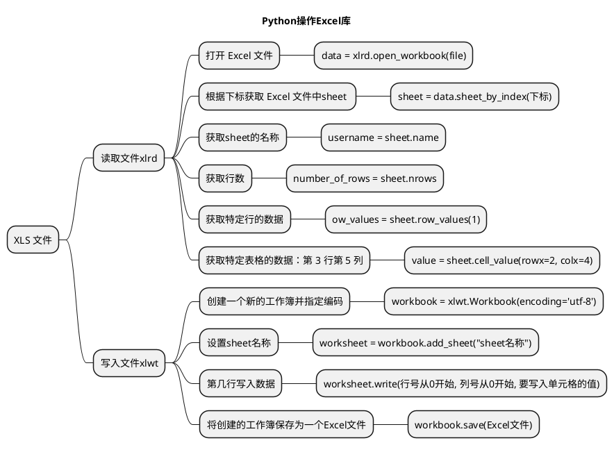
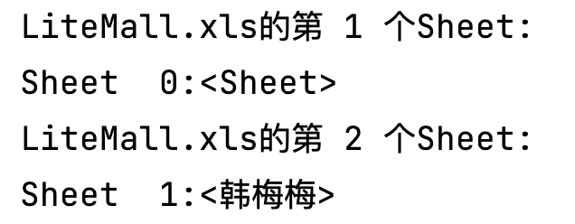
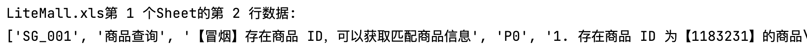
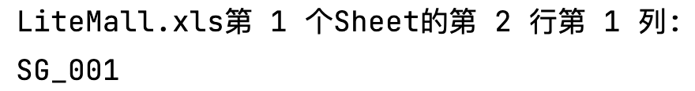
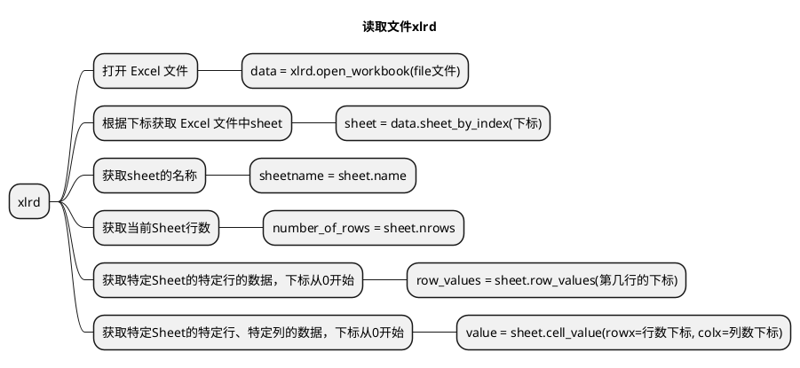
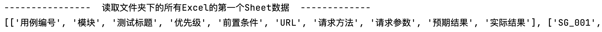
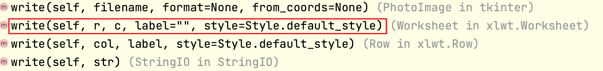

# 文章名

## 本章要点
1. 要点一
1. 要点
1. 要点
1. **要点**


## 学习目标

1. 掌握XLS文件操作。


## 思考

以.XLS 文件结尾的Excel如何合并与拆分？





## 环境准备

支持 Excel **读取**的扩展库叫做 **xlrd** 库，支持 Excel **写入**的扩展库叫做 **xlwt** 库。我们可以使用下面的命令行进行安装：

```bash
# 读取 Excel
pip3 install xlrd 
# 写入 Excel
pip3 install xlwt 
```


使用 Python 读取 Excel 文件的内容呢？你可以使用第三方库 xlrd，用于操作 Excel 文件。

# 文件读取

## 获取Sheet对象




```python
# read_ex.py xls文件读的示例操作
import xlrd

file = 'LiteMall.xls'

# --------------- 获取Sheet对象 ---------------
# 打开 Excel 文件，file 是文件路径或类似文件对象的参数
data = xlrd.open_workbook(file)
# 获取 Excel 文件中第一个 sheet  Sheet  0:<Sheet1>
sheet = data.sheets()[0]
print(f"{file}的第 1 个Sheet:\n{sheet}")
sheet2 = data.sheet_by_index(1)# 获取工作表（将 0 替换为需要的工作表索引）
print(f"{file}的第 2 个Sheet:\n{sheet2}")
```

## 获取当前Sheet行数


```python
# read_ex.py xls文件读的示例操作

# 获取当前Sheet行数
number_of_rows = sheet.nrows
print(f"{file}第 1 个Sheet的行数: {number_of_rows}")
```

## 获取特定Sheet的特定行的数据



```python
# read_ex.py xls文件读的示例操作


# 获取特定Sheet的特定行的数据
# 下标从0开始
rowIndex = 1
row_values = sheet.row_values(rowIndex)
print(f"{file}第 1 个Sheet的第 2 行数据:\n{row_values}")
```


## 读取具体单元格



```python
# read_ex.py xls文件读的示例操作

# --------------- 读取具体单元格的数据 ---------------
# 获取表格中第 2 行（从 0 开始计数）第 1 列（从 0 开始计数，即 A 列）的单元格内容。
# rowx 行  rowx=1
# colx 列  colx=0
value = sheet.cell_value(rowx=1, colx=0)
# 注意，这里将第 2 行和第 1 列作为参数传递给 cell_value 函数，因为在 Python 中计数从 0 开始。
# 如果想读取 Excel 文件中的其他单元格，只需要将相应的行数和列数传递给 cell_value 函数即可。
print(f"{file}第 1 个Sheet的第 2 行第 1 列:\n{value}")
```


## 代码总结



## 场景：读 Sheet1 的每一行


### 代码模版

```python
# read_row.py 读Sheet1 测试用例每一行
import xlrd


print("----------------  开始遍历 Excel 文件中具体的Sheet的每一行  -------------")

```


### 代码实现


```python
# 02read_row.py 读Sheet1 测试用例每一行
import xlrd

file = 'LiteMall.xls'

# --------------- 获取Sheet对象 ---------------
# 打开 Excel 文件，file 是文件路径或类似文件对象的参数
data = xlrd.open_workbook(file)
# 获取 Excel 文件中第一个 sheet  Sheet  0:<Sheet1>
sheet = data.sheets()[0]
print("----------------  开始遍历 Excel 文件中具体的Sheet的每一行  -------------")
# 遍历 Excel 文件中的所有行  读取 Excel 文件中的每一行数据。
# range(sheet.nrows)是一个Python中的内置函数和内置类型structrange。
# 它返回一个range对象(范围对象)，该对象表示从0开始，到sheet对象的行数(sheet.nrows)结束的数字序列。
# 这个返回值通常被用在for循环的语句中，来遍历sheet对象中的所有行。例如：
for row_index in range(sheet.nrows):
    row = sheet.row_values(row_index)
    print(row)
```


通过上述代码，你可以读取 Excel 文件中的每一行数据。


>注意，这段代码只处理了第一个 sheet，根据实际情况调整代码以满足您的需求。


## 场景：读 Sheet2 的选项结果


### 代码模版


```python
# read_result.py xls文件读Sheet2的选项结果
import xlrd

print("----------------  获取 Sheet2 调查表结果  -------------")

# sheet2的选项结果

# 5. 合并为一行存储
temp = f'{username},{answer1},{answer2}'
print(temp)
```


### 代码实现

```python
# 03read_result.py xls文件读Sheet2的选项结果
import xlrd

file = 'LiteMall.xls'

# --------------- 获取Sheet对象 ---------------
# 打开 Excel 文件，file 是文件路径或类似文件对象的参数
data = xlrd.open_workbook(file)


print("----------------  获取 Sheet2 调查表结果  -------------")

# sheet2的选项结果
# 1. 根据下标获取sheet
sheet2 = data.sheet_by_index(1)
# 2. 获取sheet的名称 作为员工姓名 打印
username = sheet2.name
# 3. 获取第一道题的选项
answer1 = sheet2.cell_value(rowx=4, colx=4)
# 4. 获取第二道题的选项
answer2 = sheet2.cell_value(rowx=10, colx=4)
# 5. 合并为一行存储
temp = f'{username},{answer1},{answer2}'
print(temp)
```


## 读取文件夹下的所有Excel路径


```python
# 04read_test.py 读取文件夹下的所有Excel

import os
import xlrd
from pathlib import Path, PurePath

print("----------------  读取文件夹下的所有Excel  -------------")

# 指定要合并excel的路径
src_path = '测试用例xls'


# 另存为新的 Excel 文件（.xlsx）  os.path.join(folder, file)
# 在Python中，为了确保跨平台兼容性，建议使用os.path.join() 进行路径拼接。
# 它会根据您的操作系统选择正确的路径分隔符（在Windows上是反斜杠 \，在其他大多数操作系统上是正斜杠 /）。
# Windows: example_folder\example_file.txt
# Linux 或 macOS: example_folder/example_file.txt
#        new_excel = os.path.join(xlsx_path, name + '.xlsx')
#  Python 3.4 或更高版本，您还可以使用 pathlib 库进行路径操作，
#  这是一个对路径操作进行了更高级封装的库，旨在替代 os.path。

# pathlib 模块提供了一组面向对象的类，这些类可代表各种操作系统上的路径，程序可通过这些类操作路径。
# 取得该目录下所有的xls格式文件
p = Path(src_path)#输出格式。PosixPath('.')
# 列表推导式
# files = [x for x in p.iterdir() if PurePath(x).match('*.xls')]
files = []
# https://docs.python.org/3/library/pathlib.html#pathlib.Path.iterdir
# 遍历目录 p 中的所有文件和子目录 # 遍历当前目录下所有文件和子目录
for x in p.iterdir():
    # print(x)
    #https://docs.python.org/3/library/pathlib.html#pathlib.PurePath.match
    # print(PurePath(x).match('*.xls'))
    # 判断文件路径 x 是否匹配 '*.xls' 模式，即文件扩展名是否为 `.xls`
    if PurePath(x).match('*.xls'):
        files.append(x)

print(files)
```


## 列表推导式

[列表推导式](../../2002A_列表推导式.md)

```python
files = [x for x in p.iterdir() if PurePath(x).match('*.xls')]
```

从 pathlib 模块的 Path 对象 p 目录下过滤出符合指定模式（'*.xls'）的文件，其中 p 表示要查询的目录。

此代码是一个**列表推导式**（List Comprehension），用于

与传统的 for 循环和 if 条件语句相比，列表推导式**提供了一个简洁的语法来创建新的列表**。在这个示例中，我们使用了 pathlib 中的 Path.iterdir() 方法和 PurePath.match() 方法。

下面是对这段代码的分解：

- **p.iterdir()** ：遍历目录 p 中的所有文件和子目录。
- **PurePath(x).match('*.xls')**  判断文件路径 x 是否匹配 '*.xls' 模式，即文件扩展名是否为 `.xls`。
-  **[x for x in p.iterdir() if PurePath(x).match('*.xls')]** 对于所有满足指定模式的文件路径 x，将其添加到列表中并将结果赋给变量 files。等同与以下代码：

```python
files = []
p.iterdir() #遍历目录 p 中的所有文件和子目录
for x in p.iterdir():
# 判断文件路径 x 是否匹配 '*.xls' 模式，即文件扩展名是否为 `.xls`
    if PurePath(x).match('*.xls'):
        files.append(x)

```

最终，列表 files 将包含目录 p 中所有扩展名为 '.xls' 的文件路径。


**读取文件夹下所有的Excel文件的第一个sheet使用列表推导式优化。**


## 场景：读取文件夹下的所有Excel的第一个Sheet




### 代码模版

```python
# 04read_test.py 读取文件夹下的所有Excel

import os
import xlrd
from pathlib import Path, PurePath

# 指定要合并excel的路径
src_path = '测试用例xls'

# pathlib 模块提供了一组面向对象的类，这些类可代表各种操作系统上的路径，程序可通过这些类操作路径。
# 取得该目录下所有的xls格式文件
p = Path(src_path)#输出格式。PosixPath('.')
files = []
# https://docs.python.org/3/library/pathlib.html#pathlib.Path.iterdir
# 遍历目录 p 中的所有文件和子目录 # 遍历当前目录下所有文件和子目录
for x in p.iterdir():
    # print(x)
    #https://docs.python.org/3/library/pathlib.html#pathlib.PurePath.match
    # print(PurePath(x).match('*.xls'))
    # 判断文件路径 x 是否匹配 '*.xls' 模式，即文件扩展名是否为 `.xls`
    if PurePath(x).match('*.xls'):
        files.append(x)


print("----------------  读取文件夹下的所有Excel的第一个Sheet数据  -------------")


# 存储所有行数据的字典列表
dict_rows = []

# todo: 双层for循环读取文件夹内的每一行

print(dict_rows)
```

### 代码实现


```python
# 04read_test.py 读取文件夹下的所有Excel

import os
import xlrd
from pathlib import Path, PurePath

# 指定要合并excel的路径
src_path = '测试用例xls'

# pathlib 模块提供了一组面向对象的类，这些类可代表各种操作系统上的路径，程序可通过这些类操作路径。
# 取得该目录下所有的xls格式文件
p = Path(src_path)#输出格式。PosixPath('.')
# 列表推导式
# files = [x for x in p.iterdir() if PurePath(x).match('*.xls')]
files = []
# https://docs.python.org/3/library/pathlib.html#pathlib.Path.iterdir
# 遍历目录 p 中的所有文件和子目录 # 遍历当前目录下所有文件和子目录
for x in p.iterdir():
    # print(x)
    #https://docs.python.org/3/library/pathlib.html#pathlib.PurePath.match
    # print(PurePath(x).match('*.xls'))
    # 判断文件路径 x 是否匹配 '*.xls' 模式，即文件扩展名是否为 `.xls`
    if PurePath(x).match('*.xls'):
        files.append(x)

print("----------------  读取文件夹下的所有Excel的第一个Sheet数据  -------------")

# 存储所有行数据的字典列表
dict_rows = []


# todo: 双层for循环读取文件夹内的每一行
# 对每一个文件进行重复处理
for file in files:
    # 使用了os库的os.path.getsize()函数来检查Excel文件的大小，
    # 如果文件大小大于0，将继续读取并处理该文件。
    # 将输出一个错误消息。这将避免抛出XLRDError: File size is 0 bytes错误。
    file_size = os.path.getsize(file)
    # 如果文件大小大于0，则继续读取文件
    if file_size > 0:
        # 如果文件大小大于0，则继续读取文件
        # 打开 Excel 文件，file 是文件路径或类似文件对象的参数
        data = xlrd.open_workbook(file)
        # 获取工作表（将 0 替换为需要的工作表索引）
        sheet = data.sheet_by_index(0)
        # 标题头获取
        # 逐行和逐列复制输入工作表中的数据
        if file == files[0]:  # 如果是第一个文件, 包括表头
            column_names = sheet.row_values(0)
            dict_rows.append(column_names)
        # 遍历 Excel 文件中的所有行 读取 Excel 文件中的每一行数据
        # 只处理了第一个 sheet
        # 遍历 Excel 文件中的所有行（跳过第一行的标题行）
        for row_index in range(1, sheet.nrows):
            row = sheet.row_values(row_index)
            # 将当前行的字典添加到字典列表中
            dict_rows.append(row)
print(dict_rows)
```


## 场景：调查表结果读取

读取测试用例下第2个Sheet的选项。


### 代码模版

```python
# read_form.py 调查表单的结果读取
import os

import openpyxl
import xlrd
from pathlib import Path, PurePath

print("----------------  获取 Sheet2 调查表结果  -------------")

# 取得该目录下所有的xls格式文件
# todo: 列表推导式

# 结果数据存储
content = []
# 标题命名
table_header = ['员工姓名', '第一题', '第二题']
# 结果数据添加标题
content.append(table_header)

# todo: 双层for循环读取文件夹内的每一行
# 1. 根据下标获取sheet
# 2. 获取sheet的名称 作为员工姓名 打印
# 3. 获取第一道题的选项
# answer1 =
# 4. 获取第二道题的选项
# answer2 = 
# 5. 合并为一行存储
temp = f'{username},{answer1},{answer2}'
print(content)
```


### 代码实现

```python
# read_form.py 调查表单的结果读取
import os

import openpyxl
import xlrd
from pathlib import Path, PurePath

print("----------------  获取 Sheet2 调查表结果  -------------")

# 指定要合并excel的路径
src_path = '/Users/gaigai/Desktop/测试用例xls'


# 取得该目录下所有的xls格式文件
p = Path(src_path)
# 列表推导式
files = [x for x in p.iterdir() if PurePath(x).match('*.xls')]
# files = []
# for x in p.iterdir():
#     if PurePath(x).match('*.xls'):
#         files.append(x)

# 结果数据存储
content = []
# 标题命名
table_header = ['员工姓名', '第一题', '第二题']
# 结果数据添加标题
content.append(table_header)

# todo: 双层for循环读取文件夹内的每一行
# 对每一个文件进行重复处理
for file in files:

    # 使用了os库的os.path.getsize()函数来检查Excel文件的大小，
    # 如果文件大小大于0，将继续读取并处理该文件。
    # 将输出一个错误消息。这将避免抛出XLRDError: File size is 0 bytes错误。
    file_size = os.path.getsize(file)
    # 如果文件大小大于0，则继续读取文件
    if file_size > 0:
        # 如果文件大小大于0，则继续读取文件
        # 打开 Excel 文件，file 是文件路径或类似文件对象的参数
        data = xlrd.open_workbook(file)
        # sheet2的选项结果
        # username = "韩梅梅"
        # 1. 根据下标获取sheet
        sheet2 = data.sheet_by_index(1)
        # 2. 获取sheet的名称 作为员工姓名 打印
        username = sheet2.name
        # print(username)
        # sheet2 = data.sheet_by_name(username)
        # 取得每一项的结果
        # 3. 获取第一道题的选项
        answer1 = sheet2.cell_value(rowx=4, colx=4)
        # 4. 获取第二道题的选项
        answer2 = sheet2.cell_value(rowx=10, colx=4)
        # 5. 合并为一行存储
        temp = f'{username},{answer1},{answer2}'
        # 合并为一行先存储起来
        content.append(temp.split(','))
        print(content)
```

# 文件写入

## 直接写入文件

```python
# 不带任何样式的写入Excel文件中具体单元格
#!/usr/bin/env python
#coding=utf-8
import xlwt


# 1. 创建 Excel 文件，utf-8在excel中输出中文，默认是ascii
workbook = xlwt.Workbook(encoding='utf-8')
# 2. 创建一个sheet 名为示例
worksheet = workbook.add_sheet("示例")
worksheet.write(0, 0, '不带样式的写入')  # 不带样式的写入
# 保存 Excel 文件
# 指定合并完成的路径
dst_file = 'Write.xls'
workbook.save(dst_file)
```



## 带样式写入文件


```python
#!/usr/bin/env python

#coding=utf-8
import xlwt


# 创建 Excel 文件，utf-8在excel中输出中文，默认是ascii
workbook = xlwt.Workbook(encoding='utf-8')
# 创建一个sheet 名为示例
worksheet = workbook.add_sheet("示例")
# 初始化样式
style = xlwt.XFStyle()
# 为样式创建字体
font = xlwt.Font()
font.name = 'Times New Roman'
font.bold = True  # 粗体
font.underline = True # 下划线
font.italic = True  # 斜体字
style.font = font  # 设定样式
worksheet.write(0, 0, '不带样式的写入')  # 不带样式的写入
worksheet.write(1, 0, '带样式的写入', style)  # 带样式的写入
# 保存 Excel 文件
# 指定合并完成的路径
dst_file = '/Users/gaigai/Desktop/写入.xls'
workbook.save(dst_file)
```

## 写入文件代码总结


## 场景：调查表结果写入


### 代码模版


```python
# write_result.py 调查结果的写入
#!/usr/bin/env python
#coding=utf-8
import xlwt

# content 是一个嵌套列表，而不是字典列表
content = [['员工姓名', '第一题', '第二题'], ['韩梅梅', 'D', 'C'], ['李雷', 'B', 'B'], ['李丽', 'A', 'A']]

print("----------------  带样式写入调查结果  -------------")

# 通过 enumerate() 函数同时遍历 content（一个字典的列表）的索引（行号）和元素（行数据）


# 保存 Excel 文件
dst_file = '调查表汇总.xls'
```

### 代码实现

```python
# 11write_result.py 调查结果的写入
#!/usr/bin/env python
#coding=utf-8
import xlwt

# content 是一个嵌套列表，而不是字典列表
content = [['员工姓名', '第一题', '第二题'], ['韩梅梅', 'D', 'C'], ['李雷', 'B', 'B'], ['李丽', 'A', 'A']]

print("----------------  带样式写入调查结果  -------------")
# 创建 Excel 文件，utf-8在excel中输出中文，默认是ascii
workbook = xlwt.Workbook(encoding='utf-8')
# 创建一个sheet 名为调查结果
worksheet = workbook.add_sheet("调查结果")
# 初始化样式
style = xlwt.XFStyle()
# 为样式创建字体
font = xlwt.Font()
font.name = 'Times New Roman'
font.bold = True  # 粗体
font.underline = True # 下划线
font.italic = True  # 斜体字
style.font = font  # 设定样式

# 通过 enumerate() 函数同时遍历 content（一个字典的列表）的索引（行号）和元素（行数据）。
# for row_num, row_data in enumerate(content, start=0):
for row_num, row_data in enumerate(content):
    # print(row_data) ['员工姓名', '第一题', '第二题']
    for col_num, cell_value in enumerate(row_data):
        # 将列表中的数据写入对应的单元格
        worksheet.write(row_num, col_num, cell_value, style)

# 保存 Excel 文件
dst_file = '调查表汇总.xls'
workbook.save(dst_file)
```

## 场景：测试用例汇总写入


### 代码模版
```python
# 12write_test.py 测试用例的写入
#!/usr/bin/env python
#coding=utf-8
import xlwt

# dict_rows 是一个嵌套列表，而不是字典列表
dict_rows = [['用例编号', '模块', '测试标题', '优先级', '前置条件', 'URL', '请求方法', '请求参数', '预期结果', '实际结果'], ['SG_001', '商品查询', '【冒烟】存在商品 ID，可以获取匹配商品信息', 'P0', '1. 存在商品 ID 为【1183231】的商品\n2. 请求头 x-litemall-admin-token 传入登录 token', 'https://litemall.hogwarts.ceshiren.com/admin/goods/list', 'GET', 'goodsId=1183231', '接口基础功能正常，响应  list 字段中返回名称中包含 id 为【1183231】的商品信息', 1], ['SG_002', '商品查询', '【冒烟】存在的商品编号，可以获取匹配的商品信息', 'P0', '1. 存在商品编号为【00006】的商品\n2. 请求头 x-litemall-admin-token 传入登录 token', 'https://litemall.hogwarts.ceshiren.com/admin/goods/list', 'GET', 'goodsSn=00006', '接口基础功能正常，响应  list 字段中返回名称中包含 编号为【00006】的商品信息', 1], ['SG_003', '商品查询', '【冒烟】存在的商品名称，可以获取匹配的商品信息', 'P0', '1. 存在商品名称为【玩具】的商品\n2. 请求头 x-litemall-admin-token 传入登录 token', 'https://litemall.hogwarts.ceshiren.com/admin/goods/list', 'GET', 'name=玩具', '接口基础功能正常，响应  list 字段中返回名称中包含名称为【玩具】的商品信息', 1], ['SG_004', '商品查询', '【流程】不存在的商品ID，list 字段返回空数组', 'P1', '1. 不存在商品 ID 为【987655436】的商品\n2. 请求头 x-litemall-admin-token 传入登录 token', 'https://litemall.hogwarts.ceshiren.com/admin/goods/list', 'GET', 'goodsId=987655436', '接口基础功能正常，响应  list 字段返回空数组', 1], ['SG_005', '商品查询', '【流程】不存在的商品编号，list 字段返回空数组', 'P1', '1. 不存在商品编号为【484736】的商品\n2. 请求头 x-litemall-admin-token 传入登录 token', 'https://litemall.hogwarts.ceshiren.com/admin/goods/list', 'GET', 'goodsSn=484736', '接口基础功能正常，响应  list 字段返回空数组', 1], ['SG_006', '商品查询', '【流程】不存在的商品名称，list 字段返回空数组', 'P1', '1. 不存在商品名称为【test商品名称】的商品\n2. 请求头 x-litemall-admin-token 传入登录 token', 'https://litemall.hogwarts.ceshiren.com/admin/goods/list', 'GET', 'name=test商品名称', '接口基础功能正常，响应  list 字段返回空数组', 1], ['SG_007', '商品查询', '【流程】传入存在的商品ID和商品编号，可以获取匹配商品信息', 'P1', '请求头 x-litemall-admin-token 传入登录 token', 'https://litemall.hogwarts.ceshiren.com/admin/goods/list', 'GET', 'goodsId=1110013&goodsSn=1110013', '接口基础功能正常，响应  list 字段返回匹配到的商品信息', 1], ['SG_008', '商品查询', '【流程】传入存在的商品ID和商品名称，可以获取匹配商品信息', 'P1', '请求头 x-litemall-admin-token 传入登录 token', 'https://litemall.hogwarts.ceshiren.com/admin/goods/list', 'GET', 'goodsId=1110013&name=悦动纯色自动伸缩牵引器', '接口基础功能正常，响应  list 字段返回匹配到的商品信息', 1], ['SG_009', '商品查询', '【流程】传入存在的商品ID、商品编号和商品名称，可以获取匹配商品信息', 'P1', '请求头 x-litemall-admin-token 传入登录 token', 'https://litemall.hogwarts.ceshiren.com/admin/goods/list', 'GET', 'goodsId=1110013&goodsSn=1110013&name=悦动纯色自动伸缩牵引器', '接口基础功能正常，响应  list 字段返回匹配到的商品信息', 1], ['SG_010', '商品查询', '【流程】不传参数，返回全部商品信息', 'P1', '请求头 x-litemall-admin-token 传入登录 token', 'https://litemall.hogwarts.ceshiren.com/admin/goods/list', 'GET', '', '接口基础功能正常，响应  list 字段返回空数组', 1], ['SG_011', '商品查询', '【流程】传入超大的页数 page，响应返回查询页数的值为查询结果的最大页数', 'P1', '请求头 x-litemall-admin-token 传入登录 token', 'https://litemall.hogwarts.ceshiren.com/admin/goods/list', 'GET', 'page=1000', '接口基础功能正常，响应返回查询页数的值为查询结果的最大页数', 1], ['SG_012', '商品查询', '【流程】传入超大的查询数量 limit，响应返回的查询结果数量为查询结果的最大值', 'P1', '请求头 x-litemall-admin-token 传入登录 token', 'https://litemall.hogwarts.ceshiren.com/admin/goods/list', 'GET', 'limit=100', '接口基础功能正常，响应返回的查询结果数量为查询结果的最大值', 0], ['SG_013', '商品查询', '【必填】不传 x-litemall-admin-token，返回未登录响应', 'P1', '', 'https://litemall.hogwarts.ceshiren.com/admin/goods/list', 'GET', 'goodsId=987655436', '接口基础功能正常\n{\n    "errno": 501,\n    "errmsg": "请登录"\n}', 0], ['SG_014', '商品查询', '【组合】只传 limit', 'P2', '请求头 x-litemall-admin-token 传入登录 token', 'https://litemall.hogwarts.ceshiren.com/admin/goods/list', 'GET', 'limit=1', '接口基础功能正常，响应  limit 字段为 1，list 字段返回 1 个商品信息', 0], ['SG_015', '商品查询', '【组合】只传 page', 'P2', '请求头 x-litemall-admin-token 传入登录 token', 'https://litemall.hogwarts.ceshiren.com/admin/goods/list', 'GET', 'page=10', '接口基础功能正常，响应  page 字段为 10，list 字段返回 10 个商品信息', 0], ['SG_016', '商品查询', '【组合】只传 sort', 'P2', '请求头 x-litemall-admin-token 传入登录 token', 'https://litemall.hogwarts.ceshiren.com/admin/goods/list', 'GET', 'sort=add_time', '接口基础功能正常，响应  page 字段为 1，list 字段返回 10 个商品信息', 0], ['SG_017', '商品查询', '【组合】只传 order', 'P2', '请求头 x-litemall-admin-token 传入登录 token', 'https://litemall.hogwarts.ceshiren.com/admin/goods/list', 'GET', 'order=desc', '接口基础功能正常，响应  page 字段为 1，list 字段返回 10 个商品信息', 0], ['SG_018', '商品查询', '【组合】传 limit  和 page', 'P2', '请求头 x-litemall-admin-token 传入登录 token', 'https://litemall.hogwarts.ceshiren.com/admin/goods/list', 'GET', 'limit=2&page=5', '接口基础功能正常，响应  page 字段为 5，limit 字段为 2，list 字段返回 2 个商品信息', 0], ['SG_019', '商品查询', '【组合】传 limit、page、sort', 'P2', '请求头 x-litemall-admin-token 传入登录 token', 'https://litemall.hogwarts.ceshiren.com/admin/goods/list', 'GET', 'limit=20&page=40&sort=add_time', '接口基础功能正常，响应  page 字段为 40，limit 字段为 20，list 字段返回 20 个商品信息', 0], ['SG_020', '商品查询', '【组合】传 limit、page、sort、order', 'P2', '请求头 x-litemall-admin-token 传入登录 token', 'https://litemall.hogwarts.ceshiren.com/admin/goods/list', 'GET', 'limit=10&page=1&sort=add_time&order=desc', '接口基础功能正常，响应返回 list 字段', 1], ['SG_021', '商品查询', '【组合】传 limit、page、sort、order 和存在的 goodsId', 'P2', '1. 存在商品 ID 为【1110013】的商品\n2. 请求头 x-litemall-admin-token 传入登录 token', 'https://litemall.hogwarts.ceshiren.com/admin/goods/list', 'GET', 'goodsId=1110013&limit=10&page=1&sort=add_time&order=desc', '接口基础功能正常，响应返回 list 字段', 1], ['SG_022', '商品查询', '【组合】传 limit、page、sort、order 和存在的 goodsSn', 'P2', '1. 存在商品编号为【1110013】的商品\n2. 请求头 x-litemall-admin-token 传入登录 token', 'https://litemall.hogwarts.ceshiren.com/admin/goods/list', 'GET', 'goodsSn=1110013&limit=10&page=1&sort=add_time&order=desc', '接口基础功能正常，响应返回 list 字段', 1], ['SG_023', '商品查询', '【组合】传 limit、page、sort、order 和存在的 name', 'P2', '1. 存在商品名称为【悦动纯色自动伸缩牵引器】的商品\n2. 请求头 x-litemall-admin-token 传入登录 token', 'https://litemall.hogwarts.ceshiren.com/admin/goods/list', 'GET', 'name=悦动纯色自动伸缩牵引器&limit=10&page=1&sort=add_time&order=desc', '接口基础功能正常，响应返回 list 字段', 1], ['SG_024', '商品查询', '【组合】传 limit、page、sort、order 和存在的 goodsId、name', 'P2', '1. 存在商品 ID 为【1110013】商品名称为【悦动纯色自动伸缩牵引器】的商品\n2. 请求头 x-litemall-admin-token 传入登录 token', 'https://litemall.hogwarts.ceshiren.com/admin/goods/list', 'GET', 'goodsId=1110013&name=悦动纯色自动伸缩牵引器&limit=10&page=1&sort=add_time&order=desc', '接口基础功能正常，响应返回 list 字段', 1], ['SG_025', '商品查询', '【组合】传 limit、page、sort、order 和存在的 goodsId、name、goodsId', 'P2', '1. 存在商品 ID 为【1110013】商品编号为【1110013】商品名称为【悦动纯色自动伸缩牵引器】的商品\n2. 请求头 x-litemall-admin-token 传入登录 token', 'https://litemall.hogwarts.ceshiren.com/admin/goods/list', 'GET', 'goodsId=1110013&goodsSn=1110013&name=悦动纯色自动伸缩牵引器&limit=10&page=1&sort=add_time&order=desc', '接口基础功能正常，响应返回 list 字段', 1], ['SG_026', '商品查询', '【组合】传 limit、page、sort、order 和存在的 name、goodsSn', 'P2', '请求头 x-litemall-admin-token 传入登录 token', 'https://litemall.hogwarts.ceshiren.com/admin/goods/list', 'GET', 'goodsSn=1110013&name=悦动纯色自动伸缩牵引器&limit=10&page=1&sort=add_time&order=desc', '接口基础功能正常，响应返回 list 字段', 1], ['SG_027', '商品查询', '【组合】传 limit、page、sort、order 和存在的 goodsId、goodsSn', 'P2', '请求头 x-litemall-admin-token 传入登录 token', 'https://litemall.hogwarts.ceshiren.com/admin/goods/list', 'GET', 'goodsId=1110013&goodsSn=1110013&limit=10&page=1&sort=add_time&order=desc', '接口基础功能正常，响应返回 list 字段', 1], ['SG_028', '商品查询', '【参数值】order 传入 desc 之外的值', 'P2', '请求头 x-litemall-admin-token 传入登录 token', 'https://litemall.hogwarts.ceshiren.com/admin/goods/list', 'GET', 'order=esc', '接口基础功能正常，响应为：\n{\n    "errno": 402,\n    "errmsg": "arg7排序类型不支持"\n}', 1], ['SG_029', '商品查询', '【参数值】sort 传入 add_time 之外的值', 'P2', '请求头 x-litemall-admin-token 传入登录 token', 'https://litemall.hogwarts.ceshiren.com/admin/goods/list', 'GET', 'sort=update_time', '接口基础功能正常，响应为：\n{\n    "errno": 402,\n    "errmsg": "arg6排序字段不支持"\n}', 1], ['SG_030', '商品查询', '【异常】传入多余参数', 'P3', '请求头 x-litemall-admin-token 传入登录 token', 'https://litemall.hogwarts.ceshiren.com/admin/goods/list', 'GET', 'goodsId=1110013&add_key=add_value', '接口基础功能正常，响应返回 list 字段', 1], ['SG_031', '商品查询', '【异常】使用错误的请求方法', 'P3', '请求头 x-litemall-admin-token 传入登录 token', 'https://litemall.hogwarts.ceshiren.com/admin/goods/list', 'POST', 'goodsId=1110013', '接口基础功能正常，响应为：\n{\n    "errno": 502,\n    "errmsg": "系统内部错误"\n}', 1]]
print("----------------  标题带样式写入测试用例  -------------")

# 样式：仿宋、粗体、下划线、斜体
# 标题带样式写入，其他行默认格式
# 实际结果的值转为True False

# 保存 Excel 文件名为：用例汇总.xls
dst_file = '用例汇总.xls'
```

### 代码实现

```python
# 12write_test.py 测试用例的写入
#!/usr/bin/env python
#coding=utf-8
import xlwt

# dict_rows 是一个嵌套列表，而不是字典列表
dict_rows = [['用例编号', '模块', '测试标题', '优先级', '前置条件', 'URL', '请求方法', '请求参数', '预期结果', '实际结果'],... ]

print("----------------  标题带样式写入测试用例  -------------")
# 样式：仿宋、粗体、下划线、斜体
# 标题带样式写入，其他行默认格式
# 实际结果的值转为True False
# 保存 Excel 文件名为：用例汇总.xls

# 创建 Excel 文件，utf-8在excel中输出中文，默认是ascii
workbook = xlwt.Workbook(encoding='utf-8')
# 创建一个sheet 名为调查结果
worksheet = workbook.add_sheet("测试用例汇总")
# 初始化样式
style = xlwt.XFStyle()
# 为样式创建字体
font = xlwt.Font()
font.name = '仿宋'
font.bold = True  # 粗体
font.underline = True # 下划线
font.italic = True  # 斜体字
style.font = font  # 设定样式

# 通过 enumerate() 函数同时遍历 dict_rows（一个字典的列表）的索引（行号）和元素（行数据）。
# for row_num, row_data in enumerate(content, start=0):
for row_num, row_data in enumerate(dict_rows):
    # print(row_data) ['用例编号', '模块', '测试标题', '优先级', '前置条件', 'URL', '请求方法', '请求参数', '预期结果', '实际结果']
    for col_num, cell_value in enumerate(row_data):
        if row_num == 0:
            # 带样式的输入
            worksheet.write(row_num, col_num, cell_value, style)
        else:
            if col_num == 9:
                if cell_value == 1:
                    cell_value = True
                else:
                    cell_value = False
            # 不带样式的输入 将列表中的数据写入对应的单元格
            worksheet.write(row_num, col_num, cell_value)


# 保存 Excel 文件
dst_file = '用例汇总.xls'
workbook.save(dst_file)
```

# 文件拆分

## 直接拆分每一行为新文件

```python
# split_salary.py 工资单的拆分

import xlrd
import xlwt
from pathlib import Path, PurePath

# 工资单文件
salary_file = '工资单.xls'
# 拆分文件保存路径
dst_path = './工资单'


# 读Excel文件
data = xlrd.open_workbook(salary_file)
# 读sheet
table = data.sheets()[0]

# 取得表头
# rowx=line：表示要获取的行索引，line 是一个整数，表示行号，从0开始计数。
# start_colx=0：表示要开始提取数据的列索引，0 表示从第一列开始。
# end_colx=None：表示要结束提取数据的列索引，None 表示提取到最后一列。
salary_header = table.row_values(rowx=0, start_colx=0, end_colx=None)

# 定义写入文件的函数 有几行写几个文件
def write_to_file(filename, cnt):
    '''
    filename : 写入的文件名
    cnt      : 写入的内容
    '''
    workbook = xlwt.Workbook(encoding='utf-8')
    xlsheet = workbook.add_sheet("本月工资")

    row = 0
    for line in cnt:
        print(f"line:{line}")
        col = 0
        for cell in line:
            xlsheet.write(row, col, cell)
            col += 1
        row += 1

    folder = Path(dst_path)

    # 文件路径拼接 PurePath 类用于处理纯路径字符串，而不进行实际的文件操作。
    # 将目标路径 dst_path 中的文件名替换为 filename，并将文件扩展名更改为 .xls。
    # 这可以用于生成具有指定文件名和扩展名的新路径。
    excel_file = folder / PurePath(dst_path).with_name(filename).with_suffix('.xls')
    workbook.save(excel_file)


# 取得员工数量 有几行
employee_number = table.nrows
# 取得每一行,并用第二个单元格作为新的文件名
for line in range(1,employee_number):
    # 读出来每一行
    # rowx=line：表示要获取的行索引，line 是一个整数，表示行号，从0开始计数。
    # start_colx=0：表示要开始提取数据的列索引，0 表示从第一列开始。
    # end_colx=None：表示要结束提取数据的列索引，None 表示提取到最后一列。
    content = table.row_values(rowx=line, start_colx=0, end_colx=None)
    # print(content) end_colx=None：表示要结束提取数据的列索引，None 表示提取到最后一列。
    # 将表头和员工数量重新组成一个新的文件
    new_content = []
    # 增加表头到要写入的内容中
    new_content.append(salary_header)
    # 增加员工工资到要写入的内容中
    new_content.append(content)
    # 调用自定义函数write_to_file()写入新的文件 content[1]第二列
    write_to_file(filename = content[1], cnt = new_content)

```


## 场景：根据特定列拆分新文件

根据用例优先级拆分Excel文件。

先把P0测试用例保存在一个新的列表中，然后写入。

```python
# 不带样式的测试用例拆分

import xlrd
import xlwt

# 打开原始 Excel 文件
workbook = xlrd.open_workbook('用例汇总.xls')

# 获取第一个工作表
worksheet = workbook.sheet_by_index(0)

# 拆分出P0级别的用例
workbook_p0 = xlwt.Workbook()

# 在工作簿中创建新的工作表
worksheet_p0 = workbook_p0.add_sheet('P0')

# 列索引
# 根据第 3 列优先级进行拆分，索引从0开始计数
column_index = 3

# 获取当前测试用例有几行
test_number = worksheet.nrows

header = worksheet.row_values(rowx=0, start_colx=0, end_colx=None)

# 将表头和数量重新组成一个新的文件
new_content = []
# 增加表头到要写入的内容中
new_content.append(header)

# 遍历每一行
for line in range(1, test_number):  # 从第二行开始，忽略标题行
    print(line)
    # cell_value = worksheet.cell_value(row, column_index)
    content = worksheet.row_values(rowx=line, start_colx=0, end_colx=None)
    print(f"content:{content}")
    # 根据列值将数据写入不同的工作表
    if content[3] == 'P0':
        # 增加P0用例到要写入的内容中
        new_content.append(content)
for row_num, row_data in enumerate(new_content):
    for col_num, cell_value in enumerate(row_data):

        if col_num == 9:
            if cell_value == 1:
                cell_value = True
            elif cell_value == 0:
                cell_value = False
        # 不带样式的输入 将列表中的数据写入对应的单元格
        worksheet_p0.write(row_num, col_num, cell_value)


# 保存拆分后的工作簿
workbook_p0.save('UI_p0.xls')
```


## 总结
- 总结一
- 总结二
- 总结三
https://github.com/Wechat-ggGitHub/Awesome-GitHub-Repo

[项目演示地址](https://github.com/testeru-pro/junit5-demo/tree/main/junit5-basic)


# 学习反馈

1. SpringBoot项目的父工程为( )。

   - [x] A. `spring-boot-starter-parent`
   - [ ] B.`spring-boot-starter-web`
   - [ ] C. `spring-boot-starter-father`
   - [ ] D. `spring-boot-starter-super`


<style>
  strong {
    color: #ea6010;
    font-weight: bolder;
  }
  .reveal blockquote {
    font-style: unset;
  }
</style>


