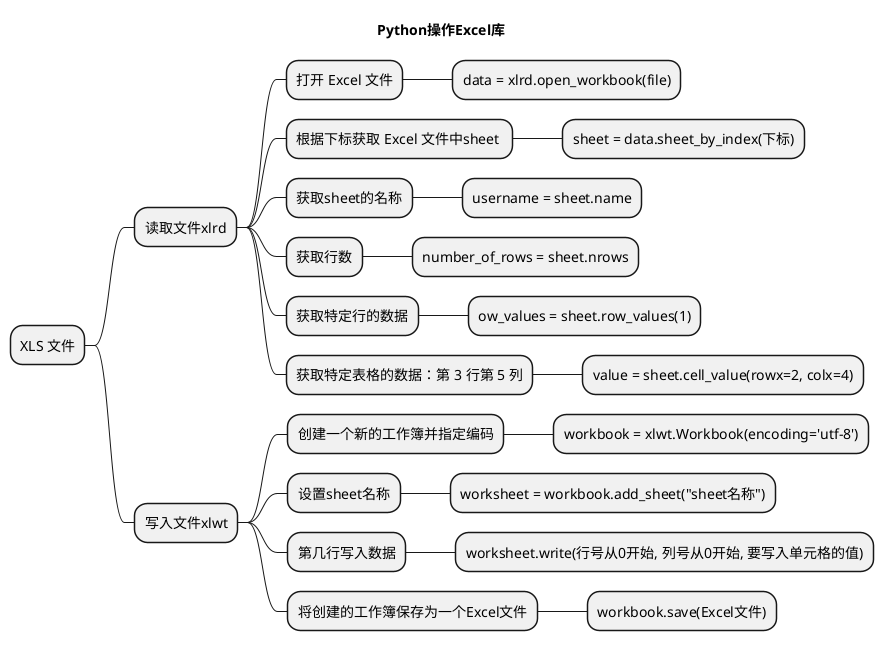
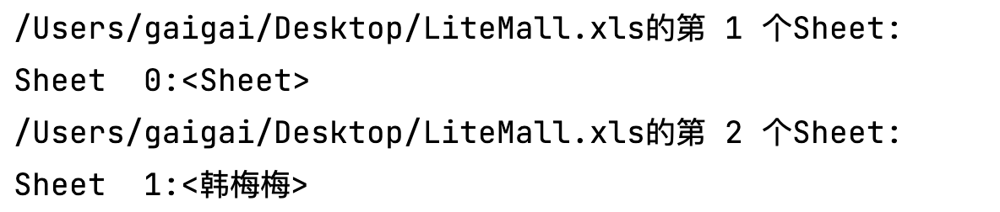
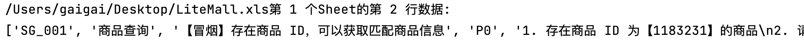
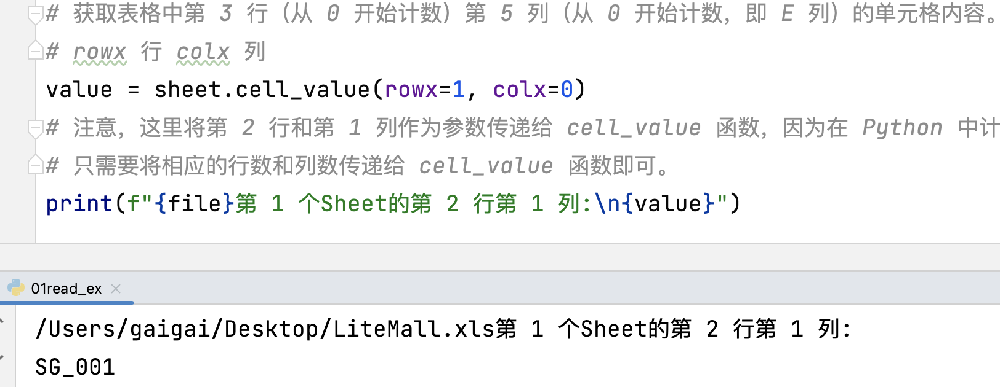
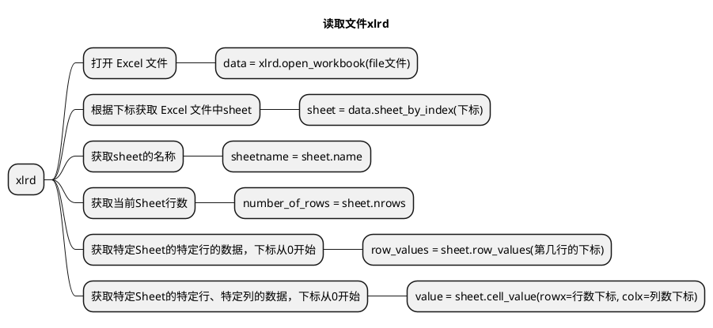
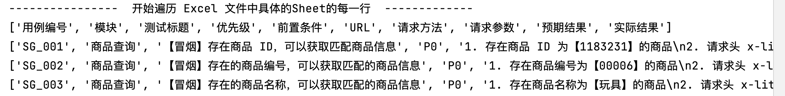
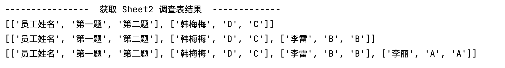
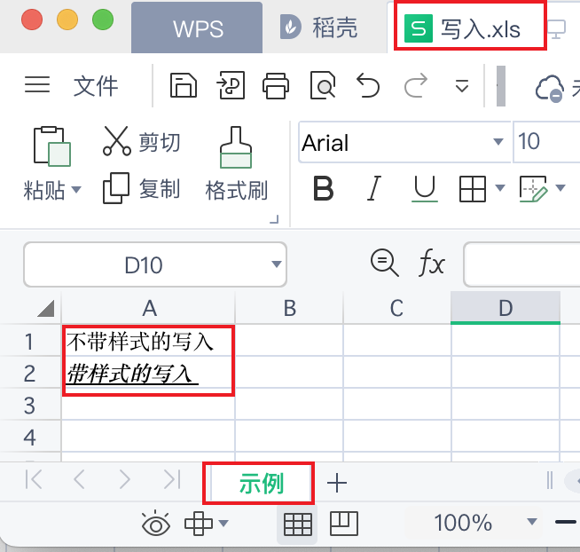
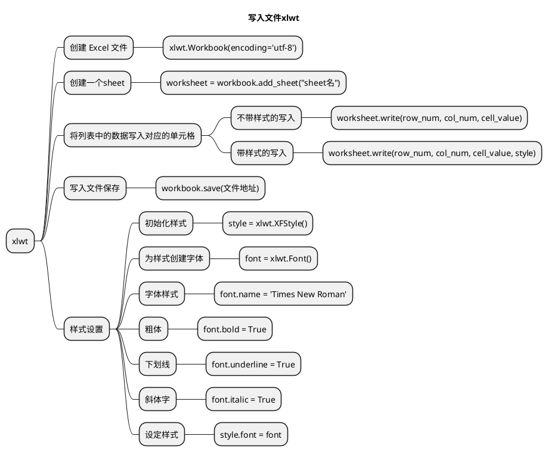
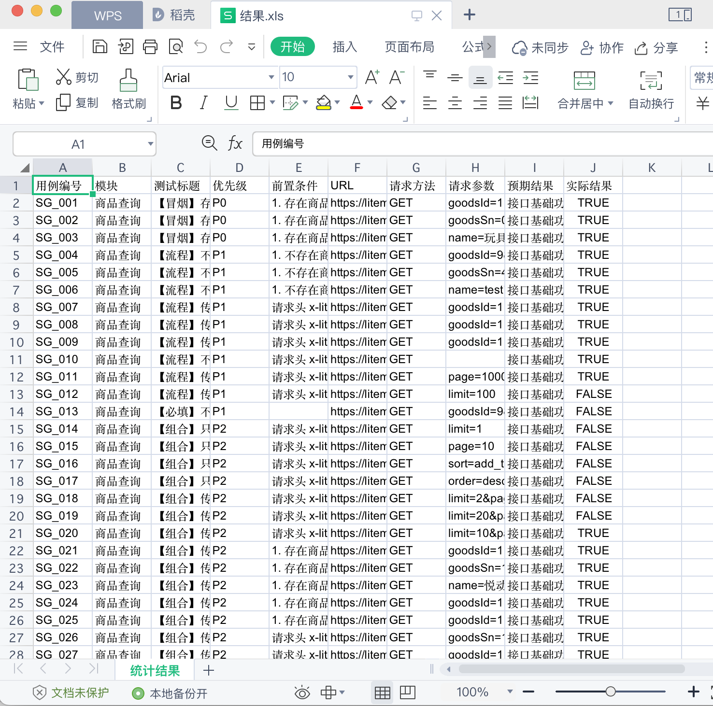

# 文章名

## 本章要点
1. 要点一
1. 要点
1. 要点
1. **要点**


## 学习目标

1. 掌握XLS文件操作。


## 思考

以.XLS 文件结尾的Excel如何合并与拆分？





## 环境准备

支持 Excel **读取**的扩展库叫做 **xlrd** 库，支持 Excel **写入**的扩展库叫做 **xlwt** 库。我们可以使用下面的命令行进行安装：

```bash
# 读取 Excel
pip3 install xlrd 
# 写入 Excel
pip3 install xlwt 
```


使用 Python 读取 Excel 文件的内容呢？你可以使用第三方库 xlrd，用于操作 Excel 文件。

## 获取Sheet对象




```python
# read_ex.py xls文件读的示例操作
import xlrd

file = 'LiteMall.xls'

# --------------- 获取Sheet对象 ---------------
# 打开 Excel 文件，file 是文件路径或类似文件对象的参数
data = xlrd.open_workbook(file)
# 获取 Excel 文件中第一个 sheet  Sheet  0:<Sheet1>
sheet = data.sheets()[0]
print(f"{file}的第 1 个Sheet:\n{sheet}")
sheet2 = data.sheet_by_index(1)# 获取工作表（将 0 替换为需要的工作表索引）
print(f"{file}的第 2 个Sheet:\n{sheet2}")
```

## 获取当前Sheet行数


```python
# read_ex.py xls文件读的示例操作

# 获取当前Sheet行数
number_of_rows = sheet.nrows
print(f"{file}第 1 个Sheet的行数: {number_of_rows}")
```

## 获取特定Sheet的特定行的数据



```python
# read_ex.py xls文件读的示例操作


# 获取特定Sheet的特定行的数据
# 下标从0开始
rowIndex = 1
row_values = sheet.row_values(rowIndex)
print(f"{file}第 1 个Sheet的第 2 行数据:\n{row_values}")
```


## 读取具体单元格



```python
# read_ex.py xls文件读的示例操作


# 获取表格中第 3 行（从 0 开始计数）第 5 列（从 0 开始计数，即 E 列）的单元格内容。
# rowx 行 colx 列
value = sheet.cell_value(rowx=1, colx=0)
# 注意，这里将第 2 行和第 1 列作为参数传递给 cell_value 函数，
# 因为在 Python 中计数从 0 开始。如果想读取 Excel 文件中的其他单元格，
# 只需要将相应的行数和列数传递给 cell_value 函数即可。
print(f"{file}第 1 个Sheet的第 2 行第 1 列:\n{value}")
```


## 代码总结



## 场景：读 Sheet1 的每一行




```python
# xls文件读每一行 read_row.py
import xlrd

file = 'LiteMall.xls'

# --------------- 获取Sheet对象 ---------------
# 打开 Excel 文件，file 是文件路径或类似文件对象的参数
data = xlrd.open_workbook(file)
# 获取 Excel 文件中第一个 sheet  Sheet  0:<Sheet1>
sheet = data.sheets()[0]
print("----------------  开始遍历 Excel 文件中具体的Sheet的所有行  -------------")
# 遍历 Excel 文件中的所有行  读取 Excel 文件中的每一行数据。
#
# range(sheet.nrows)是一个Python中的内置函数和内置类型structrange。
# 它返回一个range对象(范围对象)，该对象表示从0开始，到sheet对象的行数(sheet.nrows)结束的数字序列。
# 这个返回值通常被用在for循环的语句中，来遍历sheet对象中的所有行。例如：
for row_index in range(sheet.nrows):
    row = sheet.row_values(row_index)
    print(row)
```


通过上述代码，你可以读取 Excel 文件中的每一行数据。


>注意，这段代码只处理了第一个 sheet，根据实际情况调整代码以满足您的需求。


## 场景：读 Sheet2 的选项结果


如果 Excel 文件包含多个 sheet，可以使用 `workbook.sheet_by_index(sheet_index)`。

1. 把 **sheet_index** 替换成对应的 **sheet** 序号 (从 0 开始)。

2. 使用 `workbook.sheet_by_name(sheet_name)`，
把 **sheet_name** 替换成对应的 **sheet** 名字。


模版：`temp = f'{username},{answer1},{answer2}'`
    

```python
# 03read_result.py xls文件读Sheet2的选项结果
import xlrd

file = 'LiteMall.xls'

# --------------- 获取Sheet对象 ---------------
# 打开 Excel 文件，file 是文件路径或类似文件对象的参数
data = xlrd.open_workbook(file)


print("----------------  获取 Sheet2 调查表结果  -------------")

# sheet2的选项结果
# 1. 根据下标获取sheet
sheet2 = data.sheet_by_index(1)
# 2. 获取sheet的名称 作为员工姓名 打印
username = sheet2.name
# 3. 获取第一道题的选项
answer1 = sheet2.cell_value(rowx=4, colx=4)
# 4. 获取第二道题的选项
answer2 = sheet2.cell_value(rowx=10, colx=4)
# 5. 合并为一行存储
temp = f'{username},{answer1},{answer2}'
print(temp)
```


## 读取文件夹下的所有Excel的第一个Sheet

todo: 

```python
import xlrd
from pathlib import Path, PurePath


# pathlib 模块提供了一组面向对象的类，这些类可代表各种操作系统上的路径。
# 取得该目录下所有的xls格式文件
p = Path(src_path)#输出格式。PosixPath('.')

files = []
# https://docs.python.org/3/library/pathlib.html#pathlib.Path.iterdir
# 遍历目录 p 中的所有文件和子目录 # 遍历当前目录下所有文件和子目录
for x in p.iterdir():
    print(x)
    #https://docs.python.org/3/library/pathlib.html#pathlib.PurePath.match
    print(PurePath(x).match('*.xls'))

# todo: 双层for循环读取文件夹内每个xls文件的第一个Sheet的每一行
# 使用 os库的os.path.getsize()函数来检查Excel文件的大小
# 如果文件大小大于0，将继续读取并处理该文件。
# 如果文件大小等于0，将输出一个错误消息。抛出XLRDError: File size is 0 bytes错误。
# file_size = os.path.getsize(file)
```


### 代码实现


```python
# read_test.py 读取文件夹下的所有Excel

import os
import xlrd
from pathlib import Path, PurePath
import xlwt

# 指定要合并excel的路径
src_path = '/Users/gaigai/Desktop/测试用例xls'

# pathlib 模块提供了一组面向对象的类，这些类可代表各种操作系统上的路径，程序可通过这些类操作路径。
# 取得该目录下所有的xls格式文件
p = Path(src_path)#输出格式。PosixPath('.')
# 列表推导式
# files = [x for x in p.iterdir() if PurePath(x).match('*.xls')]
files = []
# https://docs.python.org/3/library/pathlib.html#pathlib.Path.iterdir
# 遍历目录 p 中的所有文件和子目录 # 遍历当前目录下所有文件和子目录
for x in p.iterdir():
    # print(x)
    #https://docs.python.org/3/library/pathlib.html#pathlib.PurePath.match
    # print(PurePath(x).match('*.xls'))
    # 判断文件路径 x 是否匹配 '*.xls' 模式，即文件扩展名是否为 `.xls`
    if PurePath(x).match('*.xls'):
        files.append(x)


# 存储所有行数据的字典列表
dict_rows = []


# todo: 双层for循环读取文件夹内的每一行
# 对每一个文件进行重复处理
for file in files:
    # 使用了os库的os.path.getsize()函数来检查Excel文件的大小，
    # 如果文件大小大于0，将继续读取并处理该文件。
    # 将输出一个错误消息。这将避免抛出XLRDError: File size is 0 bytes错误。
    file_size = os.path.getsize(file)
    # 如果文件大小大于0，则继续读取文件
    if file_size > 0:
        # 如果文件大小大于0，则继续读取文件
        # 打开 Excel 文件，file 是文件路径或类似文件对象的参数
        data = xlrd.open_workbook(file)
        # 获取工作表（将 0 替换为需要的工作表索引）
        sheet = data.sheet_by_index(0)
        # 标题头获取
        # 逐行和逐列复制输入工作表中的数据
        if file == files[0]:  # 如果是第一个文件, 包括表头
            column_names = sheet.row_values(0)
            dict_rows.append(column_names)
        # 遍历 Excel 文件中的所有行 读取 Excel 文件中的每一行数据
        # 只处理了第一个 sheet
        # 遍历 Excel 文件中的所有行（跳过第一行的标题行）
        for row_index in range(1, sheet.nrows):
            row = sheet.row_values(row_index)
            # 将当前行的字典添加到字典列表中
            dict_rows.append(row)
print(dict_rows)
```


## 列表推导式

[列表推导式](../../2002A_列表推导式.md)

```python
files = [x for x in p.iterdir() if PurePath(x).match('*.xls')]
```

从 pathlib 模块的 Path 对象 p 目录下过滤出符合指定模式（'*.xls'）的文件，其中 p 表示要查询的目录。

此代码是一个**列表推导式**（List Comprehension），用于

与传统的 for 循环和 if 条件语句相比，列表推导式**提供了一个简洁的语法来创建新的列表**。在这个示例中，我们使用了 pathlib 中的 Path.iterdir() 方法和 PurePath.match() 方法。

下面是对这段代码的分解：

- **p.iterdir()** ：遍历目录 p 中的所有文件和子目录。
- **PurePath(x).match('*.xls')**  判断文件路径 x 是否匹配 '*.xls' 模式，即文件扩展名是否为 `.xls`。
-  **[x for x in p.iterdir() if PurePath(x).match('*.xls')]** 对于所有满足指定模式的文件路径 x，将其添加到列表中并将结果赋给变量 files。等同与以下代码：

```python
files = []
p.iterdir() #遍历目录 p 中的所有文件和子目录
for x in p.iterdir():
# 判断文件路径 x 是否匹配 '*.xls' 模式，即文件扩展名是否为 `.xls`
    if PurePath(x).match('*.xls'):
        files.append(x)

```

最终，列表 files 将包含目录 p 中所有扩展名为 '.xls' 的文件路径。


**读取文件夹下所有的Excel文件的第一个sheet使用列表推导式优化。**


## 场景：调查表结果读取

读取测试用例下第2个Sheet的选项。



```python
# read_form.py 调查表单的结果读取
import os

import openpyxl
import xlrd
from pathlib import Path, PurePath

print("----------------  获取 Sheet2 调查表结果  -------------")

# 取得该目录下所有的xls格式文件
# todo: 列表推导式

# 结果数据存储
content = []
# 标题命名
table_header = ['员工姓名', '第一题', '第二题']
# 结果数据添加标题
content.append(table_header)

# todo: 双层for循环读取文件夹内的每一行
# 1. 根据下标获取sheet
# 2. 获取sheet的名称 作为员工姓名 打印
# 3. 获取第一道题的选项
# answer1 =
# 4. 获取第二道题的选项
# answer2 = 
# 5. 合并为一行存储
temp = f'{username},{answer1},{answer2}'
print(content)
```


### 代码实现

```python
# read_form.py 调查表单的结果读取
import os

import openpyxl
import xlrd
from pathlib import Path, PurePath

print("----------------  获取 Sheet2 调查表结果  -------------")

# 指定要合并excel的路径
src_path = '/Users/gaigai/Desktop/测试用例xls'


# 取得该目录下所有的xls格式文件
p = Path(src_path)
# 列表推导式
files = [x for x in p.iterdir() if PurePath(x).match('*.xls')]
# files = []
# for x in p.iterdir():
#     if PurePath(x).match('*.xls'):
#         files.append(x)

# 结果数据存储
content = []
# 标题命名
table_header = ['员工姓名', '第一题', '第二题']
# 结果数据添加标题
content.append(table_header)

# todo: 双层for循环读取文件夹内的每一行
# 对每一个文件进行重复处理
for file in files:

    # 使用了os库的os.path.getsize()函数来检查Excel文件的大小，
    # 如果文件大小大于0，将继续读取并处理该文件。
    # 将输出一个错误消息。这将避免抛出XLRDError: File size is 0 bytes错误。
    file_size = os.path.getsize(file)
    # 如果文件大小大于0，则继续读取文件
    if file_size > 0:
        # 如果文件大小大于0，则继续读取文件
        # 打开 Excel 文件，file 是文件路径或类似文件对象的参数
        data = xlrd.open_workbook(file)
        # sheet2的选项结果
        # username = "韩梅梅"
        # 1. 根据下标获取sheet
        sheet2 = data.sheet_by_index(1)
        # 2. 获取sheet的名称 作为员工姓名 打印
        username = sheet2.name
        # print(username)
        # sheet2 = data.sheet_by_name(username)
        # 取得每一项的结果
        # 3. 获取第一道题的选项
        answer1 = sheet2.cell_value(rowx=4, colx=4)
        # 4. 获取第二道题的选项
        answer2 = sheet2.cell_value(rowx=10, colx=4)
        # 5. 合并为一行存储
        temp = f'{username},{answer1},{answer2}'
        # 合并为一行先存储起来
        content.append(temp.split(','))
        print(content)
```

## 样式写入文件




```python
#!/usr/bin/env python

#coding=utf-8
import xlwt


# 创建 Excel 文件，utf-8在excel中输出中文，默认是ascii
workbook = xlwt.Workbook(encoding='utf-8')
# 创建一个sheet 名为示例
worksheet = workbook.add_sheet("示例")
# 初始化样式
style = xlwt.XFStyle()
# 为样式创建字体
font = xlwt.Font()
font.name = 'Times New Roman'
font.bold = True  # 粗体
font.underline = True # 下划线
font.italic = True  # 斜体字
style.font = font  # 设定样式
worksheet.write(0, 0, '不带样式的写入')  # 不带样式的写入
worksheet.write(1, 0, '带样式的写入', style)  # 带样式的写入
# 保存 Excel 文件
# 指定合并完成的路径
dst_file = '/Users/gaigai/Desktop/写入.xls'
workbook.save(dst_file)
```

## 写入文件代码总结


## 场景：调查表结果写入


```python

# 结果数据存储
content = [['员工姓名', '第一题', '第二题'], ['韩梅梅', 'D', 'C'], ['李雷', 'B', 'B'], ['李丽', 'A', 'A']]

print("----------------  写入文件 Excel 文件中的所有行  -------------")
# 创建 Excel 文件，utf-8在excel中输出中文，默认是ascii
workbook = xlwt.Workbook(encoding='utf-8')
# 创建一个sheet 名为调查结果
worksheet = workbook.add_sheet("调查结果")
# 初始化样式
style = xlwt.XFStyle()
# 为样式创建字体
font = xlwt.Font()
font.name = 'Times New Roman'
font.bold = True  # 粗体
font.underline = True # 下划线
font.italic = True  # 斜体字
style.font = font  # 设定样式
# font.colour_index = 3
# worksheet.write(0, 0, 'Unformatted value')  # 不带样式的写入
# worksheet.write(1, 0, 'Formatted value', style)  # 带样式的写入
# dict_rows 是一个嵌套列表，而不是字典列表
# 通过 enumerate() 函数同时遍历 dict_rows（一个字典的列表）的索引（行号）和元素（行数据）。
# start=1 参数表示下标从 1 开始计数，而不是默认从 0 开始。
for row_num, row_data in enumerate(content, start=0):
    for col_num, cell_value in enumerate(row_data):
        # 将列表中的数据写入对应的单元格
        worksheet.write(row_num, col_num, cell_value, style)

        # table.write(0, 1, 'any text', style)
        # if row_num == 0 & col_num == 1:
        #     worksheet.write(0, 1,  cell_value, style)

# 保存 Excel 文件
# 指定合并完成的路径
dst_file = '/Users/gaigai/Desktop/调查表汇总.xls'
workbook.save(dst_file)
```

## 场景：测试用例汇总写入




```python
# test.py 测试用例文件夹汇总
import os

import xlrd
from pathlib import Path, PurePath

import xlwt

import os
import xlrd
from pathlib import Path, PurePath

# 指定要合并excel的路径
src_path = '/Users/gaigai/Desktop/测试用例xls'

# pathlib 模块提供了一组面向对象的类，这些类可代表各种操作系统上的路径，程序可通过这些类操作路径。
# 取得该目录下所有的xls格式文件
p = Path(src_path)#输出格式。PosixPath('.')
# 列表推导式
# files = [x for x in p.iterdir() if PurePath(x).match('*.xls')]
files = []
# https://docs.python.org/3/library/pathlib.html#pathlib.Path.iterdir
# 遍历目录 p 中的所有文件和子目录 # 遍历当前目录下所有文件和子目录
for x in p.iterdir():
    # print(x)
    #https://docs.python.org/3/library/pathlib.html#pathlib.PurePath.match
    # print(PurePath(x).match('*.xls'))
    # 判断文件路径 x 是否匹配 '*.xls' 模式，即文件扩展名是否为 `.xls`
    if PurePath(x).match('*.xls'):
        files.append(x)


# 存储所有行数据的字典列表
dict_rows = []


# todo: 双层for循环读取文件夹内的每一行
# 对每一个文件进行重复处理
for file in files:
    # 使用了os库的os.path.getsize()函数来检查Excel文件的大小，
    # 如果文件大小大于0，将继续读取并处理该文件。
    # 将输出一个错误消息。这将避免抛出XLRDError: File size is 0 bytes错误。
    file_size = os.path.getsize(file)
    # 如果文件大小大于0，则继续读取文件
    if file_size > 0:
        # 如果文件大小大于0，则继续读取文件
        # 打开 Excel 文件，file 是文件路径或类似文件对象的参数
        data = xlrd.open_workbook(file)
        # 获取工作表（将 0 替换为需要的工作表索引）
        sheet = data.sheet_by_index(0)
        # 标题头获取
        # 逐行和逐列复制输入工作表中的数据
        if file == files[0]:  # 如果是第一个文件, 包括表头
            column_names = sheet.row_values(0)
            dict_rows.append(column_names)
        # 遍历 Excel 文件中的所有行 读取 Excel 文件中的每一行数据
        # 只处理了第一个 sheet
        # 遍历 Excel 文件中的所有行（跳过第一行的标题行）
        for row_index in range(1, sheet.nrows):
            row = sheet.row_values(row_index)
            # 将当前行的字典添加到字典列表中
            dict_rows.append(row)
print(dict_rows)

print("----------------  写入文件 Excel 文件中的所有行  -------------")

workbook = xlwt.Workbook(encoding='utf-8')
worksheet = workbook.add_sheet("统计结果")
print(f"column_names:\n{column_names}")
# ['用例编号', '模块', '测试标题', '优先级', '前置条件', 'URL', '请求方法', '请求参数', '预期结果', '实际结果']
# 0,用例编号
# for col_num, column_title in enumerate(column_names):
#     # 第一行写入列标题 0 第一行 col_num
#     worksheet.write(0, col_num, column_title)

# dict_rows 是一个嵌套列表，而不是字典列表
# 通过 enumerate() 函数同时遍历 dict_rows（一个字典的列表）的索引（行号）和元素（行数据）。
# start=1 参数表示下标从 1 开始计数，而不是默认从 0 开始。
# for row_num, row_data in enumerate(dict_rows, start=1):
for row_num, row_data in enumerate(dict_rows):
    for col_num, cell_value in enumerate(row_data):
        if cell_value == 1:
            cell_value = True
        elif cell_value == 0:
            cell_value = False
        # 将列表中的数据写入对应的单元格
        worksheet.write(row_num, col_num, cell_value)

# 保存 Excel 文件
# 指定合并完成的路径
dst_file = '/Users/gaigai/Desktop/结果.xls'
workbook.save(dst_file)
```


# 文件拆分


## 总结
- 总结一
- 总结二
- 总结三
https://github.com/Wechat-ggGitHub/Awesome-GitHub-Repo

[项目演示地址](https://github.com/testeru-pro/junit5-demo/tree/main/junit5-basic)


# 学习反馈

1. SpringBoot项目的父工程为( )。

   - [x] A. `spring-boot-starter-parent`
   - [ ] B.`spring-boot-starter-web`
   - [ ] C. `spring-boot-starter-father`
   - [ ] D. `spring-boot-starter-super`


<style>
  strong {
    color: #ea6010;
    font-weight: bolder;
  }
  .reveal blockquote {
    font-style: unset;
  }
</style>


