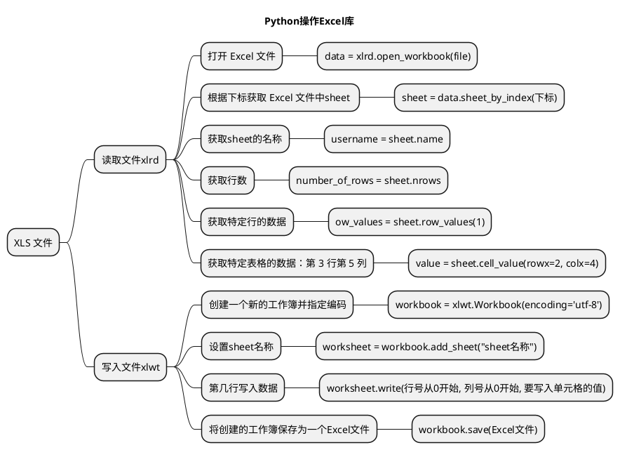
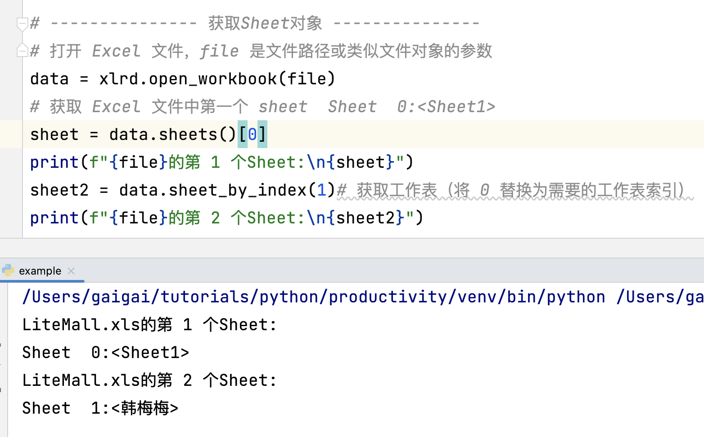
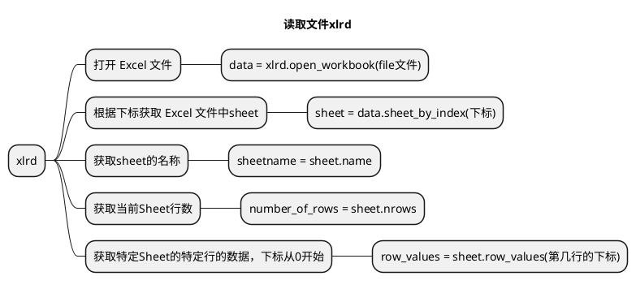
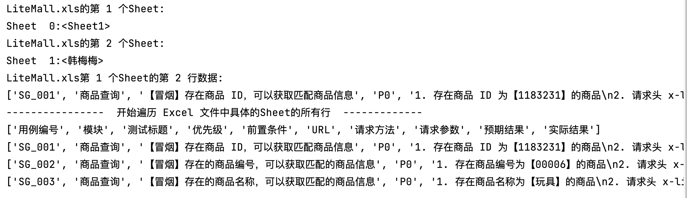
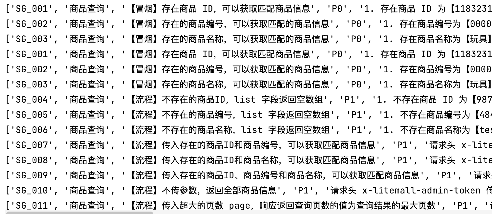
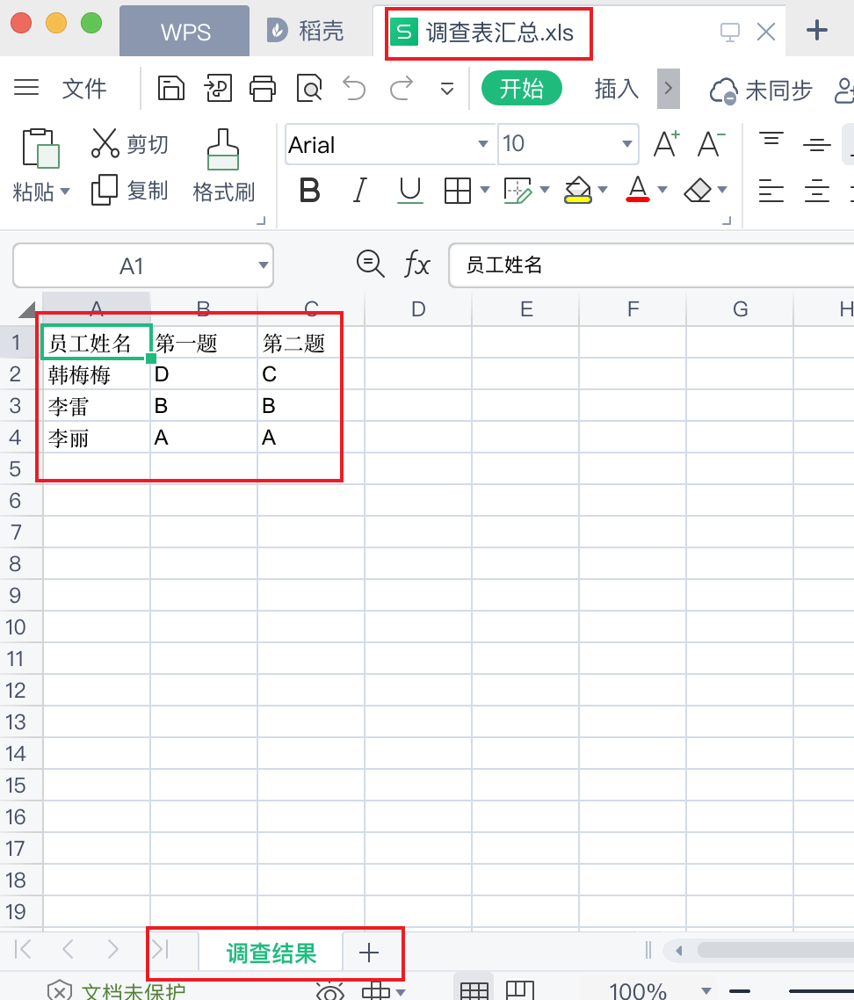

# 文章名

## 本章要点
1. 要点一
1. 要点
1. 要点
1. **要点**


## 学习目标

1. 掌握XLS文件操作。


## 思考

以.XLS 文件结尾的Excel如何合并与拆分？





## 环境准备

支持 Excel **读取**的扩展库叫做 **xlrd** 库，支持 Excel **写入**的扩展库叫做 **xlwt** 库。我们可以使用下面的命令行进行安装：

```bash
# 读取 Excel
pip3 install xlrd 
# 写入 Excel
pip3 install xlwt 
```


使用 Python 读取 Excel 文件的内容呢？你可以使用第三方库 xlrd，用于操作 Excel 文件。

## 获取Sheet对象




```python
# xls文件读的示例操作
import xlrd

file = 'LiteMall.xls'

# --------------- 获取Sheet对象 ---------------
# 打开 Excel 文件，file 是文件路径或类似文件对象的参数
data = xlrd.open_workbook(file)
# 获取 Excel 文件中第一个 sheet  Sheet  0:<Sheet1>
sheet = data.sheets()[0]
print(f"{file}的第 1 个Sheet:\n{sheet}")
sheet2 = data.sheet_by_index(1)# 获取工作表（将 0 替换为需要的工作表索引）
print(f"{file}的第 2 个Sheet:\n{sheet2}")
```

## 获取当前Sheet行数

```python
# 获取当前Sheet行数
number_of_rows = sheet.nrows
print(f"{file}第 1 个Sheet的行数: {number_of_rows}")
```

## 获取特定Sheet的特定行的数据


```python
# 获取特定Sheet的特定行的数据
# 下标从0开始
rowIndex = 1
row_values = sheet.row_values(rowIndex)
print(f"{file}第 1 个Sheet的第 2 行数据:\n{row_values}")
```

## 读取第一个 sheet 的每一行








```python
# xls文件读的示例操作
import xlrd

file = 'LiteMall.xls'

# --------------- 获取Sheet对象 ---------------
# 打开 Excel 文件，file 是文件路径或类似文件对象的参数
data = xlrd.open_workbook(file)
# 获取 Excel 文件中第一个 sheet  Sheet  0:<Sheet1>
sheet = data.sheets()[0]
print(f"{file}的第 1 个Sheet:\n{sheet}")
sheet2 = data.sheet_by_index(1)# 获取工作表（将 0 替换为需要的工作表索引）
print(f"{file}的第 2 个Sheet:\n{sheet2}")

# 获取特定Sheet的特定行的数据
# 下标从0开始
rowIndex = 1
row_values = sheet.row_values(rowIndex)
print(f"{file}第 1 个Sheet的第 2 行数据:\n{row_values}")

# 获取当前Sheet行数
number_of_rows = sheet.nrows
print(f"{file}第 1 个Sheet的行数: {number_of_rows}")

print("----------------  开始遍历 Excel 文件中具体的Sheet的所有行  -------------")
# 遍历 Excel 文件中的所有行  读取 Excel 文件中的每一行数据。
# todo：实现遍历
```

**代码实现：**


```python
# xls文件读的示例操作
import xlrd

file = 'LiteMall.xls'

# --------------- 获取Sheet对象 ---------------
# 打开 Excel 文件，file 是文件路径或类似文件对象的参数
data = xlrd.open_workbook(file)
# 获取 Excel 文件中第一个 sheet  Sheet  0:<Sheet1>
sheet = data.sheets()[0]
print(f"{file}的第 1 个Sheet:\n{sheet}")
sheet2 = data.sheet_by_index(1)# 获取工作表（将 0 替换为需要的工作表索引）
print(f"{file}的第 2 个Sheet:\n{sheet2}")

# 获取特定Sheet的特定行的数据
# 下标从0开始
rowIndex = 1
row_values = sheet.row_values(rowIndex)
print(f"{file}第 1 个Sheet的第 2 行数据:\n{row_values}")

# 获取当前Sheet行数
number_of_rows = sheet.nrows
print(f"{file}第 1 个Sheet的行数: {number_of_rows}")

print("----------------  开始遍历 Excel 文件中具体的Sheet的所有行  -------------")
# 遍历 Excel 文件中的所有行  读取 Excel 文件中的每一行数据。
# todo：实现遍历
# range(sheet.nrows)是一个Python中的内置函数和内置类型structrange。
# 它返回一个range对象(范围对象)，该对象表示从0开始，到sheet对象的行数(sheet.nrows)结束的数字序列。
# 这个返回值通常被用在for循环的语句中，来遍历sheet对象中的所有行。例如：
for row_index in range(sheet.nrows):
    row = sheet.row_values(row_index)
    print(row)
```


通过上述代码，你可以读取 Excel 文件中的每一行数据。


>注意，这段代码只处理了第一个 sheet，根据实际情况调整代码以满足您的需求。

## 读取具体单元格


## 读取第二个 sheet 的具体单元格

如果 Excel 文件包含多个 sheet，可以使用 `workbook.sheet_by_index(sheet_index)`。

1. 把 **sheet_index** 替换成对应的 **sheet** 序号 (从 0 开始)。

2. 使用 `workbook.sheet_by_name(sheet_name)`，
把 **sheet_name** 替换成对应的 **sheet** 名字。


```python
table_header = ['员工姓名', '第一题', '第二题']
content = []
content.append(table_header)

# sheet2的选项结果
# todo：1. 根据下标获取sheet
# todo：2. 获取sheet的名称 作为员工姓名 打印  username = sheet2.name
# todo：3. 获取第一道题的选项 answer1
# todo：4. 获取第二道题的选项 answer2
# todo：5. 合并为一行存储
temp = f'{username},{answer1},{answer2}'
# todo：6. 合并为 [] 存储至content列表中
print(content)
```

#### 代码实现

```python
table_header = ['员工姓名', '第一题', '第二题']
content = []
content.append(table_header)

# sheet2的选项结果
# username = "韩梅梅"
# 1. 根据下标获取sheet
sheet2 = data.sheet_by_index(1)
# 2. 获取sheet的名称 作为员工姓名 打印
username = sheet2.name
print(username)
# sheet2 = data.sheet_by_name(username)
# 取得每一项的结果
# 3. 获取第一道题的选项
answer1 = sheet2.cell_value(rowx=4, colx=4)
# 4. 获取第二道题的选项
answer2 = sheet2.cell_value(rowx=10, colx=4)
# 5. 合并为一行存储
temp = f'{username},{answer1},{answer2}'
# 合并为一行先存储起来
content.append(temp.split(','))
print(content)
```


## 读取文件夹下的所有Excel




```python
import xlrd
from pathlib import Path, PurePath

# 指定要合并excel的路径
src_path = '/Users/gaigai/Desktop/测试用例'

# 取得该目录下所有的xls格式文件
# /Users/gaigai/Desktop/测试用例
p = Path(src_path)
# 列表推导式
files = [x for x in p.iterdir() if PurePath(x).match('*.xls')]
# files = []
# p.iterdir() 遍历目录 p 中的所有文件和子目录
# for x in p.iterdir():
# 判断文件路径 x 是否匹配 '*.xls' 模式，即文件扩展名是否为 `.xls`
#     if PurePath(x).match('*.xls'):
#         files.append(x)

# todo: 双层for循环读取文件夹内每个xls文件的第一个Sheet的每一行
# 使用 os库的os.path.getsize()函数来检查Excel文件的大小
# 如果文件大小大于0，将继续读取并处理该文件。
# 如果文件大小等于0，将输出一个错误消息。抛出XLRDError: File size is 0 bytes错误。
# file_size = os.path.getsize(file)
```


### 代码讲解

```python

files = [x for x in p.iterdir() if PurePath(x).match('*.xls')]
```

从 pathlib 模块的 Path 对象 p 目录下过滤出符合指定模式（'*.xls'）的文件，其中 p 表示要查询的目录。

此代码是一个**列表推导式**（List Comprehension），用于

与传统的 for 循环和 if 条件语句相比，列表推导式**提供了一个简洁的语法来创建新的列表**。在这个示例中，我们使用了 pathlib 中的 Path.iterdir() 方法和 PurePath.match() 方法。

下面是对这段代码的分解：

- **p.iterdir()** ：遍历目录 p 中的所有文件和子目录。
- **PurePath(x).match('*.xls')**  判断文件路径 x 是否匹配 '*.xls' 模式，即文件扩展名是否为 `.xls`。
-  **[x for x in p.iterdir() if PurePath(x).match('*.xls')]** 对于所有满足指定模式的文件路径 x，将其添加到列表中并将结果赋给变量 files。等同与以下代码：

```python
files = []
p.iterdir() #遍历目录 p 中的所有文件和子目录
for x in p.iterdir():
# 判断文件路径 x 是否匹配 '*.xls' 模式，即文件扩展名是否为 `.xls`
    if PurePath(x).match('*.xls'):
        files.append(x)

```

最终，列表 files 将包含目录 p 中所有扩展名为 '.xls' 的文件路径。


### 代码实现

[列表推导式](../../2002A_列表推导式.md)

```python
import os
import xlrd
from pathlib import Path, PurePath
import xlwt

# 指定要合并excel的路径
src_path = '/Users/gaigai/Desktop/测试用例'

# 取得该目录下所有的xls格式文件
# /Users/gaigai/Desktop/测试用例
p = Path(src_path)
# 列表推导式
files = [x for x in p.iterdir() if PurePath(x).match('*.xls')]
# files = []
# p.iterdir() 遍历目录 p 中的所有文件和子目录
# for x in p.iterdir():
# 判断文件路径 x 是否匹配 '*.xls' 模式，即文件扩展名是否为 `.xls`
#     if PurePath(x).match('*.xls'):
#         files.append(x)


# 存储所有行数据的字典列表
dict_rows = []


# todo: 双层for循环读取文件夹内的每一行
# 对每一个文件进行重复处理
for file in files:
    # 使用了os库的os.path.getsize()函数来检查Excel文件的大小，
    # 如果文件大小大于0，将继续读取并处理该文件。
    # 将输出一个错误消息。这将避免抛出XLRDError: File size is 0 bytes错误。
    file_size = os.path.getsize(file)
    # 如果文件大小大于0，则继续读取文件
    if file_size > 0:
        # 如果文件大小大于0，则继续读取文件
        # 打开 Excel 文件，file 是文件路径或类似文件对象的参数
        data = xlrd.open_workbook(file)
        # 获取工作表（将 0 替换为需要的工作表索引）
        sheet = data.sheet_by_index(0)
        column_names = sheet.row_values(0)
        # 遍历 Excel 文件中的所有行 读取 Excel 文件中的每一行数据
        # 只处理了第一个 sheet
        # 遍历 Excel 文件中的所有行（跳过第一行的标题行）
        for row_index in range(1, sheet.nrows):
            row = sheet.row_values(row_index)
            # 将当前行的字典添加到字典列表中
            dict_rows.append(row)
print(dict_rows)
```


## 调查表练习

测试用例下第2个Sheet的选项获取并写入新文件中。




### 代码实现


```python
# 调查表单的读写
import os

import xlrd
from pathlib import Path, PurePath

import xlwt

print("----------------  获取 Sheet2 调查表结果  -------------")

# file = '/Users/gaigai/Desktop/测试用例/LiteMall后台管理系统商品查询接口用例.xls'

# 指定要合并excel的路径
src_path = '/Users/gaigai/Desktop/测试用例'


# 取得该目录下所有的xls格式文件
# /Users/gaigai/Desktop/测试用例
p = Path(src_path)
# 列表推导式
files = [x for x in p.iterdir() if PurePath(x).match('*.xls')]
# files = []
# p.iterdir() #遍历目录 p 中的所有文件和子目录
# for x in p.iterdir():
# # 判断文件路径 x 是否匹配 '*.xls' 模式，即文件扩展名是否为 `.xls`
#     if PurePath(x).match('*.xls'):
#         files.append(x)

# 结果数据存储
content = []
# 标题命名
table_header = ['员工姓名', '第一题', '第二题']
# 结果数据添加标题
# content.append(table_header)

# todo: 双层for循环读取文件夹内的每一行
# 对每一个文件进行重复处理
for file in files:

    # 使用了os库的os.path.getsize()函数来检查Excel文件的大小，
    # 如果文件大小大于0，将继续读取并处理该文件。
    # 将输出一个错误消息。这将避免抛出XLRDError: File size is 0 bytes错误。
    file_size = os.path.getsize(file)
    # 如果文件大小大于0，则继续读取文件
    if file_size > 0:
        # 如果文件大小大于0，则继续读取文件
        # 打开 Excel 文件，file 是文件路径或类似文件对象的参数
        data = xlrd.open_workbook(file)
        # sheet2的选项结果
        # username = "韩梅梅"
        # 1. 根据下标获取sheet
        sheet2 = data.sheet_by_index(1)
        # 2. 获取sheet的名称 作为员工姓名 打印
        username = sheet2.name
        print(username)
        # sheet2 = data.sheet_by_name(username)
        # 取得每一项的结果
        # 3. 获取第一道题的选项
        answer1 = sheet2.cell_value(rowx=4, colx=4)
        # 4. 获取第二道题的选项
        answer2 = sheet2.cell_value(rowx=10, colx=4)
        # 5. 合并为一行存储
        temp = f'{username},{answer1},{answer2}'
        # 合并为一行先存储起来
        content.append(temp.split(','))
        print(content)

print("----------------  写入文件 Excel 文件中的所有行  -------------")

workbook = xlwt.Workbook(encoding='utf-8')
worksheet = workbook.add_sheet("调查结果")

for col_num, column_title in enumerate(table_header):
    # 第一行写入列标题 0 第一行 col_num
    worksheet.write(0, col_num, column_title)

# dict_rows 是一个嵌套列表，而不是字典列表
# 通过 enumerate() 函数同时遍历 dict_rows（一个字典的列表）的索引（行号）和元素（行数据）。
# start=1 参数表示下标从 1 开始计数，而不是默认从 0 开始。
for row_num, row_data in enumerate(content, start=1):
    for col_num, cell_value in enumerate(row_data):
        # 将列表中的数据写入对应的单元格
        worksheet.write(row_num, col_num, cell_value)

# 保存 Excel 文件
# 指定合并完成的路径
dst_file = '/Users/gaigai/Desktop/调查表汇总.xls'
# new_file_path = 'path/to/new_file.xls'
# workbook.save(new_file_path)
workbook.save(dst_file)
```


## XLS转为XLSX

```python
# excel_file 文件转为 xlsx_file文件
# 使用 pandas 库、使用 `xlrd` 引擎读取名为 excel_file 的 Excel 文件
df = pd.read_excel(excel_file, engine="xlrd")
# 将 DataFrame 保存到新的 Excel 文件中，不包括索引列
df.to_excel(xlsx_file, index=False)
```

使用 pandas 库读取名为 excel_file 的 Excel 文件，并将数据加载到名为 df 的 pandas DataFrame 中，在这个过程中使用 `xlrd` 引擎。

excel_file 是一个字符串或者路径对象，表示您要读取的 Excel 文件名称和路径。

在大多数情况下，您可以直接使用文件名（如果文件位于当前目录），或者为文件名添加适当的路径信息（如果文件位于其他目录）。


### 环境准备
```bash
pip install pandas openpyxl
```
### 单个文件第一个sheet转换

将单个LiteMall.xls文件转换为LiteMall.xlsx。


```python
from pathlib import Path

import pandas as pd

file_path = '/Users/gaigai/Desktop'

folder = Path(file_path)
# xls文件名
xls_name = 'LiteMall.xls'
# 文件路径拼接
excel_file = folder / xls_name

df = pd.read_excel(excel_file, engine="xlrd")
new_name = xls_name.split(".")[0]
xlsx_name = new_name + '.xlsx'
# 使用 pathlib 进行路径拼接
xlsx_file = folder / xlsx_name
print(f"新生成的文件路径为：{xlsx_file}")
# 将 DataFrame 保存到新的 Excel 文件中，不包括索引列
df.to_excel(xlsx_file, index=False)
```


### 文件夹内第一个sheet转换

```python
import os
from pathlib import Path,PurePath
import pandas as pd

# xls 转换为 xlsx
src_path = '/Users/gaigai/Desktop/测试用例xls'
xlsx_path = '/Users/gaigai/Desktop/测试用例xlsx'

p=Path(src_path)
files=[x for x in p.iterdir() if PurePath(x).match('*.xls')]

# todo: 双层for循环读取文件夹内的每一行
# 对每一个文件进行重复处理
for file in files:
    # 使用了os库的os.path.getsize()函数来检查Excel文件的大小，
    # 如果文件大小大于0，将继续读取并处理该文件。
    # 将输出一个错误消息。这将避免抛出XLRDError: File size is 0 bytes错误。
    file_size = os.path.getsize(file)
    # 如果文件大小大于0，则继续读取文件
    if file_size > 0:
        df = pd.read_excel(file, engine="xlrd")
        name = file.name.split(".")[0]
        # 另存为新的 Excel 文件（.xlsx）  os.path.join(folder, file)
        # 在Python中，为了确保跨平台兼容性，建议使用os.path.join() 进行路径拼接。
        # 它会根据您的操作系统选择正确的路径分隔符（在Windows上是反斜杠 \，在其他大多数操作系统上是正斜杠 /）。
        # Windows: example_folder\example_file.txt
        # Linux 或 macOS: example_folder/example_file.txt
#        new_excel = os.path.join(xlsx_path, name + '.xlsx')
        #  Python 3.4 或更高版本，您还可以使用 pathlib 库进行路径操作，
        #  这是一个对路径操作进行了更高级封装的库，旨在替代 os.path。
        folder = Path(xlsx_path)
        file = name + '.xlsx'
        # 使用 pathlib 进行路径拼接
        new_excel = folder / file
        print(new_excel)
        # 将 DataFrame 保存到新的 Excel 文件中，不包括索引列
        df.to_excel(new_excel, index=False)
```


### 文件内所有的sheet转换

从名为example.xls的Excel文件中读取所有工作表，并将数据写入名为converted_example.xlsx的Excel文件。


## 生成图表

xlrd 和 xlwt 库不支持在 Excel 文件中插入图像；因此，您需要使用 openpyxl 库来完成此任务。openpyxl 库允许您读取和写入 Excel 文件，并支持多种 Excel 功能，包括插入图像。openpyxl读写 Excel 文件（XLSX）。


## 总结
- 总结一
- 总结二
- 总结三
https://github.com/Wechat-ggGitHub/Awesome-GitHub-Repo

[项目演示地址](https://github.com/testeru-pro/junit5-demo/tree/main/junit5-basic)


# 学习反馈

1. SpringBoot项目的父工程为( )。

   - [x] A. `spring-boot-starter-parent`
   - [ ] B.`spring-boot-starter-web`
   - [ ] C. `spring-boot-starter-father`
   - [ ] D. `spring-boot-starter-super`


<style>
  strong {
    color: #ea6010;
    font-weight: bolder;
  }
  .reveal blockquote {
    font-style: unset;
  }
</style>


