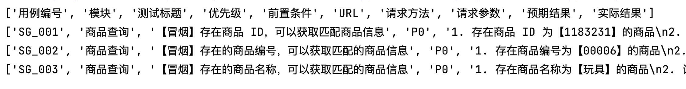

# 文章名

## 本章要点
1. 要点一
1. 要点
1. 要点
1. **要点**


## 学习目标

1. 。


## 思考

以.XLSX 文件结尾的Excel如何合并与拆分？

## .XLSX 文件操作

xlrd 和 xlwt 库不支持在 Excel 文件中插入图像；因此，您需要使用 openpyxl 库来完成此任务。openpyxl 库允许您读取和写入 Excel 文件，并支持多种 Excel 功能，包括插入图像。openpyxl读写 Excel 文件（XLSX）。


### 环境准备

```bash
pip install openpyxl
```

## 读取文件每一行




### 代码实现
```python

import openpyxl

file = '/Users/gaigai/Desktop/LiteMall.xlsx'


# 使用 openpyxl 库的 load_workbook() 函数来加载 Excel 工作簿
input_workbook = openpyxl.load_workbook(file)
# 获取活动工作表 工作簿（workbook）中访问活动工作表（active sheet）
input_sheet = input_workbook.active

print("----------------  开始遍历 Excel 文件中的所有行  -------------")

# iter_rows()方法允许您遍历工作表中的所有行。
# 遍历了input_sheet中的所有行，并使用row_values列表存储行中的所有单元格值。
for row in input_sheet.iter_rows():
    # 列表推导式
    row_values = [cell.value for cell in row]
    # 初始化一个空列表来存储行中的所有单元格值
    # row_values = []
    # 遍历行中的所有单元格
    # for cell in row:
    # 将单元格值添加到 row_values 列表中
    #     row_values.append(cell.value)
    print(row_values)
```

## 生成图表

### 数据统计

统计文件中True，False的个数。可以知道当前测试用例通过多少，失败多少。


```python
import pandas as pd

new_excel = '/Users/gaigai/Desktop/LiteMall.xlsx'

# 使用 pandas 库、使用 `openpyxl` 引擎读取名为 new_excel 的 Excel 文件
df = pd.read_excel(new_excel, engine='openpyxl')

# 更改为您要检查的列名，例如"A", "B"等
column_name = "A"  
# 使用value_counts()方法获取True和False计数
true_false_counts = df[column_name].value_counts()
# 统计个数
true_count = true_false_counts.get(True, 0)
false_count = true_false_counts.get(False, 0)

print("True count:", true_count)
print("False count:", false_count)
```

练习：

统计所有的测试用例的True、False个数。

### 生成图表

```python
from io import BytesIO

import openpyxl
from matplotlib import pyplot as plt
from openpyxl.drawing.image import Image


new_excel = '/Users/gaigai/Desktop/LiteMall.xlsx'

labels = ['A', 'B', 'C', 'D']
sizes = [25, 30, 20, 25]

plt.pie(sizes, labels=labels, autopct='%1.1f%%')
plt.title("test",)
plt.axis('equal')  # 设置为正圆形
# plt.show()
# 将饼图保存到内存中的图片文件中
buf = BytesIO()
plt.savefig(buf, format='png')
buf.seek(0)  # 重置文件指针


# 使用 openpyxl 处理新文件并插入图片
workbook1 = openpyxl.load_workbook(new_excel)
ws = workbook1.active


image = Image(buf)
ws.add_image(image, 'M1')  # 将图片插入到 Excel 的 'M1' 单元格

 # 保存含有图像的 Excel 文件
workbook1.save(new_excel)
```


### 结合

统计所有的测试用例的True，False的个数，并绘制成图表。

```python
from io import BytesIO
from openpyxl.drawing.image import Image

import openpyxl
import pandas as pd
from matplotlib import pyplot as plt

new_excel = '/Users/gaigai/Desktop/LiteMall.xlsx'

# 使用 pandas 库、使用 `xlrd` 引擎读取名为 excel_file 的 Excel 文件
# 当使用pd.read_excel()函数时，我们将sheet_name参数设置为None。
# 这表示pandas会从输入文件中读取所有工作表，并将其存储在一个字典中，
# 其中键值为工作表名，值为包含工作表数据的数据框架（DataFrame）。
df = pd.read_excel(new_excel, engine='openpyxl')

# 将目标列数据转换为布尔类型，然后筛选出其中的True和False
column_name = "实际结果"  # 更改为您要检查的列名，例如"A", "B"等
# df_bool = .astype(bool)
# 使用value_counts()方法获取True和False计数
true_false_counts = df[column_name].value_counts()
# 显示结果
# 使用value_counts()方法获取True和False计数
true_false_counts = df[column_name].value_counts()
true_count = true_false_counts.get(True, 0)
false_count = true_false_counts.get(False, 0)
print("True count:", true_count)
print("False count:", false_count)

labels = ['True', 'False']
sizes = [true_count, false_count]

print(sizes)
plt.pie(sizes, labels=labels, autopct='%1.1f%%')
plt.title("test",)
plt.axis('equal')  # 设置为正圆形
# plt.show()
# 将饼图保存到内存中的图片文件中
buf = BytesIO()
plt.savefig(buf, format='png')
buf.seek(0)  # 重置文件指针


# 使用 openpyxl 处理新文件并插入图片
workbook1 = openpyxl.load_workbook(new_excel)
ws = workbook1.active


image = Image(buf)
ws.add_image(image, 'M1')  # 将图片插入到 Excel 的 'D1' 单元格

 # 保存含有图像的 Excel 文件
workbook1.save(new_excel)
```


## 总结
- 总结一
- 总结二
- 总结三
https://github.com/Wechat-ggGitHub/Awesome-GitHub-Repo

[项目演示地址](https://github.com/testeru-pro/junit5-demo/tree/main/junit5-basic)


# 学习反馈

1. SpringBoot项目的父工程为( )。

   - [x] A. `spring-boot-starter-parent`
   - [ ] B.`spring-boot-starter-web`
   - [ ] C. `spring-boot-starter-father`
   - [ ] D. `spring-boot-starter-super`


<style>
  strong {
    color: #ea6010;
    font-weight: bolder;
  }
  .reveal blockquote {
    font-style: unset;
  }
</style>


