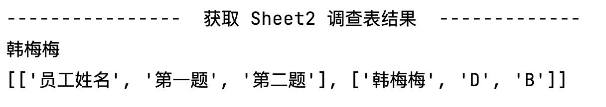

# 自动化办公

霍格沃兹测试开发学社

ceshiren.com


---

## 目录

- Excel文件操作

- 定时执行任务


---


## 思考

同时操作多个Execel文件，如何操作？手工操作，重复浪费时间。。


---

## 场景


---


## 批量合并


---

## 第三方库对比


---


## 获取每一行


```python
import xlrd


# 打开 Excel 文件
data = xlrd.open_workbook(file)
# 根据下标获取 Excel 文件中第一个 sheet 
sheet = data.sheet_by_index(0)

# 获取行数
number_of_rows = sheet.nrows
print(f"当前Sheet的行数: {number_of_rows}")

# 获取特定行的数据
rowIndex = 1
row_values = sheet.row_values(rowIndex)
print(f"第 2 行数据:\n{row_values}")

print("----------------  开始遍历 Excel 文件中的所有行  -------------")

# todo：实现遍历

# 注意，这里将第 3 行和第 5 列作为参数传递给 cell_value 函数
# rowx 行 colx 列
value = sheet.cell_value(rowx=2, colx=4)
print(f"第 3 行第 5 列:\n{value}")
```


---


## 获取某一sheet的单元格




```python
table_header = ['员工姓名', '第一题', '第二题']
content = []
content.append(table_header)

# sheet2的选项结果
# todo：1. 根据下标获取sheet
# todo：2. 获取sheet的名称 作为员工姓名 打印  username = sheet2.name
# todo：3. 获取第一道题的选项 answer1
# todo：4. 获取第二道题的选项 answer2
# todo：5. 合并为一行存储
temp = f'{username},{answer1},{answer2}'
# todo：6. 合并为 [] 存储至content列表中
print(content)
```


---


## 读取测试用例文件夹


```python
import xlrd
from pathlib import Path, PurePath

# 指定要合并excel的路径
src_path = '/Users/gaigai/Desktop/测试用例'

# 取得该目录下所有的xls格式文件
# /Users/gaigai/Desktop/测试用例
p = Path(src_path)
# 列表推导式
files = [x for x in p.iterdir() if PurePath(x).match('*.xls')]
# files = []
# p.iterdir() 遍历目录 p 中的所有文件和子目录
# for x in p.iterdir():
# 判断文件路径 x 是否匹配 '*.xls' 模式，即文件扩展名是否为 `.xls`
#     if PurePath(x).match('*.xls'):
#         files.append(x)

# todo: 双层for循环读取文件夹内每个xls文件的第一个Sheet的每一行
# 使用 os库的os.path.getsize()函数来检查Excel文件的大小
# 如果文件大小大于0，将继续读取并处理该文件。
# 如果文件大小等于0，将输出一个错误消息。抛出XLRDError: File size is 0 bytes错误。
# file_size = os.path.getsize(file)
```

---


## 列表推导式

- 用一行代码完成遍历已有列表及对元素的过滤和计算等操作。

---


## 列表推导式语法


```python
new_list = [expression for item in iterable if condition]
```

- **expression**：列表中每个元素进行操作的单个表达式，如 item、 item * 2。

- **for item in iterable**：遍历iterable列表、元组、集合等可迭代对象）的for循环，其中item是遍历过程中的每个元素。

- **if condition**：是可选的，用于对iterable中的元素进行过滤。


---

## 课堂练习

```python
# 案例1：创建一个列表，其元素为原列表元素的平方
original_list = [1, 2, 3, 4, 5]
# todo: 列表推导式编写
# squared_list = 
print(squared_list)  # 输出：[1, 4, 9, 16, 25]

# 案例2：创建列表，只包含原列表中的偶数
original_list = [1, 2, 3, 4, 5, 6, 7, 8, 9]
# todo: 列表推导式编写
# even_list = 
print(even_list)  # 输出：[2, 4, 6,8]

# 案例3：创建一个列表，将原列表中的偶数乘以3
original_list = [1, 2, 3, 4, 5, 6, 7, 8, 9]
# todo: 列表推导式编写
# multiplied_even_list = 
print(multiplied_even_list)  # 输出：[6, 12, 18, 24]
```

---

## 写入文件


```python
#!/usr/bin/env python

#coding=utf-8
import xlwt


# 创建 Excel 文件，utf-8在excel中输出中文，默认是ascii
workbook = xlwt.Workbook(encoding='utf-8')
# 创建一个sheet 名为示例
worksheet = workbook.add_sheet("示例")
# 初始化样式
style = xlwt.XFStyle()
# 为样式创建字体
font = xlwt.Font()
font.name = 'Times New Roman'
font.bold = True  # 粗体
font.underline = True # 下划线
font.italic = True  # 斜体字
style.font = font  # 设定样式
worksheet.write(0, 0, '不带样式的写入')  # 不带样式的写入
worksheet.write(1, 0, '带样式的写入', style)  # 带样式的写入
# 保存 Excel 文件
# 指定合并完成的路径
dst_file = '/Users/gaigai/Desktop/写入.xls'
workbook.save(dst_file)
```


---


## 代码总结


---


### 课堂练习

调查问卷结果汇总。


---


### 课堂练习

测试用例结果汇总。


---


## XLS 文件操作总结


---


## 思考


测试用例执行的成功失败占比，用圆饼图显示，如何在Excel中显示？

>xls文件的操作无法对图像进行操作。


---


## 路径拼接

```python
# 文件目录
path = '/Users/gaigai'
# 文件名
file = 'path_splice.py'


# 方式一：os.path
new_path = os.path.join(path, file)
print(new_path)

# 方式二：pathlib
# Path 类型对象，表示文件夹的路径
folder = Path(path)
# 使用 pathlib 进行路径拼接
new_path = folder / file
print(new_path)
```


---


## 文件转换

单个XLS转为XLSX。


```python
# excel_file 文件转为 xlsx_file文件
# 使用 pandas 库、使用 `xlrd` 引擎读取名为 excel_file 的 Excel 文件
df = pd.read_excel(excel_file, engine="xlrd")
# 将 DataFrame 保存到新的 Excel 文件中，不包括索引列
df.to_excel(xlsx_file, index=False)
```

---

### 课堂练习

调查表汇总的XLS转为XLSX文件。


---

### 课堂练习

文件内的所有XLS转为XLSX。


---


## 具体列数据汇总

```python
import pandas as pd

new_excel = '/Users/gaigai/Desktop/LiteMall.xlsx'

# 使用 pandas 库、使用 `openpyxl` 引擎读取名为 new_excel 的 Excel 文件
df = pd.read_excel(new_excel, engine='openpyxl')

# 更改为您要检查的列名，例如"A", "B"等
column_name = "A"  
# 使用value_counts()方法获取True和False计数
true_false_counts = df[column_name].value_counts()
# 统计个数
true_count = true_false_counts.get(True, 0)
false_count = true_false_counts.get(False, 0)

print("True count:", true_count)
print("False count:", false_count)
```


---

### 课堂练习


统计所有的测试用例的True、False个数。


---

## 生成图表

```python
from io import BytesIO

import openpyxl
from matplotlib import pyplot as plt
from openpyxl.drawing.image import Image


new_excel = '/Users/gaigai/Desktop/LiteMall.xlsx'

labels = ['A', 'B', 'C', 'D']
sizes = [25, 30, 20, 25]

plt.pie(sizes, labels=labels, autopct='%1.1f%%')
plt.title("test",)
plt.axis('equal')  # 设置为正圆形
# plt.show()
# 将饼图保存到内存中的图片文件中
buf = BytesIO()
plt.savefig(buf, format='png')
buf.seek(0)  # 重置文件指针


# 使用 openpyxl 处理新文件并插入图片
workbook1 = openpyxl.load_workbook(new_excel)
ws = workbook1.active


image = Image(buf)
ws.add_image(image, 'M1')  # 将图片插入到 Excel 的 'M1' 单元格

 # 保存含有图像的 Excel 文件
workbook1.save(new_excel)
```


---

### 课堂练习

统计所有的测试用例的True、Fasle并绘制成图表，写入文件。


<style>
  strong {
    color: #ea6010;
    font-weight: bolder;
  }
  .reveal blockquote {
    font-style: unset;
  }
</style>

