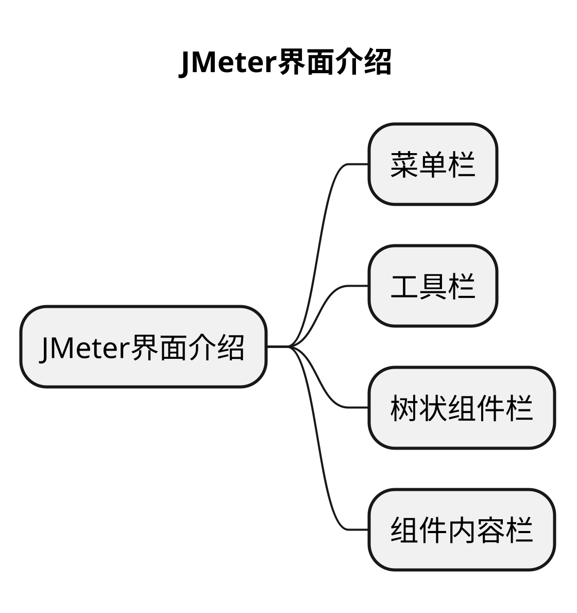
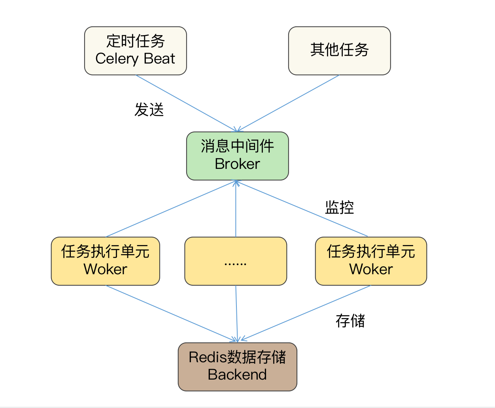

# 文章名
## 本章要点
1. 要点一
1. 要点
1. 要点
1. **要点**



## 学习目标

1. 。


## 思考

## 安装

Celery 的安装，相较于之前我们学习的第三方库，要稍微复杂些。

你需要在安装前，先给 Celery 安装一个用于处理定时任务队列的数据库软件 **Redis**，因为 Celery 库本身是没有任务排队功能的，所以就需要借用 Redis 等数据库来实现任务队列。


换言之，Celery 的安装包括两个步骤：

1. 安装 Celery 库。
2. 安装并启动 Redis 数据库。

### 安装 Celery 库

Celery 的安装包和软件同名，使用 pip3 命令安装即可。这里需要说明的是，Celery 库和 Redis 的安装先后顺序不用作区分。


### 安装并启动 Redis 数据库

#### Window

[Redis](https://github.com/MicrosoftArchive/redis/releases) 下载，根据提示多次执行“**下一步**”即可安装成功。

安装成功后，打开 Redis 的安装文件夹，找到“**redis-server.exe**”双击，即可启动 Redis 服务端，用于 Celery 存储计划任务。

#### Mac

这里需要补充的是，在 Mac 系统下，你可以利用 brew 工具，使用“**brew install redis**” 进行安装，并运行“**brew services start redis**” 来启动 Mac 版本的 Redis 服务端。

```bash
brew install redis

brew services start redis
```

## 工作过程

安装成功后，我们就可以开始为 Celery 配置定时任务了。不过为了让你更深刻地理解和掌握 Celery 定时任务的代码，我先带你学习一下 Celery 和 Redis 内部的工作过程，**Celery** 和我们以前学习的库不同的是，它**已经替我们实现了定时任务的执行和任务管理功能**，你只需要像搭积木一样，把**需要运行的任务和任务的时间与 Celery 组合即可**，我们先来看看 Celery 已经实现的四个组件以及它们的工作过程。


我把 Celery 和 Redis 之间的定时任务工作过程画成一张图，其中包括 Celery 的 Beat、Broker、Worker 和 Backend 四个组件。




前三个是 Celery 用于执行任务的组件，由 Celery 软件自身实现。其中 **Broker** 是**中间件**，用来连接 **Beat** 和多个 **Worker** 组件，

**Beat 作为任务的生产者**、**Worker 作为任务的消费者**，可以**通过 Broker 进行通信**，从而定时运行 Worker 组件的多个任务。


最后一个是 **Celery 的数据存储组件**，基于 Redis 实现。

在定时任务场景中，Redis 用于存放用户添加的任务计划到数据库中，并把数据库文件保存到磁盘，这样**前三个组件所在的进程即使遇到意外故障，重新运行，也不会造成定时任务的丢失**。


此外，Celery 和 Redis 数据还是通过 **TCP** 网络协议连接的，所以你可以给多个定时任务指定一个 Redis 数据库，以此来保证多个计算机上的定时任务需要进行修改时，只修改一次就可以实现自动数据同步了。


根据对 Celery 执行定时任务的工作过程分析，相信你已经对它的四个组件有所了解了。那接下来我就以每周六 22 点 01 分定时备份“c:\data”文件夹为例，给你讲解一下怎么通过编写 Celery 四个组件的代码来定时备份数据。


## 总结
- 总结一
- 总结二
- 总结三
https://github.com/Wechat-ggGitHub/Awesome-GitHub-Repo

[项目演示地址](https://github.com/testeru-pro/junit5-demo/tree/main/junit5-basic)


# 学习反馈

1. SpringBoot项目的父工程为( )。

   - [x] A. `spring-boot-starter-parent`
   - [ ] B.`spring-boot-starter-web`
   - [ ] C. `spring-boot-starter-father`
   - [ ] D. `spring-boot-starter-super`


<style>
  strong {
    color: #ea6010;
    font-weight: bolder;
  }
  .reveal blockquote {
    font-style: unset;
  }
</style>


