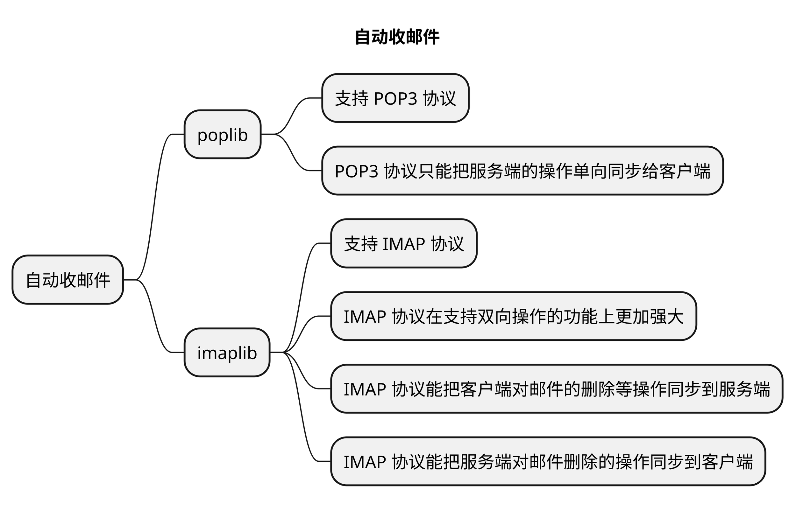

tnlqdvyymaplbfda
https://wx.mail.qq.com/list/readtemplate?name=app_intro.html#/agreement/authorizationCode

相信在你的日常办公工作当中，对邮件肯定早就不陌生了。

我们通过邮件既可以发送和接收正式的公文，也能够利用邮件编写周报、月报，以及订阅定期发布的新闻或者期刊，等等。

自动化测试时，可以直接在运行完测试用例后进行邮件的发送。

在这么多的应用场景当中，你会发现有些收发邮件的工作是周期性的。

那我们就可以利用 Python，将这些重复的邮件收发工作进行自动化。

## 思考

设想一下：

在我们接收邮件的时候，我们可以定时监察邮箱中的邮件，例如根据邮件中特定的主题，来自动判断是否为重要邮件。

如果是的话，可以通过 Python 调用钉钉等即时通讯软件马上通知自己，实现邮件的额外通知功能。

还有在发送邮件的场景中，如果你发现周报、月报等邮件模版是可以通用的，那你可以利用 Python 的字符串编写来实现邮件内容的自动替换功能，让你在使用邮件发送周报、月报工作中节约大量的时间。

那么今天我就教你如何使用 Python 的 **yagmail**、**imaplib** 两个库，分别实现邮件的自动发送和自动接收功能，并利用**正则表达式**、**字符串**和**变量**功能，来替代手工的重复工作。

## 自动收邮件

我们先从**如何自动收邮件**开始学习。

### 场景

今天的案例是这样的：

我希望能每隔五分钟检查一次收件箱，判断收件箱中是否有 30 天内未读的邮件。

并利用正则表达式根据邮件主题判断其中是否包含“**故障**”这一关键字。

如果包含的话，就通过**钉钉**等即时通讯工具通知到我，实现高优先级邮件处理的功能。

要想利用 Python 的正则表达式判断邮件主题是否出现了“故障”关键字，你必须要让 Python 实现邮件接收和主题读取功能。

在 Python 中，poplib 和 imaplib 库都支持邮件的接收协议，可以让我们登陆服务器接收邮件，从而实现**邮件接收**和**主题读取**。那这两个库该选择哪一个呢？

**imaplib 库支持 IMAP 协议，而 poplib 库支持 POP3 协议**。

IMAP 协议在支持双向操作的功能上更加强大，并且能把客户端对邮件的删除等操作同步到服务端，也能把服务端对邮件删除的操作同步到客户端。

与 POP3 协议只能把服务端的操作单向同步给客户端相比，会更加灵活。

所以就以 imaplib 库为例，为你讲解通过 IMAP 协议进行邮件的自动接收。

我们在确定采用 IMAP 协议接收邮件之后，接下来就要按照 IMAP 协议的要求，编写一个从邮件服务器下载邮件并分析邮件主题的代码。

## 获取邮件主题

获取邮件主题的代码分为三个主要步骤：

1. 指定邮件服务器的 IMAP 地址和端口、验证用户名和密码的正确性以及。

2. 下载邮件到本地。

3. 解析邮件得到邮件主题。

### 指定邮件服务器

第一步是指定邮件服务器的 IMAP 地址和端口。

大部分对邮件安全比较重视的公司，为了防止黑客暴力发现邮件服务器用户的弱口令密码，默认是将 IMAP 服务的功能关闭的。

你需要联系邮件服务器管理员或通过网页管理功能打开 IMAP 服务，允许你在家里连接 IMAP 服务器。

我以 QQ 邮箱为例，打开 IMAP 服务的方法是在QQ 邮箱的网页端登陆成功后，通过设置 - 账号 -IMAP 服务，打开 IMAP/SMTP 服务。

打开功能后，可以参考官方文档将 IMAP 服务器的地址指定为：“imap.qq.com”，“使用 SSL”保证数据传输过程的安全，并将连接 IMAP 服务器的端口指定为“993”。

打开 IMAP 服务的截图和官方文档的截图如下。

