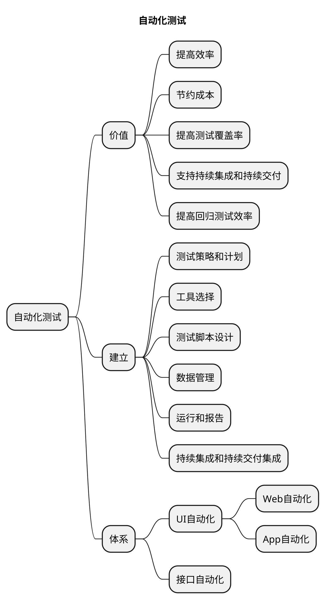

# 自动化测试的价值与体系

自动化测试在软件开发中具有重要的价值和作用。以下是自动化测试的一些主要价值：

### 提高效率

自动化测试可以大大提高测试的效率。相比手动测试，自动化测试可以快速执行大量的测试用例，并在较短的时间内提供测试结果。这使得测试团队能够更快地发现潜在的问题和缺陷，提高测试的覆盖率和质量。

### 节约成本
虽然自动化测试需要一定的投入和资源，但长期来看，它可以帮助降低测试成本。一旦自动化测试脚本编写完成，就可以重复运行多次，无需额外的人力成本。此外，自动化测试还可以减少手动测试的错误和重复工作，从而减少人力资源的浪费。

### 提高测试覆盖率

通过自动化测试，可以更全面地覆盖应用程序的功能和场景。自动化测试可以执行大量的测试用例，包括边界条件、异常情况和各种用户操作。这有助于发现更多的潜在问题，并提高测试的全面性和准确性。

### 支持持续集成和持续交付

自动化测试是实现持续集成和持续交付流程的关键组成部分。它可以与构建工具和持续集成服务器集成，使得每次代码提交后都能自动运行测试，并及时提供测试结果。这有助于保证软件的稳定性和可靠性，并加速软件发布的速度。

### 提高回归测试效率

随着软件的不断迭代和更新，回归测试变得非常重要。自动化测试可以快速执行回归测试，验证新的代码修改是否对现有功能产生了负面影响。通过自动运行已编写的测试脚本，可以更有效地检测潜在的回归问题，减少回归测试的时间和工作量。

## 建立有效自动化测试体系

为了建立一个有效的自动化测试体系，可以考虑以下几点：

### 测试策略和计划

明确自动化测试的目标和范围，确定需要自动化的测试类型和优先级。制定测试计划，包括测试用例设计、执行计划和资源分配等。

### 工具选择

选择适合项目需求和技术栈的自动化测试工具。例如，选择Selenium用于Web应用程序的自动化测试，选择Appium用于移动应用程序的自动化测试等。

### 测试脚本设计

设计易于维护和扩展的测试脚本。使用良好的编程实践和设计模式，尽量减少冗余代码和依赖性，提高测试脚本的可读性和可维护性。

### 数据管理
合理管理测试数据，包括准备测试数据、数据驱动测试和数据清理等。确保测试数据的一致性和可重复性。

### 运行和报告
建立自动化测试运行和结果报告的机制。自动化运行测试脚本，并生成详细的测试报告，包括测试结果、错误日志和执行统计等。

### 持续集成和持续交付集成
将自动化测试与持续集成和持续交付流程集成起来。确保每次代码提交后都能自动运行测试，并及时反馈结果。

通过建立完善的自动化测试体系，可以最大限度地发挥自动化测试的价值和效果，提高软件开发的效率和质量。

