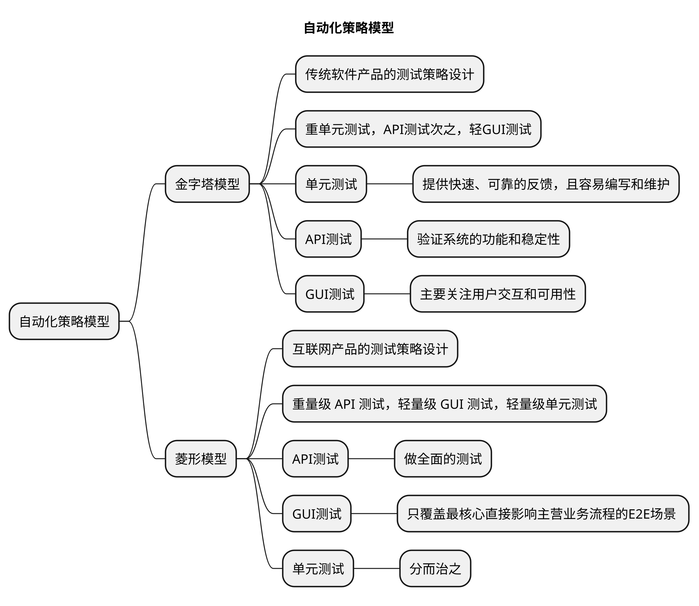
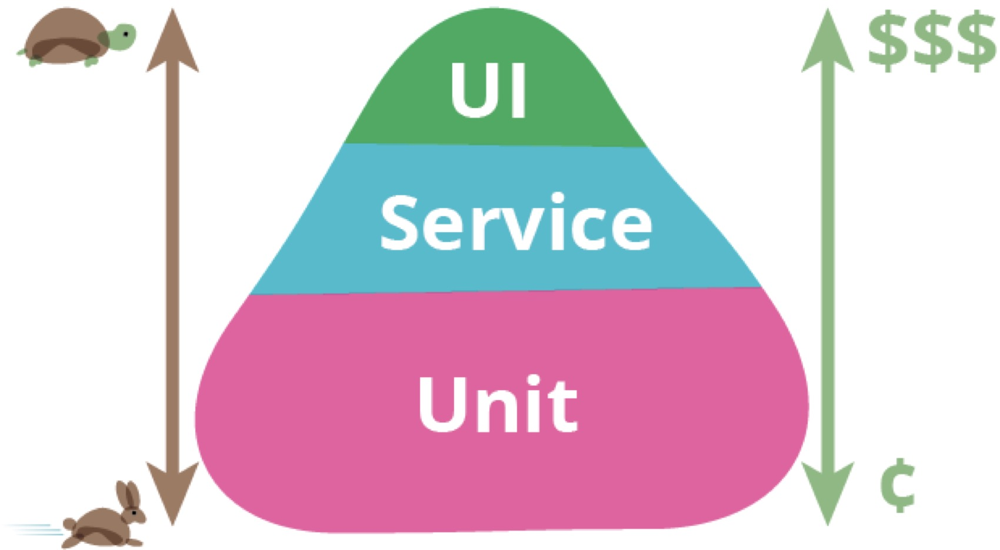
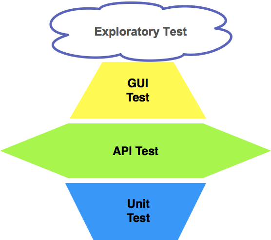

# 自动化策略模型

## 金字塔模型

- **传统软件产品的测试策略设计。**

>推崇的是迈克的 **金字塔模型**：**重单元测试，API测试次之，轻GUI测试**。

迈克的金字塔模型是一种软件测试策略，强调将重点放在单元测试上，API测试次之，而将GUI测试作为较轻量级的测试。

根据迈克的金字塔模型，测试金字塔的层次结构如下：

### 单元测试（Unit Testing）

单元测试是针对软件中最小的可测试单元——函数、方法或类等进行的测试。

它们通常是在隔离的环境中执行，以确保单元的正确性和预期行为。单元测试应该是快速、自动化的，并且在整个开发过程中频繁运行。

### API测试

API测试是对应用程序编程接口（API）进行的测试。

它们验证API的功能、性能和稳定性，并确保各种输入和边界条件下的正确行为。API测试通常涉及对请求和响应的验证，以及对API参数、状态码和错误处理的检查。

### GUI测试（Graphical User Interface Testing）

GUI测试是针对应用程序的用户界面进行的测试。

它们模拟用户的交互操作，例如点击按钮、输入文本、选择选项等，并验证应用程序在各种情况下的响应和正确性。GUI测试可以确保应用程序的可用性和用户体验。

迈克的金字塔模型的理念是将更多的测试重点放在底层的单元测试上，因为单元测试可以**提供快速、可靠的反馈，而且相对容易编写和维护**。而**API测试则可以在更高层次上验证系统的功能和稳定性**，GUI测试作为顶层的测试，主要关注用户交互和可用性。

这种金字塔结构的测试策略有助于提高测试效率、减少依赖外部系统和减少测试执行时间。通过合理分配测试资源，优先关注底层的单元测试和API测试，可以更早地发现和解决问题，从而提高软件的质量。

#### 菱形模型

- **互联网产品的测试策略设计**。

>互联网产品的研发流程就一个字：“快”，发布周期的巨大差异决定了，传统软件产品的测试策略必然不适用于互联网产品的测试，二者的测试策略必然在测试执行时间和测试执行环境上有巨大差异。

互联网产品采用 **菱形模型** ，遵循 **重量级 API 测试，轻量级 GUI 测试，轻量级单元测试** 的原则。

互联网产品的上线周期，决定了`GUI`测试不可能大范围开展。

1.  互联网**产品的迭代周期**，决定了留给开发`GUI`自动化测试用例的时间非常有限
2.  互联网**产品客户端界面的频繁变化**，决定了开展`GUI`自动化测试的效率会非常低

互联网的产品 以中间层的`API`测试为重点做全面的测试；

最上层的`GUI`测试，首先只覆盖 **最核心直接影响主营业务流程** 的`E2E`『`EndToEnd`』场景 「P0级别的回归测试」；

>UI测试可能执行的时间比较长，对应的维护成本比较高，只要前端页面有变化，我们就需要进行对应的脚本维护。所以，我们只选其中的一部分重要的测试用例，P0级别的测试用例来进行

>有些app在不同的时间段对应的页面布局都会不同，所以，UI自动化就要兼容这个布局的更改，去判断当前页面有哪个模块，就进行哪个模块的UI自动化，如果当前页面没有对应模块则不进行UI自动化测试，但是在服务端并不代表该服务停止。

单元测试采用「**分而治之**」的思想，只对那些相对稳定并且核心的服务和模块开展全面的单元测试，而应用层或者上层业务只会做少量的单元测试。

菱形模型的理念是将更多的测试重点放在API测试上，因为API是应用程序的核心接口，对系统的功能和稳定性起着关键作用。

GUI测试作为中等层次的测试，关注用户界面和用户体验，而轻量级单元测试作为最底层的测试，验证最小的可测试单元。

这种菱形结构的测试策略**有助于确保API的功能和性能**，并验证应用程序的用户界面和用户体验。通过合理分配测试资源，重点关注API测试，可以在保证系统稳定性的同时，有效地测试用户界面和最小单元的正确性。

