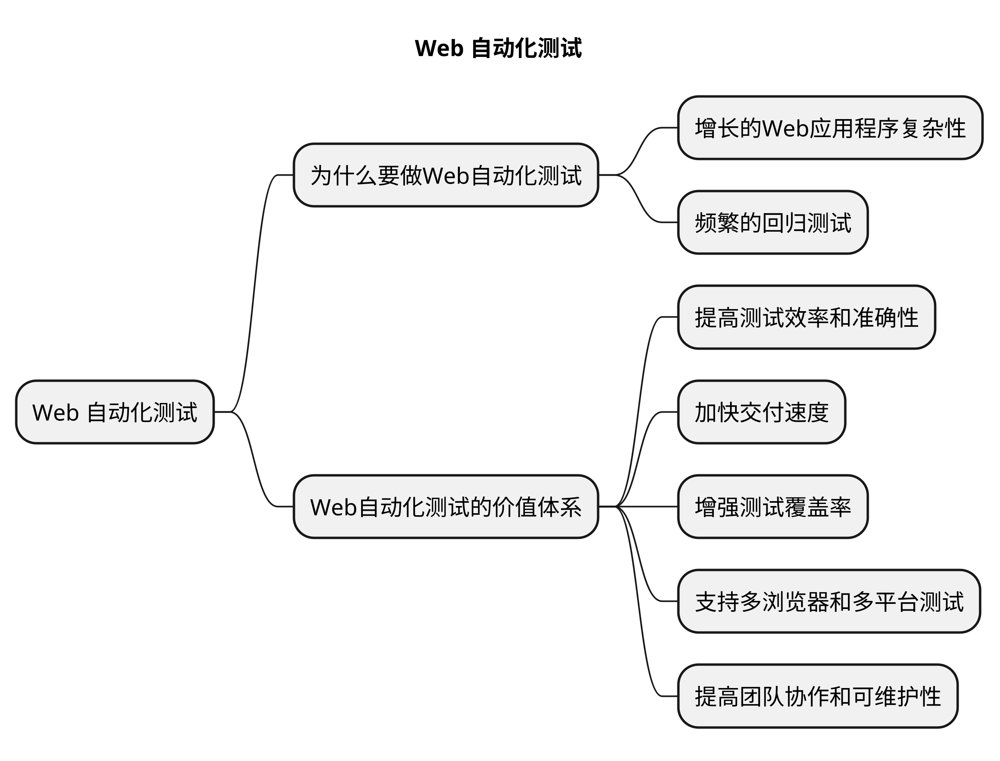

# Web 自动化测试的价值与体系

Web自动化测试是指使用自动化工具和脚本来模拟用户在Web应用程序中的操作，并验证应用程序的功能、性能和用户体验。它可以模拟用户在浏览器中点击链接、填写表单、提交数据等操作，以及提取页面数据进行验证。

## 为什么要做Web自动化测试

Web自动化测试的由来。

### 增长的Web应用程序复杂性

随着Web应用程序的快速发展和复杂化，传统的手动测试方法已经无法满足快速交付和高质量的需求。Web自动化测试的出现是为了解决这个问题，通过自动执行和验证测试，提高测试效率和准确性。

### 频繁的回归测试

Web应用程序通常需要进行频繁的版本更新和迭代，这就需要进行回归测试以确保新功能的引入不会破坏现有的功能。手动回归测试耗时且容易出错，而Web自动化测试可以快速执行回归测试，提高测试效率并降低测试成本。

## Web自动化测试的价值体系

### 提高测试效率和准确性

Web自动化测试可以自动执行大量的测试用例，覆盖各种功能和场景。它可以在较短的时间内提供测试结果，减少人工测试的工作量，并降低人为错误的风险。同时，自动化测试可以减少重复工作，提高测试的一致性和可靠性。

### 加快交付速度

Web自动化测试可以与持续集成和持续交付流程集成，实现自动测试和自动化部署的无缝衔接。通过自动执行测试用例，可以及时发现和解决问题，从而加快应用程序的交付速度，提高交付的质量和可靠性。

### 增强测试覆盖率

Web自动化测试可以覆盖大量的功能和场景，包括边界条件、异常情况和各种用户操作。它可以模拟真实用户的行为，并在不同的浏览器和设备上执行测试，从而增强测试的全面性和准确性。

### 支持多浏览器和多平台测试

Web自动化测试工具通常支持多种浏览器和平台，可以在不同的环境下执行测试。这样，开发人员可以验证应用程序在不同浏览器和平台上的兼容性和一致性，提高用户体验和应用程序的可访问性。

### 提高团队协作和可维护性

Web自动化测试可以促进测试团队和开发团队之间的紧密合作。

