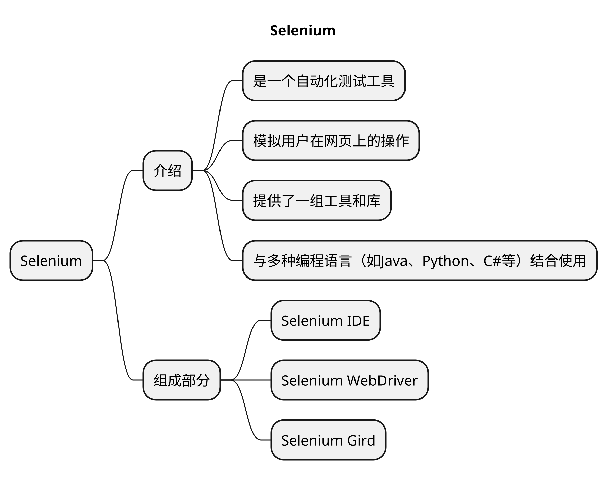

# Selenium


## 本章要点
1. 要点一
1. 要点
1. 要点
1. **要点**


## 学习目标

1. 。



## 思考

# Selenium 介绍

Selenium是一个自动化测试工具，用于模拟用户在网页上的操作。它提供了一组工具和库，可以与多种编程语言（如Java、Python、C#等）结合使用，用于编写自动化测试脚本。

它提供了一组功能强大的**工具**和**API**，用于在各种浏览器中模拟用户的行为，执行各种操作，例如**点击**、**填写表单**、**提交数据**、**导航**和
等。

Selenium最初是由Jason Huggins于2004年创建的一个内部工具，用于在浏览器中进行自动化测试。它起初是作为一个**JavaScript**扩展程序，可以注入到浏览器中执行测试脚本。后来，Selenium演变为一个完整的工具集，支持多种编程语言，包括Java、Python、C#等，并且可以与各种浏览器交互，包括Chrome、Firefox、Safari和Edge等。


## Selenium相关网站

[selenium官网](https://www.selenium.dev/)

[selenium中文说明文档](https://www.selenium.dev/zh-cn/documentation/)
    

[selenium组件下载](https://www.selenium.dev/downloads/)

[selenium镜像](https://npm.taobao.org/mirrors/selenium)

## Selenium 三大组成部分


### Selenium IDE


它是一个浏览器插件，也可以是一个客户端。用于记录和回放用户在浏览器中的操作。

Selenium IDE可以生成Selenium脚本，方便初学者快速入门，并且可以轻松地在不同的浏览器上运行。

浏览器内插件，可以进行UI自动化录制、回放、生成脚本。

#### 弊端

一个元素出现了，但是不能被点击，如果强行用sleep，无法掌握这个时间，sleep(1)时可能这个元素在红色线出现时间超过1s


### Selenium WebDriver

**进行UI自动化依赖的框架。**

是Selenium的主要组件，用于编写测试脚本和执行浏览器操作。

WebDriver提供了一组API，可以模拟用户在浏览器中的交互行为，如**点击**、**输入**、**导航**等。它支持多种浏览器，并且可以在不同的操作系统上运行。

### Selenium Gird

它是一个分布式测试执行环境，可以将测试任务分发到不同的机器和浏览器上并行执行。

如果您想通过在多台机器上分发和运行测试来扩展，并从一个中心点管理多个环境，从而可以轻松地针对浏览器/操作系统的大量组合运行测试，那么您需要使用 Selenium Grid

Selenium Grid可以提高测试的效率和速度，特别适用于大规模的测试和跨浏览器的测试需求。


### driver驱动原理

driver会将对应的浏览器绑定在特定端口启动，并作为一个服务器监听来自于测试脚本的命令，selenium测试脚本通过调用该服务操作本机安装的相应的浏览器。


## 总结

- 总结一
- 总结二
- 总结三
https://github.com/Wechat-ggGitHub/Awesome-GitHub-Repo

[项目演示地址](https://github.com/testeru-pro/junit5-demo/tree/main/junit5-basic)


# 学习反馈

1. SpringBoot项目的父工程为( )。

   - [x] A. `spring-boot-starter-parent`
   - [ ] B.`spring-boot-starter-web`
   - [ ] C. `spring-boot-starter-father`
   - [ ] D. `spring-boot-starter-super`


<style>
  strong {
    color: #ea6010;
    font-weight: bolder;
  }
  .reveal blockquote {
    font-style: unset;
  }
</style>


## 环境
```XML
<properties>
    ...
    <!-- 尽可能使用最新版本 -->
    <selenium.version>4.0.0</selenium.version>
    ...
</properties>

<dependencies>
    ...
    <dependency>
        <groupId>org.seleniumhq.selenium</groupId>
        <artifactId>selenium-java</artifactId>
        <version>${selenium.version}</version>
    </dependency>

    ...
</dependencies>
```
### Webdriver
Webdriver驱动原理：Webdriver会将对应的浏览器绑定在特定端口启动，并作为一个服务器监听来自于测试脚本的命令，selenium测试脚本通过调用该服务操作本机安装的相应的浏览器。

webdriver启动的时候，默认不带任何用户配置，启动一个崭新的浏览器。
selenium 3.0 就是优化了各种方法和开发各种需求。


接口
- postman jmeter 可以迭代更新
自动化测试
- 回归性测试,冒烟测试  --- 提高测试效率


# Selenium原理
## selenium架构图


## WebDriver原理

- 每个Selenium脚本，会创建并发送一个http请求给浏览器的驱动
- 浏览器驱动中包含了一个HTTP Server，用来接收发送的http请求
- HTTP Server 接收请求后根据请求来具体操作浏览器
