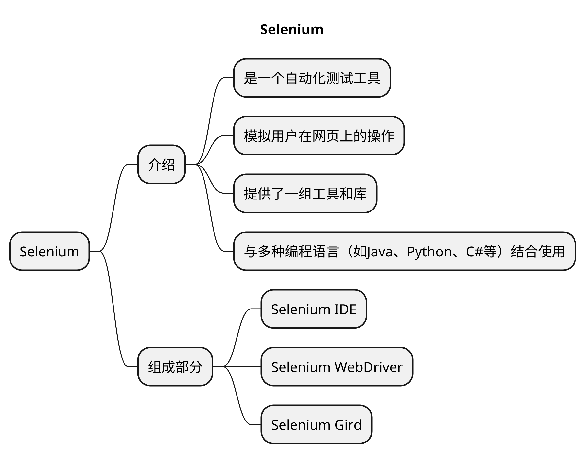
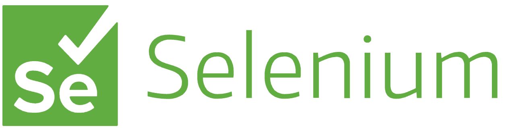
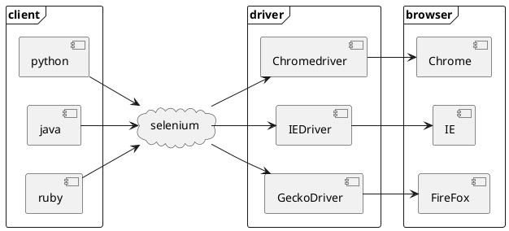

# Selenium

## Selenium 介绍

1. 用于 Web 浏览器测试的工具。

1. 支持的浏览器包括 IE，Firefox，Safari，Chrome，Edge 等。
1. 使用简单，可使用 Java，Python 等多种语言编写用例脚本。
1. 主要由三个工具构成：**WebDriver**、**IDE**、**Grid**。

Selenium是一个自动化测试工具，用于模拟用户在Web浏览器中的行为。

它提供了一组API，可以用**多种编程语言**（如Java、Python、C#等）**编写测试脚本**，通过这些脚本可以**自动化执行各种操作**，如**点击**、**填写表单**、**提交数据**等，使开发人员能够根据自己的偏好选择合适的语言。

Selenium最初是为Web应用程序测试而开发的，它可以模拟用户与Web应用程序的交互，并验证应用程序的行为是否符合预期。测试人员可以使用Selenium编写测试脚本，通过自动化执行这些脚本来进行功能测试、回归测试等。

Selenium 虽然最初是为自动化测试而创建的，但它的应用范围已经扩展到其他领域，如数据挖掘、网络爬虫和网页交互等。

Selenium**支持多种浏览器**，包括`Chrome`、`Firefox`、`Safari`、`Internet Explorer`等。它**通过与浏览器驱动程序进行通信来控制浏览器的行为**。浏览器驱动程序负责**将Selenium的指令转化为浏览器能够理解的操作**，并将浏览器的状态信息反馈给Selenium。

Selenium提供了**丰富的功能和灵活的操作方式**。它可以**定位**和**操作**Web页面上的元素，如**文本框**、**按钮**、**链接**等。它还支持**页面截图**、**处理弹窗**、**处理JavaScript**等高级功能。此外，Selenium可以**与其他测试框架集成**，如`JUnit`、`TestNG`、`Pytest`等，以实现更强大的测试和自动化流程。

Selenium有多个组件，其中最常用的是**Selenium WebDriver**。WebDriver提供了一组API，可以与不同浏览器进行交互，并控制浏览器执行操作。开发人员可以使用WebDriver编写测试脚本，实现对Web应用程序的自动化测试。

总而言之，Selenium是一个强大的自动化测试工具，可以帮助开发人员和测试人员自动化执行Web应用程序的测试任务。它具有广泛的应用领域，包括功能测试、回归测试、性能测试等，成为Web开发和测试人员的重要工具之一。

## Selenium相关网站

[selenium官网](https://www.selenium.dev/)

[selenium中文说明文档](https://www.selenium.dev/zh-cn/documentation/)
    

[selenium组件下载](https://www.selenium.dev/downloads/)

[selenium镜像](https://npm.taobao.org/mirrors/selenium)

## Selenium 组成

Selenium 主要有以下几个组件：

### Selenium IDE

Selenium IDE 是一个**浏览器插件**，用于**录制**和**回放**用户在浏览器中的操作。

它提供了一个简单的界面，允许用户通过点击和输入来录制测试脚本。

Selenium IDE 生成的脚本可以导出为不同的编程语言，以便进一步编辑和执行。

#### 弊端

一个元素出现了，但是不能被点击，如果强行用sleep，无法掌握这个时间，sleep(1)时可能这个元素在红色线出现时间超过1s

### Selenium WebDriver

**进行UI自动化依赖的框架。**

<!--  -->

WebDriver 是 Selenium 的**核心组件**，它提供了一组API，用于编写测试脚本和控制浏览器。

WebDriver 可以**与不同的浏览器交互**，如Chrome、Firefox、Safari等，通过模拟用户在浏览器中的操作，，如**点击**、**输入**、**导航**等，实现自动化测试和网页操作。

### Selenium Grid

Selenium Grid 是一个**分布式测试执行**环境，它**可以同时运行多个测试脚本**，并且**可以在不同的浏览器和操作系统上进行测试。**

Grid 可以通过配置和管理不同的节点来实现测试的并行执行，从而提高测试的效率。

## Selenium架构图

### 客户端框架（Client Frame）

表示**使用Selenium的客户端代码**，包括Python、Java和Ruby等不同编程语言。

这些客户端代码通过Selenium库与Selenium进行交互。

### 驱动程序框架（Driver Frame）

表示不同浏览器的驱动程序，用于将Selenium的命令转化为浏览器可以理解的底层操作。

示意图中包括 `Chromedriver`（用于Chrome浏览器）、`IEDriver`（用于Internet Explorer浏览器）和`GeckoDriver`（用于Firefox浏览器）。

### 浏览器框架（Browser Frame）

表示实际的浏览器实例，包括`Chrome`、`IE`和`Firefox`。

驱动程序将Selenium的命令发送给相应的浏览器，浏览器执行这些命令并返回结果。

常见面试题：[Selenium的工作原理](https://ceshiren.com/t/topic/22890)

- 官方文档： https://www.selenium.dev/documentation/

