# Selenium Driver 安装


## 本章要点
1. 要点一
1. 要点
1. 要点
1. **要点**

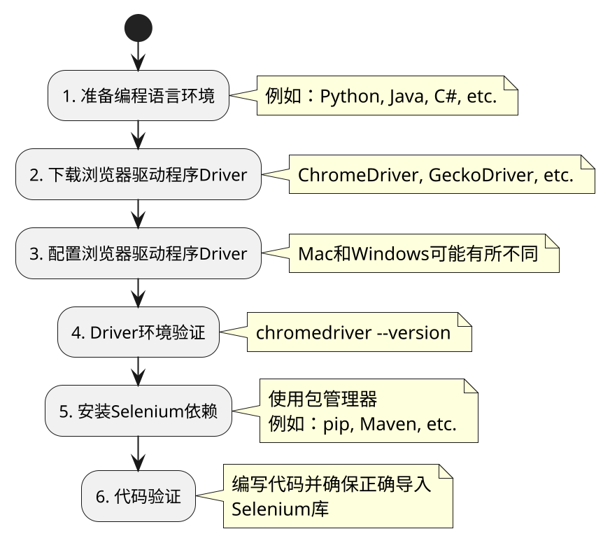

## 1. 准备编程语言环境

### Java 环境验证

```bash
java -version 
```

### Python 环境验证

```bash
python --version
```


## 2. 下载浏览器驱动程序Driver

根据你要自动化测试的浏览器类型，下载相应的浏览器驱动程序。

Selenium使用这些驱动程序来与浏览器进行通信和控制，[Slenium提供了相关的下载页面](https://www.selenium.dev/downloads/)。

### 浏览器驱动作用

浏览器驱动程序**作用**是**将代码的请求转发给浏览器**。

### 浏览器驱动对应关系


|浏览器|浏览器驱动|
|---|---|
|Chrome 浏览器|`ChromeDriver`|
|Firefox 浏览器|`GeckoDriver`|
|Internet Explorer 浏览器|`IEDriver`|

常见的浏览器驱动程序包括`ChromeDriver`（用于Chrome浏览器）、`GeckoDriver`（用于Firefox浏览器）和 `IEDriver`（用于Internet Explorer浏览器）。

下载适用于你的浏览器版本和操作系统的驱动程序，并将其保存到一个可访问的位置。

### ChromeDriver下载

1. 打开下载页面，有以下几种网址：

   - [chromedriver官网](https://chromedriver.chromium.org/downloads)


   - [海外版地址](https://chromedriver.storage.googleapis.com/index.html)

   - [淘宝CDN](https://registry.npmmirror.com/binary.html?path=chromedriver/)

    - [Selenium下载](https://www.selenium.dev/zh-cn/documentation/webdriver/troubleshooting/errors/driver_location/)


2. Chrome 浏览器版本查看。

    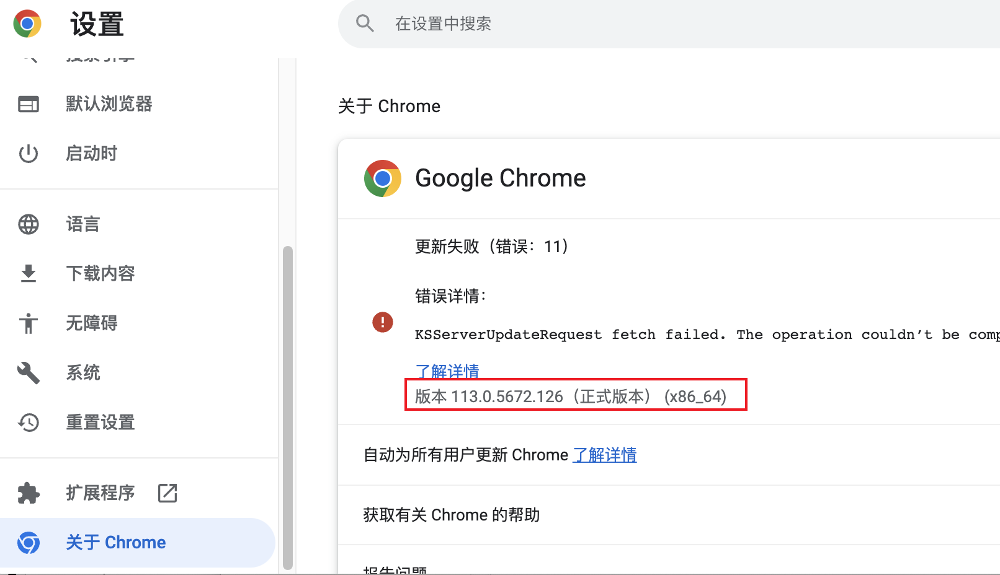

    >如果 Chrome 的版本是**113.0.5672.126**。在下载 ChromeDriver 的时候就需要下载对应的版本，如果找不到完全对应的版本，则需要保持大版本一致。

3. chromedriver下载。
   
    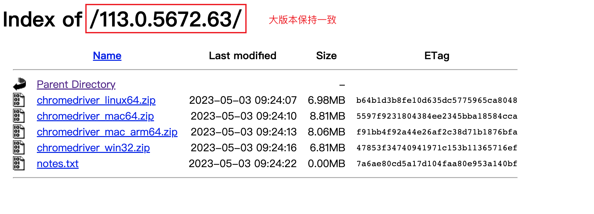
    
    >根据自己的系统选择chromedriver，windows 只有**32位**的，因为Windows 64为也支持运行32为的。点击下载保存并进行解压，记下chromedriver 的路径


### GeckoDriver下载

[GeckoDriver](https://github.com/mozilla/geckodriver/releases)

### IEDriver下载

[IEDriver](http://selenium-release.storage.googleapis.com/index.html)


## 3. 配置浏览器驱动程序Driver

将下载的浏览器驱动程序的路径配置到系统的环境变量中，或者在代码中指定驱动程序的路径。

这样，Selenium才能找到并与浏览器驱动程序进行通信。


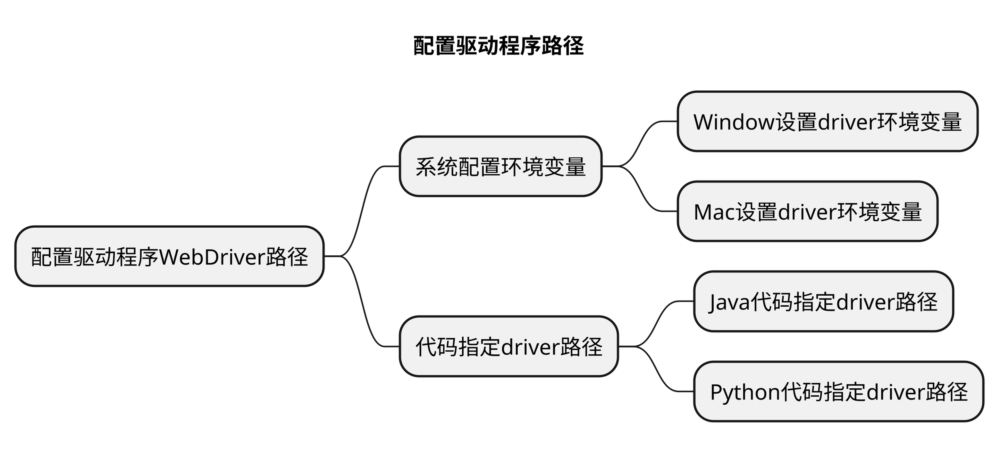

### Window设置driver环境变量

1. 查看driver路径。
    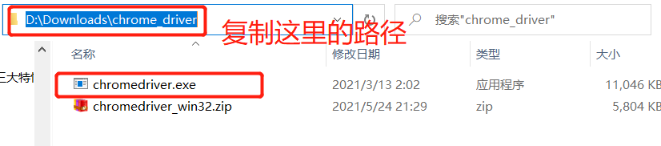

1. 环境变量配置。
    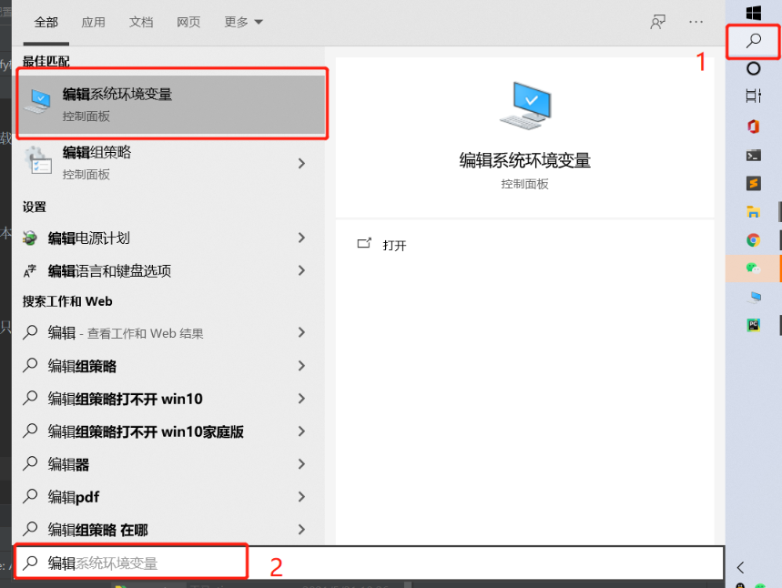
    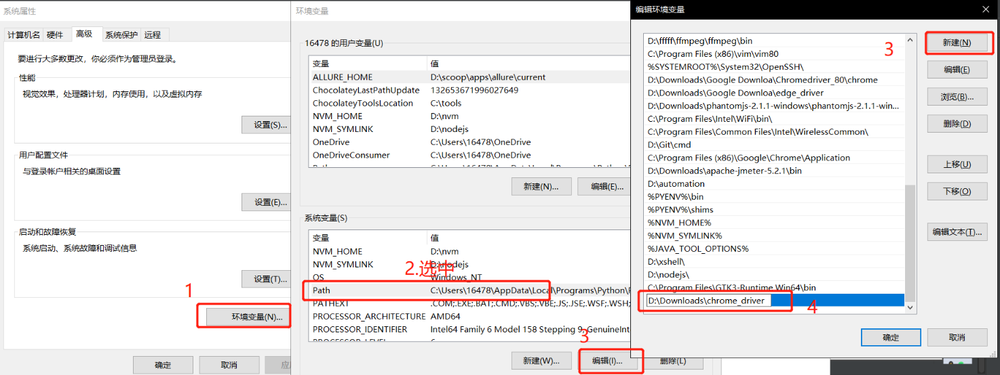

1. 命令行验证。

    >在 cmd 里面输入 `chromedriver --version`。


### Mac设置driver环境变量


1. 按 **command + 空格** 键 输入 ter，选择终端打开。

1. 终端确认电脑的bash环境。

    ```bash
    echo $SHELL
    ```
    

1. 打开环境变量配置文件。
   - 输出为 **/bin/bash**， 则创建` ~/.bash_profile` 配置文件。

   - 输出为 **/bin/zsh**，则创建 `~/.zshrc` 配置文件。

    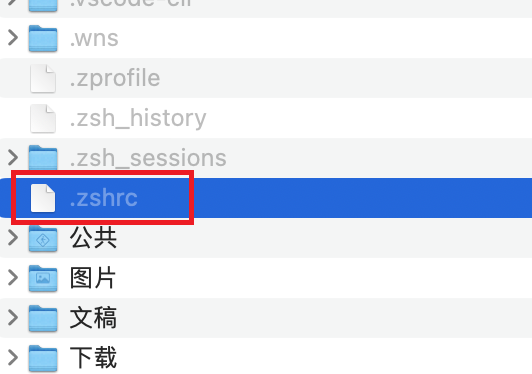

    <!--  -->

1. 在配置文件中添加 CHROMEDRIVER_HOME，PATH的变量追加DRIVER配置：
    ```bash
    CHROMEDRIVER_HOME=/Users/gaigai/.cache/selenium/chromedriver/mac64/113.0.5672.63

    PATH=$PATH:${CHROMEDRIVER_HOME}/chromedriver
    #设置指令别名
    alias chromedriver=${CHROMEDRIVER_HOME}/chromedriver
    ```

1. 终端输入 **source 配置文件名** 使环境变量生效。

    ```bash
    source ～/.zshrc 
    ```
    
    


### Java代码指定driver路径

```java
// 指定ChromeDriver的路径
System.setProperty("webdriver.chrome.driver", "/path/to/chromedriver");
```


### Python代码指定driver路径

在Python代码中，你可以使用以下方式来指定驱动程序的路径（以`ChromeDriver`为例）：

```python
from selenium import webdriver

# 指定ChromeDriver的路径
driver = webdriver.Chrome(executable_path='path/to/chromedriver')
```

## 4. Driver环境验证


1.  重启命令行工具，输入 chromedriver --version。
   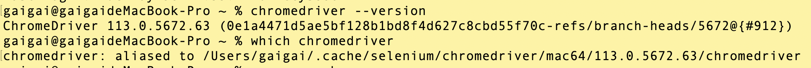


## 5. 安装 Selenium 依赖

使用包管理器。

### 5.1 Java 安装 Selenium 依赖


### 5.2 Python 安装 Selenium 依赖

使用pip命令来安装Selenium库。在终端或命令提示符中运行以下命令：

```bash
pip install selenium
```

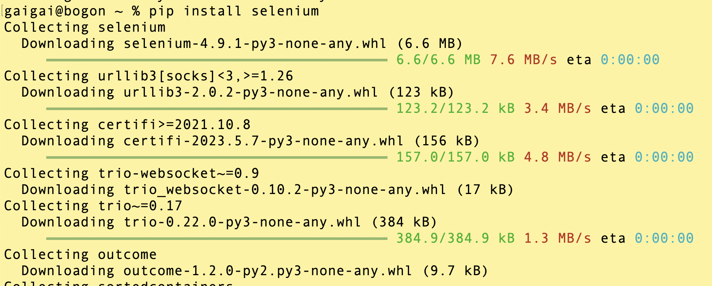

**路经验证：**

```bash
# 安装的路径
/usr/local/Cellar/python@3.10/3.10.11/Frameworks/Python.framework/Versions/3.10/lib/python3.10/site-packages/selenium
```

#### pip添加源

[添加源](https://www.runoob.com/w3cnote/pip-cn-mirror.html)

```python
# 国内清华大学的源
pip install selenium -i https://pypi.tuna.tsinghua.edu.cn/simple

# 中国科学技术大学 : https://pypi.mirrors.ustc.edu.cn/simple

# 豆瓣：http://pypi.douban.com/simple/

# 阿里云：http://mirrors.aliyun.com/pypi/simple/
```

## 6. 代码验证

### Java 打开浏览器

### Python 打开浏览器

```python
import time
# 导入selenium 包
from selenium import webdriver

# 创建一个 Chromdriver 的实例。Chrome()会从环境变量中寻找浏览器驱动
# 打开一个空白的 data; 页面
driver = webdriver.Chrome()
# 强等10s 秒
time.sleep(10)
```

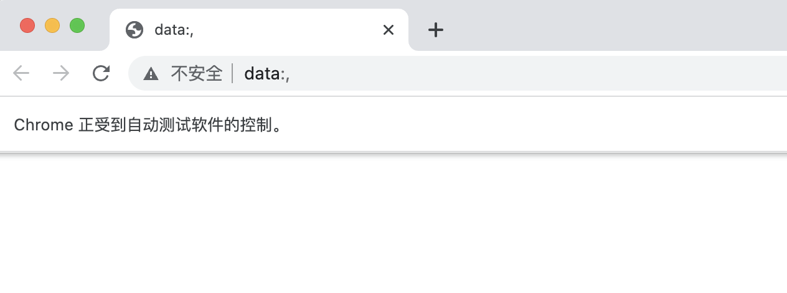


想要打开具体的网址：


```python
import time
# 导入selenium 包
from selenium import webdriver

# 创建一个 Chromdriver 的实例。Chrome()会从环境变量中寻找浏览器驱动
# 打开一个空白的 data; 页面
driver = webdriver.Chrome()
# 打开网址  get()方法中需要传入要打开页面的URL
driver.get("https://www.baidu.com/")
# 强等10s 秒 看一下效果
time.sleep(10)
# 关闭driver 断开操作，回收资源 浏览器关掉、进程断开
driver.quit()
```

>get相当于，driver可以操作电脑端的Chrome浏览器了，这时，客户端「代码」想要在浏览器上打开具体的网址，则使用get()方法。


到此，环境搭建成功。使用的语法：

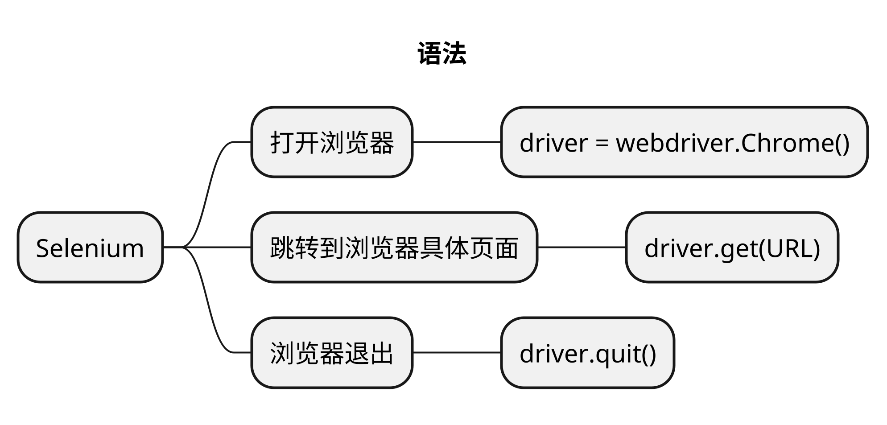

## 问题

### 1. 代码启动报错

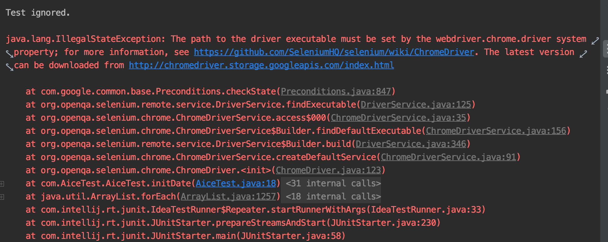

**前提**：下载安装了selenium依赖。

**场景**：代码验证环境时启动报错。

**原因**：`chromedriver` 对应安装路径没有配置环境变量中，或者环境变量对于`chromedriver`的配置有问题。

**解决方案**：

1. 环境变量重新配置`chromedriver` 的安装路径。

2. 可以在代码层级解决，在声明Chrome driver对象前，赋值`chromedriver`的全局变量。

Java：
```java
System.setProperty("webdriver.chrome.driver", "/path/to/chromedriver");
```


## 总结
- 总结一
- 总结二
- 总结三

https://github.com/Wechat-ggGitHub/Awesome-GitHub-Repo

[项目演示地址](https://github.com/testeru-pro/junit5-demo/tree/main/junit5-basic)


# 学习反馈

1. SpringBoot项目的父工程为( )。

   - [x] A. `spring-boot-starter-parent`
   - [ ] B.`spring-boot-starter-web`
   - [ ] C. `spring-boot-starter-father`
   - [ ] D. `spring-boot-starter-super`
<style>
  strong {
    color: #ea6010;
    font-weight: bolder;
  }
  .reveal blockquote {
    font-style: unset;
  }
</style>