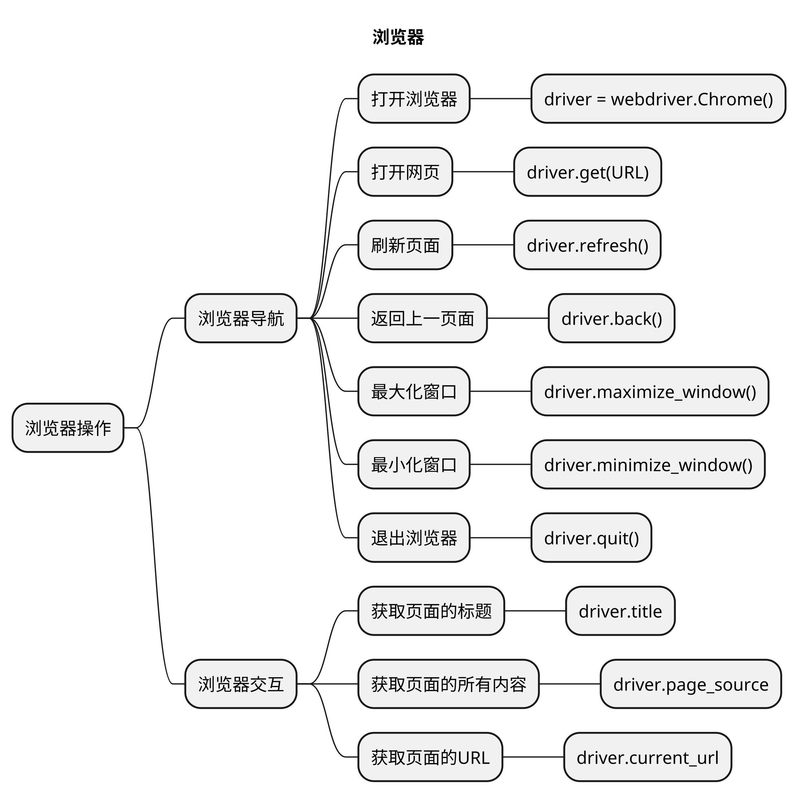

# 浏览器操作
## 本章要点
1. 要点一
1. 要点
1. 要点
1. **要点**

## 正文


## 浏览器导航

### 打开浏览器

```python
driver = webdriver.Chrome()
```

使用 Selenium WebDriver 创建 Chrome 浏览器的驱动对象的代码。

这行代码使用了 Selenium 的 Python 客户端库，结合 Chrome 浏览器的驱动程序（ChromeDriver）来实现 Web 自动化测试。

在创建驱动对象之前，需要将 ChromeDriver 的可执行文件路径添加到系统环境变量中，或者指定 ChromeDriver 的路径，例如：

```python
driver = webdriver.Chrome(executable_path='/path/to/chromedriver')

```

### 打开网页

```python
## 打开指定的 URL，将要访问的 URL 作为参数传递给该方法
driver.get(URL)
```

在使用 Selenium WebDriver 进行 Web 自动化测试时，你可以使用 driver.get() 方法来打开指定的 URL。


#### 示例


```python

import time

from selenium import webdriver


class TestWindowControl:

    def setup(self):
        ## 打开浏览器
        self.driver = webdriver.Chrome()
        ## 设置全局隐式等待
        self.driver.implicitly_wait(3)

    def teardown(self):
        self.driver.quit()

    def test_open_window(self):
        '''
        打开网页
        '''
        self.driver.get("https://vip.ceshiren.com/#/ui_study")
        time.sleep(2)
```


### 刷新页面

```python
driver.refresh()
```
使用 Selenium WebDriver 刷新当前页面的方法。

在使用 Selenium WebDriver 进行 Web 自动化测试时，有时需要刷新当前页面以获取最新的内容或重置页面状态。


这在某些测试场景中可能很有用，例如**在页面上进行动态内容的监测或重新加载后执行其他操作**。


#### 示例


```python

import time

from selenium import webdriver


class TestWindowControl:

    def setup(self):
        ## 打开浏览器
        self.driver = webdriver.Chrome()
        ## 设置全局隐式等待
        self.driver.implicitly_wait(3)

    def teardown(self):
        self.driver.quit()

    def test_refresh_window(self):
        '''
        刷新页面
        '''
        ## 打开页面
        self.driver.get("https://vip.ceshiren.com/#/ui_study")
        ## 强制等待
        time.sleep(2)
        ## 刷新页面
        self.driver.refresh()
        ## 强制等待
        time.sleep(2)
```


### 返回上一页面

```python
driver.back()
```

使用 Selenium WebDriver 执行浏览器返回操作的方法。

在使用 Selenium WebDriver 进行 Web 自动化测试时，有时需要**模拟用户点击浏览器的返回按钮来返回到上一个页面**。可以使用 driver.back() 方法来实现这个操作。


#### 示例

```python

import time

from selenium import webdriver


class TestWindowControl:

    def setup(self):
        ## 打开浏览器
        self.driver = webdriver.Chrome()
        ## 设置全局隐式等待
        self.driver.implicitly_wait(3)

    def teardown(self):
        self.driver.quit()

    def test_back(self):
        '''
        返回上一页面
        '''
        ## 打开页面
        self.driver.get("https://vip.ceshiren.com/#/ui_study")
        ## 强制等待
        time.sleep(2)
        self.driver.get("https://www.baidu.com/")
        ## 强制等待
        time.sleep(2)
        ## 返回上一页面
        self.driver.back()
        ## 强制等待
        time.sleep(2)

```


### 最大化窗口

```python
driver.maximize_window()
```


### 最小化窗口

```python
driver.minimize_window()
```


#### 示例

```python

import time

from selenium import webdriver


class TestWindowControl:

    def setup(self):
        ## 打开浏览器
        self.driver = webdriver.Chrome()
        ## 设置全局隐式等待
        self.driver.implicitly_wait(3)

    def teardown(self):
        self.driver.quit()

    def test_window(self):
        '''
        操作页面最大化和最小化
        '''
        ## 打开页面
        self.driver.get("https://vip.ceshiren.com/#/ui_study")
        ## 强制等待
        time.sleep(2)
        ## 最大化窗口
        self.driver.maximize_window()
        ## 强制等待
        time.sleep(2)
        ## 最小化窗口
        self.driver.minimize_window()
        ## 强制等待
        time.sleep(2)
```


### 退出浏览器

```python
driver.quit()
```


## 浏览器交互

### 获取页面的标题

```python
driver.title
```

### 获取页面的所有内容

```python
driver.page_source
```

### 获取页面的URL

```python
driver.current_url
```

## 示例

```python

import time

from selenium import webdriver


class TestWindowControl:

    def setup(self):
        ## 打开浏览器
        self.driver = webdriver.Chrome()
        ## 设置全局隐式等待
        self.driver.implicitly_wait(3)

    def teardown(self):
        self.driver.quit()


    def test_open_window(self):
        '''
        打开网页
        '''
        self.driver.get("https://vip.ceshiren.com/#/ui_study")
        time.sleep(2)

    def test_refresh_window(self):
        '''
        刷新页面
        '''
        ## 打开页面
        self.driver.get("https://vip.ceshiren.com/#/ui_study")
        ## 强制等待
        time.sleep(2)
        ## 刷新页面
        self.driver.refresh()
        ## 强制等待
        time.sleep(2)

    def test_back(self):
        '''
        返回上一页面
        '''
        ## 打开页面
        self.driver.get("https://vip.ceshiren.com/#/ui_study")
        ## 强制等待
        time.sleep(2)
        self.driver.get("https://www.baidu.com/")
        ## 强制等待
        time.sleep(2)
        ## 返回上一页面
        self.driver.back()
        ## 强制等待
        time.sleep(2)

    def test_window(self):
        '''
        操作页面最大化和最小化
        '''
        ## 打开页面
        self.driver.get("https://vip.ceshiren.com/#/ui_study")
        ## 强制等待
        time.sleep(2)
        ## 最大化窗口
        self.driver.maximize_window()
        ## 强制等待
        time.sleep(2)
        ## 最小化窗口
        self.driver.minimize_window()
        ## 强制等待
        time.sleep(2)

    def test_title(self):
        '''
        获取页面的标题
        '''
        ## 打开页面
        self.driver.get("https://vip.ceshiren.com/#/ui_study")
        ## 强制等待
        time.sleep(2)
        ## 获取页面的标题
        print(self.driver.title)

    def test_page(self):
        '''
        获取页面的所有内容
        '''
        ## 打开页面
        self.driver.get("https://vip.ceshiren.com/#/ui_study")
        ## 强制等待
        time.sleep(2)
        ## 获取页面的所有内容
        print(self.driver.page_source)


    def test_url(self):
        '''
        获取页面的所有内容
        '''
        ## 打开页面
        self.driver.get("https://vip.ceshiren.com/#/ui_study")
        ## 强制等待
        time.sleep(2)
        ## 获取页面的URL
        print(self.driver.current_url)
```

### 总结
- 总结一
- 总结二
- 总结三
https://github.com/Wechat-ggGitHub/Awesome-GitHub-Repo

[项目演示地址](https://github.com/testeru-pro/junit5-demo/tree/main/junit5-basic)


## 学习反馈

1. SpringBoot项目的父工程为( )。

   - [x] A. `spring-boot-starter-parent`
   - [ ] B.`spring-boot-starter-web`
   - [ ] C. `spring-boot-starter-father`
   - [ ] D. `spring-boot-starter-super`
<style>
  strong {
    color: #ea6010;
    font-weight: bolder;
  }
  .reveal blockquote {
    font-style: unset;
  }
</style>