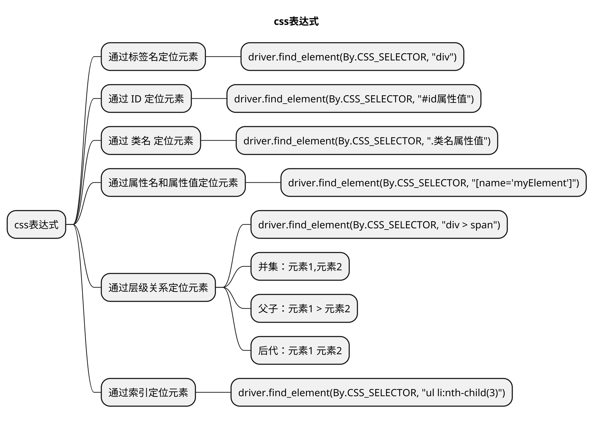

# 文章名
## 本章要点
1. 要点一
1. 要点
1. 要点
1. **要点**


## 学习目标

1. 。



## 思考

- 进入浏览器的console
- 输入: 
    - `$("css表达式")`
    - 或者`$$("css表达式")`


## 通过标签名定位元素

使用标签名作为选择器，例如 <div>、<input>、<a> 等。

### Python

```python
driver = webdriver.Chrome()
driver.find_element(By.CSS_SELECTOR, "div")
```

## 通过 ID 定位元素

使用元素的 ID 属性作为选择器。


### Python

```python
driver = webdriver.Chrome()
driver.find_element(By.CSS_SELECTOR, "#id属性值")
```

## 通过 类名 定位元素

使用元素的类名作为选择器。

### Python

```python
driver = webdriver.Chrome()
driver.find_element(By.CSS_SELECTOR, ".类名属性值")
```


## 通过属性定位元素

使用元素的属性名和属性值作为选择器。


### Python

```python
driver = webdriver.Chrome()
driver.find_element(By.CSS_SELECTOR, "[name='myElement']")
```

## 通过层级关系定位元素

使用父元素和子元素的组合来定位元素。

### 层级关系选择器

#### 子元素选择器 (>)

选择指定父元素下的直接子元素。父子：元素1 > 元素2

```javascript
// 选择 <div> 元素的直接子元素中的 <span> 元素
div > span {
  /* 样式规则 */
}
```

#### 后代元素选择器 (空格)

选择指定父元素下的所有后代元素，无论是直接子元素还是进一步嵌套的子元素。后代：元素 元素

```javascript
// 择 <div> 元素下的所有 <span> 元素，无论它们是直接子元素还是进一步嵌套的子元素
div span {
  /* 样式规则 */
}
```

#### 相邻兄弟选择器 (+)

选择指定元素的下一个相邻兄弟元素。邻近兄弟（了解即可）：元素+元素


```javascript
// 这将选择紧跟在 <h2> 元素后面的 <p> 元素。
h2 + p {
  /* 样式规则 */
}
```

#### 一般兄弟选择器 (~)

选择指定元素之后的所有兄弟元素。兄弟：元素1~元素2

```javascript
// 这将选择在 <h2> 元素之后的所有 <p> 元素。
h2 ~ p {
  /* 样式规则 */
}
```


### Python

```python
driver = webdriver.Chrome()
# 选择 <div> 元素的直接子元素中的 <span> 元素
driver.find_element(By.CSS_SELECTOR, "div > span")
```

```javascript
//在console中的写法
//元素,元素
$('.bg,.s_ipt_wr,.new-pmd,.quickdelete-wrap')
//元素>元素
$('#s_kw_wrap>input')
//元素 元素
$('#form input')
//元素+元素，了解即可
$('.soutu-btn+input')
//元素1~元素2，了解即可
$('.soutu-btn~i')
```


## 通过索引定位元素

使用索引号来定位一组相同类型的元素中的特定元素。


|类型|格式|
|--|--|
|父子关系+顺序|元素 元素|
|父子关系+标签类型+顺序|元素 元素|

```bash
//:nth-child(n)
$('#form>input:nth-child(2)')
//:nth-of-type(n)
$('#form>input:nth-of-type(1)')
```

### Python

```python
driver = webdriver.Chrome()
driver.find_element(By.CSS_SELECTOR, "ul li:nth-child(3)")
```


## 总结
- 总结一
- 总结二
- 总结三
https://github.com/Wechat-ggGitHub/Awesome-GitHub-Repo

[项目演示地址](https://github.com/testeru-pro/junit5-demo/tree/main/junit5-basic)


# 学习反馈

1. SpringBoot项目的父工程为( )。

   - [x] A. `spring-boot-starter-parent`
   - [ ] B.`spring-boot-starter-web`
   - [ ] C. `spring-boot-starter-father`
   - [ ] D. `spring-boot-starter-super`


<style>
  strong {
    color: #ea6010;
    font-weight: bolder;
  }
  .reveal blockquote {
    font-style: unset;
  }
</style>


