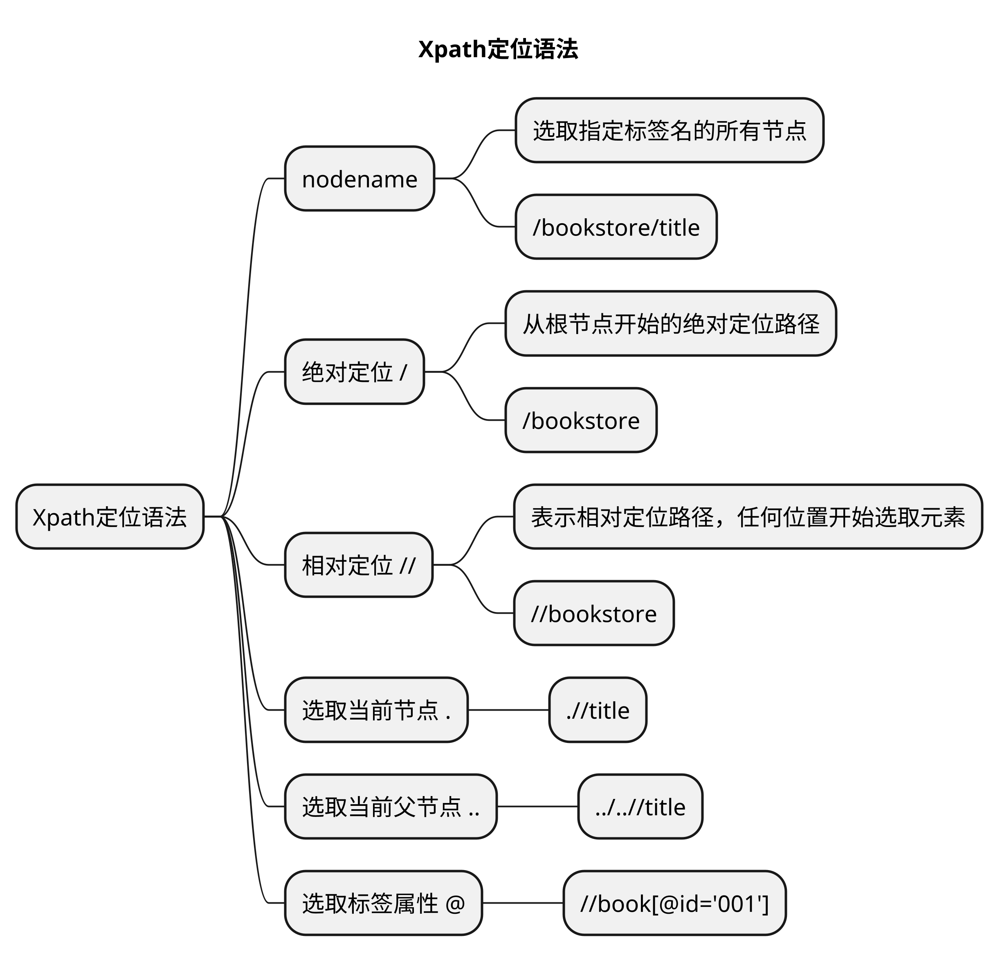
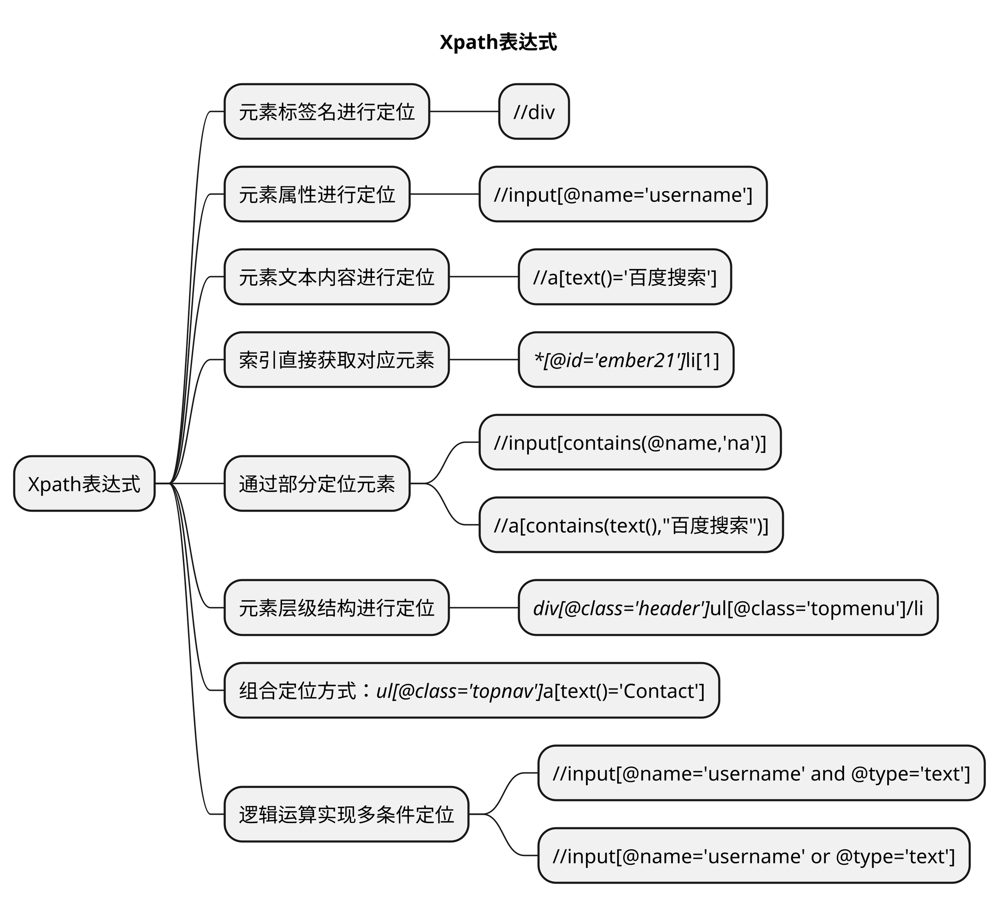

# 文章名
# Xpath定位

1. 要点一
1. 要点
1. 要点
1. **要点**


## 介绍

XPath全名为`XML Path Language`，是一种用于**在XML文档中进行导航和查找的语言**，它的语法类似于操作系统中的文件系统路径。

在Web开发中，XPath也被广泛用于Web页面元素的定位。通过XPath表达式，可以方便快捷地描述Web页面中的元素位置和属性值，从而实现自动化测试目的。


- XPath 是一门在 XML 文档中查找信息的语言
- XPath 使用路径表达式在 XML 文档中进行导航
- XPath 的应用非常广泛
- XPath 可以应用在UI自动化测试

## 组成


XPath表达式主要由以下几个部分组成：

### 1. 轴(Axis)

XPath中定义了一些**基于当前节点的选取方法**，称为轴。

例如**子孙轴**、**兄弟轴**等，可以用于快速定位元素路径。

### 2. 节点(Node)

节点是XML文档中最基本的组成单元，包括**元素节点**、**文本节点**、**释节点**等。

在XPath中，节点被抽象为一个个对象，通过**节点名称、属性或内容**等信息来确定唯一性。

### 3. 选择器(Selector)

选择器是XPath中用于描述节点选取条件的关键词，包括**元素名**、**属性名**、**节点类型**、**位置**等。

选择器还可以通过运算符和函数进一步组合和优化，以达到定位所需的节点。

XPath定位方式比较灵活，但有时也容易出现定位不准确或定位速度慢等问题。因此，在实际测试中，需要仔细考虑定位方式和表达式的准确性和稳定性，以提高测试脚本的可靠性和效率。

## Xpath定位语法



	
### nodename		

表示选取指定标签名的所有节点。

>例如 `/bookstore/title` 选取 bookstore 元素下的所有 title 元素。	

### 绝对定位

```bash
# 表示从根节点开始的绝对定位路径。
/
```	
>例如 `/bookstore` 表示选取根节点下的 bookstore 元素。

### 相对定位	

所有元素，子孙元素，从上一个元素下的所有去查找，不管几层。

```bash
# 表示相对定位路径，可以文档中的任何位置开始选取元素。
//
```
>例如 `//bookstore` 表示选取文档中所有的 bookstore 元素。


### 选取当前节点

```bash
# 表示选取当前节点。
.
```	

>例如 `.//title` 表示选取所有子孙节点中的 title 元素。

### 选取当前父节点		

```bash
# 表示选取当前节点的父节点。
..
```	

>例如 `../..//title` 表示选取当前节点的祖先节点下的 title 元素。

### 选取标签属性		
	
```bash
# 表示选取元素的属性。
@
```	

>例如 `//book[@id='001']` 表示选取所有 id 属性为 001 的 book 元素。

## Xpath表达式




### 根据元素标签名进行定位


使用元素的标签名进行定位。

>如 `//div` 表示选取文档中所有的 div 元素。


### 根据元素属性进行定位

使用元素的名称和属性值进行定位。

```bash
//标签名[标签内属性名='属性名对应的value值']
```

>如 `//input[@name='username']` 表示选取所有标签是input，并且标签的 name 属性为 username 的元素。


注意⚠️：
1. 标签名可省略
1. 省略标签名后要用 **\*** 替换，`//*`。


### 根据索引直接获取对应元素

```bash
# 获取此节点下的所有的li元素
//*[@id='ember21']//li

# 获取此节点下【所有的节点的】第一个li元素
//*[@id='ember21']//li[1]
```


### 根据元素文本内容进行定位

使用元素的文本内容进行定位。

```bash
//标签名[text()='标签的文本值']
```

>如 `//a[text()='click here']` 表示选取所有标签是a，并且标签的文本内容 click here 的元素。

```bash
//a[text()='百度搜索']
# <a href="http://www.baidu.com">百度搜索</a>
```

注意⚠️：
1. 标签名可省略
1. 省略标签名后要用 **\*** 替换，`//*`。


### 通过部分定位元素

```bash
# 部分文本定位
//标签名[contains(text(),'部分文本内容')]

//标签名[contains(@属性名,'部分属性值')]
```
		
```bash
# 匹配一个属性值中包含的字符串
//input[contains(@name,'na')]


# <a href="http://www.baidu.com">百度搜索</a>
//a[contains(text(),"百度搜索")]
```

### 根据元素层级结构进行定位


使用元素的层级结构进行定位。

>如 `//div[@class='header']//ul[@class='topmenu']/li` 表示选取所有 所有标签是div， class 属性为 header 的元素下的标签是ul， class 属性为 topmenu 的元素下的所有 li 元素。


### 组合定位方式

可以使用个定位方式组合进行定位。

>如 `//ul[@class='topnav']//a[text()='Contact']` 表示选取所有标签是 ul， class 属性为 topnav 的元素下的所有文本内容为 Contact 的 a 元素。


### 使用逻辑运算实现多条件定位

可以使用逻辑运算符 **and** 和 **or** 进一步筛选和组合多个定位条件。

>如 `//input[@name='username' and @type='text']` 表示选取所有 name 属性为 username 且 type 属性为 text 的 input 元素。


---

## xpath 定位的调试方法

- 浏览器-console
    - `$x("xpath表达式")`
- 浏览器-elements
    - ctrl+f 输入xpath或者css

## 总结
- 总结一
- 总结二
- 总结三
https://github.com/Wechat-ggGitHub/Awesome-GitHub-Repo

[项目演示地址](https://github.com/testeru-pro/junit5-demo/tree/main/junit5-basic)


# 学习反馈

1. SpringBoot项目的父工程为( )。

   - [x] A. `spring-boot-starter-parent`
   - [ ] B.`spring-boot-starter-web`
   - [ ] C. `spring-boot-starter-father`
   - [ ] D. `spring-boot-starter-super`


<style>
  strong {
    color: #ea6010;
    font-weight: bolder;
  }
  .reveal blockquote {
    font-style: unset;
  }
</style>