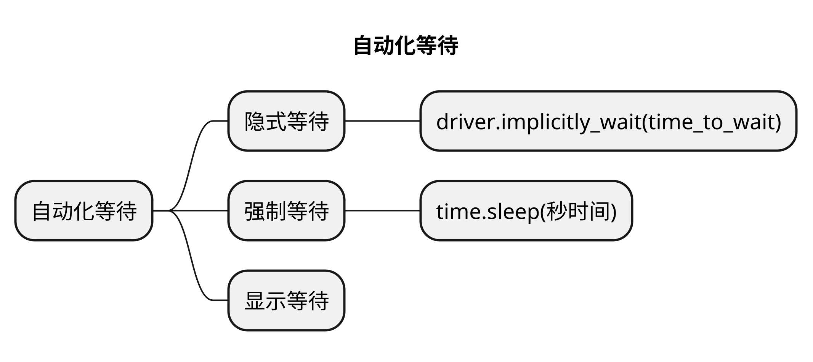

# 文章名
## 本章要点
1. 要点一
1. 要点
1. 要点
1. **要点**



## 学习目标

1. 。


## 思考

## 介绍

在使用 Selenium 进行 Web 自动化测试时，等待是一个重要的概念，用于确保在执行操作之前或之后，页面元素的状态或可见性已经发生了预期的变化。Selenium 提供了多种等待机制来处理页面加载、元素查找和操作的同步问题。

以下是一些常用的 Selenium 等待方法：

### 隐式等待（Implicit Waits）

该等待时间将应用于整个 WebDriver 实例的生命周期。

隐式等待会在**查找元素时等待一段时间**，直到元素出现或超时为止。

#### Python

使用 `driver.implicitly_wait(time_to_wait)` 方法来设置隐式等待时间。

```python
driver.implicitly_wait(10)  # 设置隐式等待时间为10秒
```

#### Java


### Sleep 等待

Sleep 等待即暂停程序执行一段时间。

这种等待方式不太推荐，因为它是固定的等待时间，不会根据实际情况灵活调整。


#### Python

```python
time.sleep(seconds)
```
使用 `time.sleep(seconds)` 方法进行硬性等待。


```python
import time

time.sleep(5)  # 等待5秒
```


#### Java


### 显式等待（Explicit Waits）

使用 WebDriverWait 类结合条件（ExpectedConditions）来实现显式等待。

显式等待会**在特定条件满足时继续执行**，或在**超时后抛出异常**。

#### Python

```python
from selenium.webdriver.support.ui import WebDriverWait
from selenium.webdriver.support import expected_conditions as EC

# 创建 WebDriverWait 实例，设置最长等待时间为10秒
wait = WebDriverWait(driver, 10)
# 等待元素可见
element = wait.until(EC.visibility_of_element_located((By.ID, "myElement")))

```

#### Java


根据测试场景和需求，选择合适的等待方法。隐式等待通常用于整个测试过程，而显式等待则用于特定操作或元素查找的等待。

请注意，在使用显式等待时，需要导入相应的模块（如 WebDriverWait 和 expected_conditions）。

## 总结
- 总结一
- 总结二
- 总结三
https://github.com/Wechat-ggGitHub/Awesome-GitHub-Repo

[项目演示地址](https://github.com/testeru-pro/junit5-demo/tree/main/junit5-basic)


# 学习反馈

1. SpringBoot项目的父工程为( )。

   - [x] A. `spring-boot-starter-parent`
   - [ ] B.`spring-boot-starter-web`
   - [ ] C. `spring-boot-starter-father`
   - [ ] D. `spring-boot-starter-super`


<style>
  strong {
    color: #ea6010;
    font-weight: bolder;
  }
  .reveal blockquote {
    font-style: unset;
  }
</style>


